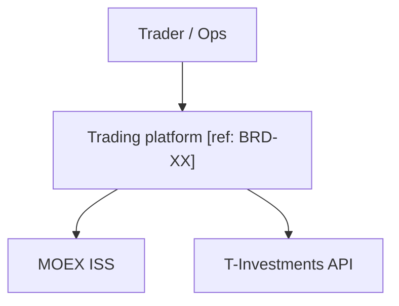
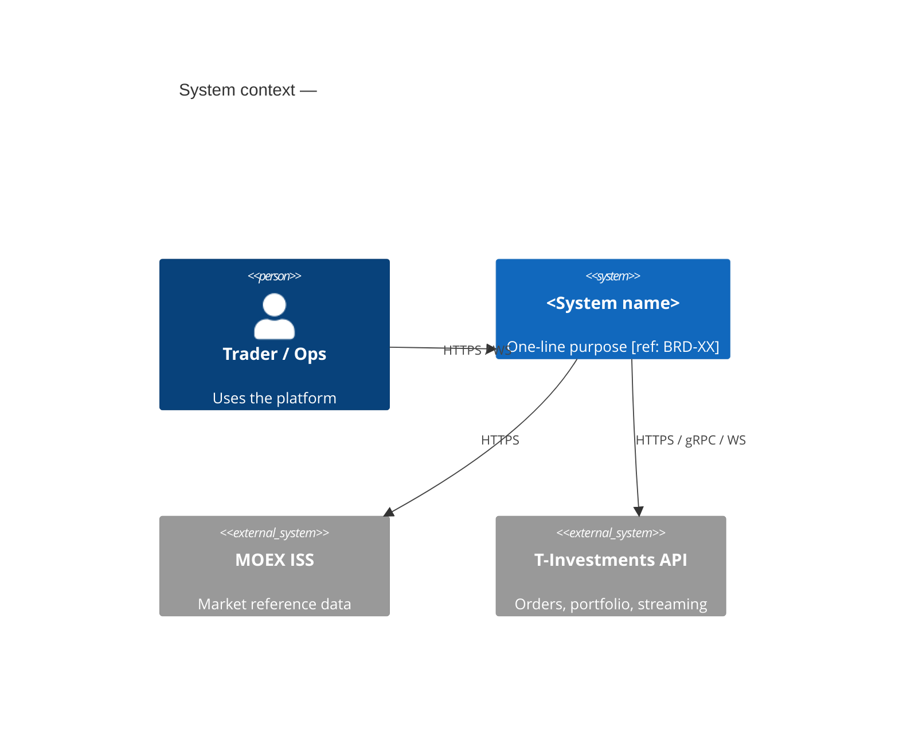
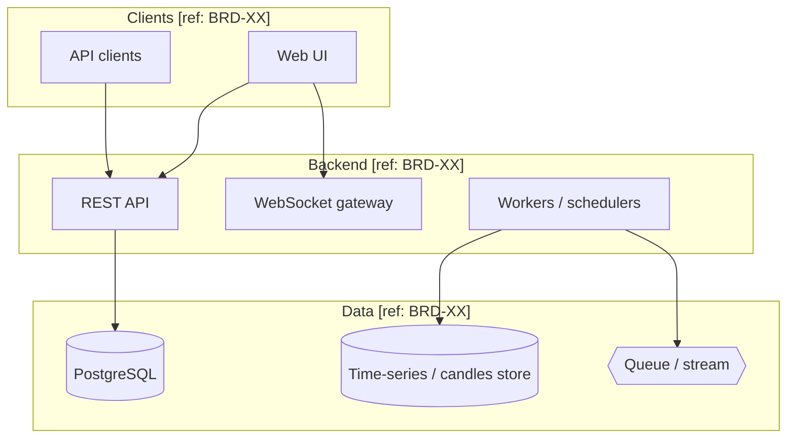
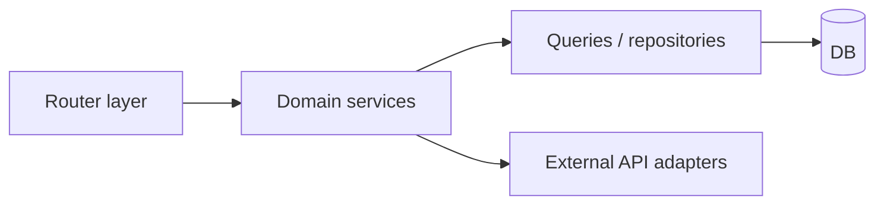

# C4 model (Mermaid)

Use **at least one** of the levels below per architecture doc. Label every box or boundary with `[ref: BRD-XX]` where applicable.

Prefer **flowchart** blocks for compatibility (default Mermaid). Use **C4Context** only if the target renderer loads the C4 plugin.

## System context (portable)

## System context (C4 plugin optional)

## Containers

## Components (example slice)

Keep diagrams readable: ≤15 nodes per diagram; split into multiple figures if needed.
