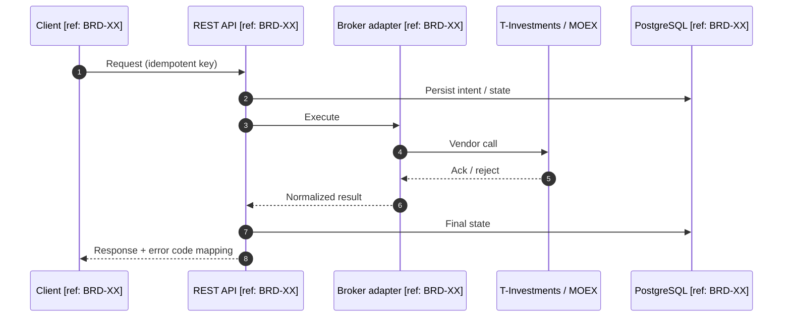
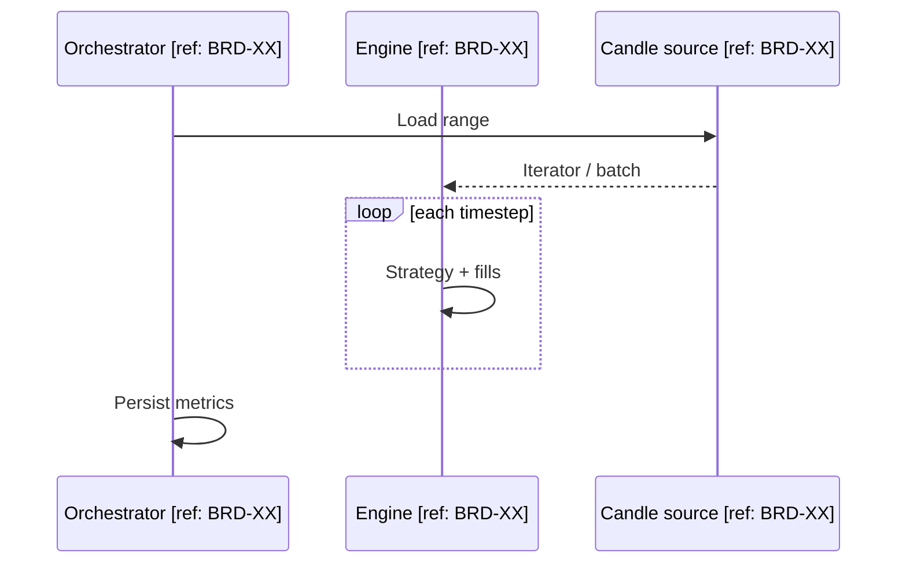

# Sequence diagrams (Mermaid)

Use for multi-party flows (client, API, broker adapter, DB, queue). Annotate lifelines with `[ref: BRD-XX]` where the BRD defines the step.

## Template

## Conventions

- Show **timeouts** and **retries** as `alt` / `opt` blocks when specified in BRD
- Show **429** / rate-limit path explicitly if integration is rate-limited
- Use **parallel** `par` blocks only when ordering is guaranteed irrelevant

## Backtest-specific fragment

