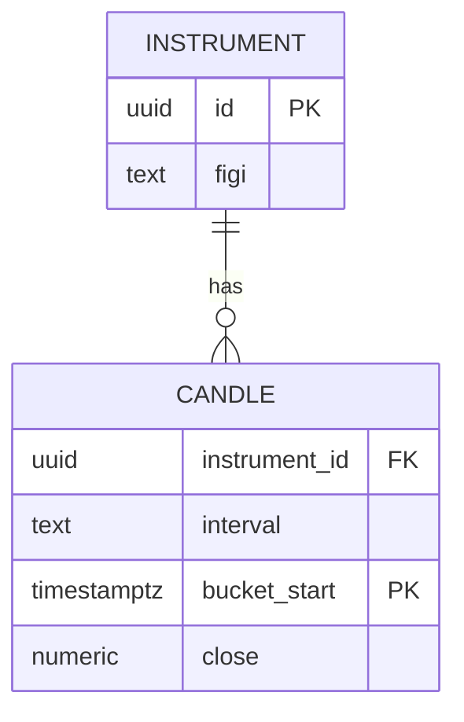

# Time-series and market data storage

Every table or collection must list: **purpose**, **retention**, **primary key**, **indexes**, **`[ref: BRD-XX]`**.

## Candles / OHLCV (relational)

Suggested shape (adjust types to product):

| Column | Type | Notes |
|--------|------|--------|
| instrument_id | UUID or text | FIGI / internal id |
| interval | text | e.g. `1m`, `1d` |
| bucket_start | `timestamptz` | UTC |
| open, high, low, close | `numeric` | |
| volume | `bigint` or `numeric` | |
| source | text | vendor lineage |

- **PK**: `(instrument_id, interval, bucket_start)`
- **Indexes**: optional BRIN on `bucket_start` for large append-only ranges; index on `(instrument_id, bucket_start DESC)` for UI queries
- **Retention**: state policy (e.g. raw 1m N days; daily indefinite)

## High-frequency / tick storage

- Prefer **partitioning** by time (monthly) or hash sharding if volume extreme
- **Dedup**: natural key (instrument, exchange_time, sequence) if replays possible

## Event / decision log (append-only)

| Column | Type | Notes |
|--------|------|--------|
| id | bigserial / UUID | |
| robot_id | UUID | if applicable |
| decided_at | `timestamptz` | |
| payload | `jsonb` | signal, order intent |
| correlation_id | text | trace across services |

- **Indexes**: `(robot_id, decided_at DESC)`; optional GIN on `payload` paths if query patterns fixed

## ER diagram hint (Mermaid)

Document **consistency model** (read-your-writes, eventual for analytics replica) per bounded context.
