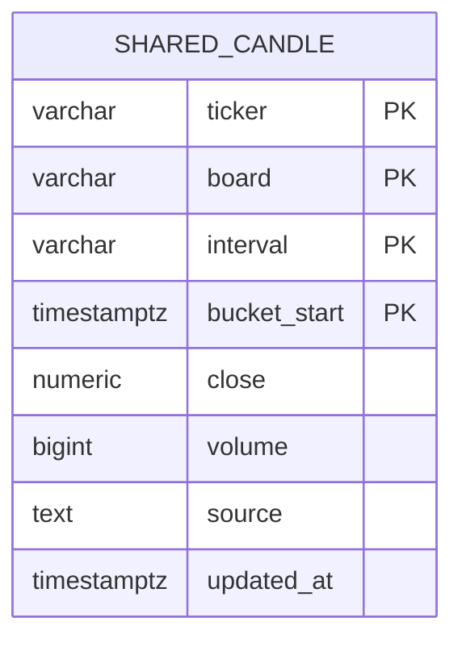
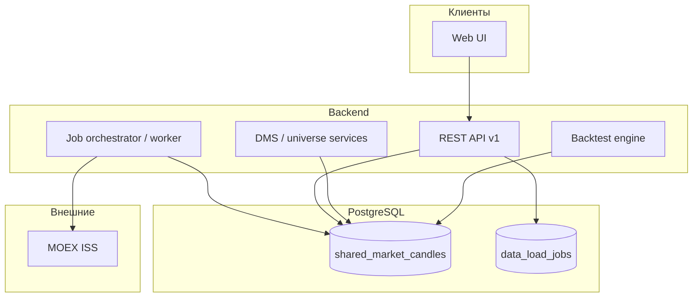
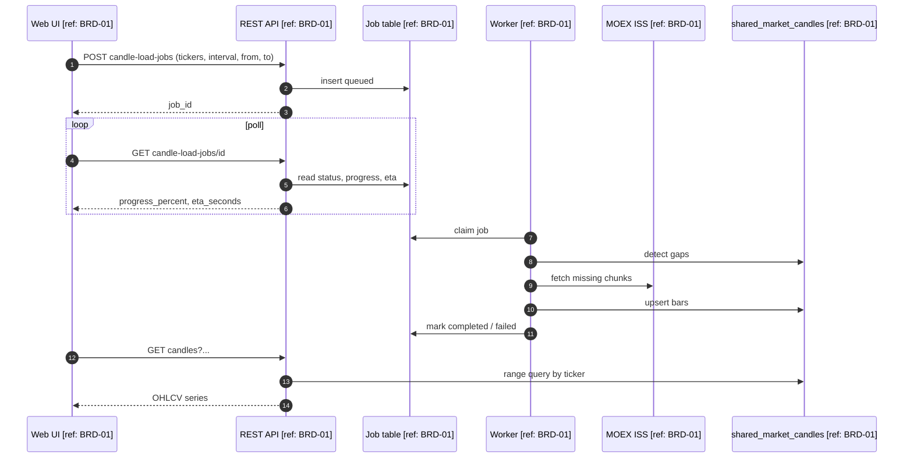

# ARCH-01: Единый контур рыночных данных и бэктеста (MOEX, TICKER, общий кеш, фоновая загрузка)

**Версия:** 1.0  
**Дата:** 2026-05-12  
**Статус:** Утверждёно к реализации (замена прежнего раздельного контура)  
**Трассировка:** `[ref: BRD-01]` — бэктест робота с динамической вселенной и пресетами  

---

## 1. Решение о зачистке наследия

**Прежние методы и публичные интерфейсы, завязанные на раздельные потоки (FIGI/T-Invest как первичный ключ, отдельные `/market/*` и оркестрация `/robots/history-backtest` поверх разных таблиц и семантик), подлежат удалению и замене реализацией «с нуля» по этому документу.**

Цели зачистки:

- один канонический идентификатор и один первичный внешний источник OHLCV на этапе загрузки;
- одна общая зона хранения свечей, доступная всем пользователям без повторных запросов к MOEX за уже покрытые окна;
- предсказуемый UX: длительная загрузка не блокирует HTTP-запрос пользователя.

Инвентарь к выводу из эксплуатации (при миграции на реализацию; точный список фиксирует PR):

- эндпоинты `POST /market/sync`, `POST /market/backtest`, `POST /market/ensure-candles` и связанные контракты, где в запросе/ответе фигурирует **FIGI как обязательный** ключ для пользовательского сценария;
- внутренняя модель «двух хранилищ свечей» (`market_data` репозиторий vs `candles_cache` по DMS) как **раздельные источники истины** для одного и того же OHLCV;
- любые публичные поля `figi` в пользовательских DTO бэктеста/рынка — заменяются на `ticker` (см. §3).

До завершения миграции допускается временный фасад-адаптер **только на бэкенде** (без публичного FIGI-контракта), если нужен параллельный запуск; срок снятия — отдельная задача.

---

## 2. Принципы (утверждено)

| # | Принцип | Содержание |
|---|-----------|------------|
| P1 | **Первичный источник** | Для первичного определения и загрузки исторических OHLCV используется **только MOEX ISS** (в рамках согласованных досок/рынков, по умолчанию акции `TQBR`). |
| P2 | **Общий кеш** | За выбранный пользователем **интервал тестирования** (и заявленный `interval`, `board`) данные **сохраняются в общую таблицу** (не пер-пользователь). Любой авторизованный пользователь **читает** уже имеющиеся бары; дозагрузка с MOEX выполняется **только для пробелов** относительно покрытия в таблице. |
| P3 | **Идентификатор** | Во всех публичных API и в симуляции бэктеста используется **только `ticker`** (строка, нормализация `UPPER`). Поле `figi` в пользовательских контрактах **не используется**. Сопоставление с брокером при live-исполнении — отдельный слой маппинга `ticker → внутренний id брокера`, вне контракта кеша свечей. |
| P4 | **Фоновая загрузка** | Запрос на обеспечение данных по диапазону **создаёт задачу** (job), исполняемую воркером. Клиент получает **прогресс** и **оценку оставшегося времени** (см. §5). Синхронная «долгая» загрузка в одном HTTP-запросе — **не норма** (только короткие операции: создание job, чтение статуса, чтение готовых баров). |

---

## 3. Модель данных (общая таблица свечей) `[ref: BRD-01]`

**Назначение:** каноническое хранилище OHLCV для бэктестов, аналитики DMS/universe и отчётов; **retention:** по политике продукта (минимум — покрытие максимального заявленного окна бэктеста + буфер); линейж источника фиксируется в `source`.

| Column | Type | Notes |
|--------|------|--------|
| `ticker` | `varchar(20)` | PK часть, UPPER, `[ref: BRD-01]` |
| `board` | `varchar(16)` | PK часть, напр. `TQBR` |
| `interval` | `varchar(32)` | Канон: например `1m`, `10m`, `1h`, `1d` (единый enum в коде) |
| `bucket_start` | `timestamptz` | PK часть, UTC, начало бара |
| `open`, `high`, `low`, `close` | `numeric` | |
| `volume` | `bigint` | опционально NULL если MOEX не отдал |
| `source` | `text` | `MOEX_ISS` |
| `updated_at` | `timestamptz` | |

- **PK:** `(ticker, board, interval, bucket_start)`  
- **Индексы:** `(ticker, board, interval, bucket_start DESC)` для выборок по окну; при росте объёма — BRIN по `bucket_start` (отдельная миграция).  
- **Консистентность:** upsert по PK; параллельные job на одно и то же окно — идемпотентность через **уникальный ключ job** или кооперативную блокировку на уровне `(ticker, board, interval, from, to)` (см. §5).

Имя физической таблицы выбирает реализация (например `shared_market_candles` в схеме приложения); важно: **одна** таблица как источник истины для OHLCV из MOEX в этом контуре.



---

## 4. Компоненты (C4, упрощённо) `[ref: BRD-01]`



---

## 5. API: фоновая загрузка и прогресс `[ref: BRD-01]`

Версионирование: префикс **`/api/v1`** (или согласованный префикс проекта) для новых ресурсов.

### 5.1. `POST /api/v1/market-data/candle-load-jobs`

| Field | Value |
|--------|--------|
| BRD ref | `[ref: BRD-01]` |
| Method / path | `POST /api/v1/market-data/candle-load-jobs` |
| Auth | Bearer / текущая схема приложения |
| Idempotency | Рекомендуется `Idempotency-Key: <hash(ticker,board,interval,from,to)>` — при повторе возвращать тот же `job_id`, если job ещё активен или завершён успешно |
| Request | `{ "tickers": ["SBER","GAZP"], "board": "TQBR", "interval": "10m", "from": "2024-01-01T00:00:00Z", "to": "2024-06-01T00:00:00Z" }` |
| 200 | `{ "job_id": "uuid", "status": "queued" }` |
| 400 | Валидация дат, пустой список, неподдерживаемый `interval` |
| 409 | Конфликт с эксклюзивной миграцией (редко) |

**Поведение:** воркер для каждого тикера вычисляет **пробелы** покрытия в `shared_market_candles`, запрашивает у MOEX только недостающие диапазоны, upsert в общую таблицу.

### 5.2. `GET /api/v1/market-data/candle-load-jobs/{job_id}`

| Field | Value |
|--------|--------|
| BRD ref | `[ref: BRD-01]` |
| Response 200 | См. ниже |

Рекомендуемая форма ответа (поля для UI прогресса и ETA):

```json
{
  "job_id": "uuid",
  "status": "running",
  "progress_percent": 42.5,
  "tickers_total": 40,
  "tickers_done": 17,
  "bars_written": 125000,
  "message": "MOEX: SBER 2024-03..2024-04",
  "started_at": "2026-05-12T10:00:00Z",
  "updated_at": "2026-05-12T10:02:15Z",
  "eta_seconds": 95
}
```

**Расчёт `eta_seconds` (MVP):**  
`remaining_work_units = (tickers_total - tickers_done) * avg_seconds_per_ticker_ewma`  
или по объёму ожидаемых баров: `(expected_bars - bars_written) / throughput_bars_per_sec`.  
Точность вторична; важна **монотонность** `progress_percent` и обновление не реже N секунд / по завершении чанка.

Статусы: `queued` | `running` | `completed` | `failed` | `cancelled`.

### 5.3. Чтение баров для UI/бэктеста

| Field | Value |
|--------|--------|
| BRD ref | `[ref: BRD-01]` |
| Method / path | `GET /api/v1/market-data/candles?tickers=SBER&board=TQBR&interval=10m&from=...&to=...` |
| Auth | Да |
| 200 | Массив баров **только из общей таблицы**; если покрытие неполное — `206 Partial Content` **или** `200` с массивом `gaps: [{ticker, from, to}]` (выбрать один стиль в реализации и зафиксировать в OpenAPI). |

Бэктест **не** вызывает MOEX напрямую: сначала клиент (или оркестратор бэктеста) доводит job до `completed` или явно обрабатывает `gaps`.

### 5.4. Sequence: фоновая загрузка и чтение



---

## 6. Бэктест `[ref: BRD-01]`

- Вход симуляции: **`ticker` → ряд баров** из общей таблицы; ограничение universe по датам (`allowed_tickers_by_date`) также на **тикерах**.
- Разделение ответственности: **Data plane** (MOEX → общая таблица, jobs) отделён от **Simulation plane** (чтение таблицы, детерминированный прогон).
- Пресеты и тонкая настройка параметров стратегии/риска — как в BRD-01; идентификатор инструмента везде **ticker**.

---

## 7. Наблюдаемость и ограничения

- Логировать `job_id`, `ticker`, диапазон, число запросов к MOEX, число upsert — по `skill://logging-standards` (корреляция с UI-сессией).
- Rate limit MOEX: воркер обязан соблюдать токен-бакет; при `429`/ошибках — backoff и отражение в `job.message` / `failed` с причиной.
- **Multi-tenant:** запись в общую таблицу не содержит `user_id`; персональные настройки живут в job и в конфиге бэктеста, не в баре.

---

## 8. Handoff: Senior Python Backend Engineer

**Исполнитель по репозиторию:** роль `@.cursor/agents/senior-python-backend-engineer.md` (не systems-analyst).  
**Входные артефакты:** этот документ (`[ref: ARCH-01]`), `docs/BRD-01-backtest-robot-dynamic-universe-presets.md` (`[ref: BRD-01]`).

### 8.1. Обязательные навыки (прочитать перед кодом)

| Навык | Путь |
|--------|------|
| FastAPI CRUD / роутеры | `.cursor/skills/fastapi-crud-template/SKILL.md` |
| PostgreSQL / Alembic | `.cursor/skills/postgres-async-patterns/SKILL.md` |
| MOEX HTTP-клиент | `.cursor/skills/moex-python-client/SKILL.md` |
| Логирование | `.cursor/skills/logging-standards/SKILL.md` |
| Multi-tenant / изоляция | `.cursor/skills/multi-tenant-trading/SKILL.md` |

### 8.2. Scope backend (без UI)

1. **Миграция:** таблицы `shared_market_candles` и `candle_load_jobs` по §3 и §5; прогнать `alembic upgrade head`.  
2. **API v1:** `POST …/candle-load-jobs`, `GET …/candle-load-jobs/{id}`, `GET …/candles` — контракт §5; Pydantic v2; авторизация как у остальных `/api`.  
3. **Воркер:** фоновая обработка `queued` → MOEX → upsert в общую таблицу; прогресс и `eta_seconds` по §5.2; идемпотентность по заголовку/ключу.  
4. **Снятие наследия:** после готовности новых эндпоинтов — удалить/задепрекейтить перечисленные в §1 старые контракты (отдельный PR).  
5. **Интеграция бэктеста:** симуляция читает только `shared_market_candles` по **ticker** (отдельная задача после стабилизации data plane).

### 8.3. Черновик кода (можно продолжить или переписать)

Уже добавлены черновые файлы (требуют ревью, доводки и тестов):

- `alembic/versions/0029_shared_moex_candles.py`  
- `backend/app/modules/market_data_v1/__init__.py`  
- `backend/app/modules/market_data_v1/intervals.py`  
- `backend/app/modules/market_data_v1/moex_fetch.py`  
- `backend/app/modules/market_data_v1/repository.py`  

**Не завершено:** `service.py`, `worker`/`scheduler`, `router`, регистрация в `main.py`, `pytest`, проверка миграции на реальной БД, согласование типов UUID/ARRAY с драйвером.

### 8.4. Критерий приёмки (backend)

- `pytest` (или команда проекта) проходит.  
- OpenAPI отражает новые пути; в ответе job есть поля для UI прогресса и ETA.  
- Итоговое резюме по протоколу агента: `✅ Implementation complete. API endpoints ready at /api/v1/.... Ready for UI Developer.`

---

## 9. Открытые вопросы (минимум)

- **[NEEDS INPUT]** Точный список поддерживаемых `interval` на первом релизе MOEX (сопоставление с ISS `interval` кодами).  
- **[NEEDS INPUT]** Политика retention (срок хранения 1m данных).  

---

**✅ Архитектура зафиксирована.** Готово к реализации Python backend + UI. Ключевые контракты: **MOEX-only загрузка**, **общая таблица свечей**, **TICKER-only**, **job + GET progress с ETA**, **бэктест читает только кеш**.
