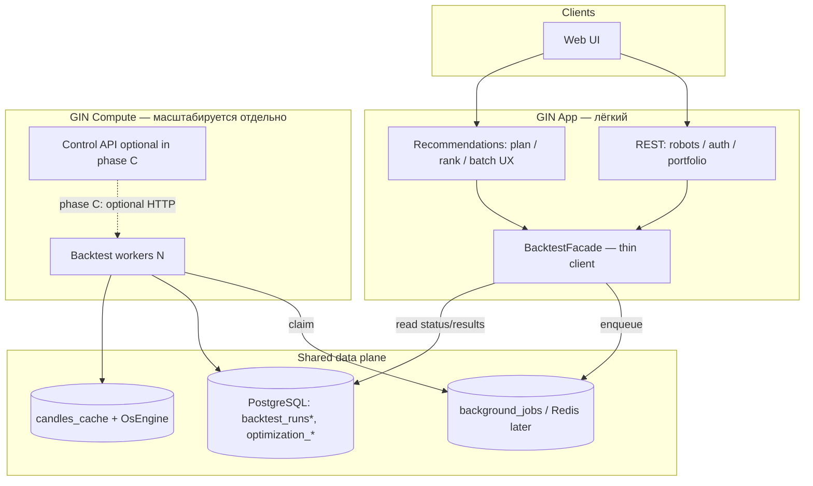
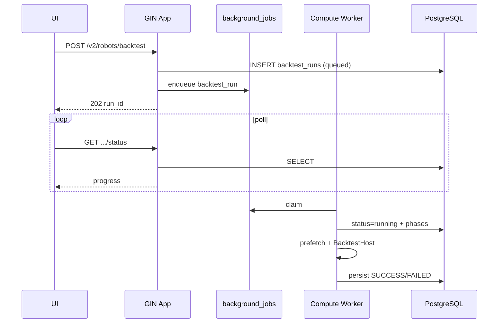
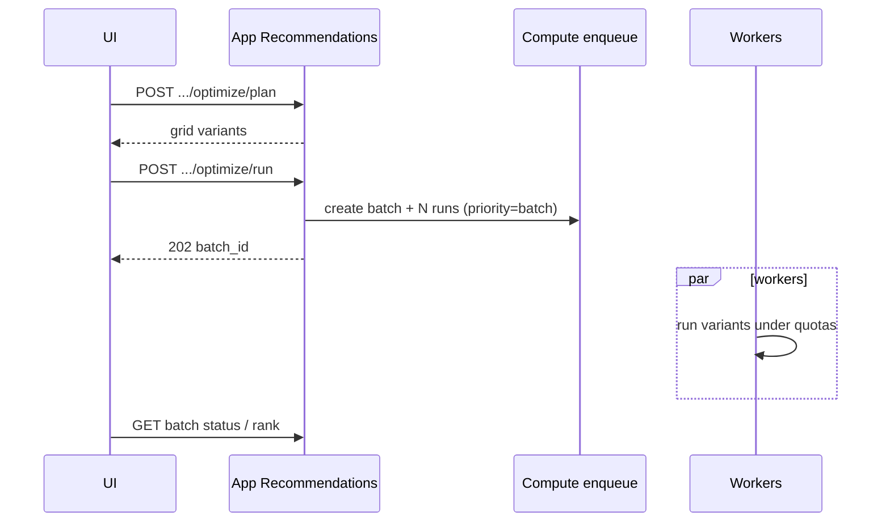

# ARCH-05: GIN Compute — отдельный сервис бэктестов и сетки параметров

**Версия:** 0.7  
**Дата:** 2026-10-02  
**Статус:** A + A.2 + B soft + C + **legacy cut complete** (history-backtest HTTP/job/engines gone); prod engine = V2 `BacktestHost` only  
**Связь:** `[ref: BRD-ARCH-02]`, `[ref: ARCH-01]`, текущий код V2 (`robots_v2/backtest/*`), recommendations (`optimize/*`)

---

## 1. Цель

Вынести **тяжёлые** прогоны (single backtest + optimization batch) из процесса GIN App, чтобы:

- API/UI/live оставались отзывчивыми;
- concurrency и replicas бэктеста масштабировались отдельно;
- модуль рекомендаций параметров ставил N вариантов без влияния на app;
- лимиты/квоты жили на границе compute, а не «надежде на один asyncio.Task».

**Не цели v0.1:** отдельная БД, отдельный market-data сервис, dual-engine (legacy + V2). Один движок — **V2 `BacktestHost`**.

---

## 2. Контейнеры



**Фаза A–B:** App пишет в `background_jobs` (`lane=heavy`, `job_type=backtest_run` / `backtest_batch`), workers в отдельном процессе/деплое читают очередь.  
**Фаза C:** появляется явный Control API (`/api/compute/v1/...`); App/Rec ходят только туда (очередь скрыта).

---

## 3. Принципы

| # | Принцип | Содержание |
|---|---------|------------|
| C1 | **Enqueue-only из App** | HTTP App **не** запускает симуляцию в `asyncio.create_task` / sync path. Только insert run + job → `202`. |
| C2 | **Статус из БД** | Источник правды — `backtest_runs` (+ связанные таблицы). In-memory `BacktestRunStore` — только локальный кэш воркера, не для multi-instance. |
| C3 | **Один engine** | V2 `BacktestHost` + `TradingRobotConfigV4`. Optimization переводится с legacy `history_backtest` на тот же job type. |
| C4 | **Лимиты на compute** | Global / per-user / per-robot / batch size — до claim или при enqueue (см. §5). |
| C5 | **Приоритеты** | `interactive` (UI single run) > `batch` (optimization). Workers предпочитают interactive при равной готовности. |
| C6 | **Idempotency** | `Idempotency-Key` на create run/batch → повторный POST не плодит дубликаты. |
| C7 | **OsEngine рядом с worker** | Prefetch/MCP — на compute-нодах; App не стартует OsEngine в lifespan (цель фазы B). |

---

## 4. REST-контракт (фаза C; фаза A–B — совместимый facade)

**Base path:** `/api/compute/v1`  
**Auth:** тот же Bearer, что у App; либо internal service token + `X-User-Id` (решить в §8).  
**Versioning:** URI `/v1`; breaking changes → `/v2`.

### 4.1 Single run

#### `POST /runs` — создать прогон

| Field | Value |
|--------|--------|
| Auth | Bearer |
| Idempotency | `Idempotency-Key` (required for UI retries) |
| Rate limit | см. §5 |

**Request**

```json
{
  "config": { "...": "TradingRobotConfigV4" },
  "from_date": "2026-01-01T00:00:00Z",
  "to_date": "2026-03-01T23:59:59Z",
  "initial_capital": 100000,
  "robot_id": 13,
  "token_id": null,
  "priority": "interactive",
  "labels": { "source": "robots_v2_ui" }
}
```

| Field | Type | Required | Notes |
|-------|------|----------|-------|
| `config` | object | yes | V4 only |
| `from_date` / `to_date` | datetime UTC | yes | `to > from`; max span — quota |
| `initial_capital` | number | no | default из `config.risk.capital` |
| `robot_id` | int \| null | no | FK/audit |
| `token_id` | int \| null | no | crypto |
| `priority` | `interactive` \| `batch` | no | default `interactive` |
| `labels` | object | no | free-form telemetry |

**Response `202`**

```json
{
  "run_id": 216,
  "status": "queued",
  "job_id": "uuid",
  "message": "Poll GET /api/compute/v1/runs/{run_id}"
}
```

**Errors:** `400` validation · `401` · `403` · `409` duplicate idempotency with different body · `429` quota exceeded (`Retry-After`).

Совместимость с UI сегодня: App-facade может по-прежнему отдавать `POST /api/v2/robots/backtest` → внутри только enqueue (без sync `200` с полным результатом). Sync path **deprecate** сразу в фазе A.

#### `GET /runs/{run_id}` — details (как сейчас V2 details)

Поля совместимы с `RobotV2BacktestDetailsResponse` (+ `priority`, `labels`, `job_id`).

#### `GET /runs/{run_id}/status` — лёгкий poll

Поля совместимы с `RobotV2BacktestStatusResponse`.

**Статусы:** `queued` → `running` → `success` \| `failed` \| `cancelled`  
(допускаются alias `QUEUED`/`RUNNING`/… в upper-case для текущего UI — нормализовать в одном месте).

#### `POST /runs/{run_id}/cancel`

```json
{ "ok": true, "status": "cancel_requested" }
```

Идемпотентно, если уже terminal.

#### `GET /runs` — list / history

Query: `robot_id`, `status`, `limit`, `offset`, `from_created`, `to_created`.

#### `POST /runs/compare`

Как текущий V2 compare: `{ "base_run_id", "compare_run_id" }` → metrics/config diff. Может остаться в App (read-only по PG) — compute не обязателен.

---

### 4.2 Optimization batch (recommendations)

Plan/rank остаются в **App** (`/api/recommendations/.../optimize/plan|rank`) — лёгкая логика.  
**Run** уходит в compute.

#### `POST /batches` — поставить сетку

| Field | Value |
|--------|--------|
| Idempotency | `Idempotency-Key` |
| Max variants | `COMPUTE_BATCH_MAX_ITEMS` (default 50) |

**Request**

```json
{
  "robot_id": 13,
  "base_config": { "...": "V4" },
  "variants": [
    { "variant_key": "grid-0", "config": { } },
    { "variant_key": "grid-1", "config": { } }
  ],
  "from_date": "2026-01-01T00:00:00Z",
  "to_date": "2026-03-01T23:59:59Z",
  "initial_capital": 100000,
  "token_id": null,
  "priority": "batch",
  "goal": "balanced"
}
```

**Response `202`**

```json
{
  "batch_id": 42,
  "status": "queued",
  "items_total": 24,
  "run_ids": [301, 302],
  "message": "Poll GET /api/compute/v1/batches/{batch_id}"
}
```

Каждый variant → отдельный `backtest_runs` row + job `priority=batch`, связанный через `optimization_batch_items.run_id` (существующие таблицы).

#### `GET /batches/{batch_id}` — статус агрегата

```json
{
  "batch_id": 42,
  "status": "running",
  "items_total": 24,
  "items_done": 10,
  "items_failed": 1,
  "items_cancelled": 0,
  "progress_percent": 45.8
}
```

#### `POST /batches/{batch_id}/cancel` — cancel remaining queued/running items

App `optimize/run` становится thin: validate plan → `POST /batches` (или enqueue того же контракта в фазе A–B без HTTP).

---

### 4.3 Job payload (фаза A–B, внутренняя очередь)

`background_jobs.lane = heavy`

| `job_type` | payload | Handler |
|------------|---------|---------|
| `backtest_run` | `{ "run_id": int, "user_id": int, "priority": "interactive"\|"batch" }` | load run → prefetch → `BacktestHost` → persist |
| `backtest_batch` | `{ "batch_id": int }` | optional orchestrator; v0.1 можно сразу N× `backtest_run` |

**Removed:** `history_backtest` job type and handlers (ARCH-05 cut complete). Stale queue rows fail as unknown job. Optimization uses `backtest_run` only.

---

## 5. Лимиты и квоты

### 5.1 Конфиг (env / settings)

| Knob | Default | Назначение |
|------|---------|------------|
| `COMPUTE_WORKER_REPLICAS` | ops | число процессов/подов worker |
| `LANE_HEAVY_CONCURRENCY` | `1` | параллельных job на один worker process |
| `COMPUTE_MAX_GLOBAL_RUNNING` | `2` | потолок running по всем нодам (enforce при claim) |
| `COMPUTE_MAX_USER_RUNNING` | `1` | на user_id |
| `COMPUTE_MAX_USER_QUEUED` | `10` | queued на user |
| `COMPUTE_MAX_ROBOT_RUNNING` | `1` | на robot_id (interactive) |
| `COMPUTE_BATCH_MAX_ITEMS` | `50` | variants в одном batch |
| `COMPUTE_BATCH_MAX_USER_ACTIVE` | `1` | активных batch на user |
| `COMPUTE_MAX_SPAN_DAYS` | `366` | длина периода |
| `COMPUTE_RUN_TIMEOUT_SEC` | `7200` | hard kill / mark failed |
| `COMPUTE_QUEUE_DEPTH_SOFT` | `100` | выше → `429` на interactive? нет, только warn; hard ниже |
| `COMPUTE_QUEUE_DEPTH_HARD` | `500` | enqueue отказ `429` |

### 5.2 Матрица отказов

| Условие | HTTP | Тело |
|---------|------|------|
| User running ≥ max | `429` | `{ "code": "quota_user_running", "limit": 1 }` |
| User queued ≥ max | `429` | `quota_user_queued` |
| Batch too large | `400` | `batch_too_large` |
| Active batch exists | `409` | `batch_already_active` |
| Global queue hard | `429` | `queue_saturated` + `Retry-After` |
| Span > max days | `400` | `span_too_long` |

Interactive при насыщенной batch-очереди: **не блочить** interactive, если есть свободный слот global — workers claim interactive first.

### 5.3 Приоритет claim

```
ORDER BY
  CASE priority WHEN 'interactive' THEN 0 ELSE 1 END,
  created_at ASC
```

(поле `priority` в payload или колонке jobs — добавить при необходимости миграцией).

---

## 6. Потоки

### 6.1 Interactive backtest



### 6.2 Optimization batch



---

## 7. Первый PR — состав `gin-compute` (фаза A)

**Цель PR:** App больше не исполняет V2 backtest in-process; тот же image, другой entrypoint worker; optimization ещё может остаться на legacy, но single-run UI уже на очереди.

### 7.1 Переезжает / меняется

| Модуль | Действие |
|--------|----------|
| `robots_v2/backtest/service.py` | `start`: только `create_db_run` + `enqueue_background_job`; убрать `asyncio.create_task` и sync execute |
| `robots_v2/backtest/persist.py` | без изменений контракта; worker пишет сюда |
| `robots_v2/backtest/host.py` | вызывается **только** из worker handler |
| `robots_v2/backtest/store.py` | optional local cache; status API читает **DB first** |
| `core/background_jobs/handlers.py` | зарегистрировать `backtest_run` → handler |
| NEW `robots_v2/backtest/worker_handler.py` | claim payload → prefetch → host → persist → progress updates |
| `core/config.py` | knobs §5.1 (минимум: timeout, max user running check) |
| `main.py` lifespan | `WORKER_EMBEDDED_ENABLED=false` в API-деплое; worker — отдельный process |
| NEW `backend/app/workers/compute.py` | `python -m app.workers.compute` (= `run.py worker --lane heavy`) |

### 7.2 Пока остаётся в App

| Модуль | Почему |
|--------|--------|
| `robots_v2/router.py` backtest routes | facade для UI |
| `recommendations/*` plan/rank/UX | лёгкие |
| `recommendations/optimization_runner.py` | **следующий PR** (фаза A.2): перевести на `backtest_run` |
| `osengine/*` | worker процесс импортирует; API-процесс перестаёт auto-start OsEngine (флаг) |
| Shared PG / `candles_cache` | data plane общий |

### 7.3 Не тащить в первый PR

- HTTP `/api/compute/v1` (фаза C) — **есть** (`app.modules.compute`)
- Отдельный Docker image / repo split (достаточно отдельного entrypoint + deploy)
- Вынос OsEngine в market-data service
- Redis вместо `background_jobs` (PG queue достаточно на старте)

> **0.4–0.7:** legacy `history_backtest` orchestration (`engine` / persist / `run_robot_history_backtest`), job handler, `trading/engines/*` + `trading/data_provider/*` удалены. Shared live-стек (`BrokerEmulator`, `session_backtest`, grain_seed orchestration, `run_file_logger`) остаётся в `robots/trading`. Опционально позже: Sharpe/Sortino/Calmar в V2 `metrics_summary` (сейчас return/DD/win_rate + child tables).

### 7.4 Acceptance первого PR

1. `POST /api/v2/robots/backtest` всегда `202` (или 429 по квоте); в API-процессе нет running `BacktestHost`.
2. При `COMPUTE_WORKER` up прогон доходит до `SUCCESS`/`FAILED`, UI poll работает.
3. При worker down — run остаётся `queued`, API живой.
4. `LANE_HEAVY_CONCURRENCY=1` + второй run → второй ждёт в queue.
5. Cancel выставляет `cancel_requested`, worker останавливается между фазами.
6. Тесты: unit на enqueue + handler с mock host; один integration на queue round-trip.

### 7.5 Deploy sketch

```text
gin-api:     uvicorn app.main:app          WORKER_EMBEDDED_ENABLED=0
gin-compute: python -m app.workers.compute LANE_HEAVY_CONCURRENCY=1..N
             replicas: scale independently
```

Оба шарят `DATABASE_URL`, `OSENGINE_*` (только compute).

---

## 8. Открытые решения (нужен выбор)

| # | Вопрос | Варианты | Рекомендация |
|---|--------|----------|--------------|
| D1 | Auth compute HTTP (фаза C) | Same JWT / mTLS internal / service token | Фаза A–B: без внешнего HTTP. Фаза C: service token + user_id в job |
| D2 | Где enforce quota | При enqueue (App) / при claim (Worker) / оба | **Оба:** soft при enqueue, hard при claim |
| D3 | OsEngine на каждой replica | Sidecar per pod / shared sticky node | Начать с **1 compute replica**; потом sticky или shared MCP |
| D4 | Срок deprecation sync `200` | Сразу / feature flag | Сразу для V2; UI уже async |
| D5 | Optimization в том же PR | Да / отдельный A.2 | **A.2** сразу после A — иначе два движка живут дольше |

---

## 9. Дорожная карта

| Этап | Результат |
|------|-----------|
| **A** (этот PR) | V2 single-run только через queue + отдельный worker entrypoint + квоты minimal |
| **A.2** | `optimization_runner` → `backtest_run` / batch rows; **cut** `history_backtest` job |
| **B** | Prod: API без embedded worker; scale `gin-compute`; OsEngine только на compute |
| **C** | Публичный `/api/compute/v1`; App — pure facade; метрики очереди (depth, wait time, success rate) |
| **D** (опц.) | Market-data service; Redis queue |

---

## 10. Трассировка к текущему коду

| Контракт / идея | Сейчас |
|-----------------|--------|
| Start V2 | `BacktestService.start` → enqueue `backtest_run` (`priority` interactive/batch); also `POST /api/compute/v1/runs` |
| Persist / list / compare | `robots_v2/backtest/persist.py` |
| Schemas UI | `robots_v2/backtest/schemas.py` |
| Control API (C) | `modules/compute/` → `/api/compute/v1` |
| Heavy lane | `core/background_jobs/worker.py` `LANE_HEAVY` + `app.workers.compute` |
| Optimization enqueue | `recommendations/optimization_runner.py` → `BacktestService.start(priority=batch)` |
| Prefetch / candle IO | `robots_v2/backtest/candle_prefetch.py` + `candle_io.py` (legacy shim в `robots/.../candle_prefetch.py`) |
| Cancel | `robots_v2/backtest/cancel.py` (+ aliases на `service`) |

---

## Changelog

| Ver | Date | Notes |
|-----|------|-------|
| 0.1 | 2026-09-24 | Первый черновик: контракт, квоты, состав PR фазы A |
| 0.2 | 2026-09-24 | Фаза A в коде: `backtest_run` job, enqueue-only start, `python -m app.workers.compute` |
| 0.3 | 2026-09-28 | Фаза A.2: optimization → `BacktestService.start(priority=batch)` + v4 param grid |
| 0.4 | 2026-09-28 | Legacy history-backtest cut: candle IO → `robots_v2/backtest/`; removed `run_robot_history_backtest` + engine/persist stack |
| 0.5 | 2026-09-29 | Phase B soft: `OSENGINE_AUTO_START` default false; compute worker starts OsEngine via `OSENGINE_AUTO_START_ON_COMPUTE` |
| 0.6 | 2026-09-29 | Phase C: public `/api/compute/v1` (runs, batches, queue metrics); smoke script `scripts/smoke_arch05_compute.py` |
| 0.7 | 2026-10-02 | Cut complete: removed `history_backtest` job/aliases, `trading/engines/*`, `trading/data_provider/*`, `/testing` UI; V2-only as-built |

