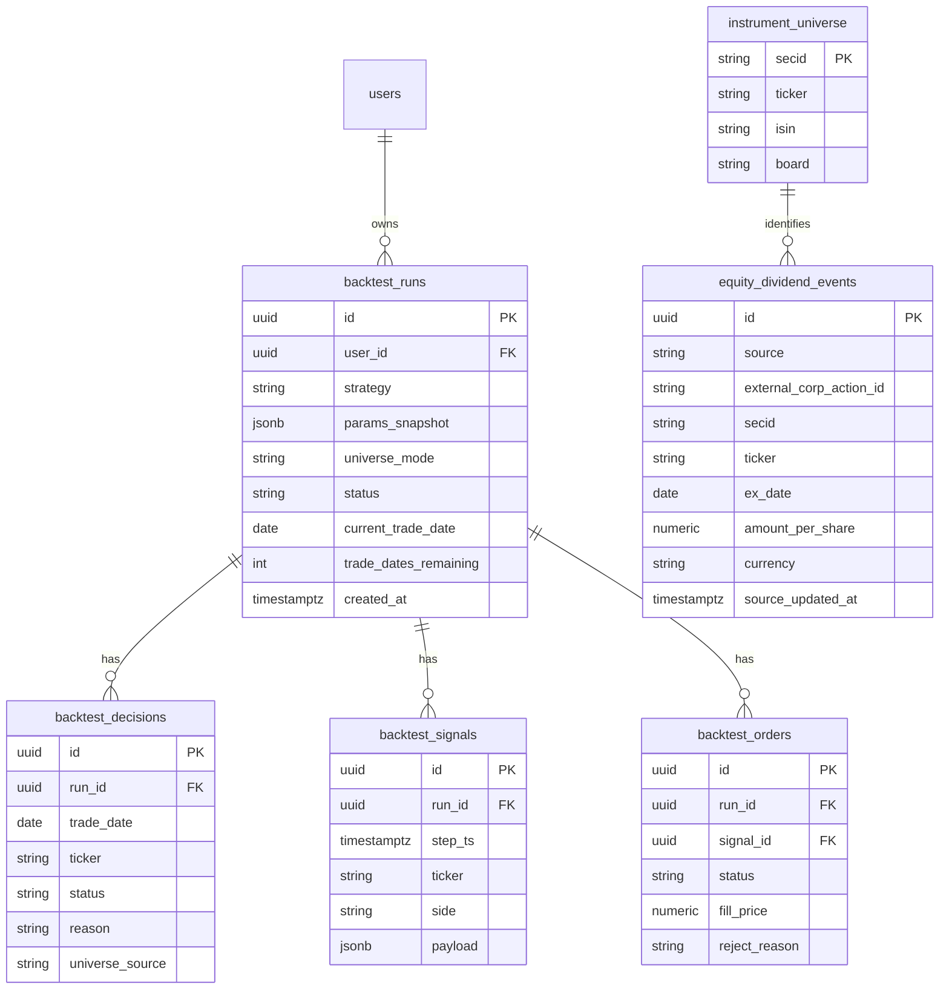
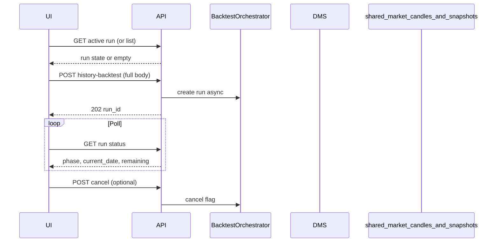
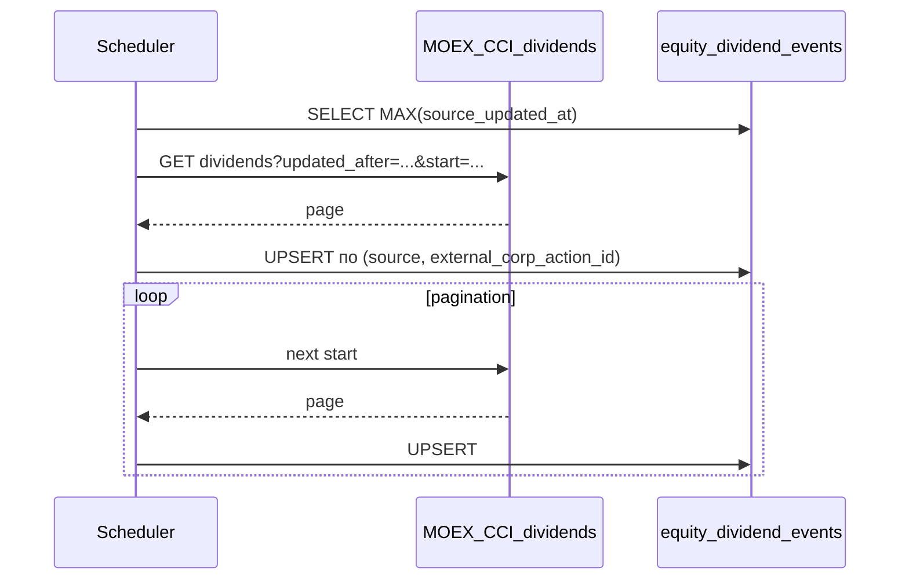

# Единая спецификация: режим бэктестинга (UI + backend)

**Версия:** 0.9.1  
**Статус:** v0.9 + **синхронизация политики риска без робота** (BRD §4.1B ↔ `TESTING-UX-REFACTOR-SPEC` §7.4 ↔ `GrainSeedRisk`)  
**Связь с кодом сегодня:** `POST /api/robots/history-backtest` принимает опциональный `robot_id`, полное тело конфигурации и флаг **`async_execution`** (ответ **202** + фон через `BackgroundTasks`, продолжение с `deferred_run_id`); стратегия `grain_seed` в `backend/app/modules/robots/trading/strategies/grain_seed.py`. Календарь дивидендов: `equity_dividend_events`, `DividendCalendarService`, ETL в `backend/app/modules/corporate_actions/`. Лимит 4 параллельных MOEX HTTP: `backend/app/modules/moex/http_gate.py` (используется в `market_data_v1/moex_fetch.py`, `dms/service.py`, `robots/service.py`, `market_data/service.py`). **v0.8:** зафиксированы fallback на `candles_cache` в history-backtest и зазор по дивидендам в live — см. §2.3.1, §3.0.1, §3.6.1. **v0.9:** **§4.0–4.2** (форма), **§4.3** — матрица. **v0.9.1:** политика **§4.1B** без робота — пресет `config.risk` = defaults класса **`GrainSeedRisk`** в `backend/app/modules/robots/schemas.py` (валидатор требует непустой `config.risk` при `robot_id is None`); UI — §7.4 UI-спеки.

Документ составлен в трёх голосах: **@business-analyst-trader** (бизнес и фильтры), **@systems-analyst** (архитектура, API, данные), **продукт/реализация** (сводка изменений UI/backend по пунктам заказчика).

---

## 1. Executive summary

Нужен режим **бэктестинга, независимый от сохранённого робота**: пользователь либо подставляет параметры существующего робота, либо задаёт их вручную с **пресетами по стратегиям**. Сейчас поддерживается одна стратегия — **«По зёрнышку, по семечке»** (`grain_seed`).

Требуется:

- Восстановление **незавершённого** прогона при открытии страницы.
- Перестроенный **UX** блоков: параметры теста, риск, пайплайн (условно по стратегии), информационный кэш свечей без кнопок, статус/запуск/отмена с прогрессом по торговым дням.
- **Backend:** единый REST, принимающий полное тело с UI (без обязательного `robot_id`), режимы фиксированного списка бумаг vs динамический pipeline, оркестрация DMS/снапшотов/свечей, пошаговая симуляция с сохранением решений/сигналов/ордеров и возможностью отмены с **частичным результатом**; **свечи симуляции:** приоритетно **`shared_market_candles`**, с **переходным fallback** на `candles_cache` / DMS ensure при нехватке рядов или отсутствии маппинга интервала (§3.6.1); **инструменты — только MOEX TQBR**; данные MOEX **не перезапрашиваются**, если уже в БД (§3.8); **ядро стратегии и риска — общее** с продуктовыми роботами; **дивидендный календарь** в **history-backtest** интегрирован в тот же пайплайн отбора, что и симуляция (§3.0.1 — **live** пока без того же шага); исходящий пул MOEX — **не более 4** параллельных HTTP (§3.7); модуль **`equity_dividend_events`** + ETL — §3.3.1, §2.4.1.

---

## 2. Голос @business-analyst-trader — требования и разделение фильтров

### 2.1 Разделение: «Фильтрация бумаг» vs «Генерация сигнала»

| Блок | Назначение | Что настраивается |
|------|------------|-------------------|
| **Фильтрация бумаг** | Определить **универс дня D**: какие тикеры допускаются к рассмотрению до intraday-симуляции. Источник правды — **снапшот рынка** (объём, спред, статусы, гэп и т.д.) + при необходимости **ATR** на истории до D + **календарь дивидендов** (§2.4). | Режим ALL/ANY, набор фильтров pipeline (см. ниже), динамический подбор vs фиксированный список от пользователя. |
| **Генерация сигнала** | На **шаге времени T** внутри дня D по уже отфильтрованному тикеру: правила входа/выхода, стоп/тейк, объём — **как в live**, но на исторических свечах выбранного интервала. | Параметры стратегии `grain_seed` (в т.ч. ADX/гэп/ATR на свечах сигнала — по фактической реализации стратегии; расширение — отдельными полями пресета). |

**Фильтрация бумаг (рекомендуемый минимальный набор для `grain_seed`, согласуется с текущим DMS-пайплайном на `/testing`):**

- Статус бумаги / режим торгов (`security_status`, `trading_status`) — как предохранители ликвидности.
- Объём (`volume`), число сделок (`num_trades`), капитализация (`capitalization`) — ликвидность и «размер имени».
- Спред (`spread`), гэп (`gap` + направление), открытие vs предыдущее закрытие (`price_vs_open`, `opening_range`).
- ATR (`atr` + период) — волатильность относительно цены.
- Оборот (`turnover`), удержание гэпа (`gap_retention`), шаг/лотность (`min_step_ratio`), белые/чёрные списки тикеров (`allowed_tickers` / `excluded_tickers`).
- **Дивидендный календарь** (§2.4): исключение или пометка бумаг в **дату отсечки** и/или в **окне N торговых сессий до** неё — снижение искажений OHLC, аукционов и нетипичной микроструктуры для intraday.

**Генерация сигнала (для `grain_seed`):**

- Входы/выходы строго по **логике стратегии на OHLCV** выбранного **интервала свечей сигналов** (в UI — дискретный набор; технически — только интервалы, поддерживаемые MOEX ISS для TQBR, с тултипом «доступные интервалы свечей предоставлены MOEX»).
- Риск-менеджмент на сделку: стоп/тейк/макс. доля/макс. рубли, комиссии, НДФЛ — как ограничения на размер и исполнение.

**Метрики успеха бэктеста (для приёмки, см. `trading-metrics-calculation`):** доходность за период, max drawdown, Sharpe (если дневная/шаговая доходность доступна), число сделок, hit rate, средний P&L на сделку, exposure по дням.

**Риски:** зависимость от полноты снапшот‑истории; rate limit MOEX при массовой дозагрузке; качество прокси спреда на свечах; ошибки/лаги в календаре дивидендов (см. §2.4).

### 2.2 Утренний отбор бумаг для внутридневной торговли (`grain_seed`)

**Важно:** «стабильно прибыльный» механизм в смысле рынка не существует как гарантия; ниже — **устойчивая к качеству исполнения** схема отбора, согласованная с тем, что стратегия уже делает на свечах (гэп, прокси спреда, ATR%, ADX-режим, MA/BB-триггеры, минимальная цель сверх round-trip комиссии — см. `grain_seed.py`).

**Идея двух слоёв (рекомендуется закрепить в пресетах):**

1. **Утро, universe (снапшот + при необходимости дневной ATR до D):** отсечь бумаги, в которых **внутридневная стратегия статистически чаще тонет в трении и плохом исполнении** — низкая ликвидность, «замороженный» статус, экстремальный гэп, широкий спред к цене, нерелистичная волатильность на открытии. Это не «предсказать движение», а **сузить выборку до режима, в котором правила стратегии имеют смысл** (достаточный оборот, исполнимый спред, не аномальный гэп).
2. **Внутри дня (свечи сигнала):** те же фильтры, что в коде стратегии, накладываются **пошагово** на уже допущенный universe — здесь ловятся режим trend/flat и точка входа.

**Практические правила для «правильнее с утра» (дополнения к таблице фильтров §2.1):**

- **Сначала статусы и торгуемость**, затем ликвидность (объём/оборот/число сделок), затем **микроструктура открытия** (спред, гэп к предыдущему закрытию), затем **ATR%** — так меньше ложных срабатываний порога ADX/MA на «мусорных» тикерах.
- **Коридор волатильности:** слишком низкий ATR% часто даёт «шум ниже комиссии»; слишком высокий на открытии — риск проскальзывания и гэп-риска вне модели. Диапазон min/max для ATR% в pipeline лучше держать **симметричным к пресету стратегии** (`atr_min_pct` и верхняя граница как отдельный параметр universe, если его ещё нет в UI).
- **Гэп:** для intraday-логики экстремальный гэп — это чаще режим дискавери/перекоса спроса, а не «зёрнышко»; верхняя граница в pipeline должна **не противоречить** `gap_filter_pct` стратегии (universe может быть чуть строже).
- **Не дублировать смысл:** если утром уже отсекли по спреду в снапшоте, внутридневной `spread_limit_pct` остаётся **контролем на каждом баре** — это нормально; оба слоя разные по времени и по данным.

**Дополнительные уточнения для согласования с продуктом (не блокеры, но лучше зафиксировать):**

- **Момент снапшота для дня D:** первый доступный срез после открытия vs фиксированное время (например 10:05) — влияет на сопоставимость с live.
- **Секторные/корреляционные лимиты:** если позже портфель >1 имени, имеет смысл ограничить число бумаг из одного сектора в день — сейчас не требуется, если риск-менеджмент однопозиционный.

### 2.3 Решения заказчика (зафиксировано)

| Вопрос | Решение |
|--------|---------|
| Fixed universe | Тот же **утренний pipeline-фильтр**, что и для dynamic; отличие только в **исходном списке кандидатов** (задан пользователем vs выдан DMS). |
| Инструменты бэктеста | **Только MOEX, board TQBR** (акции основного режима). |
| Отмена прогона | Допускается **частичный результат**: `status = cancelled`, сохранены обработанные торговые дни, KPI считаются по фактически пройденному интервалу (с явной пометкой в UI). |
| Свечи для бэктеста и UI «кэш» | **Цель заказчика:** только `shared_market_candles`; **факт кода:** §2.3.1. |

### 2.3.1 Уточнение по свечам (as-built vs целевое решение заказчика)

Исходное решение заказчика (таблица §2.3): для потока бэктеста **не использовать** legacy `candles_cache`.

**Факт реализации (v0.8):** в `run_robot_history_backtest` (`backend/app/modules/robots/service.py`) симуляция **сначала** читает ряды из **`shared_market_candles`**; при ошибке чтения, отсутствии канонического маппинга интервала на shared-слой или **недостаточном числе баров** для тикера подключается **`candles_cache`** и `_ensure_candles_cached_for_tickers` (DMS). В `config_snapshot.execution_model.source_priority` в БД перечислены оба слоя — это отражает реальный приоритет, а не только целевой ARCH-01.

**Целевое состояние (backlog):** убрать fallback на `candles_cache` для history-backtest после полного покрытия интервалов/данных в `shared_market_candles` либо официально закрепить гибрид в BRD заказчика.

### 2.4 Календарь дивидендов и фильтрация `[ref: BRD-ARCH-02]`

**Цель:** в дни **отсечки по дивиденду** (и при необходимости в коротком окне перед ней) цена и ликвидность часто ведут себя нетипично; для стратегии с жёсткими порогами по гэпу/спреду/ATR и для честного сравнения с live **одинаковые правила** должны применяться в **live-роботе** и в **бэктесте** (общий модуль — §3.0). **Текущий зазор по live:** §3.0.1.

**Данные:**

- Справочник событий: тикер (TQBR), **дата отсечки** (`ex_date` в торговых днях MOEX), опционально размер/валюта (для аналитики, не обязательно для бинарного фильтра), `source`, `updated_at`, флаг подтверждения.
- Источник на реализацию: провайдер MOEX NSD/корпоративные таблицы ISS или иной согласованный канал; **ETL по расписанию**, версионирование записей; в hot-path симуляции — только **чтение из БД**.

**Правила фильтрации (пресеты, значения по умолчанию — на согласование):**

1. **Строгий режим (рекомендуется по умолчанию):** в торговую сессию дня **D = ex_date** тикер **не допускается** в universe (запись в `backtest_decisions` / аналог в live — «дивидендная отсечка»).
2. **Окно до отсечки (опционально):** параметр `exclude_sessions_before_ex` ∈ {0, 1, 2, …} — за сколько **торговых** сессий до `ex_date` исключать бумагу (учёт гэпов на объявление и снижение «шумной» зоны).
3. **Сплиты:** когда появится надёжный календарь сплитов — тот же паттерн; до внедрения — только дивиденды как обязательный минимум.

**Согласованность live / backtest:** один и тот же вызов вида «допустим ли тикер в день D с учётом календаря» — без ветвления «только для бэктеста».

### 2.4.1 Источники календаря и данные, которые нужно хранить (BA) `[ref: BRD-ARCH-02]`

**Откуда брать (приоритет для TQBR):**

| Источник | Назначение | Заметки |
|----------|------------|---------|
| **MOEX ISS — Корпоративная информация (ЦКИ), раздел дивидендов** | Массовая загрузка и инкремент: `GET https://iss.moex.com/iss/cci/corp-actions/dividends` с фильтрами `date_from`, `date_to`, `security` (ISIN/ID), `updated_after`, пагинация `start` | Официальная витрина КД; в документации MOEX раздел помечен как **пробный режим** — заложить мониторинг качества и fallback. Общие параметры и справочники: [Корпоративные действия](https://iss.moex.com/iss/docs/corpinfo/v1/corp_actions/). |
| **MOEX ISS — дивиденды по бумаге (legacy)** | Дозагрузка/сверка по одному тикеру: `GET https://iss.moex.com/iss/securities/{SECID}/dividends.json` (пример: `.../securities/SBER/dividends.json`) | Удобно для точечной донастройки; объём истории и поля могут отличаться от ЦКИ — **нормализовать в одну внутреннюю модель** при ETL. |
| **Справочник бумаг TQBR** | Сопоставление ISIN / внутренний ID MOEX ↔ тикер `board=TQBR` для джойна с событиями | Уже планируется как `instrument_universe` (§3.3). |

**Альтернативы / резерв (по мере зрелости продукта):** коммерческие потоки NSD/эмитентов, ручной импорт CSV для закрытия дыр — только если ЦКИ не покрывает бумагу или поле; фиксировать `source` в записи.

**Какие поля хранить в БД (минимум vs стратегия «календарь дивидендов»):**

| Поле / группа | Обязательно для отсечки в `grain_seed` | Расширение для отдельной стратегии «дивидендный календарь» |
|---------------|----------------------------------------|------------------------------------------------------------|
| Идентификатор бумаги | `ticker` (TQBR) + **жёсткая связка** с `instrument_universe` (ISIN / SECID) | То же; для скринеров — сектор/эмитент из справочника |
| **Дата отсечки (ex-date)** в смысле **торговой сессии MOEX**, по которой принимается решение «не торговать / торговать до» | Да (`ex_date` нормализованная) | Да; плюс отображение в UI и сортировка «ближайшие» |
| Стабильный ключ события из источника | Да (`external_corp_action_id` или аналог) для **идемпотентного upsert** | Да |
| `source` (cci / securities_dividends / manual) | Да | Да |
| `updated_at` источника, hash/версия сырого фрагмента | Да (аудит, инкремент `updated_after`) | Да |
| **Размер дивиденда** (на акцию), **валюта** | Нет для бинарного фильтра | **Да** — доходность к цене, фильтр «див > X %» |
| **Дата фактической выплаты** / реестр (если отличаются от ex в данных MOEX) | Опционально | **Да** для удержания/налоговой логики в BRD стратегии |
| Тип события (обычный / промежуточный), статус утверждения | Опционально (снижение ложных срабатываний) | **Да** |
| НДФЛ / удержание (если есть в ответе ЦКИ) | Нет для `grain_seed` | По необходимости BRD стратегии |

**Риски:** пробный режим ЦКИ; расхождение дат «закрытие реестра» vs «первая сессия без дивиденда» — в ТЗ на ETL явно зафиксировать, **какое поле MOEX маппится на `ex_date`** после валидации на 2–3 известных бумагах.

---

## 3. Голос @systems-analyst — архитектура, API, данные, потоки

### 3.0 Общее ядро с продуктовыми роботами и изоляция режимов `[ref: BRD-ARCH-02]`

**Принцип:** бизнес-логика, которая должна совпадать между live и симуляцией, живёт в **одном наборе модулей**; различие только в **адаптерах исполнения** и **контексте прогона**.

| Слой | Общий для live-робота и бэктеста | Изоляция по режиму |
|------|-----------------------------------|---------------------|
| Стратегия | `GrainSeedStrategy`: расчёт сигналов по свечам, те же параметры | Бэктест: свечи **приоритетно** из `shared_market_candles`, при нехватке — fallback §3.6.1; live — поток/кэш брокера |
| Утренний pipeline / фильтр тикера | **History-backtest:** DMS `_evaluate_pipeline_row` + ATR + **`DividendCalendarService`** после финального прохода (`robots/service.py`). **Live-торговля:** тот же класс стратегии `GrainSeedStrategy`, но **без** автоматического шага дивидендного календаря в `trading/*` — см. §3.0.1. | Входные снапшоты: DMS/history vs live/брокер |
| Риск-менеджмент | Расчёт размера позиции, стоп/тейк, комиссии, отказ «мало капитала» | Live: реальный брокер; бэктест: симулятор ордеров / `backtest_orders` |
| Загрузка MOEX | HTTP-клиент ISS, нормализация ответа, **range-split**, upsert в **`shared_market_candles`** | Один пул исходящих запросов с лимитом §3.7; вызывается и роботом, и оркестратором бэктеста |
| Справочники | TQBR справочник (в коде: `tqbr_securities` + ETL), **`equity_dividend_events`** (§3.3.1) | ETL общий; чтение в hot-path без ветки «только бэктест» |

**Потребители модуля календаря (не исчерпывающе):** (1) **history-backtest** — дивидендный отсев в дневном пайплайне (`robots/service.py`); (2) **live** — сервис готов, **автовызов в `trading/*` не подключён** (§3.0.1); (3) будущая стратегия **`dividend_calendar`**; (4) дашборды/алерты при необходимости. **Один репозиторий БД + один сервис чтения**; в runtime стратегии не ходят в MOEX за дивидендами.

**Режим исполнения (концепт):** явный контекст `ExecutionMode` = `LIVE_ROBOT` | `BACKTEST` (или эквивалент), прокидываемый в оркестратор; **запрещено** дублировать формулы фильтрации/сигналов во втором модуле «только для бэктеста». Бэктест-оркестратор — тонкая оболочка: цикл по дням, проверка отмены, запись `backtest_*`, вызов **тех же** сервисов, что и рабочий робот.

### 3.0.1 Зазор: дивидендный календарь в live `[ref: BRD-ARCH-02]`

**Факт:** `DividendCalendarService` и политика `exclude_sessions_before_ex` вызываются в **`run_robot_history_backtest`** при дневном отборе тикеров. В каталоге **`backend/app/modules/robots/trading/`** (live-сессия, стадии робота) вызовов сервиса **нет**: робот торгует по **заранее заданным FIGI** без автоматического отсечения ex-date на стороне сервера.

**Следствие:** сопоставимость «как в бэктесте» для live **не гарантируется**, пока не добавлен вызов того же сервиса на путь live или ручное ограничение universe.

### 3.1 Состояние реализации API history-backtest (as-built, v0.8)

Этот подраздел **заменяет** прежний текст «конфликт с реализацией»: описанное ниже **уже в коде**.

| Аспект | Реализация |
|--------|------------|
| Путь | **`POST /api/robots/history-backtest`** (без отдельного `/v2`) |
| `robot_id` | **Опционален**; при `null` конфигурация берётся из тела (`strategy`, `config`, …) с валидацией |
| Синхрон vs async | По умолчанию синхронный **`200`** `RobotHistoryBacktestResponse`; при **`async_execution: true`** — немедленный **`202`** `RobotHistoryBacktestAsyncAccepted` + фон (`BackgroundTasks`, отдельная DB-сессия для прогона) |
| Опрос и отмена | **`GET /api/robots/history-backtest/runs/active`**, **`GET .../runs/{run_id}`**, **`POST .../runs/{run_id}/cancel`** — см. §9.1 |
| Стратегия | Только **`grain_seed`**; иначе **`422`** с `detail`: **«Указанная стратегия не найдена»** |

**Дальнейшие доработки (не блокируют as-built):** расширение списка стратегий; явный тип `ExecutionMode` в коде, если понадобится для метрик.

### 3.2 REST-контракт history-backtest (логический + ссылка на §9)

Детальные пути, поля тел и Pydantic-схемы — **§9.1–9.3**. Ниже — краткая логика без дублирования таблиц.

**`POST /api/robots/history-backtest`**

- **Тело:** полный снимок с UI: `strategy`, `broker`, `poll_interval` (симуляция частоты робота), `trading_hours` (start/end), `test_from` / `test_to`, `signal_candle_interval`, `risk`, `costs`, `universe_mode` (`fixed_tickers` | `pipeline`), `tickers[]` (для fixed), `pipeline: { mode, filters }` (для pipeline), опционально `preset_id` / `preset_version`.
- **Ответ при `strategy != grain_seed`:** `400` / `422` с текстом **`Указанная стратегия не найдена`** (как договорено).
- **Асинхронность:** при `async_execution: true` — **202** + `{ run_id, status, message }` и опрос **`GET /api/robots/history-backtest/runs/{run_id}`** (или `.../runs/active`). Статусы/фазы в БД: в т.ч. `QUEUED`, `RUNNING`, `SUCCESS`, `FAILED`, **`CANCELLED`** (частичный результат — `partial_result`), поля **`current_trade_date`**, **`trade_dates_total`**, **`trade_dates_remaining`**, **`run_phase`**.

**Отмена:** `POST /api/robots/history-backtest/runs/{run_id}/cancel` — оркестратор завершает текущий шаг корректно, выставляет `cancelled`, **сохраняет** уже записанные дни/сигналы/ордера; итоговый отчёт помечается как неполный (поле `partial: true` или диапазон фактически просимулированных дат).

**Восстановление при открытии UI:** `GET /api/robots/history-backtest/runs/active` (или фильтр в list: `status in (queued, running, ...)` последний по пользователю).

### 3.3 Хранилище (новые/расширяемые сущности, логический уровень)

- **`backtest_runs`:** user_id, strategy, params JSON, universe_mode, статус, текущий день симуляции, ошибка, created/updated.
- **`backtest_decisions`:** run_id, trade_date, ticker, status (`success` / `unsuccess`), reason, universe_source (`user_list` / `pipeline`).
- **`backtest_signals` / `backtest_orders` / портфель-снимки:** привязка к `run_id`, шагу T, цене исполнения, причинам reject.
- **`equity_dividend_events` (или `corporate_calendar_dividends`):** справочник отсечек по TQBR — тикер, `ex_date`, метаданные источника, индекс по `(ticker, ex_date)`; наполнение вне hot-path (§2.4). Читается **`DividendCalendarService`**; **подключён к history-backtest**; live-автовызов — §3.0.1.

#### 3.3.1 Модуль хранения и доступа к календарю дивидендов `[ref: §2.4.1]`

**Назначение:** персистентное **внутреннее** хранилище нормализованных событий; MOEX (и прочие источники) только **питают** таблицы через ETL. Данные **обязаны** храниться в PostgreSQL даже при наличии онлайн-API — это общий слой для **фильтрации `grain_seed`**, **бэктеста** и **отдельной продуктовой стратегии дивидендного календаря** (чтение одного и того же набора полей из §2.4.1).

**Состав модуля (логический):**

| Компонент | Роль |
|-----------|------|
| Таблица(ы) `equity_dividend_events` | Нормализованные строки событий; уникальность по `(source, external_corp_action_id)` или эквивалент; индексы по `(ticker, ex_date)`, `(ex_date)`, `updated_after` для инкремента |
| ETL-джоб (планировщик) | Вызов ЦКИ `.../corp-actions/dividends` с `updated_after` + окно `date_from`/`date_to`; пагинация; **без повторной записи** неизменённых строк; при необходимости — дочитка `.../securities/{secid}/dividends.json` |
| `DividendCalendarService` (имя по коду) | API домена (чтение только БД); **используется в history-backtest**; для **live** — подключение в торговый цикл в backlog (§3.0.1) |
| Конфиг политики | Параметры `exclude_sessions_before_ex` и т.д. — на уровне робота/пресета; **не** дублировать таблицу событий на стратегию |

**Интеграция с §3.8:** первичная загрузка дивидендов через MOEX — после успешного ответа строки попадают в `equity_dividend_events`; повторный ETL с теми же ключами — update-in-place. Правило «не перезапрашивать лишний раз» применяется к **HTTP**; при этом **инкремент `updated_after`** допускается по расписанию для обновления изменившихся записей.

Справочник тикеров для бэктеста и блока «Общий кэш свечей»: **`instrument_universe` (или аналог)** с фильтром **`engine=stock`, `market=shares`, `board=TQBR`**, источник справочника — MOEX ISS `.../boards/TQBR/securities.json`; обновление по расписанию, не в hot-path прогона.

**ER (логическая модель прогона)** `[ref: BRD-ARCH-02]`

Связь с существующими артефактами: `docs/BRD-01-backtest-robot-dynamic-universe-presets.md`, `docs/ARCH-01-unified-moex-candles-backtest.md` — при реализации сверить, чтобы не дублировать противоречивые решения по хранению свечей.

### 3.4 Sequence: открытие страницы и запуск

### 3.5 Режимы universe `[ref: §2.3]`

1. **Fixed tickers:** исходный список задаёт пользователь (только тикеры из справочника TQBR). **Утренний pipeline-фильтр тот же**, что в dynamic: каждая бумага проходит те же `optimized_filters` на снапшоте дня D, **календарь дивидендов** (§2.4) и при необходимости ATR на дневной истории до D; не прошедшие получают запись в `backtest_decisions` с причиной отсева. **DMS** для отбора universe не нужен; дозагрузка снапшотов/свечей — по общим правилам §3.8.
2. **Pipeline (dynamic):** расширение кандидатов через DMS до фиксированного universe дня D; далее — тот же утренний скоринг и цикл по §5–6 заказчика.

### 3.6 Свечи и покрытие для UI

- **Блок «Общий кэш свечей» и endpoint coverage:** единственный источник агрегации **без исходящего MOEX** — таблица **`shared_market_candles`** `[ref: ARCH-01]`; запрос **`GET /api/v1/market-data/candles/coverage-summary`** (§9.5).

### 3.6.1 Свечи внутри history-backtest (симуляция) — приоритет и fallback

Поведение **`run_robot_history_backtest`** (`backend/app/modules/robots/service.py`):

1. **Первично:** чтение рядов из **`shared_market_candles`** для выбранных тикеров, интервала (канонический маппинг из `strategy_params.interval`) и окна дат.
2. **Fallback:** если чтение shared не удалось, для интервала нет маппинга на shared, или **число баров ниже порога** — дозагрузка/чтение через **`candles_cache`** (`_ensure_candles_cached_for_tickers` + SQL к `candles_cache`).

В снимке прогона (`execution_model.source_priority` в JSON) перечислены оба слоя — это **документирование факта**, а не только целевой ARCH-01.

Инвариант §3.8 (**не дублировать успешно сохранённые запросы к MOEX**) сохраняется для путей, которые пишут в **`shared_market_candles`**; путь через legacy-кэш описан в §2.3.1.

### 3.7 Multi-tenant, очередь и лимит исходящих HTTP `[ref: BRD-ARCH-02]`

- Один оркестратор на run с блокировкой; DMS historical fetch — **отдельная очередь/воркер** от live snapshot, чтобы не блокировать подписки.
- **Одновременные HTTP-сессии (MOEX ISS и прочие исходящие загрузчики, общие с продуктовыми роботами):** глобальный семафор (или эквивалентный пул) с **не более чем 4 параллельными** активными HTTP-запросами в рамках одного процесса приложения (единый лимит для live и бэктеста, чтобы не удваивать нагрузку на MOEX). При горизонтальном масштабировании — повторить лимит **на реплику** или ввести внешний rate limiter; это решение выносится в эксплуатационную конфигурацию без изменения бизнес-правил §3.0–3.8.

### 3.8 MOEX: персистентность и отсутствие повторных запросов `[ref: §2.3, ARCH-01]`

**Инвариант:** любой успешно полученный ответ MOEX ISS (справочник бумаг, свечи, вспомогательные справочники, если они кэшируются в БД для бэктеста) **сохраняется** в PostgreSQL. Планировщик/оркестратор **не инициирует повторную загрузку** диапазона баров, который уже покрыт записями в `shared_market_candles` (с тем же ключом нормализации: тикер, board TQBR, интервал, границы сессии/даты согласно схеме ARCH-01).

**Поведение:**

- Перед HTTP-вызовом: **range split** — из запрошенного периода вычитаются существующие непрерывные сегменты в БД; во внешний клиент уходят только «дыры» (объединённые в минимальное число запросов с учётом лимитов ISS).
- После HTTP: upsert идемпотентный по PK/unique constraint; повторный прогон того же бэктеста или параллельный пользователь **читает из БД**.
- Идемпотентность при частичной отмене прогона: уже записанные свечи остаются общим активом; отмена не откатывает загрузку данных.
- Логирование: метрика «избежанных запросов к MOEX» (cache hit по БД) — желательно для контроля rate limit; **фактическая конкуррентность внешних вызовов** не превышает §3.7.

**Снапшоты рынка** (если хранятся отдельно от DMS): тот же принцип — ключ `(trade_date, ticker, …)`; отсутствие записи → запрос; наличие → только чтение.

---

## 4. UX страницы `/testing`: форма бэктеста и поведение

**Разделение артефактов:** в этом документе — **что** должна содержать форма (поля, обязательность, правила, связь с API). Визуальный layout, sticky-bar, плотность колонок, skeleton и макетные критерии — **`docs/ui/TESTING-UX-REFACTOR-SPEC.md`** (`[ref: UI-TESTING-UX]`). Реализация API — **§9**.

### 4.0 Сценарий при открытии страницы

1. **Первый запрос:** `GET /api/robots/history-backtest/runs/active` (или эквивалент по §9).
2. Если есть незавершённый прогон (`QUEUED` / `RUNNING`): **восстановить** значения формы из последнего известного состояния (локальный черновик + при наличии `config_snapshot` с сервера) и показать **прогресс** (`run_phase`, `current_trade_date`, `trade_dates_remaining`, при `cancel_requested` — баннер «отмена запрошена»).
3. Если активного прогона нет: показать **пустую/дефолтную** форму, начиная с блока **«Параметры теста»** (см. §4.1).

### 4.1 Блоки формы: поля, обязательность, автозаполнение

#### Блок A — «Параметры теста» (всегда видим в режиме настройки)

| Поле / группа | Обязательность | Поведение |
|-----------------|----------------|-----------|
| Выбор робота | Опционально | При выборе робота: подтянуть с сервера **стратегию**, **брокера**, **частоту опроса** (симуляция частоты робота в live), при наличии — **расписание** и прочие сохранённые поля конфига. При сбросе робота — не очищать вручную введённые пользователем поля без подтверждения (по UX-спеке). |
| Стратегия | Обязательна, если робот не выбран | Сейчас только **`grain_seed`**; иные значения — ошибка до отправки или сообщение с сервера (§9.2). |
| Брокер | Обязателен без робота | Согласован с допустимыми режимами исполнения в конфиге. |
| Частота работы робота | Обязательна без робота | Отображаемое имя: «частота опроса» / аналог; маппится на параметры оркестратора в теле `POST /history-backtest`. |
| Расписание работы робота | Обязательно задать интервал | Два поля **ЧЧ:ММ — ЧЧ:ММ** (торговая сессия симуляции); валидация: начало < конец, допустимый диапазон по продукту. |
| Интервал тестирования (дата с — дата по) | **Обязательно** | **С** — любая дата в прошлом; **по** — не позднее **вчера** (текущая дата минус 1 календарный день в TZ продукта). Подсветка ошибки при нарушении. |

#### Блок B — «Риск-менеджмент»

| Поле / группа | Обязательность | Поведение |
|-----------------|----------------|-----------|
| Весь блок | **Обязателен в теле запроса** при `robot_id is None` | **С роботом:** подставить `config.risk` с сервера при загрузке шаблона робота; при смене робота — обновить риск из нового шаблона (несохранённые правки пользователя: см. UI-спека §7.4). **Без робота:** сразу заполнить форму **пресетом**, численно совпадающим с дефолтами Pydantic-модели **`GrainSeedRisk`** в `backend/app/modules/robots/schemas.py` (это же должно уйти в `config.risk` в `POST` — иначе сервер вернёт ошибку валидации). Поля показывать как **готовые значения**, не как пустые плейсхолдеры. **Кнопка «Запустить»:** разрешена без дополнительного «подтверждения пресета», если выполнены §4.1A и клиентская валидация диапазонов риска; ненавязчивое уведомление «используются пресетные параметры риска» — по §7.4 UI-спеки. |

#### Блок C — «Управление пайплайном» (universe + фильтры стратегии)

| Условие показа | Содержимое |
|----------------|-------------|
| Показывать **только после** выбора стратегии **или** робота (т.е. когда известен `grain_seed`). | Поля pipeline / universe по текущей реализации `grain_seed` и DMS-фильтрам. |
| Перенос из «параметров робота» | Поле **«Интервал свечей (сигналы)»** с вариантами, согласованными с MOEX TQBR; **тултип:** «Доступные интервалы свечей предоставлены MOEX». |
| Дивидендный календарь | Если выводим в UI: параметры из §2.4 (в т.ч. `exclude_sessions_before_ex`); иначе — дефолт на бэке, но отображать в summary формы кратко. |

#### Блок D — «Общий кэш свечей» (информационный)

| Требование | Деталь |
|------------|--------|
| Назначение | Показать **сколько свечей** в БД для выбранного **интервала** и **периода** и набора бумаг. |
| Тикеры | **Мультиселект** с **поиском** (тот же паттерн UX, что у «частоты опроса» — combobox с фильтрацией), источник справочника **TQBR** (`GET .../tqbr-securities`, §9.5). Пустой список тикеров = **«все бумаги»** для расчёта охвата (как в ТЗ заказчика). |
| Пересчёт | При изменении **тикеров**, **периода** или **интервала свечей** — **автоматический** пересчёт (debounce 300–500 ms), **без кнопок** «Проверить» / «Обновить». |
| Сноски | В блоке **не** использовать приписки/сноски; только цифры и короткие подписи. |

#### Блок E — «Статус подготовки и теста»

| Состояние UI | Элементы |
|--------------|-----------|
| Нет активного прогона | Кнопка **«Запустить бэктест»** (disabled, пока форма невалидна). |
| Прогон идёт | **Run bar** (см. UI-спеку): текст вида «Выполняется тестирование. Текущая дата тестирования **DD.MM.YYYY**. Осталось **N** дат»; опрос `GET .../runs/{id}`; кнопка **«Отменить»** → `POST .../cancel`. Для длинного периода — отправка с **`async_execution: true`** (§9.4). |
| Завершено успешно | Статус «Завершён», **form-hint** «История тестирования», зона результата (`testing-analysis-stage__result` / эквивалент по UI-спеке): KPI, кривая, табы деталей. |
| Отмена с частичным результатом | Явный бейдж **«Неполный прогон»** + те же KPI/график за фактический интервал (`partial_result`, §9.3). |

### 4.2 Валидация и отправка

- Перед `POST /api/robots/history-backtest`: клиентская валидация обязательных полей §4.1A–B; серверная — по §9.2 и OpenAPI.
- Тело запроса должно **повторять структуру** сохраняемого снимка (в т.ч. `config.pipeline`, `config.risk`, `strategy`, даты, `async_execution` при выбранной политике фона).
- Ошибки: показ **рядом с полем** + краткий **summary** у зоны запуска (см. сценарий S1 в `[ref: UI-TESTING-UX]`).

### 4.3 Матрица трейсинга (заказчик → UI / backend)

Ниже — прежняя матрица «требование → UI / backend» для трейсинга на ревью; детализация полей — **§4.0–4.2** выше.

| № | Требование | UI | Backend |
|---|------------|-----|---------|
| 0 | Вход на страницу | Запрос активного незавершённого прогона; восстановление формы и прогресса | `GET .../runs/active` + отдача сериализованного snapshot параметров |
| 1 | Блок «Параметры теста» | Поля: робот (опц.), стратегия, брокер, частота работы, **расписание ЧЧ:ММ–ЧЧ:ММ**, интервал теста (обяз., от прошлого до today−1) | Валидация дат; если робот выбран — подстановка полей с сервера; иначе defaults/пресеты |
| 2 | Риск | Обязателен; автозаполнение с робота или плейсхолдеры | Тело запроса включает risk целиком |
| 3 | Пайплайн | Показ только после стратегии/робота; только поля для `grain_seed`; перенос «Интервал свечей (сигналы)» сюда + тултип MOEX; **параметры дивидендного исключения** (§2.4), если выводим в UI | Фильтры в теле; общий модуль §3.0 |
| 4 | Общий кэш свечей | Инфо только: счётчики, мультиселект тикеров с поиском (справочник **TQBR**), пересчёт on change, **без кнопок** | Endpoint coverage summary **только** по `shared_market_candles`; справочник из MOEX ISS TQBR |
| 5 | Статус | Кнопка «Запустить» только когда нет теста; при прогоне — прогресс по датам + «Отменить»; длинный период — **202** + опрос `GET .../runs/{id}`; по завершении / **отмене с частичным прогрессом** — явная пометка неполного отчёта + hint + блок результата | `async_execution` → **202** + `QUEUED`/`RUNNING`; отмена в pipeline и в симуляции (`cancel_check`); `CANCELLED` + `partial_result` |

---

## 5. Сводка по backend-логике (п.1–7 заказчика)

| П | Описание | Примечание |
|---|----------|------------|
| 1 | Тело содержит все параметры UI; `robot_id` не обязателен | Опционально `robot_id` только для «подтянуть шаблон» с клиента |
| 2 | `strategy != grain_seed` → ошибка «Указанная стратегия не найдена» | Расширение позже — новые strategy id |
| 2a | Режим fixed | Список кандидатов от пользователя (TQBR); **тот же утренний pipeline**, что и dynamic; DMS не нужен для расширения universe | §2.3, §3.5 |
| 2b | Режим pipeline | Снапшот‑история, очередь DMS, статус «Запрашиваем данные…»; далее общий скоринг | Отдельный worker |
| 3 | Утренний скоринг по снапшоту | DMS pipeline + ATR + **дивиденды** в **history-backtest** (`service.py`); live — без дивидендного шага в `trading/*` (§3.0.1) |
| 3b | Календарь дивидендов | Таблица `equity_dividend_events`, ETL, `DividendCalendarService`; hot-path только чтение БД |
| 4 | Дневные свечи до старта, ATR, симуляция | **Приоритет** `shared_market_candles`; **fallback** `candles_cache` / DMS — §3.6.1 |
| 5 | `backtest_decisions` success/unsuccess + причина | Новая/расширенная таблица |
| 6 | Цикл бумага×день×T: свечи, сигналы, ордера, симуляция исполнения | Использовать существующую стратегию + расширить под пошаговый run |
| 7 | Итоговые KPI в ответе / в последнем шаге run | Для `cancelled`: KPI по фактически просимулированным датам + флаги `partial` / `simulated_date_range` |

---

## 6. Открытые вопросы

На момент **v0.8** спека приведена в соответствие с **as-built** backend: §2.3.1 (свечи), §3.0.1 (live vs дивиденды), §3.1 (API), §3.6.1 (fallback симуляции). **§9** — контракт для UI без изменений по смыслу v0.7. **v0.9** — продуктовые требования к **форме** `/testing` (**§4.0–4.2**). **v0.9.1** — политика риска без робота **закрыта**: §4.1B + UI-спека §7.4 + `GrainSeedRisk`.

---

## 7. Handoff (сводка ролей)

| Роль | Получает |
|------|------------|
| **@senior-python-backend-engineer** | **§8** (порядок работ, критерии, пути коду), **§3.0–3.8**, **§2.4.1**; после merge — **§9** обязателен |
| **Frontend (позже)** | **§4.0–4.3** (форма + матрица), **§10** (порядок чтения, `config.risk` без `robot_id`), **§9.1–9.5** (REST + OpenAPI), `docs/ui/TESTING-UX-REFACTOR-SPEC.md` (**§7.4** — пресет риска) |
| **@business-analyst-trader** | Утвердить дефолты §2.4 (строгость ex-date, N сессий до отсечки) |
| **@systems-analyst** | Архитектурная база: §2.4.1, §3.0–3.8, **§8–10**; отдельный `docs/ARCH-03-...` опционален как выжимка DDL/ETL |

*Детальная цепочка передачи — §8–10.*

---

## 8. Передача в работу: @senior-python-backend-engineer `[ref: BRD-ARCH-02]`

### 8.1 Контекст кода (as-is)

| Область | Путь в репозитории |
|---------|-------------------|
| Роутер роботов (префикс приложения `/api` + `/robots`) | `backend/app/modules/robots/router.py` — сейчас `POST /api/robots/history-backtest`, `POST .../history-backtest/list`, `POST .../history-backtest/run`, compare-* |
| Оркестрация history-backtest | `backend/app/modules/robots/service.py` (`run_robot_history_backtest`), `usecases.py` |
| Схемы запросов/ответов | `backend/app/modules/robots/schemas.py` |
| Движок симуляции | `backend/app/modules/robots/trading/backtest/engine.py`, `persistence.py`, … |
| Модели БД прогонов | `backend/app/modules/robots/models.py` (`backtest_runs`, `backtest_signals`, …) |
| Свечи shared | `backend/app/modules/market_data_v1/` (см. `docs/ARCH-01-unified-moex-candles-backtest.md`) |

### 8.2 Порядок работ (рекомендуемый)

1. **Календарь дивидендов (§3.3.1, §2.4.1):** миграция Alembic → таблица `equity_dividend_events` (уникальность `(source, external_corp_action_id)`; индексы по `ticker`, `ex_date`, `secid`); ETL-джоб с MOEX ЦКИ `.../corp-actions/dividends` + опционально `.../securities/{SECID}/dividends.json`; общий **`DividendCalendarService`**; учёт **4** параллельных HTTP (§3.7).
2. **Интеграция в общее ядро (§3.0):** **`DividendCalendarService`** подключён к **history-backtest** (`robots/service.py`). Подключение к **live**-циклу (`trading/*`) — **backlog**, см. §3.0.1.
3. **Расширение history-backtest по ТЗ §3.2:** `robot_id` optional; полное тело с UI; `strategy != grain_seed` → **422** «Указанная стратегия не найдена»; **`async_execution: true`** → **202** + тело `RobotHistoryBacktestAsyncAccepted` (`run_id`, `status`, `message`), прогон в фоне (`BackgroundTasks`, отдельная DB-сессия, `deferred_run_id`); иначе синхронный ответ **200** `RobotHistoryBacktestResponse` по завершении расчёта.
4. **Эндпоинты состояния прогона:** `GET .../runs/active`, `GET .../runs/{run_id}`, `POST .../runs/{run_id}/cancel` (частичный результат §2.3) — маппинг на существующие таблицы `backtest_runs` / расширение статусов.
5. **Покрытие свечей для UI (§4):** read-only endpoint агрегации по `shared_market_candles` (точный mount — на усмотрение модуля `market_data_v1` vs `robots`, но **без** внешнего MOEX в handler).
6. **Справочник TQBR для мультиселекта:** при отсутствии готового — `GET` с поиском по префиксу тикера из кэшированного списка (ETL из `.../boards/TQBR/securities.json`).

### 8.3 Критерии приёмки (минимум) — статус v0.8

| # | Критерий | Статус |
|---|----------|--------|
| 1 | Дивиденды в БД; ETL идемпотентен; hot-path только чтение БД | **Выполнено** (осторожно: при CCI-сбое — fallback securities JSON) |
| 2 | History-backtest: отсев по ex-date / окну `exclude_sessions_before_ex`; причина в артефактах прогона | **Выполнено** в `service.py` |
| 3 | MOEX: не более **4** параллельных HTTP; range-split для shared-слоя | **Выполнено** (`http_gate`, `market_data_v1`) |
| 4 | §9 актуален; `async_execution` → **202** + опрос | **Выполнено** |

**Остаётся согласовать с заказчиком / backlog:** только **`shared_market_candles`** без `candles_cache` в симуляции (§2.3.1); дивиденды в **live** (§3.0.1).

### 8.4 Диаграмма: ETL дивидендов (инкремент)

---

## 9. Зафиксированные API-контракты (передача UI / синхронизация с OpenAPI)

Базовый префикс приложения: **`/api`**. Ниже — фактические пути и схемы из `backend/app/modules/robots/schemas.py` и `market_data_v1/schemas.py`. Для автогенерации типов на фронте достаточно **`GET /api/openapi.json`** после поднятия backend.

### 9.1 Таблица эндпоинтов backtest (`router.py`)

| Method | Path (от `/api`) | Назначение | Коды / схемы |
|--------|------------------|------------|--------------|
| `POST` | `/robots/history-backtest` | Запуск прогона | См. **§9.2** |
| `POST` | `/robots/history-backtest/list` | История прогонов | **200** `RobotBacktestHistoryResponse`; тело: `robotId` optional, `limit`, `only_active` |
| `POST` | `/robots/history-backtest/run` | Детали по `runId` (legacy POST) | **200** `RobotBacktestRunDetailsResponse` |
| `GET` | `/robots/history-backtest/runs/active` | Активный незавершённый прогон (`RUNNING` / `QUEUED`) или отсутствие | **200** `RobotBacktestRunDetailsResponse` **или** тело **`null`** |
| `GET` | `/robots/history-backtest/runs/{run_id}` | **Основной опрос статуса** для UI после **202** и во время длинного **200** | **200** `RobotBacktestRunDetailsResponse`; **403** / **404** |
| `POST` | `/robots/history-backtest/runs/{run_id}/cancel` | Поставить флаг отмены | **200** `RobotBacktestCancelResponse` (`run_id`, `cancel_requested`) |
| `POST` | `/robots/history-backtest/compare*` | Сравнение прогонов | без изменений |

### 9.2 `POST /robots/history-backtest` — тело и ответы (для UI)

**Запрос:** `RobotHistoryBacktestRequest`

| Поле | Тип | Обязательность | Примечание |
|------|-----|------------------|------------|
| `robot_id` | int \| null | опционально | Если null — полный сценарий из `strategy` + `config` |
| `strategy` | string | обязателен при `robot_id == null` | Сейчас только **`grain_seed`** |
| `from_date`, `to_date` | datetime (UTC) | да | `to_date` > `from_date` |
| `initial_capital` | number | да (default 1e6) | ≥ 1000 |
| `config` | object | при отсутствии робота | Минимум **`config.risk`**; стратегия/пайплайн/косты — как согласовано в §4 |
| `poll_interval_hours`, `trading_hours_*`, `allowed_weekdays`, `token_id`, `type` | см. схему | опционально | Проброс в оркестратор |
| **`async_execution`** | **boolean** | default **false** | **`true`** → немедленный **202** + фон; иначе ждём конец расчёта и **200** |

**Ответы:**

| Код | Когда | JSON (Pydantic) |
|-----|--------|-----------------|
| **200** | `async_execution == false` и прогон завершён без фатальной ошибки в оркестраторе | `RobotHistoryBacktestResponse` — `run_id`, `initial_capital`, `final_equity`, `total_return_percent`, `max_drawdown_percent`, `trades`, `equity_curve`, `stages`, `history_stats`, `daily_summary` |
| **202** | `async_execution == true` | `RobotHistoryBacktestAsyncAccepted` — **`run_id`**, **`status`** (например `"queued"`), **`message`** (подсказка с путём опроса) |
| **400** / **422** | Валидация тела, нет свечей, неверная стратегия и т.д. | `detail` по FastAPI |
| **502** | Сбой загрузки данных / расчёта в оркестраторе | `detail` |

**Поведение после 202:** строка `backtest_runs` создаётся со статусом **`QUEUED`**, затем воркер переводит в **`RUNNING`** и выполняет тот же пайплайн, что и синхронный прогон. Клиент **не держит** соединение: опрос **`GET /api/robots/history-backtest/runs/{run_id}`** (или **`GET .../runs/active`**).

**Отмена:** `POST /api/robots/history-backtest/runs/{run_id}/cancel` выставляет **`cancel_requested`**. Проверка выполняется **на границе календарного дня** в pipeline и **периодически внутри симуляции** (по барам, с throttling), чтобы длинная фаза симуляции тоже могла быть прервана.

Итоговые статусы прогона в БД (для отображения в UI): в т.ч. **`SUCCESS`**, **`FAILED`**, **`CANCELLED`**; при отмене с накопленными данными — **`partial_result: true`**, KPI в `result_payload` / метриках отражают **фактически пройденный** интервал.

### 9.3 `GET /robots/history-backtest/runs/{run_id}` — поля для статус-бара

Схема **`RobotBacktestRunDetailsResponse`**: `run_id`, `robot_id`, **`status`**, `requested_from`, `requested_to`, `started_at`, `finished_at`, `initial_capital`, `total_return_percent`, `max_drawdown_percent`, `final_equity`, `trades_total`, **`result_payload`**, `signals`, `orders`, `portfolio_snapshots`, `daily_summary`, **`partial_result`**, **`run_phase`**, **`current_trade_date`**, **`trade_dates_total`**, **`trade_dates_remaining`**, **`cancel_requested`**.

Рекомендация UI: при **`RUNNING` / `QUEUED`** показывать `run_phase` + прогресс по дням (`trade_dates_*`, `current_trade_date`); при **`cancel_requested`** — индикатор «отмена запрошена».

### 9.4 Реализация на фронте (референс в репозитории)

- Сервис: `frontend/src/services/robotService.ts` — `runHistoryBacktest` возвращает **`{ status: 200 \| 202, data }`**.
- Страница тестирования: `frontend/src/pages/testing/hooks/useTestingBacktest.ts` — для длинного календарного окна (**> 45 торговых дней по `from`/`to`**) в запрос добавляется **`async_execution: true`**, затем выполняется **опрос** `getHistoryBacktestRun` до терминального `status`. Порог **45** — эвристика UX, не контракт backend; при необходимости сменить на явный переключатель «фоновый прогон».

### 9.5 Market data v1 (read-only)

| Method | Path (от `/api`) | Назначение | Response (Pydantic) |
|--------|------------------|------------|---------------------|
| `GET` | `/v1/market-data/candles/coverage-summary` | Сводка по `shared_market_candles` без MOEX | `CandleCoverageSummaryResponse` |
| `GET` | `/v1/market-data/tqbr-securities` | Поиск по префиксу SECID из `tqbr_securities` | `TqbrSearchResponse` |

**Changelog §9:** **v0.6** — дивиденды + TQBR ETL, MOEX×4, GET/POST cancel, coverage-summary, tqbr-securities. **v0.7** — **`async_execution`**, **202** + фоновый прогон, отмена в симуляции, уточнение статусов/§9 для UI. **v0.8** — синхронизация описательных разделов §2.3.1, §3.0.1, §3.1, §3.6.1 с **as-built** кодом (пути и схемы §9.1–9.5 без изменений). **v0.9** — без изменений контрактов §9.1–9.5; в документ добавлены **§4.0–4.2** (UX-форма `/testing` на уровне полей и поведения). **v0.9.1** — без изменений §9; уточнена передача UI в **§10** (порядок чтения, `config.risk` при отсутствии `robot_id`).

**Changelog документа (кроме §9):** **v0.9** — §4 переименован и расширен: сценарий входа, блоки A–E, валидация/отправка; §4.3 — прежняя сводная таблица. **v0.9.1** — §4.1B: пресет риска без робота = `GrainSeedRisk` defaults; синхрон с `docs/ui/TESTING-UX-REFACTOR-SPEC.md` §7.4; §6 — снят открытый вопрос по риску.

---

## 10. Передача @senior-typescript-ui-engineer (после §9)

**Порядок чтения для реализации `/testing`:** **§4.0–4.3** (продуктовая форма) → **`docs/ui/TESTING-UX-REFACTOR-SPEC.md`** (layout, sticky-bar, §7.4 пресет риска) → **§9.1–9.5** (REST + схемы) → **`GET /api/openapi.json`**.

**Входные артефакты:**

- **§9.1–9.5** настоящего документа (REST для backtest + market_data v1) и при необходимости актуальный **`GET /api/openapi.json`** с сервера разработки.
- **§4.0–4.3** (поля формы, валидация, матрица) и **`docs/ui/TESTING-UX-REFACTOR-SPEC.md`** (layout, sticky-bar, контракт `loading/ready/empty/error/partial`, **§7.4** — риск без робота).

**Задачи UI (высокий уровень):**

- Страница `/testing`: блоки параметров, риска, пайплайна, кэш-сводка, статус прогона с отменой и прогрессом по датам — строго по контрактам из **§9** (в т.ч. ветка **202** + polling **`GET .../runs/{run_id}`**).
- При **`robot_id` отсутствует:** в теле всегда отправлять **`config.risk`**, инициализированный пресетом **строго как дефолты `GrainSeedRisk`** в `backend/app/modules/robots/schemas.py`, пока пользователь не изменил поля (см. §4.1B, UI §7.4).
- Типы запросов/ответов — сгенерировать или синхронизировать с OpenAPI **после** поднятия backend с актуальной схемой.

**Ограничение:** не расширять контракт с клиента без согласования с backend (см. протокол агента: UI не авторинг API).

---

**✅ Документ обновлён (v0.9.1).** Цепочка: **@systems-analyst** (§1–7,8–10) → **@senior-python-backend-engineer** (реализация + §9) → **@senior-typescript-ui-engineer** (**§10** — порядок чтения; **§4** + UI-спека §7.4 + §9.2–9.4 + OpenAPI).
