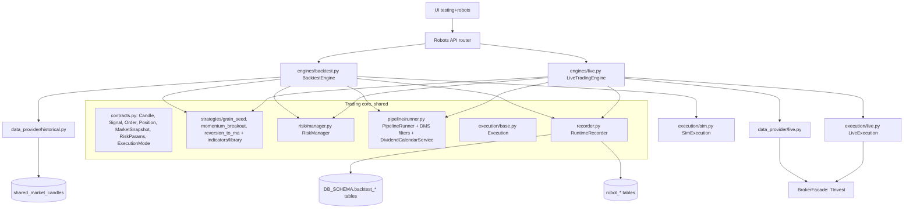

# BRD-ARCH-03 — Единое ядро торгового движка (backtest + live)

**Версия:** 1.0
**Статус:** draft for implementation
**Связь:** наследует решения [`BRD-ARCH-02-unified-backtest-testing-spec.md`](BRD-ARCH-02-unified-backtest-testing-spec.md) и [`ARCH-01-unified-moex-candles-backtest.md`](ARCH-01-unified-moex-candles-backtest.md); закрывает зазор §3.0.1 BRD-ARCH-02 (отсутствие `DividendCalendarService` в live) и формализует общие контракты для **бэктеста** и **реальной торговли**.

Документ написан в голосе **@systems-analyst** + **@senior-python-backend-engineer**, ориентирован на разработчика-исполнителя.

---

## §1. Executive summary

В коде уже есть общий контракт стратегии (`BaseStrategy.generate_signals` вызывается и из live `Stage5Signals`, и из backtest `engine.run_backtest_simulation`), но **бизнес-логика дублируется**: SL/TP/trailing/daily-loss/cooling/EOD-flatten — в [`backend/app/modules/robots/trading/backtest/engine.py`](../backend/app/modules/robots/trading/backtest/engine.py), а оркестрация (резерв средств, серия убыточных дней, принудительное закрытие) — в [`backend/app/modules/robots/trading/grain_seed_orchestrator.py`](../backend/app/modules/robots/trading/grain_seed_orchestrator.py) и [`backend/app/modules/robots/trading/session.py`](../backend/app/modules/robots/trading/session.py) с хардкодом по имени стратегии. Контракты данных размыты (везде `Dict[str, Any]`), а history-backtest пишется в две схемы (`{DB_SCHEMA}.backtest_*` и `backtest.*`).

Цель документа — зафиксировать 7-слойную архитектуру, в которой и **бэктест**, и **реальная торговля** запускают одну и ту же цепочку:

`DataProvider → Pipeline → Strategy → RiskManager → Execution → Recorder`.

Различаются только **DataProvider** (история vs стрим) и **Execution** (симуляция vs реальный брокер). Архитектура поддерживает три стратегии (GRAIN_SEED, MOMENTUM_BREAKOUT, REVERSION_TO_MA), общий риск-менеджмент и единое журналирование решений в БД.

---

## §2. Целевая архитектура



**Принцип**: одинаковые `STRATS`, `RISK`, `PIPE`, `REC`, `TYPES` для обоих движков. Различаются только `DataProvider` и `Execution`.

### Границы ответственности

| Слой | За что отвечает | За что НЕ отвечает |
|------|------------------|----------------------|
| **DataProvider** | получение свечей/снапшота/справочников; кэширование; range-split | бизнес-фильтрация, выбор тикеров стратегией |
| **Pipeline** | утренний отбор universe по фильтрам + календарь дивидендов | загрузка истории, генерация сигналов |
| **Strategy** | сигналы входа/выхода по правилам и индикаторам | размер позиции, проверка лимитов, исполнение |
| **RiskManager** | лимиты, стопы, трейлинг, дневной P&L, концентрация, force close, sizing | контракт с брокером, расчёт индикаторов |
| **Execution** | формирование и отправка ордера; статус исполнения | проверка риск-лимитов, генерация сигналов |
| **Recorder** | единое журналирование решений и сделок в БД | расчёт KPI (kpi считаются в `metrics.py`) |
| **Engine** | оркестрация цикла + контроль cancel/recovery | бизнес-логика любого из слоёв выше |

---

## §3. Контракты данных

Новый модуль [`backend/app/modules/robots/trading/contracts.py`](../backend/app/modules/robots/trading/contracts.py).

Pydantic v2 `BaseModel` (для API и persist; arbitrary-types-allowed) + `dataclass(slots=True)` для hot-path (где BaseModel дорог). Все цены — `Decimal` или `float` в зависимости от роли.

```python
class ExecutionMode(str, Enum):
    BACKTEST = "BACKTEST"
    LIVE = "LIVE"
    PAPER = "PAPER"

@dataclass(slots=True)
class Candle:
    secid: str | None      # MOEX ticker
    figi: str | None       # T-Invest figi (для live)
    interval: str          # CANDLE_INTERVAL_5_MIN | M10 | D1 | ...
    time: datetime         # UTC
    open: float
    high: float
    low: float
    close: float
    volume: int            # лоты или контракты, как у источника
    volume_rub: float | None  # turnover, если известен

class SnapshotRow(BaseModel):
    secid: str
    figi: str | None = None
    last_price: float | None
    open: float | None
    prev_close: float | None
    high: float | None
    low: float | None
    bid: float | None
    ask: float | None
    spread_pct: float | None
    volume_rub: float | None
    num_trades: int | None
    capitalization: float | None
    gap_pct: float | None
    atr_pct: float | None
    security_status: str | None
    trading_status: str | None
    meta: dict = {}

class MarketSnapshot(BaseModel):
    as_of: datetime
    trade_date: date
    board: str = "TQBR"
    rows: dict[str, SnapshotRow]   # by secid

class Signal(BaseModel):
    signal_id: UUID = Field(default_factory=uuid4)
    created_at: datetime = Field(default_factory=lambda: datetime.now(timezone.utc))
    secid: str | None = None
    figi: str | None = None
    side: Literal["BUY", "SELL", "CLOSE"]
    confidence: float | None = None
    quantity_hint: int | None = None
    target_price: float | None = None
    stop_price: float | None = None
    take_price: float | None = None
    reason: str = ""
    rule: str | None = None      # имя правила (ma_cross, bb_break, rsi_oversold...)
    strategy: str | None = None
    meta: dict = {}

class Order(BaseModel):
    order_id: UUID = Field(default_factory=uuid4)
    signal_id: UUID | None = None
    secid: str | None = None
    figi: str | None = None
    side: Literal["BUY", "SELL"]
    type: Literal["MARKET", "LIMIT"] = "LIMIT"
    price: float | None = None
    quantity: int
    tif: str = "DAY"
    status: Literal["NEW", "PARTIALLY_FILLED", "FILLED", "REJECTED", "CANCELLED"] = "NEW"
    created_at: datetime = Field(default_factory=lambda: datetime.now(timezone.utc))

class Fill(BaseModel):
    order_id: UUID
    fill_price: float
    quantity: int
    commission: float = 0.0
    slippage: float = 0.0
    tax: float = 0.0
    ts: datetime = Field(default_factory=lambda: datetime.now(timezone.utc))

@dataclass(slots=True)
class Position:
    secid: str | None
    figi: str | None
    side: Literal["LONG", "SHORT"]
    quantity: int
    avg_entry_price: float
    current_price: float = 0.0
    peak_price: float = 0.0     # для трейлинга
    opened_at: datetime | None = None
    realized_pnl: float = 0.0
    @property
    def unrealized_pnl(self) -> float: ...

class CostParams(BaseModel):
    commission_pct: float = 0.05
    ndfl_rate: float = 0.13
    slippage_pct: float = 0.0
```

`RiskParams` — см. §7.

### Совместимость

- `BaseStrategy.generate_signals(candles_data) -> Dict[figi, "BUY"/"SELL"/None]` (старый контракт) сохраняется. Новый контракт `evaluate(snapshot, history) -> List[Signal]` добавляется параллельно с дефолтной реализацией-адаптером: legacy-стратегия упаковывается в `List[Signal]` через адаптер.
- `GrainSeedRisk` остаётся как **alias** на `RiskParams` (Pydantic v2 model_validator) — все ранее сохранённые конфиги роботов читаются без миграции.

---

## §4. DataProvider

Новый пакет [`backend/app/modules/robots/trading/data_provider/`](../backend/app/modules/robots/trading/data_provider/).

### `base.py`

```python
class DataProvider(ABC):
    @abstractmethod
    async def list_universe(self, trade_date: date) -> list[str]: ...

    @abstractmethod
    async def get_daily_summary(self, secids: list[str], trade_date: date) -> MarketSnapshot: ...

    @abstractmethod
    async def get_daily_candles(self, secid: str, from_d: date, to_d: date) -> list[Candle]: ...

    @abstractmethod
    async def get_intraday_candles(self, secid: str, day: date, interval: str) -> list[Candle]: ...

    async def get_spread(self, secid: str, ts: datetime) -> tuple[float, float] | None:
        return None  # необязательно

    def subscribe_candles(self, secids: list[str], interval: str) -> AsyncIterator[Candle]:
        raise NotImplementedError  # live-only
```

### `historical.py` — `HistoricalDataProvider`

- читает [`shared_market_candles`](../alembic/versions/0029_shared_moex_candles.py) через [`backend/app/modules/market_data_v1/repository.py`](../backend/app/modules/market_data_v1/repository.py);
- снимок дня D — через `DmsService` (`market_snapshot_history` / `market_snapshot_data_history`) с обёрткой в `MarketSnapshot`;
- fallback на `candles_cache` сохраняется (§3.6.1 BRD-ARCH-02) — fallback можно отключить параметром, чтобы зафиксировать целевое «только shared»;
- `subscribe_candles` бросает `NotImplementedError`.

### `live.py` — `LiveDataProvider`

- обёртка над [`BrokerFacade`](../backend/app/modules/robots/trading/brokers/base.py) (`get_candles`, `subscribe_prices`);
- агрегирует тики в `Candle` по выбранному интервалу (если брокер не отдаёт готовые бары стриминговым каналом);
- `list_universe` — из `tqbr_securities`;
- `get_daily_summary` — через `DmsService.create_snapshot` (или последний кэш, если свежий).

Оба провайдера возвращают идентичные типы (`MarketSnapshot`, `list[Candle]`) — стратегия и риск-менеджмент не должны различать `LIVE` vs `BACKTEST`.

---

## §5. Pipeline

Новый пакет [`backend/app/modules/robots/trading/pipeline/`](../backend/app/modules/robots/trading/pipeline/).

```python
class PipelineRunner:
    def __init__(
        self,
        filters: list[dict],
        mode: Literal["ALL", "ANY"] = "ALL",
        dividend_policy: DividendExclusionPolicy | None = None,
        optimize_order: bool = True,
    ): ...

    async def run(
        self,
        snapshot: MarketSnapshot,
        atr_map: dict[str, float] | None = None,
        *,
        db_for_dividends: Session | None = None,
    ) -> PipelineResult: ...

@dataclass
class PipelineResult:
    accepted: list[str]
    rejected: list[tuple[str, str]]   # (secid, reason)
```

Внутри:
1. Каждая `SnapshotRow` приводится к dict-формату DMS (тот же словарь, который сейчас передаётся в `DmsService._evaluate_pipeline_row`).
2. Вызывается `DmsService._evaluate_pipeline_row` (нужен публичный экспорт). Все 17 фильтров (`gap`, `spread`, `volume`, `num_trades`, `turnover`, `atr`, `gap_retention`, `capitalization`, `min_step_ratio`, `opening_range`, `price_vs_open`, `security_status`, `trading_status`, `last_price`, `volume_lots`, `excluded_tickers`, `only_tickers`) остаются как есть.
3. Композиция AND/OR — режим `mode` сразу же в `_evaluate_pipeline_row`.
4. Календарь дивидендов — `DividendCalendarService.exclusion_reason_for_day` — общий для backtest и live (закрывает зазор §3.0.1 BRD-ARCH-02).
5. Логирование — через `RuntimeRecorder.record_universe(date, accepted, rejected)`.

### Декларативный формат фильтров

```python
[
    {"type": "security_status", "enabled": True, "eq": "A"},
    {"type": "trading_status", "enabled": True, "eq": "T"},
    {"type": "gap", "enabled": True, "max_percent": 2.5, "direction": "BOTH"},
    {"type": "spread", "enabled": True, "max_percent": 0.15},
    {"type": "volume", "enabled": True, "min": 50_000_000},
    {"type": "num_trades", "enabled": True, "min": 100},
    {"type": "turnover", "enabled": True, "min_percent": 0.1},
    {"type": "atr", "enabled": True, "min_percent": 1.5, "period": 14},
    {"type": "gap_retention", "enabled": True, "min_ratio": 0.5},
]
```

Pipeline одинаково вызывается:
- из `BacktestEngine` (был внутри `robots/service.py:run_robot_history_backtest`),
- из `LiveTradingEngine` (раньше отсутствовал в live — закрытие §3.0.1).

---

## §6. Strategy

### `BaseStrategy` v2

Расширение существующего класса в [`backend/app/modules/robots/trading/strategies/base.py`](../backend/app/modules/robots/trading/strategies/base.py).

```python
class BaseStrategy(ABC):
    name: ClassVar[str] = ""
    params_model: ClassVar[type[BaseModel]] = ...

    def __init__(self, client, params: dict | BaseModel):
        ...
        self.params = self.params_model.model_validate(params) if isinstance(params, dict) else params
        self.figis = getattr(self.params, "figis", []) or []

    # legacy (сохраняется):
    @abstractmethod
    async def generate_signals(self, candles_data: Dict[str, List[Dict]]) -> Dict[str, Optional[str]]:
        ...

    # new — опциональный, более богатый:
    async def evaluate(
        self,
        snapshot: MarketSnapshot,
        history: Dict[str, List[Candle]],
        *,
        positions: Dict[str, Position] | None = None,
    ) -> List[Signal]:
        legacy = await self.generate_signals(self._candles_to_legacy(history))
        return [self._signal_from_side(secid, side) for secid, side in legacy.items() if side]
```

Старые стратегии работают без изменений (через legacy-адаптер). Новые стратегии могут переопределять `evaluate` напрямую.

### `indicators/library.py`

Чистые функции на pandas DataFrame (или numpy array):

- `calc_ma(close, period) -> pd.Series`
- `calc_bb(close, period, stddev) -> tuple[pd.Series, pd.Series, pd.Series]` (mid/upper/lower)
- `calc_atr(high, low, close, period) -> pd.Series` (rolling mean TR — legacy совместимость) + `calc_atr_ewm(...)` (для ADX)
- `calc_adx(high, low, close, period) -> pd.Series`
- `calc_rsi(close, period) -> pd.Series` (Wilder)
- `build_frame(candles: list[Candle] | list[dict]) -> pd.DataFrame` — общая нормализация (раньше дублировалась в `grain_seed.py`, `Stage5._parse_candle_price`, `engine._close_price`).

### Спецификации стратегий

#### §6.1 GRAIN_SEED

**Идея**: утренний отбор + ADX/MA/BB триггеры на интрадей-свечах + жёсткие выходы.

**Параметры** (Pydantic `GrainSeedParams`):

Filters (включаемо/выключаемо, маппинг на DMS):

| Параметр | Default | DMS-фильтр |
|----------|---------|------------|
| `gap_max_pct` | 2.5 | `gap` |
| `spread_max_pct` | 0.15 | `spread` |
| `volume_min_rub` | 50_000_000 | `volume` |
| `num_trades_min` | 100 | `num_trades` |
| `turnover_min_pct` | 0.1 | `turnover` |
| `atr_min_pct` | 1.5 (period=14) | `atr` |
| `gap_retention_min_ratio` | 0.5 | `gap_retention` |

Signals:

| Параметр | Default | Что значит |
|----------|---------|------------|
| `adx_threshold` | 22 | trend vs flat |
| `ma_fast_period` | 5 | golden/death cross |
| `ma_slow_period` | 20 | |
| `bb_period` | 20 | flat-режим |
| `bb_stddev` | 2 | |
| `signal_profile` | `"legacy"` / `"tz_signals_v1"` | сохраняем для совместимости |

Exits (передаются в `RiskParams`, не в стратегию):

- `stop_loss_pct = 2`
- `take_profit_pct = 3`
- `force_close_time = "18:45"`

**Правила**:

- Trend (ADX > порог): BUY при `MA_fast` пересекает `MA_slow` снизу вверх; SELL — наоборот.
- Flat (ADX ≤ порог): BUY при `close ≤ BB_lower`; SELL при `close ≥ BB_upper`.
- Проверка комиссии: если `min_profit_target_pct ≤ 2 * commission_pct` — сигналы блокируются (legacy).

#### §6.2 MOMENTUM_BREAKOUT

**Идея**: вход на пробое максимума последних N дней в первые M минут сессии.

**Параметры** (Pydantic `MomentumBreakoutParams`):

| Параметр | Default | Описание |
|----------|---------|----------|
| `lookback_days` | 5 | сколько предыдущих дневных high брать |
| `entry_minutes_from_open` | 30 | сколько минут после открытия рассматривать вход |
| `hold_candles` | 4 | сколько 10-минутных свечей удерживать позицию |
| `volume_confirmation` | True | требовать подтверждения объёмом |
| `volume_multiplier` | 1.5 | min(volume) / avg(volume) |
| `exit_on_reverse` | True | выход при обратном пробое (ниже отметки входа) |
| `interval` | `"CANDLE_INTERVAL_10_MIN"` | для входа |

**Правила**:

- Утром формируется `breakout_level[secid] = max(daily_high[D-1..D-lookback_days])`.
- В первые `entry_minutes_from_open` минут: если `close > breakout_level` и (при `volume_confirmation`) `volume > volume_multiplier * avg_volume(last_5_bars)` — `BUY`.
- Выход: через `hold_candles` баров с момента входа **или** при `close < breakout_level` (если `exit_on_reverse`).

Требует от DataProvider: `get_daily_candles(secid, D-lookback, D-1)` + `get_intraday_candles(secid, D, "M10")`.

#### §6.3 REVERSION_TO_MA

**Идея**: вход при перекупленности/перепроданности с возвратом к MA.

**Параметры** (Pydantic `ReversionToMaParams`):

| Параметр | Default | Описание |
|----------|---------|----------|
| `ma_period` | 20 | период MA для возврата |
| `deviation_pct` | 2.0 | % отклонения от MA для входа |
| `rsi_period` | 14 | |
| `rsi_overbought` | 80 | для SELL |
| `rsi_oversold` | 20 | для BUY |
| `max_hold_candles` | 12 | принудительный выход по времени |
| `use_volume_filter` | True | проверка объёма |
| `interval` | `"CANDLE_INTERVAL_5_MIN"` | |

**Правила**:

- `BUY`: `close < MA * (1 - deviation_pct/100)` AND `RSI < rsi_oversold`.
- `SELL` (закрытие позиции): `close >= MA` OR `RSI > rsi_overbought` OR прошло `max_hold_candles`.
- Симметричное `SHORT` опционально (если разрешит брокер; в первой реализации — только LONG).

Требует RSI — добавляем в `indicators/library.py`.

---

## §7. RiskManager

Новый пакет [`backend/app/modules/robots/trading/risk/`](../backend/app/modules/robots/trading/risk/).

### `params.py` — `RiskParams`

```python
class RiskParams(BaseModel):
    # размер позиции
    max_position_pct: float = 10.0
    max_position_rub: float = 50_000.0
    # дневной лимит убытка
    max_daily_loss_pct: float = 1.0
    max_daily_loss_rub: float = 10_000.0
    # концентрация
    max_concurrent_positions: int = 3
    # стопы и тейк
    stop_loss_mode: Literal["fixed", "trailing"] = "fixed"
    stop_loss_pct: float = 2.0
    take_profit_pct: float = 3.0
    trailing_activation_pct: float = 0.5
    trailing_step_pct: float = 0.2
    # издержки
    commission_pct: float = 0.05
    # серия убыточных дней
    day_loss_streak_limit: int = 3
    # резерв средств
    free_funds_reserve_pct: float = 50.0
    # время принудительного закрытия (МСК)
    force_close_time: str = "18:45"
    # риск на сделку (для sizing по дистанции до стопа)
    risk_per_trade_pct: float = 2.0
```

`GrainSeedRisk` остаётся как обратно совместимый alias (см. §9 BRD-ARCH-02 v0.9.1).

### `manager.py` — `RiskManager`

```python
@dataclass
class RiskDecision:
    allow: bool
    reason: str = ""
    quantity: int = 0

class RiskManager:
    def __init__(self, params: RiskParams, costs: CostParams | None = None): ...

    def pre_trade_check(
        self,
        signal: Signal,
        *,
        cash: float,
        equity: float,
        positions: dict[str, Position],
        today_pnl: float,
        loss_streak: int,
    ) -> RiskDecision: ...

    def compute_quantity(
        self,
        signal: Signal,
        *,
        cash: float,
        equity: float,
        entry_price: float,
    ) -> int: ...

    def evaluate_exits(
        self,
        position: Position,
        current_candle: Candle,
    ) -> Optional[Signal]: ...
    # fixed: SL/TP по high/low бара; trailing: по close с активацией

    def is_trading_halted(self, today_pnl: float, equity: float, loss_streak: int) -> tuple[bool, str]: ...

    def force_close_signals(self, now_msk: datetime, positions: dict[str, Position]) -> list[Signal]: ...
```

Извлекается:
- из [`engine.py`](../backend/app/modules/robots/trading/backtest/engine.py): `_risk_budget_max_quantity`, SL/TP по high/low бара, trailing-stop, daily loss cap, cooling, EOD flatten;
- из [`grain_seed_orchestrator.py`](../backend/app/modules/robots/trading/grain_seed_orchestrator.py): `compute_effective_free_funds`, `fetch_consecutive_loss_days`, `parse_force_close_time`, `filter_grain_seed_signals` (обобщить, убрать привязку к имени стратегии).

После рефакторинга обе точки — `engine.py` и `session.py` — пользуются единственным `RiskManager`.

---

## §8. Execution

Новый пакет [`backend/app/modules/robots/trading/execution/`](../backend/app/modules/robots/trading/execution/).

```python
class Execution(ABC):
    @abstractmethod
    async def submit(self, order: Order) -> Fill | OrderEvent: ...

    @abstractmethod
    async def cancel(self, order_id: UUID) -> None: ...

    @abstractmethod
    async def on_state_changed(self) -> AsyncIterator[OrderEvent]: ...
```

### `sim.py` — `SimExecution`

- Использует существующие [`BrokerEmulator`](../backend/app/modules/robots/trading/backtest/broker_emulator.py) (`NEXT_BAR_OPEN`/`CURRENT_BAR_CLOSE`/`SIGNAL_BAR_HIGH_LOW`) + [`SimExecutor`](../backend/app/modules/robots/trading/backtest/sim_executor.py).
- Передаёт `Order` → возвращает `Fill` синхронно (на бэктесте партикулярного `on_state_changed` нет).
- Поддерживает `slippage_pct`.

### `live.py` — `LiveExecution`

- Тонкая обёртка над [`BrokerFacade.post_order`](../backend/app/modules/robots/trading/brokers/base.py) / `get_order_state` / `post_market_order` (логика из [`Stage6Orders`](../backend/app/modules/robots/trading/stages/stage6_orders.py)).
- `on_state_changed` — поток статусов через `BrokerFacade` (опционально подписка на собственный WS-канал в backlog).

---

## §9. Engines

Новый пакет [`backend/app/modules/robots/trading/engines/`](../backend/app/modules/robots/trading/engines/).

```python
@dataclass
class RuntimeContext:
    mode: ExecutionMode
    provider: DataProvider
    pipeline: PipelineRunner
    strategy: BaseStrategy
    risk: RiskManager
    execution: Execution
    recorder: RuntimeRecorder
    initial_capital: float = 1_000_000.0
```

### `backtest.py` — `BacktestEngine`

Рефакторит `run_backtest_simulation` из [`engine.py`](../backend/app/modules/robots/trading/backtest/engine.py). Цикл:

```
for day in trade_days:
    snapshot = await provider.get_daily_summary(universe, day)
    atr_map  = await provider.compute_atr_map(universe, period=14)
    accepted, rejected = await pipeline.run(snapshot, atr_map)
    await recorder.record_universe(day, accepted, rejected)
    candles = await provider.get_intraday_candles_for(accepted, day, interval)
    for bar_time in unique_times(candles):
        for pos in open_positions:
            exit_signal = risk.evaluate_exits(pos, candle_at(bar_time, pos.secid))
            if exit_signal:
                await execution.submit(...)
                await recorder.record_signal(exit_signal)
        snapshot_for_strategy = build_snapshot(bar_time)
        signals = await strategy.evaluate(snapshot_for_strategy, history)
        for signal in signals:
            decision = risk.pre_trade_check(signal, cash, equity, open_positions, today_pnl, loss_streak)
            if not decision.allow:
                await recorder.record_risk_reject(signal, decision.reason)
                continue
            qty = risk.compute_quantity(signal, cash=cash, equity=equity, entry_price=...)
            order = Order.from_signal(signal, qty)
            fill = await execution.submit(order)
            await recorder.record_signal(signal)
            await recorder.record_order(order)
            await recorder.record_fill(fill)
    eod_signals = risk.force_close_signals(now_msk(day), open_positions)
    for s in eod_signals: ...
    await recorder.record_daily_pnl(day, ...)
    await recorder.record_position_snapshot(positions, equity)
```

Существующая функция `run_backtest_simulation` сохраняется как тонкая обёртка над `BacktestEngine.run()` (backward compat).

### `live.py` — `LiveTradingEngine`

Рефактор [`TradingSession`](../backend/app/modules/robots/trading/session.py).

- На старте сессии: `snapshot = await provider.get_daily_summary(universe, today)` + `pipeline.run(...)`. Тикеры/FIGI, прошедшие фильтр, становятся `allowed_figis` сессии. Это закрывает зазор §3.0.1 BRD-ARCH-02 (раньше живой робот не вызывал `DividendCalendarService`).
- Цикл: `async for candle in provider.subscribe_candles(secids, interval)` — на каждую закрытую свечу повторяется тот же набор шагов 1–5, что и в backtest.
- `Stage5Signals` / `Stage6Orders` сводятся к тонким адаптерам над `LiveTradingEngine` или удаляются (решение фиксируется здесь как §11 backlog: удаление stages — после стабилизации).

---

## §10. Persistence & logging

### `recorder.py` — `RuntimeRecorder`

Единый интерфейс журналирования (BRD-требование «все действия и решения логировать в БД»):

```python
class RuntimeRecorder(ABC):
    async def record_universe(self, day: date, accepted: list[str], rejected: list[tuple[str, str]]) -> None: ...
    async def record_signal(self, signal: Signal) -> None: ...
    async def record_risk_reject(self, signal: Signal, reason: str) -> None: ...
    async def record_order(self, order: Order) -> None: ...
    async def record_fill(self, fill: Fill) -> None: ...
    async def record_position_snapshot(self, ts: datetime, positions: list[Position], cash: float, equity: float) -> None: ...
    async def record_daily_pnl(self, day: date, pnl: float, return_pct: float) -> None: ...

class BacktestRecorder(RuntimeRecorder):  # пишет в {DB_SCHEMA}.backtest_*
class LiveRecorder(RuntimeRecorder):      # пишет в {DB_SCHEMA}.robot_*
```

### Таблицы (после миграции 0031)

- `{DB_SCHEMA}.backtest_runs` — финальные поля по 0027 + 0030.
- `{DB_SCHEMA}.backtest_decisions` — переносится из runtime-DDL в Alembic 0031. Используется `record_universe`.
- `{DB_SCHEMA}.backtest_signals`, `backtest_orders`, `backtest_portfolio_snapshots`, `backtest_metrics` — без изменений.
- **Новые в 0031**:
  - `{DB_SCHEMA}.backtest_risk_events` — события отказа риск-менеджера: `run_id`, `ts`, `secid`, `figi`, `signal_id`, `reason_code`, `payload`, `created_at`.
  - `{DB_SCHEMA}.robot_risk_events` — аналогично для live: `robot_id`, `ts`, `secid`, `figi`, `signal_id`, `reason_code`, `payload`, `created_at`.

### Удаление двойной записи

Сейчас [`backend/app/modules/robots/service.py:run_robot_history_backtest`](../backend/app/modules/robots/service.py) пишет одновременно в `{DB_SCHEMA}.backtest_*` (схема приложения) и в `backtest.*` (отдельная схема из 0028). После рефакторинга:
- Пишем **только** в `{DB_SCHEMA}.backtest_*`.
- `BacktestPersistence` (`backend/app/modules/robots/trading/backtest/persistence.py`) помечается deprecated; ре-экспорты остаются как no-op, чтобы не сломать импорты.
- Снос `CREATE SCHEMA backtest` и `DROP` всех `backtest.*` — отдельной миграцией в backlog (см. §11).

---

## §11. Совместимость и миграция

### Обратная совместимость

1. **Старый `BaseStrategy.generate_signals`** работает через legacy-адаптер. Stage5Signals продолжает звать его в переходный период.
2. **`GrainSeedRisk`** — alias на `RiskParams`. Pydantic v2 валидатор принимает оба написания.
3. **`GrainSeedConfig.strategy == "grain_seed"`** валидатор расширяется до `Literal["grain_seed", "momentum_breakout", "reversion_to_ma"]`. Старые роботы с `strategy="grain_seed"` продолжают работать.
4. **`signal_profile`** (`legacy` / `tz_signals_v1` / `tz_doc_v1` / `backtest_review`) сохраняется как режим внутри новой реализации `grain_seed.py`.
5. **`run_backtest_simulation`** сохраняется как функция (тонкая обёртка над `BacktestEngine.run`). Импорт из `app.modules.robots.trading.backtest` остаётся валидным.
6. **`grain_seed_orchestrator`** — функции (`parse_force_close_time`, `compute_effective_free_funds`, `extract_broker_position_figis`, `extract_db_open_figis`, `evaluate_grain_seed_orchestration`, `filter_grain_seed_signals`) сохраняются как **deprecated re-exports** на обёртки `RiskManager` / `risk/utils.py`. Поведение не меняется.
7. **`backtest/dms_emulator.py`** — помечается deprecated, остаётся в кодовой базе до сноса схемы `backtest` из 0028.

### Backlog (не блокирует план)

- Снос таблиц `backtest.*` (0028) после переноса всех потребителей на `{DB_SCHEMA}.backtest_*` и `BacktestRecorder`.
- Удаление `Stage5Signals` / `Stage6Orders` (стадии заменяются вызовами `LiveTradingEngine`).
- Полная замена `TradingSession.run_robot_backtest` (legacy путь через T-Invest API) на путь через `HistoricalDataProvider`.
- Удаление `backtest/dms_emulator.py`.
- Frontend обновление `/testing` под список из трёх стратегий — отдельная задача (вне этого плана).

---

## §12. Acceptance & tests

| # | Критерий | Тест |
|---|----------|------|
| 1 | Контракты `Candle/Signal/Order/Fill/Position/MarketSnapshot` сериализуются JSON и round-trip без потерь | `backend/tests/test_contracts.py` |
| 2 | Индикаторы `ADX/MA/BB/ATR/RSI` дают результат, идентичный текущему в `grain_seed.py` на тех же входах | `backend/tests/test_indicators.py` |
| 3 | `RiskManager.pre_trade_check`: ветки `max_position_pct`, `max_position_rub`, `max_concurrent_positions`, `max_daily_loss`, `loss_streak`, `is_trading_halted` | `backend/tests/test_risk_manager.py` |
| 4 | `RiskManager.evaluate_exits`: fixed SL/TP по high/low бара; trailing-stop с активацией | `backend/tests/test_risk_manager.py` |
| 5 | `PipelineRunner` с режимами `ALL`/`ANY` + дивидендный календарь даёт ту же выборку, что и `DmsService._evaluate_pipeline_row + DividendCalendarService` (snapshot test) | `backend/tests/test_pipeline_runner.py` |
| 6 | `BacktestEngine` на тех же входных свечах + стратегиях даёт **идентичный** список сигналов и сделок, что и текущий `run_backtest_simulation` (parity guard на 1 коротком прогоне) | `backend/tests/test_engine_parity.py` |
| 7 | Backtest и Live в режиме PAPER на одинаковых свечах генерируют идентичный список сигналов | `backend/tests/test_engine_parity.py` |
| 8 | Три стратегии (GRAIN_SEED, MOMENTUM_BREAKOUT, REVERSION_TO_MA) проходят smoke-тест: дают какие-то сигналы на готовых фикстурах OHLCV | `backend/tests/test_backtest_strategies.py` |
| 9 | Миграция 0031 идемпотентна: повторное `alembic upgrade head` без ошибок | manual / smoke |

---

## §13. Передача в работу

| Роль | Получает |
|------|-----------|
| **@senior-python-backend-engineer** | §3–§10, §11, §12 + код-карта §15 (этого документа: импорт-пути в коде) |
| **@senior-typescript-ui-engineer** | §6 (params_schema трёх стратегий) — для расширения формы `/testing`; §7 (RiskParams) — для блока «Риск-менеджмент» в форме. Backlog: спека UI `docs/ui/TESTING-UX-REFACTOR-SPEC.md` обновление |
| **@business-analyst-trader** | §6.1–§6.3 (правила входа/выхода) — на ревью бизнес-правил |

---

## §14. Открытые вопросы / отложенные решения

- **Multi-leg / SHORT в REVERSION_TO_MA** — в первой версии только LONG. Решение о SHORT — после первого live-прогона REVERSION.
- **Partial fills в SimExecution** — пока не моделируем; добавим при появлении сценариев у пользователей.
- **WebSocket fills в LiveExecution** — стрим `OrderEvent` пока через `BrokerFacade.get_order_state` polling; полноценный WS-канал — отдельный шаг (backlog §11).
- **Снос `backtest.*` (0028)** — после полной миграции всех потребителей.

---

## §15. Карта файлов (импорт-пути)

| Путь | Назначение |
|------|------------|
| `backend/app/modules/robots/trading/contracts.py` | Контракты данных (§3) |
| `backend/app/modules/robots/trading/indicators/library.py` | Индикаторы (§6) |
| `backend/app/modules/robots/trading/risk/params.py` | `RiskParams` (§7) |
| `backend/app/modules/robots/trading/risk/manager.py` | `RiskManager` (§7) |
| `backend/app/modules/robots/trading/pipeline/runner.py` | `PipelineRunner` (§5) |
| `backend/app/modules/robots/trading/data_provider/base.py` | `DataProvider` (§4) |
| `backend/app/modules/robots/trading/data_provider/historical.py` | `HistoricalDataProvider` |
| `backend/app/modules/robots/trading/data_provider/live.py` | `LiveDataProvider` |
| `backend/app/modules/robots/trading/execution/base.py` | `Execution` (§8) |
| `backend/app/modules/robots/trading/execution/sim.py` | `SimExecution` |
| `backend/app/modules/robots/trading/execution/live.py` | `LiveExecution` |
| `backend/app/modules/robots/trading/engines/backtest.py` | `BacktestEngine` (§9) |
| `backend/app/modules/robots/trading/engines/live.py` | `LiveTradingEngine` |
| `backend/app/modules/robots/trading/recorder.py` | `RuntimeRecorder` (§10) |
| `backend/app/modules/robots/trading/strategies/grain_seed.py` | Переписан под BaseStrategy v2 |
| `backend/app/modules/robots/trading/strategies/momentum_breakout.py` | Новая стратегия |
| `backend/app/modules/robots/trading/strategies/reversion_to_ma.py` | Новая стратегия |
| `alembic/versions/0031_unified_engine_schema.py` | DDL: `backtest_decisions`, `backtest_risk_events`, `robot_risk_events` |

---

**Документ закрыт для ревью.** После согласования — поэтапная имплементация по §15 BRD-ARCH-02-style чек-листу (порядок работ в [`plan unified backtest live arch`](../.cursor/plans/unified_backtest_live_arch_ab62a38d.plan.md) §15).
