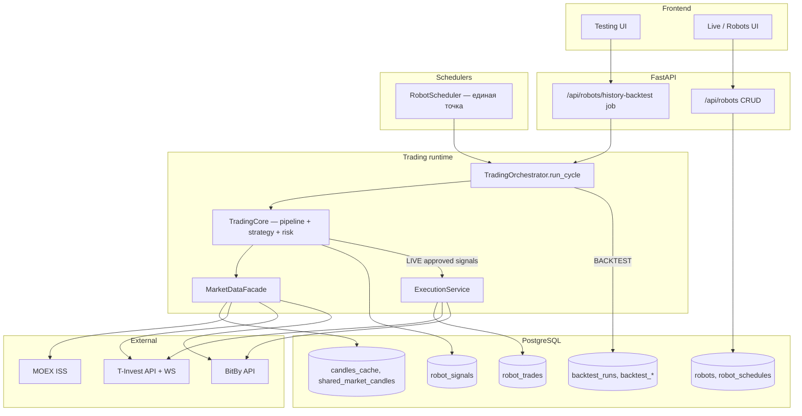
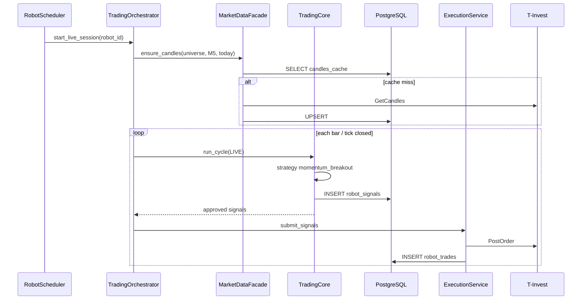
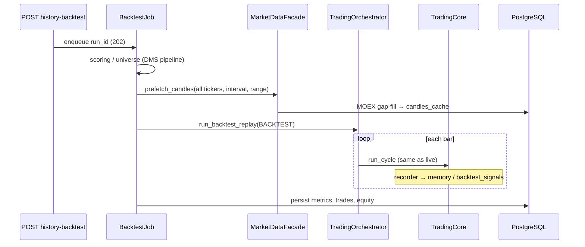

# BRD-ARCH-04 — Ядро торговли, фасад данных и робот исполнения

**Версия:** 1.0  
**Статус:** draft for implementation  
**Связь:** развивает [BRD-ARCH-03-unified-engine-architecture.md](BRD-ARCH-03-unified-engine-architecture.md), [BRD-ARCH-02-unified-backtest-testing-spec.md](BRD-ARCH-02-unified-backtest-testing-spec.md); отражает целевую модель «один робот → одно ядро → фасад → сигналы → (live) заявки».

**Референс-робот:** `robot_type = 2` (торговый), стратегия `momentum_breakout`, интервал из `strategy_params.interval` (M1/M5/M10/…).

---

## §1. Executive summary

Сейчас live и backtest **делят логику частично** (`TradingSession` / `BacktestTradingSession`), но данные и исполнение размазаны по `service.py`, DMS, `BrokerFacade`, legacy `engine.py`. Цель — **одно торговое ядро** и **тонкие адаптеры** по режиму:

| Режим | Данные | Решения | Исполнение |
|-------|--------|---------|------------|
| **LIVE** | DB → Facade → T-Invest | Core (общее) | Execution Robot → брокер по `token_id` |
| **BACKTEST** | DB → Facade → MOEX (gap-fill) | Core (то же) | SimExecution (без брокера) |

REST для роботов и history-backtest **не содержат** бизнес-логики стратегии — только CRUD, постановка job, опрос статуса.

---

## §2. Целевая схема (C4, containers)



---

## §3. Типы роботов и точки входа

| `robot_type` | Назначение (словарь) | Кто запускает | Runtime |
|--------------|----------------------|---------------|---------|
| `1` | Portfolio snapshot | `portfolio_updater/scheduler` | Отдельный worker (вне Core) |
| `2` | Торговый (live) | `RobotScheduler` → `TradingOrchestrator(LIVE)` | Core + Execution |
| — | History backtest (не отдельный type в robots) | `POST history-backtest` → background job | `TradingOrchestrator(BACKTEST)` + persist job |

**Правило:** type=2 в БД — это **конфигурация live-робота**. Backtest использует **тот же config snapshot**, но `ExecutionMode.BACKTEST` и отдельный `run_id` в `backtest_runs`.

---

## §4. Слои и границы ответственности

### 4.1 `MarketDataFacade` (ваш «фасад»)

Единственная точка выхода ядра во внешний мир за **рыночными данными**.

**Контракт (Python):**

```python
class MarketDataFacade(Protocol):
    async def ensure_candles(
        self,
        *,
        tickers: list[str],
        interval: ResolvedInterval,
        from_ts: datetime,
        to_ts: datetime,
        board: str = "TQBR",
        user_id: int | None = None,
        run_id: int | None = None,
        progress: Callable[[int, int], None] | None = None,
    ) -> CandlePrefetchStats: ...

    async def get_candles(
        self,
        *,
        ticker: str,
        interval: ResolvedInterval,
        from_ts: datetime,
        to_ts: datetime,
    ) -> list[Candle]: ...

    async def get_snapshot(
        self,
        *,
        trade_date: date,
        board: str,
        user_id: int | None = None,
    ) -> list[SnapshotRow]: ...
```

**Поведение:**

1. `SELECT` из `shared_market_candles` / `candles_cache` (по `ResolvedInterval`, см. `trading/intervals.py`).
2. При пробелах — провайдер:
   - **BACKTEST / history:** MOEX ISS → upsert `candles_cache`.
   - **LIVE:** T-Invest REST (`GetCandles`) / BitBy → upsert cache.
3. Никогда не возвращать «пусто» без попытки gap-fill (с лимитом rate / cancel).

**Запрещено:** импорт `httpx` / MOEX URL из `TradingCore`, `Strategy`, `RiskManager`.

**Текущий код для переноса:** `dms_service._ensure_candles_cached_for_tickers`, `candle_prefetch.py`, `market_data_v1.repository`, фрагменты `service.run_robot_history_backtest`.

---

### 4.2 `TradingCore` (ядро решений)

Один цикл анализа **без** отправки ордеров (кроме вызова Execution через отдельный шаг).

**Контракт:**

```python
@dataclass
class CycleInput:
    mode: ExecutionMode
    robot_id: int
    user_id: int
    token_id: int | None          # LIVE: обязателен для execution
    config: dict                  # merged robot config
    clock: Callable[[], datetime]
    universe: list[str]           # figi/ticker на этот цикл
    market_snapshot: list[SnapshotRow] | None

@dataclass
class CycleOutput:
    signals: list[Signal]
    decisions: list[dict]         # pipeline reject/accept audit
    risk_blocks: list[dict]       # отклонено риском

class TradingCore:
    def __init__(
        self,
        *,
        facade: MarketDataFacade,
        pipeline: PipelineRunner,
        strategy_factory: Callable[[dict], BaseStrategy],
        risk: RiskManager,
        recorder: RuntimeRecorder,
    ): ...

    async def run_cycle(self, inp: CycleInput) -> CycleOutput: ...
```

**Внутри `run_cycle` (порядок фиксированный):**

1. Загрузить свечи для `universe` через `facade` (интервал из `config.strategy_params.interval`).
2. Обновить индикаторы (`indicator_service` / `indicators/library`).
3. `strategy.generate_signals(...)`.
4. `risk.filter_and_size(signals, portfolio, limits)`.
5. `recorder.save_signals(...)` → `robot_signals` (LIVE) или memory/backtest tables (BACKTEST).

**Текущий код для переноса:** `_run_single_trading_cycle` в `session.py`, Stage5/6 **без** POST order в Stage6 — ордера в Execution.

---

### 4.3 `ExecutionService` (робот выставления заявок)

Только **LIVE** (и опционально PAPER). Backtest использует `SimExecution`.

**Контракт:**

```python
class ExecutionService(Protocol):
    async def submit_signals(
        self,
        *,
        robot_id: int,
        token_id: int,
        broker_type: str,          # tinvest (MOEX); bybit — crypto (план)
        account_id: str,
        approved_signals: list[Signal],
        positions: dict[str, Position],
    ) -> list[OrderResult]: ...

    async def poll_order_status(
        self,
        *,
        robot_id: int,
        open_orders: list[str],
    ) -> list[OrderStatusUpdate]: ...
```

**Поведение:**

- Резолв брокера по `robot.config.broker_type` + `token_id`.
- `POST` заявка → запись `robot_trades` + связь `robot_signals.executed_trade_id`.
- Мониторинг: WS (T-Invest) или polling — обновление статуса сделки.

**Текущий код:** `stages/stage6_orders.py`, `BrokerFacade`, `create_broker_facade`.

---

### 4.4 `TradingOrchestrator` (связка режимов)

Тонкая оболочка над Core + mode-specific окружением.

```python
class TradingOrchestrator:
    async def run_live_session(self, robot: RobotRow) -> SessionResult:
        """Долгоживущая сессия: WS, очередь цен, периодический run_cycle + execution."""

    async def run_backtest_replay(
        self,
        *,
        run_id: int,
        config: dict,
        candles_by_figi: dict[str, list[dict]],
        allowed_figis_by_date: dict[str, list[str]],
        initial_capital: float,
        cancel_check: Callable[[], bool] | None = None,
    ) -> BacktestResult:
        """Bar-by-bar replay; recorder → backtest tables."""
```

**Текущий код:** `TradingSession.run()`, `BacktestTradingSession.run_history_replay()`, `HistoryBacktestRobot`.

---

### 4.5 `RobotScheduler` (общий планировщик)

```python
class RobotScheduler:
    async def tick(self) -> None:
        for robot in await self._due_robots():
            if robot.type == 2 and self._should_run(robot):
                await self._start_or_continue_live(robot)
            # type=1 → portfolio scheduler (делегат)
```

**`_should_run`:** `robot_schedules` (часы, дни недели), `status=active`, нет дублирующей `active_session`, не `cancel_requested`.

**Сейчас:** `trading/scheduler.py` — `_should_start_session` = TODO (всегда True). Этап 5 миграции — подключить `robot_schedules`.

---

## §5. Поток: robot type=2, `momentum_breakout`, LIVE



---

## §6. Поток: тот же робот, BACKTEST (Testing UI)



**Важно:** фазы job (`scoring`, `prefetching_candles`, `simulating`) остаются в `service.py`; **только** `simulating` вызывает `TradingOrchestrator`, не legacy `engine.py`.

---

## §7. Модель данных (signals / orders)

### Live (уже есть)

| Таблица | Роль |
|---------|------|
| `robots` | конфиг, type, status |
| `robot_schedules` | окно торговли |
| `robot_signals` | решения ядра (`was_executed`, `executed_trade_id`) |
| `robot_trades` | факт исполнения |
| `robot_execution_logs` | аудит сессии |
| `candles_cache` / `shared_market_candles` | кэш фасада |

### Backtest (дополнительно к live)

| Таблица | Роль |
|---------|------|
| `backtest_runs` | job, progress, phase |
| `backtest_decisions` | pipeline audit (scoring) |
| `backtest_metrics` / payload | KPI после прогона |

**Целевое выравнивание (этап 6+):** опционально писать сигналы backtest в `backtest.signals` с теми же полями, что `robot_signals`, для единых отчётов. На этапах 1–4 достаточно текущего persist.

---

## §8. Конфиг робота (минимальный контракт)

```json
{
  "strategy": "momentum_breakout",
  "strategy_params": {
    "interval": "CANDLE_INTERVAL_5_MIN",
    "figis": [],
    "lookback": 20
  },
  "risk": { "stop_loss_percent": 1.5, "max_position_percent": 20 },
  "pipeline": { "mode": "ALL", "filters": [] },
  "universe": { "mode": "tqbr_scan" },
  "execution_model": { "model": "NEXT_BAR_OPEN", "slippage_pct": 0 },
  "broker_type": "tinvest",
  "account_id": "..."
}
```

**Режим test/live** не отдельное поле в БД — задаётся **контекстом запуска**:

- `ExecutionMode.LIVE` — scheduler / manual run.
- `ExecutionMode.BACKTEST` — `history-backtest` job.

Опционально позже: `config.simulation_mode` для paper.

---

## §9. Структура каталогов (целевая)

```
backend/app/modules/robots/
  api/                    # router → usecases (тонкие)
  scheduler/
    robot_scheduler.py      # единый tick
  runtime/
    orchestrator.py
    session_factory.py      # уже есть
  core/
    trading_core.py
    cycle.py                # CycleInput / CycleOutput
  data/
    facade.py
    providers/
      db_cache.py
      moex_history.py
      tinvest_market.py
      bitby_market.py       # этап 6
  execution/
    service.py              # live orders
    sim.py                  # backtest
  trading/                  # постепенно deprecate дубли
    strategies/
    risk/
    pipeline/
    contracts.py
```

---

## §10. План миграции (этапы)

| # | Этап | DoD | Удалить/deprecate |
|---|------|-----|-------------------|
| **1** ✅ | Выделить `TradingCore.run_cycle` из `TradingSession._run_single_trading_cycle` | `test_trading_core.py`; live делегирует в `run_single_trading_cycle` | — |
| **2** ✅ | `MarketDataFacade` + prefetch/gap-fill + snapshots | `test_market_data_facade.py`, `test_moex_snapshots.py`; MOEX только `trading/data/providers/` | прямые `iss.moex.com` из `service.py` убраны |
| **3** ✅ | Backtest sim только `TradingOrchestrator(BACKTEST)` | `test_trading_orchestrator.py`; service/market API → orchestrator | `unified_runner`, prod `engine.py` (deprecated, тесты grain_seed) |
| **4** ✅ | `ExecutionService` ← Stage6 | `test_execution_service.py`; session/robot → `LiveExecutionService` | прямой `Stage6Orders` в session/robot |
| **5** ✅ | `RobotScheduler` + `robot_schedules` | `test_schedule_policy.py`; MSK-окно из `robot_schedules` | `_should_start_session = True` |
| **6** ~~✅~~ **отменён** | ~~BitBy provider~~ | `broker routing` остаётся; `bitby` удалён (06.2026) | MOEX LIVE только `tinvest`; crypto — `bybit` (план) |

**Уже сделано (база этапов 1–3):**

- **Этап 1:** `trading/core/trading_core.py` — `run_single_trading_cycle`, `TradingCore.run_cycle`; `session._run_single_trading_cycle` делегирует
- **Этап 2:** `trading/data/facade.py` — candles + `ensure_snapshot_day`; `providers/moex_snapshots.py`, `moex_backtest.py`
- **Этап 3:** `trading/runtime/orchestrator.py` — `TradingOrchestrator.run_backtest_replay`; `HistoryBacktestRobot` — thin wrapper
- **Этап 4:** `trading/execution/service.py` — `LiveExecutionService.submit_signals`, `poll_order_status`; Stage6 — внутренняя реализация
- **Этап 5:** `scheduling/schedule_policy.py` + `RobotScheduler`; `TradingScheduler` читает `robot_schedules`, MSK-окно
- **Этап 6 (отменён 06.2026):** `modules/bitby/` удалён — путаница с криптобиржей ByBit; MOEX только T-Invest; `brokers/routing.py` + `test_broker_routing.py` сохранены
- `session_factory`, `HistoryBacktestRobot`, `ExecutionMode`
- `candle_prefetch` + `intervals.py`
- DB connectivity 503, jwt_ttl cache

---

## §11. Нефункциональные требования

| Тема | Требование |
|------|------------|
| **DB pool** | Фоновый backtest job не должен занимать все соединения пула; batch prefetch, отдельный `progress_bind` (уже есть). |
| **Rate limits** | Facade использует `moex_http_acquire`, T-Invest rate limiter. |
| **Cancel** | `cancel_requested` на `backtest_runs` и флаг live session. |
| **Идемпотентность ордеров** | Execution: client_order_id / signal_id в payload. |
| **Наблюдаемость** | `run_phase`, `phase_label`, structured logs `robot_id`, `mode`, `cycle`. |

---

## §12. Открытые решения (ADR)

| ID | Вопрос | Рекомендация |
|----|--------|--------------|
| ADR-04-1 | Один scheduler или координатор поверх нескольких? | Сначала `RobotScheduler` facade, внутри делегаты в portfolio/DMS/trading. |
| ADR-04-2 | WS цены в Core или в Orchestrator? | WS остаётся в live orchestrator; Core получает `on_closed_candle` callback. |
| ADR-04-3 | ~~BitBy паритет~~ **отменён** | MOEX LIVE только T-Invest; crypto — отдельный `bybit` facade (план). |
| ADR-04-4 | PAPER mode | `ExecutionMode.PAPER` = Live data + SimExecution без POST. |

---

## §13. Критерии приёмки (robot #10, momentum_breakout, M5)

1. Live type=2: сигнал в `robot_signals` и сделка в `robot_trades` проходят через `TradingCore` + `ExecutionService`.
2. Backtest: тот же config snapshot, фаза simulating — те же Stage5 правила, что live (уже parity session).
3. Prefetch M5 перед simulating — только через `MarketDataFacade`.
4. Нет prod-вызова `run_backtest_simulation` из `engine.py`.
5. `/runs/active` и CRUD роботов работают при доступной БД (503 при недоступности).

---

## §14. Ссылки на код (текущее состояние)

| Компонент | Файл |
|-----------|------|
| Trading core (этап 1) | `trading/core/trading_core.py` |
| Market data facade (этап 2) | `trading/data/facade.py`, `providers/moex_snapshots.py` |
| Trading orchestrator (этап 3) | `trading/runtime/orchestrator.py` |
| Execution service (этап 4) | `trading/execution/service.py` |
| Robot scheduler (этап 5) | `scheduling/robot_scheduler.py`, `scheduling/schedule_policy.py` |
| ~~BitBy broker (этап 6)~~ | удалён 06.2026; см. `brokers/routing.py`, `brokers/tinvest.py` |
| Live session | `trading/session.py` |
| Backtest session | `trading/session_backtest.py` |
| Factory | `trading/session_factory.py` |
| History job | `service.run_robot_history_backtest` |
| Contracts | `trading/contracts.py` |
| Runtime context | `trading/engines/context.py` |
| Intervals M1/M5/… | `trading/intervals.py` |
| Prefetch | `trading/backtest/candle_prefetch.py` |
| Spec ARCH-03 | `docs/BRD-ARCH-03-unified-engine-architecture.md` |
