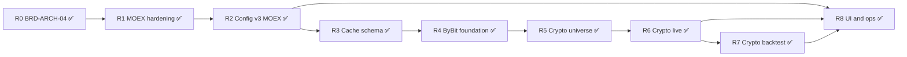

# Release map: текущая реализация → целевая архитектура

**Версия:** 1.1  
**Дата:** 17.06.2026 (обновлено: 17.06.2026)  
**Статус:** R0–R8 завершены; остаются ops/E2E и мелкие хвосты (см. §10)  

**Связанные документы:**

- [ROBOTS-ARCHITECTURE-TARGET.md](ROBOTS-ARCHITECTURE-TARGET.md) — целевая архитектура (v1.4)
- [ROBOTS-TECH-PORTFOLIO-TRADING.md](ROBOTS-TECH-PORTFOLIO-TRADING.md) — эксплуатационная техдокументация (as-is)
- [BRD-ARCH-04-trading-core-facade-orchestrator.md](BRD-ARCH-04-trading-core-facade-orchestrator.md) — контракт ядра MOEX (этапы 1–5 ✅)
- [ROBOTS-TECH-ROAD-MAP_BYBIT.md](ROBOTS-TECH-ROAD-MAP_BYBIT.md) — детализация crypto-контура

---

## 1. Executive summary

Целевая архитектура описывает **три контура** (portfolio MOEX/crypto, trading MOEX, trading crypto) на **одном торговом ядре** с тонкими фасадами брокера и рыночных данных.

**Текущее состояние (после R0–R8, июнь 2026):**

| Контур | Готовность | Комментарий |
|--------|------------|-------------|
| MOEX trading live (`type=2`, `tinvest`) | **~95%** | Orchestrator live, DMS П1/П2, typed v3, immutable `broker_type` |
| MOEX history backtest | **~95%** | `TradingOrchestrator.run_backtest_replay`, `candles_cache.market=moex` |
| Portfolio updater (`type=1`) | **~90%** | `tinvest` + `bybit` → `portfolio_snapshots`; `bybit_accounts` не введена |
| Typed config v3 / profiles | **~95%** | 4 профиля, validate/migrate v3, OpenAPI oneOf; sandbox — legacy v2 path |
| Crypto / ByBit (`broker_type=bybit`) | **~90%** | Live + backtest + funding; E2E testnet не зафиксирован в приёмке |
| UI по профилю рынка | **~95%** | `deriveMarketProfile`, `MoexConfigurator`, Crypto/Portfolio configurators |

**Принцип release map:** этапы идут **снизу вверх** — сначала закрыть пробелы MOEX-ядра (BRD-ARCH-04), затем инфраструктура кэша/конфига, затем ByBit-контур без форка ядра.

---

## 2. Матрица «сейчас → target»

Легенда: ✅ есть / рабочий · 🟡 частично · ❌ нет

### 2.1 Backend — общее ядро

| Компонент (target §3.1) | Сейчас | Путь | Gap |
|-------------------------|--------|------|-----|
| `TradingOrchestrator` | ✅ | `trading/runtime/orchestrator.py` | `run_live_session` + `run_backtest_replay` |
| `TradingCore.run_cycle` | 🟡 | `trading/core/trading_core.py` | Host-based (R1.2); не полностью standalone injectable |
| `TradingSession` / `BacktestTradingSession` | ✅ | `session.py`, `session_backtest.py` | — |
| `session_factory` | ✅ | `session_factory.py` | — |
| `LiveExecutionService` | ✅ | `execution/service.py` | Prod-путь через Stage6 |
| `SimExecution` / `SimBacktestBrokerFacade` | ✅ | `execution/sim.py`, `brokers/sim_backtest.py` | MOEX + crypto costs/funding |
| `BrokerFacade` + factory | ✅ | `brokers/factory.py` | `tinvest`, `bybit`, stubs |
| `MarketDataFacade` | ✅ | `trading/data/facade.py` | `moex_*` + `bybit_market` |
| `intervals.py` | ✅ | `trading/intervals.py` | MOEX + ByBit kline strings |
| `universe_jobs` (П1/П2) | ✅ | `universe_jobs.py` | MOEX only |
| Config v2 MOEX | ✅ | `config/v2_schema.py` | Legacy read/migrate |
| Config v3 / profiles | ✅ | `config/profiles/` | 4 `schema_profile` |
| `broker_type` immutable | ✅ | `service.py` | 409 на patch |
| Live WS envelope | ✅ | `live_ws.py`, `LivePage.tsx`, `trading_core` — signal/order с `run_id`/`cycle_id`/`decision_id` |

### 2.2 Backend — MOEX-only

| Компонент (target §3.2) | Сейчас | Путь | Gap |
|-------------------------|--------|------|-----|
| `PipelineRunner` (DMS) | ✅ | `pipeline/runner.py` | — |
| `moex_backtest` / `moex_snapshots` | ✅ | `data/providers/` | — |
| `TInvestBrokerFacade` | ✅ | `brokers/tinvest.py` | — |
| `grain_seed_orchestrator` | ✅ | `grain_seed_orchestrator.py` | — |
| Corporate actions в pipeline | ✅ | `modules/corporate_actions/`, `pipeline/runner.py` | DividendCalendar в universe scoring |
| `data_source=moex_iss` в live | 🟡 | config + facade | П1/backtest — да; live M5 — только tinvest (by design) |

### 2.3 Backend — Crypto-only (target §3.3)

| Компонент | Сейчас | Gap |
|-----------|--------|-----|
| `modules/bybit/` | ✅ | HTTP v5, signer, WS |
| `ByBitBrokerFacade` | ✅ | `trading/brokers/bybit.py` — live execution |
| `bybit_market` provider | ✅ | `data/providers/bybit_market.py` — kline + funding cache |
| `crypto_universe.py` | ✅ | `robots/crypto_universe.py` |
| `rebuild_crypto_universe` | ✅ | `universe_jobs.py` + `POST /jobs/crypto-screening` |
| Funding (backtest) | ✅ | `bybit_market.ensure_funding_*` + `session_backtest` | Live accrual — не реализован |
| Portfolio `type=1` + bybit | ✅ | `portfolio_updater/robot.py` |

### 2.4 БД (target §6)

| Таблица / изменение | Сейчас | Gap |
|---------------------|--------|-----|
| `robot_*`, `backtest_*` | ✅ | Общие runtime-таблицы работают |
| `candles_cache` + `market` | ✅ | Migration 0033; discriminator `moex`/`bybit` |
| `crypto_universe_daily` | ✅ | Migration 0034 |
| `bybit_funding_history` | ✅ | Migration + backtest preload |
| `bybit_accounts` | ❌ | Не введена; snapshots в `portfolio_snapshots` |
| `portfolio_snapshots` для ByBit | ✅ | `portfolio_updater` bybit branch |

### 2.5 REST API (target §7)

| Endpoint | Сейчас | Gap |
|----------|--------|-----|
| CRUD роботов, jobs П1/П2, backtest | ✅ | MOEX + crypto |
| `POST /migrate-config-v2` | ✅ | — |
| `POST /migrate-config-v3` | ✅ | Batch migrate |
| `POST /validate-config` | ✅ | Normalized v3 |
| `GET /config-schema/{profile}` | ✅ | JSON Schema export |
| `POST /duplicate` | ✅ | Copy + broker migration |
| `POST /jobs/crypto-screening` | ✅ | Preview symbols |
| `GET /bybit/funding-rate` | ✅ | Read-only UI API |
| `GET /bybit/instruments` | ✅ | `GET /bybit/instruments` + UI datalist |

### 2.6 Frontend (target §8, §17.6)

| Компонент | Сейчас | Gap |
|-----------|--------|-----|
| `/robots` settings page | ✅ | `deriveMarketProfile` conditional panels |
| Typed builders по profile | ✅ | v3: MOEX/crypto/portfolio/sandbox |
| `MoexConfigurator` / `CryptoConfigurator` | ✅ | Все три configurator-компонента |
| `deriveMarketProfile` | ✅ | `resolveProfile.ts` |
| `brokerType` в форме | ✅ | Read-only после create; 409 backend |
| Live WS envelope | ✅ | `LivePage` + `trading_core` signal/order events |
| Testnet badge | ✅ | `resolveBybitEnvironment` |

### 2.7 Deprecated / cleanup

| Артефакт | Статус | Действие |
|----------|--------|----------|
| `trading/engines/unified_runner.py` | deprecated | Только тесты / legacy unified-engine |
| `trading/data_provider/` (legacy) | test-only | Не в prod MOEX pipeline (R1.7) |
| `trading/execution/live.py` | deprecated | Единый путь через `service.py` (R1.3) |
| `modules/bitby/` | удалён 06.2026 | — |

---

## 3. Этапы реализации (releases)

Каждый этап имеет **цель**, **scope**, **критерии готовности (DoD)** и **зависимости**.

---

### R0 — BRD-ARCH-04: унифицированное MOEX-ядро ✅

**Статус:** завершён (этапы 1–5 BRD-ARCH-04). Этап 6 (bitby) отменён.

| # | Deliverable | Файлы | DoD |
|---|-------------|-------|-----|
| R0.1 | `TradingCore.run_cycle` | `trading/core/trading_core.py` | `test_trading_core.py` ✅ |
| R0.2 | `MarketDataFacade` MOEX | `data/facade.py`, `providers/moex_*` | `test_market_data_facade.py` ✅ |
| R0.3 | Backtest через orchestrator | `runtime/orchestrator.py` | `test_trading_orchestrator.py` ✅ |
| R0.4 | `LiveExecutionService` | `execution/service.py` | `test_execution_service.py` ✅ |
| R0.5 | Schedule policy | `scheduling/schedule_policy.py` | `test_schedule_policy.py` ✅ |
| R0.6 | Config v2 + migration | `config/v2_schema.py`, `migration.py` | `test_config_migration.py` ✅ |
| R0.7 | Universe jobs П1/П2 | `universe_jobs.py` | `test_universe_jobs.py` ✅ |
| R0.8 | Intervals MOEX | `intervals.py` | `test_intervals.py` ✅ |

**Не входит в R0 (остаётся на R1+):** live через orchestrator, полная декомпозиция TradingCore от session host.

---

### R1 — MOEX core hardening

**Цель:** довести MOEX-контур до target §9.1 без crypto; убрать технический долг BRD-ARCH-04.

**Зависимости:** R0 ✅

| # | Задача | Target ref | Файлы / действия | DoD |
|---|--------|------------|------------------|-----|
| R1.1 | Live entry через orchestrator | §3.1, §9.1 | Добавить `TradingOrchestrator.run_live_session()`; `TradingScheduler` вызывает orchestrator вместо прямого `create_trading_session` | Live path документирован; один entry point |
| R1.2 | TradingCore меньше связан с session | §4 | Вынести signal/order hooks в injectable deps (strategy, risk, execution) | `run_cycle` тестируется без полного mock session |
| R1.3 | Консолидация execution | §4.3 | Deprecate прямой `LiveExecution` в prod; единый `execution_service_for_session()` | Нет prod-импортов `execution/live.py` |
| R1.4 | Удалить legacy unified_runner из prod | §11 | Grep + redirect оставшихся вызовов на orchestrator/session | `unified_runner` только в тестах / помечен deprecated |
| R1.5 | `broker_type` immutable | §15 | `POST /update`, `POST /config` → 409 при смене `broker_type` | pytest + OpenAPI error model |
| R1.6 | WS envelope на frontend | §7.7 | `LivePage` / `EventFeed` используют `event_id`, `run_id`, `cycle_id`, `decision_id` | Нет client-only `signalIdRef` для dedup |
| R1.7 | `data_provider/` → `data/` | §4.2 | Миграция оставшихся consumers на `MarketDataFacade` | Один data stack для MOEX |

**Критерий этапа:** MOEX robot #10 (momentum_breakout, M5) проходит BRD-ARCH-04 §13 acceptance + live стартует через orchestrator.

**Оценка:** 1–2 спринта.

---

### R2 — Config v3 и typed profiles (MOEX)

**Цель:** type-safe конфиг для `type2_tinvest` (target §17, этапы T1–T2).

**Зависимости:** R1 (желательно R1.5 для immutability)

| # | Задача | Target ref | Deliverable | DoD |
|---|--------|------------|-------------|-----|
| R2.1 | Profile registry backend | §17.5 | `config/profiles/__init__.py`, `type2_tinvest.py` | `validate_robot_config()` |
| R2.2 | Typed `MoexRiskConfig`, `MoexCostsConfig` | §17.3 | `config/risk_moex.py`, `costs_moex.py` | Round-trip `test_dump_preserves_falsy_flags` |
| R2.3 | `POST /validate-config` | §17.7 | `router.py` + service | 200 normalized / 422 errors |
| R2.4 | `POST /migrate-config-v3` | §17.8 | `migration.py` → `schema_profile`, v3 fields | Batch migrate существующих роботов |
| R2.5 | `GET /config-schema/{profile}` | §17.7 | JSON Schema export | UI может подгрузить схему |
| R2.6 | Frontend MOEX typed | §17.6 T2 | `resolveSchemaProfile`, `buildMoexConfig.ts`, `collectIssues.ts` | «Проверить» без `Record<string, unknown>` |
| R2.7 | `deriveMarketProfile` (MOEX branch) | §8.1.1 | `frontend/src/modules/robots/config/resolveProfile.ts` | MOEX panels only для `type2_tinvest` |
| R2.8 | `broker_type` read-only в UI | §15.3 | Settings form после `robot.id` | Toast при попытке смены |

**Критерий этапа:** новый MOEX trading robot сохраняется как `config_version: 3`, `schema_profile: type2_tinvest`; validate без save работает.

**Оценка:** 1–2 спринта.

---

### R3 — Единая схема кэша свечей

**Цель:** подготовить `candles_cache` к MOEX + ByBit (target §6.2.1, §16).

**Зависимости:** R1 (MarketDataFacade стабилен). **Блокирует** R4+ (crypto data).

| # | Задача | Target ref | Deliverable | DoD |
|---|--------|------------|-------------|-----|
| R3.1 | Alembic migration | §6.2.1 | `market`, `instrument_id`, `source`; новый UNIQUE | Migration up/down |
| R3.2 | Backfill MOEX rows | §6.2.1 | `market='moex'`, `instrument_id=ticker` | Все legacy строки заполнены |
| R3.3 | `CandleCache` model | §6.2.1 | `dms/models.py` | ORM соответствует схеме |
| R3.4 | `db_cache.py` + facade reads | §16.3 | Всегда фильтр `market` из `broker_type` | `test_market_data_facade` + migration test |
| R3.5 | Prefetch / П1 paths | §16.4 | `candle_prefetch`, `universe_jobs` передают `market=moex` | Backtest regression green |

**Критерий этапа:** MOEX backtest и П1 работают на новой схеме; коллизии тикеров MOEX/crypto исключены на уровне БД.

**Оценка:** 0.5–1 спринт.

---

### R4 — ByBit foundation (roadmap Phase 1)

**Цель:** изолированная интеграция ByBit API + фасады без торгового цикла (target §3.3, §4.1–4.2; [ROBOTS-TECH-ROAD-MAP_BYBIT.md](ROBOTS-TECH-ROAD-MAP_BYBIT.md) §2 этап 1).

**Зависимости:** R3 ✅

| # | Задача | Target ref | Deliverable | DoD |
|---|--------|------------|-------------|-----|
| R4.1 | ByBit REST v5 client | §3.3 | `modules/bybit/http_client.py`, `signer.py` | Testnet: balance + kline |
| R4.2 | ByBit WebSocket | §3.3 | `modules/bybit/websocket.py` | Public kline в очередь |
| R4.3 | `ByBitBrokerFacade` | §4.1 | `trading/brokers/bybit.py` | Реализует `BrokerFacade` contract |
| R4.4 | Factory + routing | §4.1 | `factory.py`, `routing.py` → `"bybit"` | `test_broker_routing` extended |
| R4.5 | `bybit_market` provider | §4.2 | `data/providers/bybit_market.py` | `ensure_candles` → `market=bybit` |
| R4.6 | Intervals ByBit | §4.2.1 | `intervals.py` — `5m`, `1h` strings | `ResolvedInterval` для crypto |
| R4.7 | API tokens для ByBit | §5.3 | `api_tokens` + settings UI (testnet key) | Сохранение/валидация ключа |

**Checkpoint (MVP infra):** testnet balance, kline fetch, запись в `candles_cache(market=bybit)`.

**Оценка:** 2 спринта.

---

### R5 — Crypto universe и portfolio ByBit

**Цель:** отбор инструментов и синхронизация портфеля без DMS (target §3.3.1, §4.4, §5.1).

**Зависимости:** R4 ✅

| # | Задача | Target ref | Deliverable | DoD |
|---|--------|------------|-------------|-----|
| R5.1 | `crypto_universe.py` | §3.3.1 | volume/spread filters → `allowed_symbols` | Unit test с mock tickers |
| R5.2 | `rebuild_crypto_universe` job | §4.4 | hook в `universe_jobs.py` | Пишет config JSONB |
| R5.3 | `POST /jobs/crypto-screening` | §7.5 | `router.py` | 200 + preview symbols |
| R5.4 | `crypto_universe_daily` table | §6.5 | Alembic optional | Аналог `daily_universe` |
| R5.5 | Config `type2_bybit` schema | §17.4 | `profiles/type2_bybit.py` | `crypto_universe`, `bybit.*` blocks |
| R5.6 | Portfolio `type=1` + bybit | §5.1 | `portfolio_updater/robot.py` | Snapshots для unified account |
| R5.7 | `type1_bybit` profile | §17.4 | `profiles/type1_bybit.py` | validate on save |

**Критерий этапа:** portfolio robot на testnet синхронизирует баланс; screening job заполняет `allowed_symbols`.

**Оценка:** 1–1.5 спринта.

---

### R6 — Crypto trading live

**Цель:** `type=2`, `broker_type=bybit` — полный live-цикл (target §5.3, §9.2).

**Зависимости:** R4, R5 ✅; R2 (желательно для typed config)

| # | Задача | Target ref | Deliverable | DoD |
|---|--------|------------|-------------|-----|
| R6.1 | Live session + bybit config | §9.2 | `TradingSession` branches по `broker_type` | Нет `ByBitTradingSession` |
| R6.2 | WS worker ByBit | §9.2 | `stage2_websocket` или bybit-specific adapter | Prices в live hub |
| R6.3 | Execution mapping | §4.3 | `LiveExecutionService` → `ByBitBrokerFacade` | Market/limit order testnet |
| R6.4 | Risk: short, leverage | §5.3 | `risk/params.py` crypto extensions | `allow_short`, `max_leverage` |
| R6.5 | Costs: maker/taker | §5.3 | `costs` crypto path in sim + live | Fee в `robot_trades` |
| R6.6 | Schedule 24/7 | §5.3 | `schedule_policy` для bybit | `schedule_type=1` always in window |
| R6.7 | `allowed_symbols` в session | §5.4 | Refresh config; empty → WS 4005 analog | Error message для symbols |
| R6.8 | Live WS `init.broker_type` | §7.7.1 | `figis` → instruments (symbols) | FE показывает symbol labels |

**Критерий этапа:** testnet robot открывает/закрывает позицию по стратегии; события в `/ws/live`.

**Оценка:** 2 спринта.

---

### R7 — Crypto backtest и funding

**Цель:** history backtest на ByBit klines + funding (target §5.5, §9.3.1).

**Зависимости:** R4, R6 (cost model)

| # | Задача | Target ref | Deliverable | DoD |
|---|--------|------------|-------------|-----|
| R7.1 | Orchestrator crypto prefetch | §9.3 | `bybit_market` historical kline | `candles_by_symbol` в replay |
| R7.2 | `bybit_funding_history` | §9.3.1.1 | Alembic + model | Upsert on backtest start |
| R7.3 | Funding step in backtest session | §9.3.1 | `session_backtest.py` | Charge на funding timestamps |
| R7.4 | `SimBacktestBrokerFacade` crypto | §4.1 | maker/taker; no NDFL | Metrics match fee model |
| R7.5 | `GET /bybit/funding-rate` | §7.5 | REST для UI read-only | Current rate display |
| R7.6 | Backtest UI crypto branch | §8.4 | `/testing` — symbols, fees | Run completes with KPI |

**Критерий этапа:** crypto backtest на BTCUSDT testnet/historical data с funding enabled даёт equity curve.

**Оценка:** 1.5–2 спринта.

---

### R8 — UI, ops и config v3 completion

**Цель:** единый UX по target §8, §15, §17; операторские сценарии.

**Зависимости:** R2 (MOEX typed), R6–R7 (crypto functional)

| # | Задача | Target ref | Deliverable | DoD |
|---|--------|------------|-------------|-----|
| R8.1 | `deriveMarketProfile` full | §8.1.1 | `portfolio` \| `moex` \| `crypto` | Conditional panels |
| R8.2 | `CryptoConfigurator` | §8.4, §17.6 | Forms: testnet, category, leverage, universe | Create/save validated |
| R8.3 | `PortfolioConfigurator` | §8.2 | `type1_tinvest` + `type1_bybit` | Broker selector at create only |
| R8.4 | `POST /duplicate` | §7.8 | Copy robot + reset universe | Broker migration workflow |
| R8.5 | Testnet/Mainnet badge | §5.3 | Settings + live header | `bybit.testnet` visible |
| R8.6 | v2 deprecation | §17.8 T5 | UI writes v3 only | No new v2 robots |
| R8.7 | OpenAPI oneOf profiles | §17.5 | FastAPI response schemas | `openapi-typescript` optional |
| R8.8 | Документация as-is | §11 | Update `ROBOTS-TECH-PORTFOLIO-TRADING.md` | Reflects implemented target |

**Критерий этапа:** пользователь создаёт crypto robot end-to-end в UI; дублирует MOEX→crypto через `/duplicate`.

**Оценка:** 1.5–2 спринта.

---

## 4. Сводная таблица releases

| Release | Название | Контур | Зависит от | Оценка | Target § |
|---------|----------|--------|------------|--------|----------|
| **R0** | BRD-ARCH-04 MOEX core | MOEX | — | ✅ Done | BRD-04 §10 |
| **R1** | MOEX hardening | MOEX | R0 | ✅ Done | §9.1, §11 |
| **R2** | Config v3 MOEX | MOEX | R1 | ✅ Done | §17 T1–T2 |
| **R3** | Cache `market` column | Infra | R1 | ✅ Done | §6.2.1, §16 |
| **R4** | ByBit foundation | Crypto | R3 | ✅ Done | §3.3, §4 |
| **R5** | Crypto universe + portfolio | Crypto | R4 | ✅ Done | §3.3.1, §5.1 |
| **R6** | Crypto live trading | Crypto | R4, R5 | ✅ Done | §5.3, §9.2 |
| **R7** | Crypto backtest + funding | Crypto | R6 | ✅ Done | §9.3 |
| **R8** | UI + ops polish | All | R2, R6–R7 | ✅ Done | §8, §15, §17 |

**Суммарно:** release map R0–R8 закрыт. Детальный прогресс — [ROBOTS-ARCHITECTURE-RELEASE_STATUS.md](ROBOTS-ARCHITECTURE-RELEASE_STATUS.md).

---

## 5. MVP-срезы (что можно отдать раньше)

### MVP-A — «MOEX production-ready»

**Releases:** R1 + R2 (без crypto)

- Live через orchestrator
- Typed MOEX config + validate
- `broker_type` immutable
- WS envelope на frontend

### MVP-B — «ByBit testnet execution»

**Releases:** R3 + R4 + R5 + R6 (минимальный scope)

Соответствует [ROBOTS-TECH-ROAD-MAP_BYBIT.md §7](ROBOTS-TECH-ROAD-MAP_BYBIT.md):

- Fixed symbols (`BTCUSDT`, `ETHUSDT`)
- Одна стратегия (`reversion_to_ma` или `momentum_breakout` с crypto params)
- Testnet only (`bybit.testnet: true`)
- Без funding в backtest (R7 отложен)
- Без `crypto_universe_daily` table (config-only)

### MVP-C — «Full target v1.4»

**Releases:** R0–R8 полностью

---

## 6. Маппинг на ByBit roadmap

| ByBit roadmap phase | Release map | Примечание |
|---------------------|-------------|------------|
| Phase 1: REST/WS, facade, market provider | **R4** | Изолированная интеграция |
| Phase 2: unified core, execution, costs | **R6** | Без отдельной сессии |
| Phase 3: funding, leverage risk, orderbook | **R7** (+ часть R6 risk) | Funding — backtest first |
| Phase 4: UI broker selector, crypto fields | **R8** (+ R5 config) | `deriveMarketProfile` |

---

## 7. Маппинг на Config v3 (target §17.9)

| Target этап | Release map | Содержание |
|-------------|-------------|------------|
| **T1** | R2 | Backend `type2_tinvest`, validate-config |
| **T2** | R2 + R8.1 | Frontend MOEX typed |
| **T3** | R5 + R8.2 | `type2_bybit` schema + crypto builder |
| **T4** | R5 + R8.3 | `type1_*` portfolio profiles |
| **T5** | R8.6 | v2→v3 migration, UI только v3 |

---

## 8. Риски и блокеры

| Риск | Влияние | Митигация |
|------|---------|-----------|
| Два execution/data stack до R1 | Регрессии при рефакторинге | R1.3, R1.4 — явный deprecation |
| `candles_cache` migration на prod объёме | Downtime / long migration | R3.2 batch backfill; dual-read период |
| ByBit API rate limits | Universe + prefetch | async-rate-limiter skill; cache-first |
| TradingCore host-coupling | Затрудняет crypto branches | R1.2 до R6 |
| UI monolith settings page | Медленный R8 | Ранний `deriveMarketProfile` stub в R2.7 |
| `broker_type` не enforced | Несовместимый config | R1.5 до любого ByBit UI |

---

## 9. Чеклист приёмки target architecture

Полное соответствие [ROBOTS-ARCHITECTURE-TARGET.md](ROBOTS-ARCHITECTURE-TARGET.md) v1.4:

- [x] Один `TradingOrchestrator` для live + backtest (§3.1)
- [x] MOEX только `tinvest`; crypto только `bybit` (§1, §10)
- [x] Нет `ByBitTradingSession` (§10)
- [x] `MarketDataFacade` маршрутизирует по `broker_type` (§4.2.1)
- [x] DMS / П1/П2 только MOEX; crypto screening отдельно (§4.4)
- [x] `candles_cache.market` discriminator (§6.2.1)
- [x] Config v3 + `schema_profile` для 4 профилей (§17.4)
- [x] `broker_type` immutable + `/duplicate` (§15, §7.8)
- [x] UI `deriveMarketProfile` conditional panels (§8.1.1)
- [x] Crypto backtest funding (§9.3.1)
- [x] Portfolio type=1: tinvest + bybit (§5.1)
- [x] WS envelope contract end-to-end (§7.7) — `run_id`/`cycle_id`/`decision_id` в signal/order events

**Оставшиеся хвосты вне чеклиста:** `bybit_accounts`, live funding accrual, E2E testnet smoke на prod, `openapi-typescript`.

---

## 10. Следующий шаг

Release map **R0–R8 завершён**. Рекомендуемый фокус:

1. **Ops:** прогнать [ROBOTS-OPS-ACCEPTANCE.md](ROBOTS-OPS-ACCEPTANCE.md) — migrate v3 CLI/UI + smoke checklist.
2. **Приёмка:** E2E crypto testnet live на staging/prod.
3. **Опционально:** `bybit_accounts`, live funding accrual, `openapi-typescript`.

---

*Документ синхронизировать при завершении каждого release: обновлять §2 матрицу и чеклист §9.*
