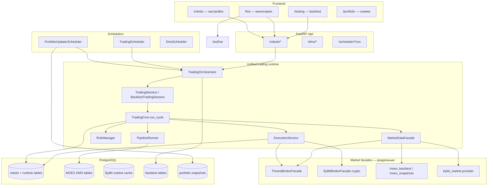
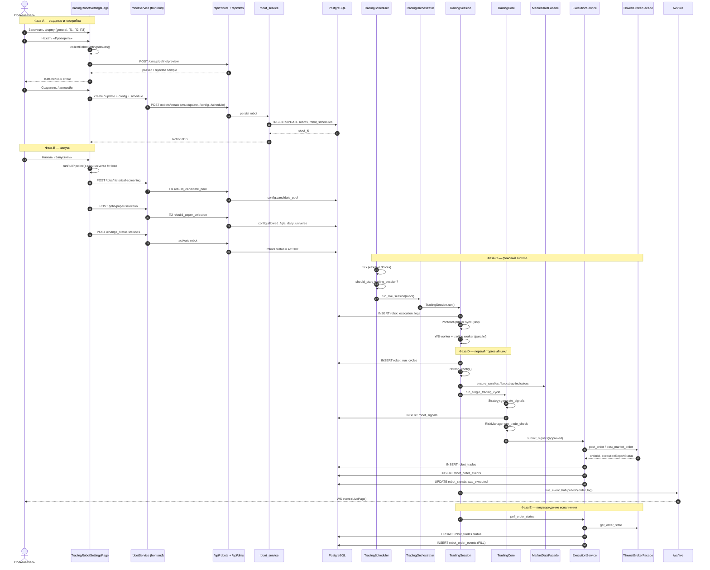
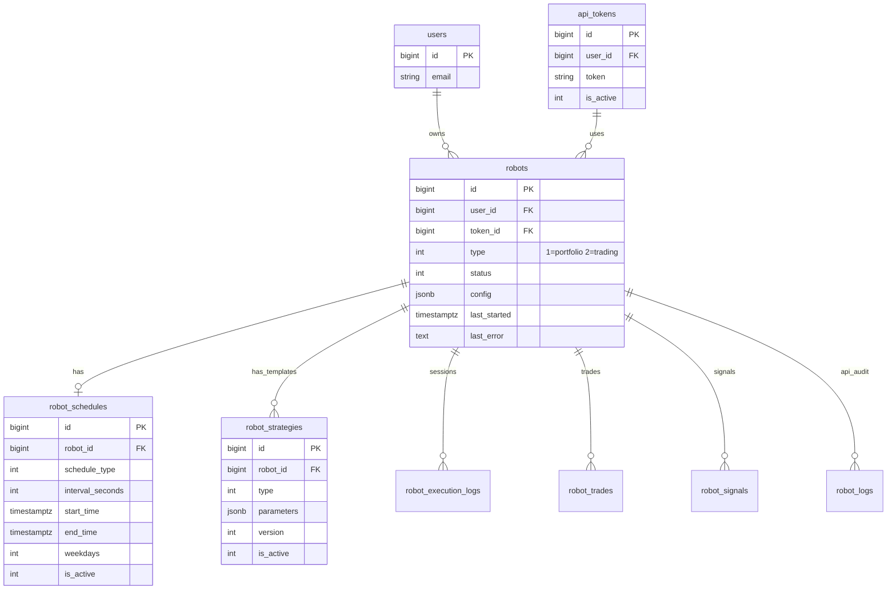
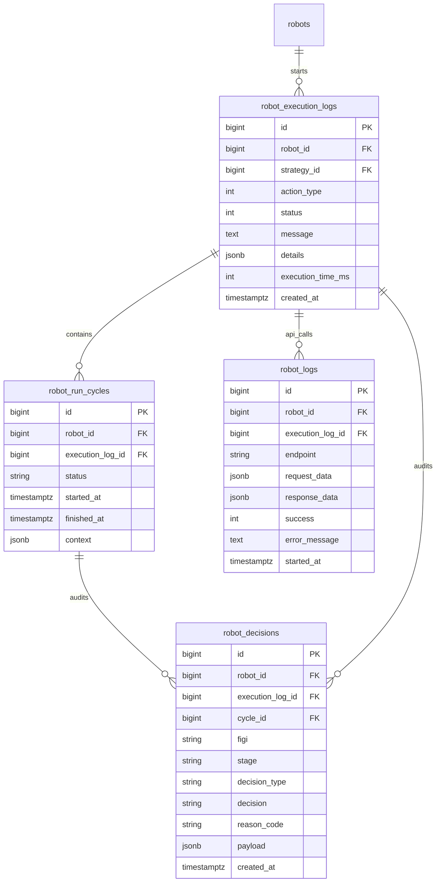
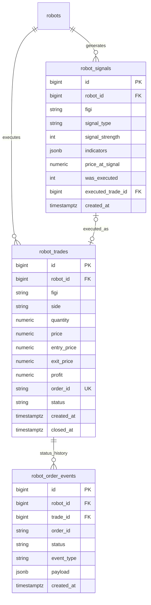
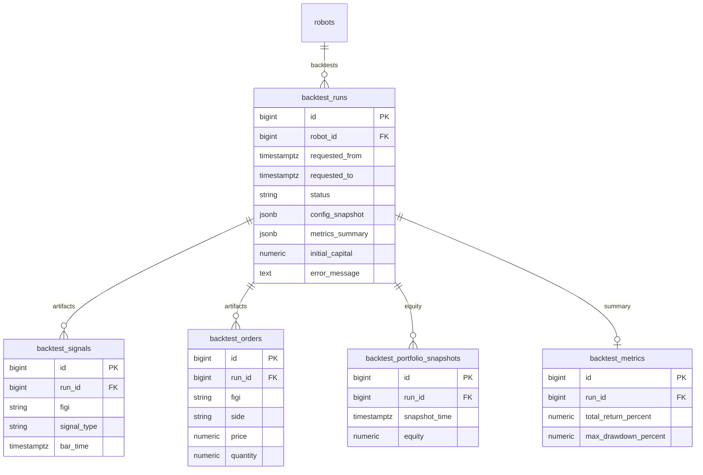
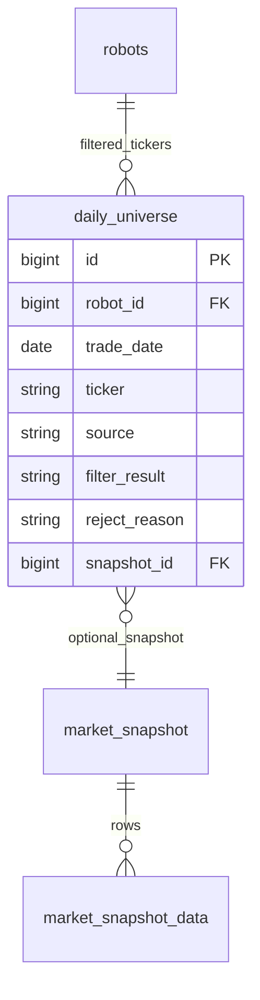
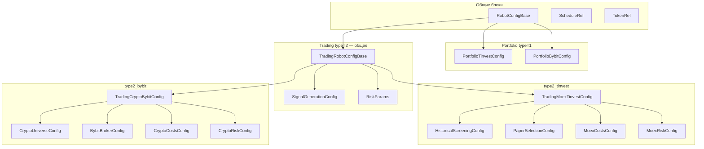

# Целевая архитектура роботов: унифицированное ядро и рыночные фасады

**Версия:** 1.4  
**Дата:** 16.06.2026  
**Статус:** Target architecture (после реализации BRD-ARCH-04 + ByBit roadmap v2)  

> **Терминология**
>
> - **ByBit** (`broker_type=bybit`) — криптобиржа: BTCUSDT, perpetual, funding. Отдельный target-контур.
> - **MOEX** — Московская биржа; исполнение и live-данные акций **только через T-Invest** (`broker_type=tinvest`).
>
> **Удалённый legacy `bitby`:** ранее в репозитории был экспериментальный MOEX-адаптер `modules/bitby/` (BRD-ARCH-04 этап 6) — generic REST-обёртка с `BITBY_API_URL`, **не** криптобиржа ByBit. Имя совпадало фонетически с ByBit и вводило в заблуждение. Модуль **удалён**; MOEX → только T-Invest, crypto → только ByBit API.

**Связанные документы:**

- [ROBOTS-TECH-PORTFOLIO-TRADING.md](ROBOTS-TECH-PORTFOLIO-TRADING.md) — эксплуатационная техдокументация
- [BRD-ARCH-04-trading-core-facade-orchestrator.md](BRD-ARCH-04-trading-core-facade-orchestrator.md) — контракт ядра
- [ROBOTS-TECH-ROAD-MAP_BYBIT.md](ROBOTS-TECH-ROAD-MAP_BYBIT.md) — crypto-интеграция

> **Конфигурация:** эволюция к type-safe схемам — §17.

---

## 1. Executive summary

После реализации система строится по принципу:
``
> **Одно торговое ядро** → **тонкие рыночные адаптеры** → **единые REST/UI** с условным отображением полей.

Три контура роботов:

| Контур | `robot_type` | Runtime | Брокер / рынок |
|--------|--------------|---------|----------------|
| Обновление портфеля | `1` | `PortfolioUpdaterRobot` | `tinvest` **или** `bybit` |
| Торговля MOEX | `2` | `TradingOrchestrator(LIVE)` | **только** `tinvest` |
| Торговля crypto | `2` | `TradingOrchestrator(LIVE)` | `bybit` (spot / linear / inverse) |
| History backtest | — (job) | `TradingOrchestrator(BACKTEST)` | MOEX (T-Invest data) **или** ByBit kline |

**Общее между рынками:** только логическое ядро принятия решений (`TradingCore`, стратегии, risk, execution contract). Всё остальное — разные фасады, universe jobs, market data и costs.

**Ключевое правило:** нет отдельных `ByBitTradingSession` / `MoexTradingSession`. Есть один orchestrator и разные фасады исполнения и данных.

---

## 2. C4: контейнеры и потоки



---

## 3. Модули: общие и различные

### 3.1 Общие модули (все рынки)

| Модуль | Путь | Назначение |
|--------|------|------------|
| REST API роботов | `backend/app/modules/robots/router.py` | CRUD, config, backtest, jobs |
| Сервис роботов | `backend/app/modules/robots/service.py` | бизнес-операции, оркестрация job |
| Схемы config v2 | `backend/app/modules/robots/config/v2_schema.py` | П1/П2/П3 + legacy mirror |
| Trading orchestrator | `backend/app/modules/robots/trading/runtime/orchestrator.py` | live + backtest entry |
| Trading session | `backend/app/modules/robots/trading/session.py` | live loop (WS + trade worker) |
| Backtest session | `backend/app/modules/robots/trading/session_backtest.py` | bar replay |
| Trading core | `backend/app/modules/robots/trading/core/trading_core.py` | один торговый цикл |
| Strategies | `backend/app/modules/robots/trading/strategies/*` | grain_seed, momentum_breakout, reversion_to_ma |
| Risk | `backend/app/modules/robots/trading/risk/*` | RiskManager, RiskParams |
| Execution | `backend/app/modules/robots/trading/execution/*` | LiveExecutionService, SimExecution |
| Indicators | `backend/app/modules/robots/trading/indicators/*` | bootstrap, on_closed_candle |
| Broker factory | `backend/app/modules/robots/trading/brokers/factory.py` | `create_broker_facade(type)` |
| Broker routing | `backend/app/modules/robots/trading/brokers/routing.py` | normalize, filter instruments |
| Schedulers | `portfolio_updater/scheduler`, `trading/scheduler` | фоновые циклы |
| Live WS hub | `backend/app/modules/robots/live_ws.py`, `live_hub.py` | стрим событий в UI |
| Portfolio robot | `backend/app/modules/robots/portfolio_updater/robot.py` | type=1 |

### 3.2 MOEX-only модули (T-Invest)

> **ByBit не имеет MOEX-инструментов.** Все модули ниже — только для `broker_type=tinvest` и рынка MOEX.

| Модуль | Путь | Назначение |
|--------|------|------------|
| Universe jobs П1/П2 | `backend/app/modules/robots/universe_jobs.py` | candidate_pool → `allowed_figis` |
| Pipeline runner | `backend/app/modules/robots/trading/pipeline/runner.py` | **только MOEX:** DMS filters + dividend calendar |
| DMS service | `backend/app/modules/dms/service.py` | snapshots, `candles_cache`, `daily_universe` |
| MOEX market data | `trading/data/providers/moex_*` | backtest/live MOEX candles |
| Grain seed orchestration | `trading/grain_seed_orchestrator.py` | сессионные правила MOEX |
| T-Invest integration | `backend/app/modules/tinvest/*` | REST/WS брокер MOEX |
| Corporate actions | `backend/app/modules/corporate_actions/*` | дивиденды в pipeline |

### 3.3 Crypto-only модули (ByBit, целевые)

| Модуль | Путь | Назначение |
|--------|------|------------|
| ByBit API | `backend/app/modules/bybit/*` | REST v5, WS, signer |
| ByBit broker facade | `trading/brokers/bybit.py` | `BrokerFacade` для crypto |
| ByBit market provider | `trading/data/providers/bybit_market.py` | live/backtest kline |
| Crypto universe | `robots/crypto_universe.py` | top volume + spread filters |
| Funding (backtest) | `trading/data/providers/bybit_market.py` | prefetch + `session_backtest` charges |
| Funding adapter `bybit/funding.py` | *(не введён)* | логика в `bybit_market`; live accrual — план |

#### 3.3.1 Crypto screening job

**DMS для crypto нет.** Отбор инструментов — отдельный job, не `PipelineRunner`.

| Компонент | Путь | Назначение |
|-----------|------|------------|
| Crypto screening | `trading/crypto_universe.py` | запрос tickers ByBit → фильтры volume/spread → запись в config |
| Scheduler hook | `universe_jobs.py` → `rebuild_crypto_universe` | вызов из live-сессии / `POST /jobs/crypto-screening` |
| Market data cache | `candles_cache` с `market='bybit'` *(или `bybit_candles_cache`)* | kline history для П1-аналога и backtest |
| REST entry | `POST /api/robots/jobs/crypto-screening` | ручной/операторский пересчёт |

**Поток данных:**

```text
ByBit REST /v5/market/tickers
  → crypto_universe.py (min_volume_24h_usd, max_spread_bps)
  → robots.config.allowed_symbols   # аналог allowed_figis для MOEX
  → optional: crypto_universe_daily (robot_id, symbol, filter_result, trade_date)
```

**Вход config:** `crypto_universe.enabled`, `min_volume_24h_usd`, `max_spread_bps`, `refresh.every_minutes`.

**Выход config:** `allowed_symbols: ["BTCUSDT", "ETHUSDT"]` + опционально `candidate_pool.symbols` для fixed/manual режима.

**Не пишется в:** `daily_universe`, `market_snapshot_*`, DMS-таблицы.

### 3.4 Матрица «кто что использует»

| Компонент | Portfolio `type=1` | MOEX `type=2` | Crypto `type=2` | Backtest |
|-----------|-------------------|---------------|-----------------|----------|
| TradingOrchestrator | — | ✓ | ✓ | ✓ |
| TradingCore | — | ✓ | ✓ | ✓ |
| PipelineRunner (DMS) | — | ✓ | — | ✓ (MOEX only) |
| Universe jobs П1/П2 | — | ✓ | — | ✓ (MOEX only) |
| Crypto universe job | — | — | ✓ | ✓ (crypto) |
| TInvestBrokerFacade | ✓ | ✓ | — | — |
| ByBitBrokerFacade | ✓ | — | ✓ | ✓ (sim) |
| MarketDataFacade MOEX | — | ✓ | — | ✓ (MOEX) |
| MarketDataFacade ByBit | — | — | ✓ | ✓ (crypto) |
| DMS (`/api/dms/*`) | — | ✓ | — | ✓ (MOEX prefetch) |

---

## 4. Фасады: как выглядят после реализации

### 4.1 Слой брокерского исполнения (`BrokerFacade`)

Единый абстрактный контракт (`trading/brokers/base.py`):

```
get_accounts, get_portfolio, get_free_funds
get_candles, post_order, post_market_order
get_order_state, get_orders, cancel_order
connect_websocket, subscribe_prices, close
```

Реализации:

| Фасад | `broker_type` | Внешний модуль | Инструмент | Особенности |
|-------|---------------|----------------|------------|-------------|
| `TInvestBrokerFacade` | `tinvest` | `modules/tinvest/` | FIGI (BBG…) | MOEX session, T-Invest WS |
| `ByBitBrokerFacade` | `bybit` | `modules/bybit/` | symbols (`BTCUSDT`) | 24/7, short, leverage, funding |
| `SimBacktestBrokerFacade` | — | internal | FIGI или symbol | backtest fills |
| `StubBrokerFacade` | `vtb`, `alfa` | stub | — | заглушки |

Фабрика:

```python
create_broker_facade(broker_type, token) -> BrokerFacade
```

Ядро **не импортирует** HTTP-клиенты брокеров напрямую — только фасад.

### 4.2 Слой рыночных данных (`MarketDataFacade`)

Единый контракт (`trading/data/facade.py`):

- `ensure_candles` — gap-fill + cache
- `read_candles_cache_rows`
- `ensure_snapshot_day` — для MOEX pipeline
- `gap_fill_ticker`

Провайдеры внутри:

| Провайдер | Когда | Источник |
|-----------|-------|----------|
| `moex_backtest` | backtest MOEX, П1 lookback | MOEX ISS → `candles_cache` |
| `moex_snapshots` | П2 snapshot day | DMS `market_snapshot_*` |
| `tinvest` (via broker) | live MOEX bootstrap | T-Invest GetCandles |
| `bybit_market` | live/backtest crypto | ByBit `/v5/market/kline` |

#### 4.2.1 MarketDataFacade: маршрутизация по `broker_type` и `data_source`

`MarketDataFacade` выбирает провайдер по `broker_type`, `signal_generation.data_source` (MOEX) и `market_profile` (crypto). Ядро вызывает **один** контракт (`ensure_candles`, `read_candles_cache_rows`); различия инкапсулированы внутри.

```text
ensure_candles(instrument_id, interval, mode=live|backtest, ...)
  │
  ├─ broker_type=tinvest (MOEX)
  │    ├─ live + data_source=tinvest (default):
  │    │     TInvestBrokerFacade.get_candles → candles_cache (market=moex, source=tinvest)
  │    ├─ live + data_source=moex_iss:
  │    │     moex_backtest gap-fill (MOEX ISS) → candles_cache (market=moex, source=moex_iss)
  │    │     ⚠ только интервалы, поддерживаемые ISS (1/10/60 мин, day…); M5 — только tinvest
  │    ├─ backtest / П1 prefetch:
  │    │     moex_backtest (MOEX ISS) — основной путь для экономии лимитов T-Invest
  │    └─ П2 snapshot day: moex_snapshots (DMS), не свечи
  │
  └─ broker_type=bybit (crypto)
       ├─ live: bybit_market.fetch_klines → candles_cache (market=bybit)
       └─ backtest: bybit_market historical kline → тот же cache
```

| Аспект | MOEX (tinvest) | Crypto (bybit) |
|--------|----------------|----------------|
| ID инструмента | FIGI (`BBG004730N88`) | symbol (`BTCUSDT`) |
| `instrument_id_type` | `"figi"` | `"symbol"` |
| Категория инструмента | board TQBR (в П1) | `bybit.instrument_category`: `spot` / `linear` / `inverse` |
| Interval в config | `CANDLE_INTERVAL_5_MIN` (T-Invest enum) | `5m`, `15m`, `1h` (ByBit string) |
| Live data source | `signal_generation.data_source`: `tinvest` *(default)* \| `moex_iss` | всегда `bybit` |
| Внутренняя нормализация | `intervals.py` → `ResolvedInterval` | тот же модуль: строка → минуты → `cache_label` |
| DB cache key | `market=moex` + ticker/figi | `market=bybit` + symbol |
| Snapshot day | `ensure_snapshot_day` (DMS) | не применяется |

**Когда выбирать `data_source=moex_iss` при `broker_type=tinvest`:**

- П1 historical screening / backtest prefetch — **предпочтительно** `moex_iss` (без расхода квот T-Invest)
- Live сигналы на `CANDLE_INTERVAL_5_MIN` — **только** `tinvest` (MOEX ISS 5m не отдаёт бары)
- Bootstrap индикаторов в live — `tinvest` по умолчанию; fallback на cache, если свечи уже в `candles_cache`

**Унификация интервалов:** в config хранятся **протокольные** значения брокера; `trading/intervals.py` приводит их к `ResolvedInterval` (минуты, `cache_label`, `moex_interval_code` где применимо). Стратегии и индикаторы работают с нормализованным интервалом, не с сырым enum/string.

### 4.3 Слой исполнения сигналов (`ExecutionService`)

- `LiveExecutionService` — live, вызывает `BrokerFacade`
- `SimExecution` — backtest, без внешнего брокера

Один интерфейс, разные backend'ы по `broker_type` из config.

### 4.4 Слой universe (отбор инструментов)

| Контур | Job | Вход | Выход в config | Хранилище |
|--------|-----|------|----------------|-----------|
| MOEX П1 | `rebuild_candidate_pool` | TQBR + historical filters | `candidate_pool.tickers` | config JSONB |
| MOEX П2 | `rebuild_paper_selection` | DMS snapshot + paper filters | `allowed_figis` | config + `daily_universe` |
| Crypto | `rebuild_crypto_universe` | ByBit tickers + volume/spread | `allowed_symbols` | config + `crypto_universe_daily` *(опц.)* |

`PipelineRunner` (DMS) — **только MOEX / T-Invest**. Для crypto — `crypto_universe.py` без dividend/TQBR/DMS.

#### 4.4.1 DMS vs Crypto screening

| | MOEX (DMS) | Crypto (ByBit) |
|--|------------|----------------|
| Модуль | `dms/service.py`, `pipeline/runner.py` | `crypto_universe.py` |
| REST preview | `POST /dms/pipeline/preview` | `POST /robots/jobs/crypto-screening` |
| Таблицы | `market_snapshot_*`, `daily_universe`, `candles_cache` | `candles_cache(market=bybit)`, `crypto_universe_daily` |
| ID | FIGI | symbol |
| Результат | `allowed_figis` | `allowed_symbols` |

---

## 5. Роботы: типы и config после реализации

### 5.1 Portfolio robot (`type=1`)

**Назначение:** синхронизация портфеля и операций с брокером (T-Invest **или** ByBit).

**Config:** минимальный (`PortfolioUpdaterConfig`), привязка к `token_id` и `broker_type`.

```json
{
  "broker_type": "tinvest"
}
```

```json
{
  "broker_type": "bybit",
  "bybit": { "testnet": true, "account_type": "UNIFIED" }
}
```

> **`bybit.testnet`:** default **`true`** (см. §5.3).

**Runtime:** `PortfolioUpdaterScheduler` → `PortfolioUpdaterRobot.run()` → соответствующий `BrokerFacade`.

**Не использует:** TradingCore, Pipeline, strategies, DMS.

### 5.2 Trading robot MOEX (`type=2`, `broker_type=tinvest` only)

**Config v2 (источник правды):**

```json
{
  "config_version": 2,
  "broker_type": "tinvest",
  "instrument_id_type": "figi",
  "instruments": ["BBG004730N88"],
  "universe_mode": "dms_pipeline",
  "historical_screening": {
    "enabled": true,
    "source": "moex",
    "board": "TQBR",
    "interval": "CANDLE_INTERVAL_10_MIN",
    "lookback_days": 14,
    "filters": [{ "type": "atr", "min_percent": 1.5, "period": 14 }],
    "refresh": { "daily_at_msk": "07:00" }
  },
  "paper_selection": {
    "enabled": true,
    "input": "candidate_pool",
    "mode": "ALL",
    "filters": [{ "type": "volume", "min": 1000000 }],
    "refresh": { "every_minutes": 30, "only_trading_hours": true }
  },
  "signal_generation": {
    "strategy": "momentum_breakout",
    "params": {
      "interval": "CANDLE_INTERVAL_5_MIN",
      "moex_analysis_interval": "CANDLE_INTERVAL_10_MIN",
      "lookback_days": 5
    },
    "data_source": "tinvest",
    "update_interval_seconds": 10
  },
  "allowed_figis": ["BBG004730N88"],
  "risk": { "stop_loss_percent": 2, "trading_hours_start": "10:00 MSK" },
  "costs": { "broker_commission_rate": 0.0005, "ndfl_rate": 0.13 }
}
```

> **Интервалы MOEX:** в config — T-Invest enum (`CANDLE_INTERVAL_*`). `intervals.py` нормализует в минуты для кэша и индикаторов.

**Расписание:** `robot_schedules` + `risk.allowed_weekdays`.

### 5.3 Trading robot Crypto (`type=2`, `broker_type=bybit`)

**Config v2 + crypto extension:**

```json
{
  "config_version": 2,
  "broker_type": "bybit",
  "market_profile": "crypto",
  "instrument_id_type": "symbol",
  "instruments": ["BTCUSDT", "ETHUSDT"],
  "bybit": {
    "testnet": true,
    "instrument_category": "linear",
    "position_mode": "one_way",
    "leverage": 3
  },
  "crypto_universe": {
    "enabled": true,
    "min_volume_24h_usd": 50000000,
    "max_spread_bps": 15,
    "refresh": { "every_minutes": 60 }
  },
  "signal_generation": {
    "strategy": "reversion_to_ma",
    "params": { "interval": "5m", "ma_period": 20 },
    "data_source": "bybit",
    "update_interval_seconds": 10
  },
  "allowed_symbols": ["BTCUSDT", "ETHUSDT"],
  "risk": {
    "allow_short": true,
    "max_leverage": 5,
    "max_daily_loss": 3
  },
  "costs": {
    "maker_fee_rate": 0.0001,
    "taker_fee_rate": 0.0006,
    "funding_rate_enabled": true
  }
}
```

> **Интервалы crypto:** в config — ByBit kline strings (`1m`, `5m`, `15m`, `1h`). Не использовать `CANDLE_INTERVAL_*` для `broker_type=bybit`.

> **`bybit.testnet`:** по умолчанию **`true`** (безопасный старт на testnet). Mainnet — явное `testnet: false` + валидный production API key в `api_tokens`. UI показывает badge «Testnet» / «Mainnet» по этому флагу.

> **Идентификаторы vs категория:** `instrument_id_type` — формат ID (`figi` / `symbol`). `bybit.instrument_category` — тип рынка ByBit (`spot` / `linear` / `inverse`); это разные оси, не путать.

> **Колонки БД:** `robot_signals.figi` / `robot_trades.figi` хранят универсальный `instrument_id` (legacy имя колонки).

**Отличия от MOEX:**

- нет `historical_screening` / `paper_selection` DMS (`enabled: false` или отсутствуют)
- universe через `crypto_universe` → `allowed_symbols`
- schedule 24/7 (`schedule_type=1`)
- costs: maker/taker + funding вместо НДФЛ

### 5.4 Единое поле `instruments` (целевой контракт)

> Полная type-safe модель по профилям — §17 (`schema_profile`, `config_version: 3`).

| Поле | MOEX | Crypto |
|------|------|--------|
| `instrument_id_type` | `"figi"` | `"symbol"` |
| `instruments` | `["BBG004730N88"]` | `["BTCUSDT", "ETHUSDT"]` |
| Категория рынка | board в П1 (`TQBR`) | `bybit.instrument_category`: `spot` / `linear` / `inverse` |
| Universe output | `allowed_figis` | `allowed_symbols` |
| `broker_type` | `tinvest` | `bybit` |

### 5.5 Backtest job (не отдельный robot type)

- snapshot `robots.config` на момент запуска
- `backtest_runs` + артефакты
- тот же `TradingOrchestrator.run_backtest_replay`
- источник свечей: MOEX (`moex_backtest`) или ByBit (`bybit_market`) по `broker_type`
- **crypto futures:** funding rate начисляется на отметках funding time (см. §9.3.1)

---

## 6. Таблицы БД: общие и различные

### 6.1 Общие (все роботы)

| Таблица | Назначение |
|---------|------------|
| `robots` | сущность робота, `type`, `status`, `config` JSONB |
| `robot_schedules` | расписание live-сессий |
| `api_tokens` | токены брокеров (per user) |
| `robot_execution_logs` | запуск/завершение сессии |
| `robot_run_cycles` | торговые циклы внутри сессии |
| `robot_logs` | API call audit |
| `robot_signals` | сгенерированные сигналы |
| `robot_trades` | сделки/ордера |
| `robot_decisions` | audit pipeline/risk |
| `robot_order_events` | события статусов ордеров |

### 6.2 MOEX / DMS (universe pipeline)

| Таблица | Назначение |
|---------|------------|
| `daily_universe` | результат П2 по дням (robot_id, ticker, filter_result) |
| `market_snapshot` / `market_snapshot_data` | оперативные снапшоты TQBR |
| `market_snapshot_history` / `_data_history` | архив снапшотов |
| `candles_cache` | кэш свечей MOEX (П1, backtest); см. §6.2.1 |
| `shared_market_candles` | общий TS storage |
| `tqbr_securities` | справочник бумаг |
| `dms_subscriptions` | подписки на авто-снапшоты |

#### 6.2.1 `candles_cache`: единая таблица, discriminator `market`

**Сейчас** в БД нет колонки `market` (unique по `ticker, interval, candle_time`). **Target:** миграция добавляет discriminator.

```sql
-- target schema (упрощённо)
candles_cache (
  market        VARCHAR(10) NOT NULL DEFAULT 'moex',  -- 'moex' | 'bybit'
  instrument_id VARCHAR(32) NOT NULL,                 -- ticker (MOEX) или symbol (ByBit)
  interval      VARCHAR(10) NOT NULL,                 -- cache_label: M5, M10, 5m, …
  candle_time   TIMESTAMPTZ NOT NULL,
  open, high, low, close, volume,
  source        VARCHAR(20),                          -- 'tinvest' | 'moex_iss' | 'bybit'
  UNIQUE (market, instrument_id, interval, candle_time)
)
```

| `market` | `instrument_id` пример | `interval` пример | Источник fill |
|----------|--------------------------|-------------------|---------------|
| `moex` | `SBER` или FIGI→ticker map | `M10`, `M5` | `moex_iss`, `tinvest` |
| `bybit` | `BTCUSDT` | `5m`, `1h` | `bybit` API |

**Правило:** любой запрос к кэшу **обязан** фильтровать по `market`, иначе коллизии тикеров MOEX/crypto невозможны исключить. `MarketDataFacade.read_candles_cache_rows` передаёт `market` из `broker_type`.

**Обратная совместимость:** существующие строки без `market` → backfill `market='moex'`, `instrument_id=ticker`.

### 6.3 Backtest

| Таблица | Назначение |
|---------|------------|
| `backtest_runs` | прогон (status, progress, ETA) |
| `backtest_signals` | сигналы прогона |
| `backtest_orders` | ордера прогона |
| `backtest_portfolio_snapshots` | equity curve points |
| `backtest_metrics` | агрегированные KPI |
| `backtest_comparisons` | сравнение прогонов |

### 6.4 Portfolio (`type=1`)

| Таблица | Назначение | Брокер |
|---------|------------|--------|
| `tinvest_accounts` | счета пользователя | tinvest |
| `portfolio_snapshots` | снимки портфеля | tinvest (+ bybit в target) |
| `account_operations` | синхронизированные операции | tinvest (+ bybit в target) |
| `bybit_accounts` *(план)* | счета ByBit | bybit |

### 6.5 Crypto market data

| Таблица | Назначение |
|---------|------------|
| `candles_cache` (`market='bybit'`) | kline history — та же таблица, см. §6.2.1 |
| `crypto_universe_daily` | аналог `daily_universe` для symbols |
| `bybit_funding_history` | история funding rate для backtest (см. §9.3.1.1) |

**Принцип:** runtime-таблицы роботов (`robot_*`, `backtest_*`) **общие**; market data tables **разделяются по `market`**, доступ через `MarketDataFacade`.

### 6.6 Где лежат данные (сводная таблица)

| Данные | MOEX / T-Invest | Crypto / ByBit | Config-only (без таблицы) |
|--------|-----------------|----------------|---------------------------|
| Конфиг робота | `robots.config` | `robots.config` | — |
| Candidate pool (П1) | `config.candidate_pool` | `config.candidate_pool.symbols` *(опц.)* | — |
| Universe после отбора | `config.allowed_figis` + `daily_universe` | `config.allowed_symbols` + `crypto_universe_daily` | — |
| Свечи исторические | `candles_cache` (moex) | `candles_cache` (bybit) | — |
| Оперативный снапшот рынка | `market_snapshot` / `_data` | — (нет DMS) | — |
| Архив снапшотов | `market_snapshot_history` | — | — |
| Live сигналы / сделки | `robot_signals`, `robot_trades` | те же таблицы | — |
| Backtest артефакты | `backtest_*` | `backtest_*` | — |
| Funding rate history | — | `bybit_funding_history` или API on-demand | `costs.funding_rate_enabled` |
| Портфель | `portfolio_snapshots` | `portfolio_snapshots` / `bybit_accounts` | — |
| API токены | `api_tokens` | `api_tokens` | — |
| Расписание | `robot_schedules` | `robot_schedules` | — |
| Дивиденды / corp actions | `corporate_actions` *(модуль)* | не применяется | — |

---

## 7. REST API

### 7.1 Общие endpoints (`/api/robots`)

| Метод | Path | Назначение | Рынок |
|-------|------|------------|-------|
| POST | `/data` | список роботов | все |
| POST | `/create` | создать робота | все |
| GET | `/id/{robot_id}` | карточка | все |
| POST | `/update` | patch робота | все; `broker_type` immutable (§15) |
| POST | `/change_status` | вкл/выкл | все |
| POST | `/delete` | soft delete | все |
| POST | `/config` | сохранить config | все; `broker_type` immutable (§15) |
| POST | `/schedule` | расписание | все |
| GET | `/strategies` | метаданные стратегий | trading |
| GET | `/trading-defaults` | комиссии/НДФЛ defaults | trading |
| POST | `/live/snapshot` | снимок live-состояния | trading |
| POST | `/migrate-config-v2` | миграция config | trading |
| POST | `/migrate-config-v3` | v2 → typed v3 (§17.8) | все |
| POST | `/validate-config` | валидация без save (§17.7) | все |
| GET | `/config-schema/{schema_profile}` | JSON Schema профиля | все |
| POST | `/duplicate` | копия робота (§7.8) | все |

### 7.8 Дублирование робота

> **Статус:** реализовано (`POST /api/robots/duplicate`, UI «Дублировать робота»).

| Метод | Path | Назначение |
|-------|------|------------|
| POST | `/duplicate` | создать нового робота-копию из существующего |

**Request:**

```json
{
  "source_robot_id": 42,
  "name": "Momentum copy",
  "broker_type": "bybit",
  "token_id": null,
  "copy_sections": ["signal_generation", "risk", "costs", "schedule"],
  "reset_sections": ["universe", "allowed_figis", "allowed_symbols", "candidate_pool"]
}
```

| Поле | Обязательно | Описание |
|------|-------------|----------|
| `source_robot_id` | да | исходный робот (тот же `user_id`) |
| `name` | нет | имя копии; default: `"{source.name} (copy)"` |
| `broker_type` | нет | если задан — **новый** брокер (смена контура §15); иначе как у source |
| `token_id` | нет | `null` → не копировать токен (пользователь выберет в UI) |
| `copy_sections` | нет | какие ветки config перенести |
| `reset_sections` | нет | какие ветки обнулить / подставить defaults |

**Response `201`:** тело как `GET /id/{robot_id}` — новый робот со `status=inactive`, без запуска universe jobs.

**Ошибки:**

| Код | Когда |
|-----|-------|
| `404` | source не найден или чужой user |
| `409` | `broker_type` source = target, но несовместимый patch в `copy_sections` |
| `422` | невалидный набор `copy_sections` / `reset_sections` |

**UI:** кнопка «Дублировать» на `/robots` вызывает этот endpoint; при смене брокера — wizard с выбором `broker_type` и сбросом universe.

| Метод | Path | Назначение |
|-------|------|------------|
| POST | `/jobs/historical-screening` | П1 → candidate_pool |
| POST | `/jobs/paper-selection` | П2 → allowed_figis |
| POST | `/sync-universe` | полный pipeline sync |

### 7.3 Backtest

| Метод | Path | Назначение |
|-------|------|------------|
| POST | `/history-backtest` | запуск (sync/202) |
| GET | `/history-backtest/runs/active` | активный прогон |
| GET | `/history-backtest/runs/{id}` | детали |
| GET | `/history-backtest/runs/{id}/status` | лёгкий статус + ETA |
| POST | `/history-backtest/runs/{id}/cancel` | отмена |
| POST | `/history-backtest/list` | история |
| POST | `/history-backtest/compare` | сравнение прогонов |

### 7.4 DMS (`/api/dms`) — MOEX only

| Метод | Path | Назначение |
|-------|------|------------|
| POST | `/pipeline/preview` | проверка фильтров П2 (кнопка «Проверить») |
| POST | `/initialize-day` | snapshot + universe за день |
| GET | `/daily-universe` | результат отбора |
| GET | `/filter-log` | журнал фильтрации |
| POST | `/snapshots/create` | ручной снапшот |

### 7.5 Crypto

| Метод | Path | Назначение | Статус |
|-------|------|------------|--------|
| POST | `/robots/jobs/crypto-screening` | universe top pairs | ✅ |
| GET | `/bybit/instruments` | справочник символов | *(план)* |
| GET | `/bybit/funding-rate` | funding для UI | ✅ |

### 7.6 Операторские (`/api/scheduler`)

| Метод | Path | Назначение |
|-------|------|------------|
| GET | `/scheduler/portfolio/run` | force portfolio cycle |
| GET | `/scheduler/trading/run/{robot_id}` | force trading session |

### 7.7 WebSocket live-мониторинг

| Endpoint | Назначение |
|----------|------------|
| `WS /ws/live?robot_id={id}&token={session_token}` | стрим цен, логов, сигналов, ордеров |

**Ограничения:** только `robot.type === 2` (trading). Auth — session token (как REST), не JWT exp-only.

Подробнее (эксплуатация): [ROBOTS-TECH-PORTFOLIO-TRADING.md §21](ROBOTS-TECH-PORTFOLIO-TRADING.md).

#### 7.7.1 Сообщения server → client

Все исходящие JSON-объекты. Writer в `live_ws.py` дополняет **envelope** (если поля ещё нет):

| Поле | Тип | Описание |
|------|-----|----------|
| `event_id` | int | монотонный seq в рамках WS-соединения |
| `run_id` | int \| null | `robot_execution_logs.id` текущей сессии |
| `cycle_id` | int \| null | `robot_run_cycles.id` текущего цикла |
| `decision_id` | int \| null | `robot_decisions.id` (для signal/order audit) |

**`init`** — сразу после успешного connect:

```json
{
  "type": "init",
  "robot_id": 42,
  "broker_type": "tinvest",
  "figis": ["BBG004730N88", "BBG004731489"],
  "event_id": 1,
  "run_id": null,
  "cycle_id": null,
  "decision_id": null
}
```

**`price`** — котировка от брокерского WS (relay):

```json
{
  "type": "price",
  "figi": "BBG004730N88",
  "price": 285.42,
  "time": "2026-06-16T10:15:03.123456+00:00",
  "event_id": 2,
  "run_id": null,
  "cycle_id": null,
  "decision_id": null
}
```

**`log`** — текст сессии или ответ на subscribe/unsubscribe:

```json
{
  "type": "log",
  "level": "INFO",
  "message": "[SESSION 42] Цикл #3 завершён",
  "robot_id": 42,
  "time": "2026-06-16T10:15:10+00:00",
  "event_id": 3,
  "run_id": 501,
  "cycle_id": 1203,
  "decision_id": null
}
```

**`signal`** — сгенерированный сигнал (`TradingCore`):

```json
{
  "type": "signal",
  "robot_id": 42,
  "figi": "BBG004730N88",
  "signal_type": "buy",
  "price": 285.1,
  "target_price": 290.0,
  "indicators": { "rsi": 32.5, "ma_fast": 284.0 },
  "decision_id": 9001,
  "time": "2026-06-16T10:15:11+00:00",
  "event_id": 4,
  "run_id": 501,
  "cycle_id": 1203
}
```

**`order`** / **`skipped`** — результат исполнения:

```json
{
  "type": "order",
  "robot_id": 42,
  "figi": "BBG004730N88",
  "side": "buy",
  "quantity": 10,
  "price": 285.15,
  "status": "placed",
  "reason": null,
  "time": "2026-06-16T10:15:12+00:00",
  "event_id": 5,
  "run_id": 501,
  "cycle_id": 1203,
  "decision_id": null
}
```

```json
{
  "type": "skipped",
  "robot_id": 42,
  "figi": "BBG004730N88",
  "side": "buy",
  "quantity": 10,
  "price": null,
  "status": "skipped",
  "reason": "risk: max_positions",
  "time": "2026-06-16T10:15:12+00:00",
  "event_id": 6,
  "run_id": 501,
  "cycle_id": 1203,
  "decision_id": null
}
```

**`ping`** — heartbeat при idle 30s (нет входящих команд от клиента):

```json
{
  "type": "ping",
  "event_id": 7,
  "run_id": null,
  "cycle_id": null,
  "decision_id": null
}
```

**`error`** — фатальная ошибка; после сообщения сокет закрывается:

```json
{
  "type": "error",
  "message": "Robot has no instruments (allowed_figis empty). Check DMS pipeline filters..."
}
```

| Close code | Причина |
|------------|---------|
| `4001` | Unauthorized (невалидный token) |
| `4003` | Robot is not a trading robot (`type !== 2`) |
| `4004` | Robot not found |
| `4005` | Empty instruments (`allowed_figis`) |
| `4010` | Broker WebSocket connect failed |

#### 7.7.2 Сообщения client → server

```json
{ "action": "subscribe", "figi": "BBG004730N88" }
```

```json
{ "action": "subscribe", "figis": ["BBG004730N88", "BBG004731489"] }
```

```json
{ "action": "unsubscribe", "figi": "BBG004730N88" }
```

Ответ — `log` с `level: "INFO"` и текстом `Subscribed to …` / `Unsubscribed from …`.

#### 7.7.3 TypeScript (frontend)

```typescript
type LiveWsEnvelope = {
  event_id?: number
  run_id?: number | null
  cycle_id?: number | null
  decision_id?: number | null
}

type LiveWsServerMessage =
  | (LiveWsEnvelope & { type: 'init'; robot_id: number; broker_type: string; figis: string[] })
  | (LiveWsEnvelope & { type: 'price'; figi: string; price: number; time: string })
  | (LiveWsEnvelope & { type: 'log'; level: string; message: string; robot_id?: number; time: string })
  | (LiveWsEnvelope & { type: 'signal'; robot_id: number; figi: string; signal_type: string; price?: number; target_price?: number; indicators?: Record<string, unknown>; time: string })
  | (LiveWsEnvelope & { type: 'order' | 'skipped'; robot_id: number; figi: string; side: string; quantity: number; price?: number | null; status: string; reason?: string | null; time: string })
  | (LiveWsEnvelope & { type: 'ping' })
  | { type: 'error'; message: string }

type LiveWsClientMessage =
  | { action: 'subscribe'; figi?: string; figis?: string[] }
  | { action: 'unsubscribe'; figi?: string; figis?: string[] }
```

## 8. UI: маршруты и экраны

### 8.1 Маршруты frontend

| Route | Страница | Аудитория |
|-------|----------|-----------|
| `/robots` | `TradingRobotSettingsPage` | настройка portfolio + trading (все брокеры) |
| `/live` | `LivePage` | мониторинг live-сессий, WS |
| `/testing` | `TestingPage` | backtest, presets, universe cards |
| `/portfolio` | `PortfolioPage` | снимки портфеля (type=1) |
| `/dashboard` | KPI, обзор | все |
| `/analytics` | метрики торговли | trading |
| `/settings` | токены API | все |

#### 8.1.1 Как UI определяет, что показывать

Один маршрут `/robots` — **условные панели** по полям config робота:

```typescript
// frontend: deriveMarketProfile(robot)
function deriveMarketProfile(robot: RobotInDB): 'portfolio' | 'moex' | 'crypto' {
  const config = robot.config ?? {}

  // type=1 — portfolio updater (отдельный UI-контур)
  if (robot.type === 1) return 'portfolio'

  // type=2 — trading
  if (config.broker_type === 'bybit' || config.market_profile === 'crypto') return 'crypto'
  return 'moex'  // broker_type=tinvest (default)
}
```

| `deriveMarketProfile` | Условие | Видимые блоки | Скрытые блоки |
|----------------------|---------|---------------|---------------|
| `portfolio` | `type === 1` | token, schedule, sync interval; **по `broker_type`:** T-Invest accounts / ByBit unified account | П1/П2/П3, backtest, DMS, strategy |
| `moex` | `type === 2`, `broker_type=tinvest` | П1, П2, П3, DMS preview, MSK hours, FIGI, НДФЛ | crypto universe, leverage, funding |
| `crypto` | `type === 2`, `broker_type=bybit` | П3, crypto universe, symbols, `instrument_category`, leverage, fees, funding | П1/П2 DMS, MSK session, НДФЛ |

**Триггеры переключения:**

1. `robot.type` — `1` → portfolio; `2` → trading
2. `config.broker_type` — `tinvest` | `bybit` (в т.ч. для `type=1`)
3. `config.market_profile` — fallback для crypto trading (`"crypto"`)
4. `config.instrument_id_type` — лейблы полей: «FIGI» vs «Symbol»
5. `config.bybit.instrument_category` — только crypto: spot / linear / inverse

При **создании** робота пользователь выбирает тип (portfolio / trading) и брокера → UI инициализирует шаблон с `broker_type`, `instrument_id_type`, `bybit.testnet: true`.

При **редактировании** существующего робота `broker_type` **неизменяем** (см. §15).

### 8.2 UI: общие блоки (все trading robots)

| Блок | Компонент | Backend |
|------|-----------|---------|
| Список роботов | sidebar cards | `POST /robots/data` |
| Общие поля | name, token, type, schedule | `/create`, `/schedule` |
| П3 стратегия | strategy form, risk, costs | `/config`, `/strategies` |
| Pipeline visualizer | П1/П2/П3 badges | config + job state |
| Проверить / Запустить | validation + preview | local + `/dms/pipeline/preview` |
| Live monitor | WS + snapshot | `/ws/live`, `/live/snapshot` |

### 8.3 UI: MOEX-only поля

| Поле UI | Config path |
|---------|-------------|
| Интервал свечей MOEX | `historical_screening.interval` |
| Глубина (дней) | `historical_screening.lookback_days` |
| Пересчёт (MSK) | `historical_screening.refresh.daily_at_msk` |
| Режим universe | `universe_mode` (fixed / tqbr_scan / dms_pipeline) |
| Фильтры П1/П2 | `historical_screening.filters`, `paper_selection.filters` |
| Пересчёт отбора (мин) | `paper_selection.refresh.every_minutes` |
| Часы работы МСК | schedule + `risk.trading_hours_*` |
| FIGI / тикеры TQBR | `allowed_figis`, `fixed_tickers`, `instruments` |
| Broker | **только** `tinvest` |

### 8.4 UI: Crypto-only поля

| Поле UI | Config path |
|---------|-------------|
| Testnet / Mainnet | `bybit.testnet` (default: `true`) |
| Категория ByBit | `bybit.instrument_category` (`spot` / `linear` / `inverse`) |
| Плечо | `bybit.leverage`, `risk.max_leverage` |
| Режим позиций | `bybit.position_mode` |
| Символы | `instruments`, `allowed_symbols` |
| Интервал свечей | `signal_generation.params.interval` (`5m`, `15m`, …) |
| Maker/Taker fee | `costs.maker_fee_rate`, `costs.taker_fee_rate` |
| Funding rate (read-only) | API `/bybit/funding-rate` |
| Short allowed | `risk.allow_short` |
| 24/7 schedule indicator | schedule_type=1 |

### 8.5 Условное отображение в UI

```text
if robot.type === 1:
  show portfolio schedule only
  hide pipeline / strategy / backtest
  broker selector: tinvest | bybit (only at create time)
  deriveMarketProfile === 'portfolio'

if robot.type === 2 && broker_type === 'tinvest':
  show П1, П2, MOEX filters, MSK hours, NDFL, FIGI

if robot.type === 2 && broker_type === 'bybit':
  hide П1/П2 DMS blocks
  show crypto universe, symbols, instrument_category, leverage, funding, 24/7
  validation: POST /jobs/crypto-screening preview (not /dms/pipeline/preview)

// broker_type field: disabled after robot.id assigned (§15.3)
```

---

## 9. Runtime: как выглядит сессия после реализации

### 9.1 Live MOEX session

```text
TradingScheduler (schedule window MSK)
  → TradingOrchestrator.run_live_session(robot)
    → TradingSession(broker_type=tinvest)
      → PortfolioUpdater sync (fast mode)
      → universe jobs П1/П2 (if due)
      → WS worker (Stage2WebSocket via TInvestBrokerFacade)
      → trading worker:
          refresh_config
          TradingCore.run_cycle
            → MarketDataFacade (data_source=tinvest|moex_iss)
            → PipelineRunner (if snapshot day)
            → Strategy.generate_signals
            → RiskManager
            → ExecutionService → TInvestBrokerFacade
          → poll order statuses
      → live_event_hub → /ws/live
```

### 9.2 Live Crypto session

```text
TradingScheduler (24/7)
  → TradingOrchestrator.run_live_session(robot)
    → TradingSession(broker_type=bybit)   # тот же класс
      → crypto universe job (if due)
      → WS worker (ByBit public/private)
      → trading worker:
          TradingCore.run_cycle
            → MarketDataFacade (bybit_market)
            → Strategy (crypto params)
            → RiskManager (short, leverage)
            → ExecutionService → ByBitBrokerFacade
      → live_event_hub → /ws/live
```

### 9.3 Backtest session

```text
POST /history-backtest
  → TradingOrchestrator.run_backtest_replay
    → BacktestTradingSession
      → prefetch candles (moex_backtest | bybit_market)
      → bar-by-bar TradingCore.run_cycle
      → SimExecution / SimBacktestBrokerFacade
      → persist backtest_runs + artifacts
```

#### 9.3.1 Funding rate в crypto backtest

Для **linear/inverse perpetual** funding влияет на equity между сделками.

```text
На каждом баре:
  TradingCore.run_cycle → signals / fills / commissions

На отметках funding time (обычно каждые 8h, ByBit API):
  if costs.funding_rate_enabled && position_open:
    rate = lookup_funding_rate(symbol, ts)   # см. §9.3.1.1
    pnl_adjustment = position_notional * rate * direction
    apply to cash / equity в SimExecution
    optional: backtest_orders.payload.funding_charge
```

| Аспект | MOEX backtest | Crypto backtest |
|--------|---------------|-----------------|
| Комиссии | broker + НДФЛ | maker/taker |
| Funding | не применяется | на funding timestamps |
| Источник rate | — | `bybit_funding_history` (backtest) / WS+REST (live) |
| Slippage model | MOEX execution_model | crypto execution_model |

Funding **не** смешивается с bar-close signal logic — отдельный шаг в `BacktestTradingSession` после обработки бара, если timestamp ∈ funding window.

##### 9.3.1.1 Источник funding rate

| Режим | Источник | Хранение |
|-------|----------|----------|
| Live | ByBit WebSocket `tickers` / REST `GET /v5/market/funding/history` | in-memory cache в `bybit/funding.py` (TTL ~8h) |
| Backtest | Предзагрузка `bybit_market.fetch_funding_history(symbol, from, to)` | таблица `bybit_funding_history` |

**Схема `bybit_funding_history` (target):**

```text
bybit_funding_history (
  symbol          VARCHAR(32),
  funding_time    TIMESTAMPTZ,
  funding_rate    NUMERIC(12, 8),
  instrument_category VARCHAR(16),  -- linear | inverse
  UNIQUE (symbol, funding_time, instrument_category)
)
```

**Загрузка для backtest:**

1. При старте `POST /history-backtest` — для каждого symbol из `allowed_symbols` запросить funding history за `[requested_from, requested_to]`
2. Upsert в `bybit_funding_history` (пропуск, если строки уже в кэше)
3. В симуляции — на каждом баре проверить пересечение с ближайшим `funding_time`; применить charge к открытой позиции
4. Если `instrument_category=spot` или `funding_rate_enabled=false` — шаг пропускается

**Live:** `ByBitBrokerFacade` / WS worker подписывается на funding; `RiskManager` может блокировать вход перед funding window (опционально, config).

---

## 10. Границы ответственности (что НЕ смешивать)

| ❌ Нельзя | ✓ Правильно |
|----------|-------------|
| Путать удалённый `bitby` и **ByBit** (crypto) | `bybit` = криптобиржа; `bitby` удалён из кода |
| ByBit HTTP в `TradingCore` | `ByBitBrokerFacade` + factory |
| DMS pipeline для BTCUSDT | `crypto_universe.py` |
| MOEX trading через `broker_type=bybit` | MOEX только `tinvest` |
| `CANDLE_INTERVAL_*` в crypto config | `5m`, `15m` (ByBit strings) |
| `allowed_figis` для BTCUSDT | `allowed_symbols` + `instrument_id_type=symbol` |
| Путать `instrument_id_type` и `instrument_category` | ID format vs ByBit market type |
| Смена `broker_type` у существующего робота | создать нового робота (§15) |
| `ByBitTradingSession` отдельный класс | `TradingSession` + config |
| MOEX `grain_seed` rules на crypto | отдельный risk preset |
| Прямой MOEX fetch из strategy | `MarketDataFacade` |
| Разные REST для каждого брокера | один `/api/robots` + conditional config |

---

## 11. Эволюция: текущее состояние → target

| Область | Сейчас | Target |
|---------|--------|--------|
| Ядро | `TradingSession` + partial `TradingCore` | полный `TradingOrchestrator` + `TradingCore` |
| MOEX execution | `tinvest` | **только** `tinvest` |
| Portfolio | `tinvest` only | `tinvest` + `bybit` |
| Crypto | roadmap only | `bybit` facade + UI branch |
| Universe | П1/П2 MOEX (DMS) | + `crypto_universe.py` |
| Backtest data | MOEX cache | MOEX + ByBit kline + funding history |
| UI | MOEX-focused settings | `deriveMarketProfile()` conditional panels |
| Config typing | v2 partial Pydantic, free JSON risk/costs | v3 + `schema_profile` union (§17) |

---

## 12. Быстрая шпаргалка для команды

- **Один robot row** в `robots` — одна конфигурация, один `broker_type`.
- **Одно ядро** принимает решения; фасады только IO.
- **MOEX** = T-Invest + DMS pipeline + FIGI + session hours + НДФЛ.
- **Crypto** = ByBit + symbols + 24/7 + leverage/funding + maker/taker.
- **Portfolio** = T-Invest или ByBit (без TradingCore).
- **REST/UI** общие; различия — в config branches и `deriveMarketProfile()`.
- **Таблицы runtime** общие; market data — `candles_cache` с `market` + §16.
- **broker_type** неизменяем после создания (§15).
- **instrument_id_type** ≠ **instrument_category** (ID format vs spot/linear/inverse).
- **Конфиг:** §17 — typed configurator (`schema_profile`, v3, validate-config).

---

## 13. Sequence: создание робота в UI → первый ордер

Сценарий: торговый робот MOEX (`type=2`, `broker_type=tinvest`), universe через П1/П2.



### 13.1 Упрощённый путь (fixed universe, без П1/П2)

```text
Создать → config (fixed_tickers + strategy) → Проверить → Запустить
  → change_status(1) → Scheduler → Session → Cycle → Order
```

### 13.2 Crypto-ветка (bybit) — отличия в sequence

- шаги «Проверить» DMS заменяются на local validation + optional crypto screening preview
- шаги П1/П2 заменяются на `POST /jobs/crypto-screening` → `config.allowed_symbols`
- `TInvestBrokerFacade` → `ByBitBrokerFacade`
- `MarketDataFacade` → `bybit_market` provider
- schedule check всегда в окне 24/7
- costs: maker/taker + funding вместо НДФЛ

---

## 14. ER-диаграмма: таблицы `robot_*` и связанный runtime

### 14.1 Ядро сущности робота



### 14.2 Runtime live-сессии (один запуск → циклы → решения)



### 14.3 Сигналы → сделки → события ордеров



### 14.4 Backtest (отдельный контур, ссылка на robot)



### 14.5 Связь с MOEX universe (вне `robot_*`, но пишется из П2)



### 14.6 Ключевые FK-цепочки (шпаргалка)

| Цепочка | Смысл |
|---------|--------|
| `robots` → `robot_execution_logs` → `robot_run_cycles` | одна live-сессия и её циклы |
| `robot_run_cycles` → `robot_decisions` | audit pipeline/risk на цикл |
| `robot_signals` → `robot_trades` | сигнал исполнен сделкой |
| `robot_trades` → `robot_order_events` | история статусов ордера у брокера |
| `robot_execution_logs` → `robot_logs` | API-вызовы в рамках сессии |
| `robots` → `backtest_runs` → `backtest_*` | исторический прогон и артефакты |
| `robots.config` (JSONB) | candidate_pool, allowed_figis / allowed_symbols — без отдельных таблиц |

---

## 15. Смена брокера у существующего робота

`broker_type` задаётся **при создании** и считается неизменяемым идентификатором контура (рынок, costs, universe, instrument_id_type).

### 15.1 Правила

| Действие | Разрешено? | Последствия |
|----------|------------|-------------|
| `tinvest` → `bybit` | ❌ Нет | Конфиг несовместим (FIGI vs symbols, DMS vs crypto_universe, НДФЛ vs funding) |
| `bybit` → `tinvest` | ❌ Нет | Аналогично |
| `tinvest` → `tinvest` | ✅ Да | Обновление настроек, token, strategy, risk |
| `bybit` → `bybit` | ✅ Да | Обновление настроек, leverage, symbols |

**Backend:** `POST /robots/update` и `POST /robots/config` отклоняют patch с изменением `broker_type` (`409 Conflict` или validation error).

### 15.2 Если пользователь хочет сменить брокера

1. Создать **нового робота** с нужным `broker_type` (`POST /create` или **`POST /duplicate`** — §7.8, *план*)
2. Перенести блок П3 (strategy, risk, costs) — вручную, через duplicate API или UI «Дублировать»
3. Перенастроить universe (П1/П2 для MOEX или `crypto_universe` для ByBit)
4. Привязать соответствующий `api_tokens` entry
5. Старый робот — остановить (`change_status` → inactive) или удалить

**До реализации `/duplicate` (устарело):** ранее — ручное копирование JSON; с R8.4 используйте `POST /duplicate`.

### 15.3 UI-поведение

- Поле «Брокер» **read-only** после создания робота
- При попытке сменить `broker_type` (в т.ч. через devtools / API) — блокировка + toast: *«Для смены брокера создайте нового робота»*
- Кнопка **«Дублировать робота»** → `POST /duplicate` (§7.8): копирует strategy/risk/schedule, сбрасывает universe и token

---

## 16. Кэширование (единая модель)

Кэш разделён на **три уровня**; все запросы идут через фасады, не напрямую из стратегий.

### 16.1 Уровни кэша

| Уровень | Компонент | TTL / объём | Назначение |
|---------|-----------|-------------|------------|
| L1 in-memory | `trading/cache.py` → `CandlesCache` | 24h, per-process | live-сессия: последние бары для индикаторов |
| L2 PostgreSQL | `candles_cache` (§6.2.1) | persistent | gap-fill MOEX/ByBit, backtest prefetch, П1 |
| L3 config | `robots.config` JSONB | до следующего job | `candidate_pool`, `allowed_figis` / `allowed_symbols` |
| DMS snapshots | `market_snapshot*` | per trade day | П2 MOEX only |
| Funding | `bybit_funding_history` + in-memory | per symbol / 8h | crypto backtest / live risk |

### 16.2 Политики invalidation

| Событие | Что инвалидируется |
|---------|-------------------|
| П1 `rebuild_candidate_pool` | `config.candidate_pool`; optional refill `candles_cache` (moex) |
| П2 `rebuild_paper_selection` | `config.allowed_figis`, `daily_universe` |
| `rebuild_crypto_universe` | `config.allowed_symbols`, `crypto_universe_daily` |
| `POST /config` с новым interval | L1 cache clear для robot_id; L2 — догрузка при следующем `ensure_candles` |
| Backtest start | prefetch в L2; L1 не используется |
| Live session end | L1 TTL expire; L2 сохраняется |

### 16.3 Ключ кэша свечей (канонический)

```text
cache_key = (market, instrument_id, interval_label, candle_time)
  market          = 'moex' | 'bybit'     # из broker_type
  instrument_id   = figi→ticker | symbol
  interval_label  = ResolvedInterval.cache_label  # M5, M10, 5m, …
```

### 16.4 MOEX: выбор источника и кэш

| Сценарий | Источник | Пишет в L2 |
|----------|----------|------------|
| П1 lookback | `moex_iss` | `market=moex`, `source=moex_iss` |
| Live M10 signals | `tinvest` или cache hit | `source=tinvest` |
| Live M5 signals | **только** `tinvest` | `source=tinvest` |
| Backtest prefetch | `moex_iss` (+ tinvest для M5) | mixed `source` |

### 16.5 ByBit: кэш kline и funding

| Данные | Live | Backtest |
|--------|------|----------|
| Kline | `bybit_market` → L1 + L2 (`market=bybit`) | prefetch L2 за весь период |
| Funding | in-memory (`bybit/funding.py`) | `bybit_funding_history` preload |
| Tickers (universe) | REST on job | не кэшируется долго; snapshot в config |

---

## 17. Типизированный конфигуратор

Эволюционный шаг от **«свободного JSON»** в `robots.config` к **type-safe конфигурации**: у каждой пары `(robot.type, broker_type)` — своя Pydantic/TypeScript-схема, общие блоки вынесены в базовые типы.

### 17.1 Текущее состояние vs target

| Аспект | Сейчас (после R8) | Target |
|--------|-------------------|--------|
| Хранение | `robots.config` JSONB | тот же JSONB, валидируется схемой профиля |
| Backend | `PROFILE_REGISTRY`, 4 профиля v3 | discriminated union по `schema_profile` ✅ |
| Frontend | typed builders + `validate-config` | typed builders + Zod/TS strict types ✅ (sandbox — v2 fallback) |
| Валидация | `POST /robots/validate-config` + OpenAPI oneOf | ✅ |
| Crypto / portfolio | `type1_*`, `type2_bybit` | ✅ |

**Принцип:** runtime по-прежнему читает dict/JSON; типизация — на границах **API ↔ UI ↔ migrate**, не внутри hot path цикла (чтобы не ломать perf).

### 17.2 Ключ дискриминации: `schema_profile`

```text
schema_profile = f"type{robot.type}_{broker_type}"

Примеры:
  type1_tinvest    — portfolio updater, T-Invest
  type1_bybit      — portfolio updater, ByBit
  type2_tinvest    — trading MOEX
  type2_bybit      — trading crypto
```

Поле **`broker_type`** immutable (§15). **`schema_profile`** вычисляется при создании и сохраняется в config для быстрой маршрутизации без повторного вывода.

```json
{
  "config_version": 3,
  "schema_profile": "type2_tinvest",
  "broker_type": "tinvest",
  "instrument_id_type": "figi"
}
```

### 17.3 Иерархия схем



### 17.4 Матрица профилей

| `schema_profile` | `robot.type` | `broker_type` | Обязательные секции | Запрещённые секции |
|------------------|--------------|---------------|---------------------|-------------------|
| `type1_tinvest` | 1 | `tinvest` | `sync_interval`, schedule | П1/П2/П3, strategy |
| `type1_bybit` | 1 | `bybit` | `bybit.account_type`, schedule | П1/П2/П3, strategy |
| `type2_tinvest` | 2 | `tinvest` | П1/П2/П3, `MoexRisk`, `MoexCosts` | `crypto_universe`, `bybit.*` |
| `type2_bybit` | 2 | `bybit` | П3, `CryptoUniverse`, `BybitBroker`, `CryptoCosts` | П1/П2 DMS, `allowed_figis` |

### 17.5 Backend: Pydantic registry

> **Статус:** реализовано в `backend/app/modules/robots/config/profiles/`.

```text
config/
  base.py              # RobotConfigBase, CONFIG_VERSION_V3
  v2_schema.py         # текущий MOEX (миграция → v3)
  profiles/
    __init__.py        # validate_robot_config(), PROFILE_REGISTRY
    type1_tinvest.py
    type1_bybit.py
    type2_tinvest.py   # extends TradingRobotConfigV2 + typed risk/costs
    type2_bybit.py
  risk_moex.py         # MoexRiskConfig
  risk_crypto.py       # CryptoRiskConfig (leverage, allow_short, …)
  costs_moex.py        # MoexCostsConfig (ndfl_rate, …)
  costs_crypto.py      # CryptoCostsConfig (maker/taker, funding_rate_enabled)
```

**Контракт валидатора:**

```python
def validate_robot_config(
    robot_type: int,
    raw: dict,
    *,
    broker_type: str | None = None,
) -> RobotConfigUnion:
    profile = resolve_schema_profile(robot_type, raw, broker_type)
    model_cls = PROFILE_REGISTRY[profile]
    return model_cls.model_validate(raw)

def dump_robot_config(model: RobotConfigUnion) -> dict:
    """Сериализация для записи в robots.config (JSONB).

    Важно различать флаги Pydantic model_dump:
    - exclude_none=True   — убирает только None; False, 0, "" остаются
    - exclude_defaults    — убирает поля, равные default модели → теряем явный
                            testnet: false, allow_short: false, funding_rate_enabled: false
    - exclude_unset       — убирает поля, не переданные при validate → round-trip ломается
    """
    return model.model_dump(
        mode="json",
        exclude_none=True,
        # exclude_defaults=False  — явно; не включать
        # exclude_unset=False     — явно; не включать при persist
    )
```

**Правила persist для JSONB:**

| Значение | Должно попасть в БД? | `exclude_none` | `exclude_defaults` |
|----------|----------------------|----------------|-------------------|
| `bybit.testnet: false` (default в схеме `true`) | да (mainnet) | сохраняется | сохраняется |
| `risk.allow_short: false` (default `false`) | да | сохраняется | **пропадёт** — неотличимо от «не задано» |
| `costs.funding_rate_enabled: false` | да | сохраняется | **может пропасть** |
| `historical_screening.refresh.every_minutes: 0` | да (ручной режим) | сохраняется | зависит от default |
| `optional_field: null` | нет | убирается | — |

**Рекомендация:** при сохранении config использовать **только** `exclude_none=True`. Для опциональных секций, которых нет в профиле (например `crypto_universe` у MOEX), — не включать ключ в модель или обнулять через `model_validate` + profile-specific schema, а не через `exclude_defaults`.

**Round-trip тест (обязателен в pytest):**

```python
def test_dump_preserves_falsy_flags():
    cfg = TradingCryptoBybitConfig(
        bybit=BybitBrokerConfig(testnet=False, leverage=3),
        costs=CryptoCostsConfig(funding_rate_enabled=False),
        # …минимально валидный остальной config
    )
    raw = dump_robot_config(cfg)
    assert raw["bybit"]["testnet"] is False
    assert raw["costs"]["funding_rate_enabled"] is False
    assert raw["bybit"]["leverage"] == 3
    restored = TradingCryptoBybitConfig.model_validate(raw)
    assert restored.bybit.testnet is False
```

`leverage: 0` в схеме **запрещён** (`ge=1`); если поле допускает `0` семантически (например `every_minutes: 0`), его нужно сохранять — с `exclude_none=True` оно не теряется.

**Интеграция:**

- `POST /config` → `validate_robot_config` перед upsert; `422` с `detail[]` Pydantic
- `migration.py` → v2→v3: проставить `schema_profile`, разнести `risk`/`costs` по typed models
- OpenAPI: `oneOf` по `schema_profile` (или отдельные response schema per endpoint)

#### 17.5.1 Пример: `TradingMoexTinvestConfig` (фрагмент)

```python
class TradingMoexTinvestConfig(TradingRobotConfigV2):
    config_version: Literal[3] = 3
    schema_profile: Literal["type2_tinvest"] = "type2_tinvest"
    broker_type: Literal["tinvest"] = "tinvest"
    instrument_id_type: Literal["figi"] = "figi"
    instruments: list[str] = Field(default_factory=list)
    risk: MoexRiskConfig = Field(default_factory=MoexRiskConfig)
    costs: MoexCostsConfig = Field(default_factory=MoexCostsConfig)
    # historical_screening, paper_selection, signal_generation — из v2
```

#### 17.5.2 Пример: `TradingCryptoBybitConfig` (фрагмент)

```python
class BybitBrokerConfig(BaseModel):
    testnet: bool = True
    instrument_category: Literal["spot", "linear", "inverse"] = "linear"
    position_mode: Literal["one_way", "hedge"] = "one_way"
    leverage: int = Field(default=1, ge=1, le=125)

class TradingCryptoBybitConfig(BaseModel):
    config_version: Literal[3] = 3
    schema_profile: Literal["type2_bybit"] = "type2_bybit"
    broker_type: Literal["bybit"] = "bybit"
    instrument_id_type: Literal["symbol"] = "symbol"
    instruments: list[str] = Field(default_factory=list)
    bybit: BybitBrokerConfig
    crypto_universe: CryptoUniverseConfig
    signal_generation: CryptoSignalGenerationConfig  # interval: Literal["1m","5m",...]
    allowed_symbols: list[str] = Field(default_factory=list)
    risk: CryptoRiskConfig
    costs: CryptoCostsConfig
```

### 17.6 Frontend: typed configurator

> **Статус:** реализовано в `frontend/src/modules/robots/config/`; `MoexConfigurator` — inline в settings (не выделен в отдельный файл).

```text
config/
  types/
    profiles.ts          # discriminated union RobotConfig
    type2-tinvest.ts
    type2-bybit.ts
    type1-tinvest.ts
    type1-bybit.ts
  resolveProfile.ts      # resolveSchemaProfile(robot)
  builders/
    buildMoexConfig.ts     # замена buildTradingRobotConfigV2 для tinvest
    buildCryptoConfig.ts
  forms/
    MoexConfigurator.tsx   # П1/П2/П3 + deriveMarketProfile === 'moex'
    CryptoConfigurator.tsx
    PortfolioConfigurator.tsx
  validate/
    collectIssues.ts       # typed issues[] вместо string[]
```

**Discriminated union (TypeScript):**

```typescript
type RobotConfig =
  | PortfolioTinvestConfig
  | PortfolioBybitConfig
  | TradingMoexTinvestConfig
  | TradingCryptoBybitConfig

function isTradingMoex(cfg: RobotConfig): cfg is TradingMoexTinvestConfig {
  return cfg.schema_profile === 'type2_tinvest'
}
```

**Связь с UI (§8.1.1):**

```typescript
const profile = resolveSchemaProfile(robot)
const Form = CONFIGURATOR_REGISTRY[profile]  // компонент формы
const builder = BUILDER_REGISTRY[profile]    // snapshot → RobotConfig
```

Генерация типов из OpenAPI (`openapi-typescript`) — опциональный шаг после публикации `oneOf` в FastAPI.

### 17.7 REST: валидация конфига

> **Статус:** реализовано (`POST /validate-config`, `GET /config-schema/{schema_profile}`).

**Request `validate-config`:**

```json
{
  "robot_type": 2,
  "broker_type": "tinvest",
  "config": { "...": "..." }
}
```

**Response `200`:**

```json
{
  "valid": true,
  "schema_profile": "type2_tinvest",
  "normalized_config": { "config_version": 3, "schema_profile": "type2_tinvest", "...": "..." }
}
```

**Response `422`:**

```json
{
  "valid": false,
  "schema_profile": "type2_tinvest",
  "errors": [
    { "loc": ["signal_generation", "params", "interval"], "msg": "M5 requires data_source=tinvest", "type": "value_error" }
  ]
}
```

Кнопка UI **«Проверить»** вызывает `validate-config` + (для MOEX П2) `POST /dms/pipeline/preview`.

### 17.8 Миграция v2 → v3

| Шаг | Действие |
|-----|----------|
| 1 | Добавить `schema_profile` в `migration.py` по `robot.type` + `broker_type` |
| 2 | `risk`/`costs` — parse через `MoexRiskConfig` / `MoexCostsConfig` с fallback defaults |
| 3 | `POST /migrate-config-v3` — batch для всех роботов пользователя |
| 4 | UI: читать v2 и v3; писать только v3 |
| 5 | Deprecate прямое редактирование legacy keys (`strategy_params` top-level) |

Обратная совместимость: runtime читает v2 до завершения миграции; `validate_robot_config` принимает v2 и возвращает нормализованный v3.

### 17.9 Этапы внедрения

| Этап | Scope | Критерий готовности |
|------|-------|---------------------|
| **T1** | Backend `type2_tinvest`: typed `risk`/`costs`, `validate-config` | pytest + OpenAPI oneOf для MOEX |
| **T2** | Frontend MOEX: TS types + `collectIssues` typed | «Проверить» без `Record<string, unknown>` |
| **T3** | `type2_bybit` schema + crypto builder | crypto robot create/save validated |
| **T4** | `type1_*` portfolio profiles | portfolio pages typed |
| **T5** | v2→v3 migration endpoint + UI только v3 | нет новых роботов на v2 |

### 17.10 Связь с существующим кодом

| Сейчас | Куда переходит |
|--------|----------------|
| `config/v2_schema.py` | база для `profiles/type2_tinvest.py` |
| `config/migration.py` | + `migrate_v2_to_v3`, `resolve_schema_profile` |
| `buildTradingRobotConfigV2.ts` | `builders/buildMoexConfig.ts` (strict return type) |
| `robotSettingsValidation.ts` | `validate/collectIssues.ts` + profile plugins |
| `TradingRobotConfigV2` в Pydantic | `config_version: 3` + `schema_profile` |
