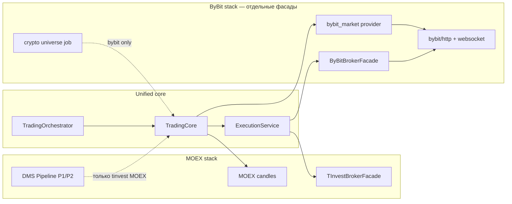

# Roadmap: Интеграция ByBit (криптобиржа)

**Версия:** 2.0  
**Дата:** 16.06.2026  
**Статус:** Планирование (пересмотрен под унифицированное ядро)  
**Связь:** [BRD-ARCH-04-trading-core-facade-orchestrator.md](BRD-ARCH-04-trading-core-facade-orchestrator.md), [ROBOTS-TECH-PORTFOLIO-TRADING.md](ROBOTS-TECH-PORTFOLIO-TRADING.md)

---

## 0. Пересмотр v2: принципы унификации

### 0.1 Терминология: `bybit` ≠ удалённый `bitby`

**`bybit`** — криптобиржа [Bybit](https://www.bybit.com) (BTCUSDT, perpetual, funding, leverage). Этот roadmap описывает только её.

Ранее в коде существовал **`bitby`** — экспериментальный MOEX-брокер-адаптер (BRD-ARCH-04 этап 6, `BITBY_API_URL`). Это **не** криптобиржа; модуль **удалён** из репозитория. MOEX → T-Invest, crypto → ByBit API.

| | MOEX | ByBit (crypto) |
|--|------|----------------|
| Брокер | T-Invest (`tinvest`) | ByBit API (`bybit`) |
| Инструмент | FIGI | symbol |
| Universe | DMS П1/П2 | `crypto_universe.py` |

### 0.2 Архитектурное решение (зафиксировано)

| Слой | MOEX / T-Invest | ByBit (crypto) | Общее ядро |
|------|-----------------|----------------|------------|
| **TradingCore / Orchestrator** | да | да | **одно ядро** |
| **Pipeline П1/П2 (MOEX+DMS)** | да | нет | отдельный crypto-universe |
| **MarketDataFacade** | MOEX + T-Invest | ByBit REST/WS | единый контракт, разные провайдеры |
| **ExecutionService** | T-Invest facade | **ByBit facade (отдельный)** | единый контракт |
| **TradingSession** | да | да | **без `ByBitTradingSession`** |

**Запрещено в v2:**

- `ByBitTradingSession`, наследующий `TradingSession` (дублирует ядро)
- бизнес-логика стратегий внутри broker-модуля
- MOEX pipeline (DMS/TQBR) для crypto universe

**Разрешено и рекомендуется:**

- отдельный модуль интеграции: `backend/app/modules/bybit/` (HTTP/WS, подпись, парсинг v5 API)
- тонкий адаптер: `backend/app/modules/robots/trading/brokers/bybit.py` → `BrokerFacade`
- провайдер данных: `trading/data/providers/bybit_market.py` → `MarketDataFacade`
- crypto-специфика только в config + risk extensions + execution mapping

### 0.3 Целевая схема подключения

---

## 1. Введение

Документ описывает план внедрения поддержки брокера **ByBit (crypto)** в систему торговых роботов **без форка торгового ядра**.

### 1.1 Цели

- Добавить `broker_type=bybit` как криптоброкера (наряду с `tinvest` для MOEX)
- Сохранить обратную совместимость существующих MOEX-роботов
- Все ByBit API-интерфейсы — **отдельным фасадом**, ядро не знает деталей v5 API
- Поддержать специфику крипторынка (24/7, short, leverage, funding) через config/risk, не через отдельную сессию

### 1.2 Ключевые отличия ByBit vs T-Invest

| Аспект | T-Invest (было) | ByBit (становится) |
|--------|-----------------|-------------------|
| **Тип данных** | Фондовый рынок (акции, облигации) | Криптовалютный рынок (фьючерсы, спот) |
| **Торговые сессии** | 10:00–18:45 МСК (рыночные часы) | 24/7 (круглосуточно) |
| **Инструменты** | FIGI, тикеры (SBER, GAZP) | Символы (BTCUSDT, ETHUSDT) |
| **Типы ордеров** | Лимитные, рыночные | Лимитные, рыночные, стоп-лосс, тейк-профит |
| **Типы позиций** | Только Long | Long + Short (фьючерсы) |
| **Плечо** | 1x (без плеча) | 1x – 100x |
| **Комиссии** | Фиксированная (0.05%) | Maker/Taker (0.01% / 0.06%) |
| **WebSocket** | Подписка по FIGI | Подписка по символам + orderbook |
| **Тестнет** | Песочница T-Invest | ByBit Testnet |

---

## 2. Этапы реализации

### Этап 1: ByBit-фасад (изолированная интеграция)

> Все пути ниже — контур **`bybit`** (криптобиржа).

#### Задача 1.1: REST API клиент ByBit v5

**Модуль:** `backend/app/modules/bybit/http_client.py`, `backend/app/modules/bybit/signer.py`

**Методы (минимум для MVP):**

- `GET /v5/market/tickers`, `GET /v5/market/kline`
- `GET /v5/account/wallet-balance`, `GET /v5/position/list`
- `POST /v5/order/create`, `POST /v5/order/cancel`, `GET /v5/order/realtime`

**Checkpoint:** баланс и свечи с Testnet.

---

#### Задача 1.2: WebSocket клиент ByBit v5

**Модуль:** `backend/app/modules/bybit/websocket.py`

- public: `kline`, `orderbook` (опционально на MVP)
- private: `order`, `position`
- reconnect + heartbeat

**Checkpoint:** live kline/price в очередь событий.

---

#### Задача 1.3: `ByBitFacade` + `ByBitBrokerFacade`

**Слои:**

1. `backend/app/modules/bybit/facade.py` — низкоуровневый API (как `tinvest/facade`)
2. `backend/app/modules/robots/trading/brokers/bybit.py` — реализация `BrokerFacade`

**Маппинг в единый контракт:**

- `figi` в ядре = `symbol` на ByBit (BTCUSDT)
- статусы ордеров → `EXECUTION_REPORT_STATUS_*` / trade status mapping
- portfolio/positions → формат, ожидаемый `Stage3/Stage4`

**Checkpoint:** все методы `BrokerFacade` работают на Testnet.

---

#### Задача 1.4: Регистрация в фабрике и routing

**Файлы:**

- `trading/brokers/factory.py` — `create_broker_facade("bybit", token)`
- `trading/brokers/routing.py` — `SUPPORTED_LIVE_BROKERS`, `filter_allowed_instruments` (символы USDT, не BBG)
- `trading/data/providers/bybit_market.py` — live candles для `MarketDataFacade`

**Checkpoint:** `broker_type=bybit` выбирается в config; ядро стартует без MOEX pipeline.

---

### Этап 2: Подключение к унифицированному ядру (без отдельной сессии)

#### Задача 2.1: ~~ByBitTradingSession~~ → расширения host-config

**Было (v1, отменено):** отдельный `session_bybit.py`.

**Стало (v2):** использовать существующие:

- `TradingOrchestrator.run_live_session`
- `TradingSession` + `trading_core.run_single_trading_cycle`

**ByBit-специфика выносится в:**

- `config.market_profile = "crypto"` (или `broker_type=bybit` как дискриминатор)
- `config.bybit`: `instrument_type`, `leverage`, `position_mode`, `testnet`
- risk extensions: short allowed, max leverage, funding threshold
- schedule policy: 24/7 (`schedule_type=1` или отдельный crypto window)

**Checkpoint:** live-сессия `broker_type=bybit` проходит цикл без MOEX-зависимостей.

---

#### Задача 2.2: Execution + ордера

**Модуль:** `ExecutionService` / `LiveExecutionService` (без дублирования Stage6)

- Limit/Market на MVP
- Stop/TP — фаза 2 (через mapping в facade, не в core)
- partial fills, status polling (WS private channel)

**Checkpoint:** ордер создаётся, статус доходит до `robot_trades`.

---

#### Задача 2.3: Short и margin

**Не в TradingSession**, а в:

- `RiskManager` extensions (`allow_short`, `max_leverage`)
- `ByBitBrokerFacade` (position side, reduce-only)
- config validation в schemas

**Checkpoint:** short-сделка на Testnet с риск-ограничениями.

---

#### Задача 2.4: Комиссии Maker/Taker

- `config.costs.maker_fee_rate`, `taker_fee_rate` (вместо единого `broker_commission_rate`)
- `TradingCosts` / PnL учитывает тип исполнения

**Checkpoint:** net PnL с разными fee rates.

---

### Этап 3: Продвинутые возможности

#### Задача 3.1: Funding Rate в стратегиях

**Описание:** Добавить учёт funding rate в торговые стратегии для фьючерсов.

**Состав работ:**
1. Получение funding rate через API
2. Добавить funding rate как фактор в стратегии (сигнал, если > 0.01%)
3. Отображение funding rate в UI
4. Добавить funding cost в расчёт PnL

**Checkpoint:** Стратегии учитывают funding rate.

---

#### Задача 3.2: Поддержка плеча (leverage) в риск-менеджменте

**Описание:** Интегрировать плечо в систему управления рисками.

**Состав работ:**
1. Добавить поле `leverage` в риск-менеджмент
2. Расчёт позиции с учётом плеча: `position_size = capital * leverage`
3. Ограничения: макс. плечо на символ, риск на сделку
4. UI для управления плечом
5. Валидация плеча перед входом в позицию

**Checkpoint:** Плечо корректно работает в риск-менеджменте.

---

#### Задача 3.3: Order Book для анализ

**Описание:** Добавить визуализацию стакана для продвинутого анализа.

**Состав работ:**
1. Подписка на orderbook через WebSocket
2. Агрегация данных стакана и расчёт метрик (спред, глубина, ликвидность)
3. UI-компонент для отображения стакана
4. Интеграция со стратегиями (сигналы на основе стакана)

**Checkpoint:** Стакан отображается в UI и влияет на стратегии.

---

#### Задача 3.4: Hedge Mode (лонг + шорт одновременно)

**Описание:** Добавить поддержку hedge mode для продвинутого управления рисками.

**Состав работ:**
1. Адаптировать логику позиций для hedge mode (поддержка одновременных лонг и шорт на одном символе)
2. Отдельный PnL для лонг и шорт
3. Риск-ограничения для hedge mode
4. UI для переключения между `one_way` и `hedge`

**Checkpoint:** Hedge mode работает корректно.

---

### Этап 4: UI и интеграция

#### Задача 4.1: Выбор брокера в UI

**Описание:** Добавить возможность выбора брокера при создании/редактировании робота.

**Состав работ:**
1. Добавить селектор брокера в форму настроек
2. Условное отображение полей в зависимости от брокера (FIGI для T-Invest, символы/плечо для ByBit)
3. Валидация полей и автозаполнение дефолтных значений
4. Обновить sidebar статуса для ByBit

**Checkpoint:** Можно создать робота для ByBit через UI.

---

#### Задача 4.2: ByBit-специфичные поля

**Описание:** Добавить все ByBit-специфичные поля в UI.

**Состав работ (UI):**
1. Поле "Тип инструмента" (спот / бессрочный фьючерс)
2. Поле "Плечо" (1-100x)
3. Поле "Режим позиций" (one_way / hedge)
4. Поле "Testnet/Mainnet" (переключатель)
5. Отображение статуса 24/7 торговли и funding rate

**Состав работ (Backend):**
1. Расширить схемы валидации для ByBit-полей
2. Добавить миграцию для новых полей
3. Добавить проверку на наличие API ключей

**Checkpoint:** Все ByBit-поля отображаются и сохраняются.

---

#### Задача 4.3: Отображение статуса ByBit-роботов

**Описание:** Добавить ByBit-специфичную информацию в список и карточку роботов.

**Состав работ (UI):**
1. Отображение текущего leverage, позиции (лонг/шорт), unrealized PnL, funding rate
2. Статус WebSocket-соединения

**Состав работ (Backend):**
1. API для получения статуса ByBit-сессии
2. WebSocket-события для ByBit-специфичных данных

**Checkpoint:** Статус ByBit-робота виден в UI.

---

#### Задача 4.4: Бэктест для ByBit

**v2-подход:** тот же `TradingOrchestrator.run_backtest_replay`, но:

- источник свечей: ByBit historical kline (не MOEX `candles_cache` по умолчанию)
- `SimBacktestBrokerFacade` с crypto costs (maker/taker, funding)
- universe: фиксированный список символов или crypto screening job (не DMS П1/П2)

**Checkpoint:** backtest run с `broker_type=bybit` в config snapshot.

---

## 6. Стратегии: MOEX vs ByBit — общее и различия

### 6.1 Что можно переиспользовать (ядро)

Математика сигналов **может быть общей**, если стратегия параметризована:

- `momentum_breakout` — пробой уровня + hold + volume filter
- `reversion_to_ma` — отклонение от MA + RSI
- индикаторы в `indicators/library` (ATR, MA, BB)

Ядро (`TradingCore`, `RiskManager`, `ExecutionService`) остаётся одним.

### 6.2 Что **обязательно** различается (критерии отбора и риска)

| Критерий | MOEX (T-Invest) | ByBit (crypto) |
|----------|-------------------------|----------------|
| **Universe** | П1 MOEX lookback + П2 DMS snapshot (TQBR, листинг, ликвидность) | Top volume pairs, min 24h turnover, spread; **без** dividend calendar |
| **Торговые часы** | 10:00–18:45 МСК, weekdays mask | 24/7; `entry_minutes_from_open` не применим |
| **Корпоративные события** | дивиденды, делистинг, security_status | funding rate, maintenance, delisting announcement |
| **Направление** | по умолчанию long-only (акции) | long + short нативно |
| **Плечо / маржа** | 1x, запрет short sell без позиции | leverage, liquidation, margin mode |
| **Комиссии** | broker + НДФЛ | maker/taker, без НДФЛ |
| **Ликвидность** | MOEX value_today, num_trades, board filters | orderbook depth, 24h volume |
| **Волатильность** | ATR% на D1, gap at open | часто выше; funding как cost of carry |
| **Принудительное закрытие** | grain_seed `force_close_time_msk` | опционально EOD нет; funding flip / risk flatten |
| **Backtest data** | MOEX ISS / `candles_cache` | ByBit kline history |

### 6.3 Практический вывод

**Да, критерии отличаются существенно** — не столько в формуле MA/пробоя, сколько в:

1. **universe pipeline** (MOEX П1/П2 ≠ crypto screening),
2. **календаре и сессии**,
3. **риск-модели** (short, leverage, funding),
4. **источнике данных и costs**.

Рекомендация:

- держать **один набор strategy classes** с `market_profile` / `broker_type` guards;
- вынести market-specific правила в:
  - `PipelineRunner` (MOEX only),
  - `crypto_universe_jobs` (ByBit only),
  - `RiskParams` presets per market.

**Не переносить на ByBit как есть:**

- `grain_seed` (жёстко завязан на MOEX session orchestration),
- MOEX-specific filters (`security_status`, dividend calendar),
- `momentum_breakout.entry_minutes_from_open` без адаптации (нужен crypto-аналог: rolling window, не "открытие биржи").

---

## 7. MVP scope (рекомендуемый порядок)

1. `bybit` facade + factory + Testnet execution (Market orders)
2. `broker_type=bybit` в config, UI selector, fixed symbol list
3. Одна стратегия: `reversion_to_ma` или упрощённый `momentum_breakout` с crypto params
4. Live session через существующий Orchestrator
5. Backtest на ByBit kline
6. Funding / leverage / orderbook — фаза 2

---

---

## 5. Тестирование и Rollout

#### Задача 5.1: Тестирование на ByBit Testnet

**Описание:** Полное тестирование на тестовой сети ByBit (через единый Orchestrator, не отдельную сессию).

**Тест-кейсы:**
1. Создание ByBit-робота через UI (`broker_type=bybit`)
2. Запуск live-сессии на Testnet и WebSocket
3. Генерация сигналов (crypto-adapted strategy)
4. Market/Limit ордера, статусы в `robot_trades`
5. Long/short с risk limits
6. Leverage 1x/3x (фаза 2)
7. Backtest на ByBit kline
8. Rate limit / insufficient balance
9. WS reconnect
10. Graceful shutdown

**Checkpoint:** все тест-кейсы MVP пройдены на Testnet.

---

# Дополнительные материалы
1. Официальная документация ByBit API: https://bybit-exchange.github.io/docs/v5/intro
ByBit Testnet: https://testnet.bybit.com/
2. Текущая документация T-Invest (для сравнения): [внутренняя ссылка]
3. Шаблон конфигурации ByBit-робота: backend/app/modules/robots/config/templates/bybit_template.json
