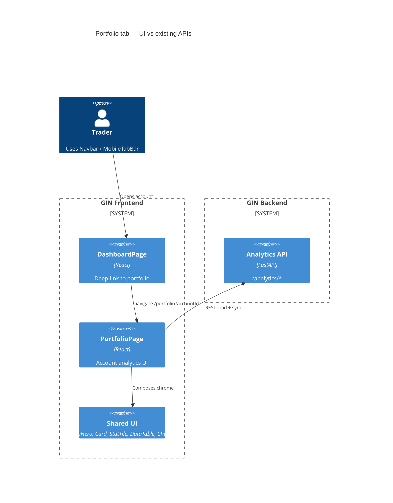
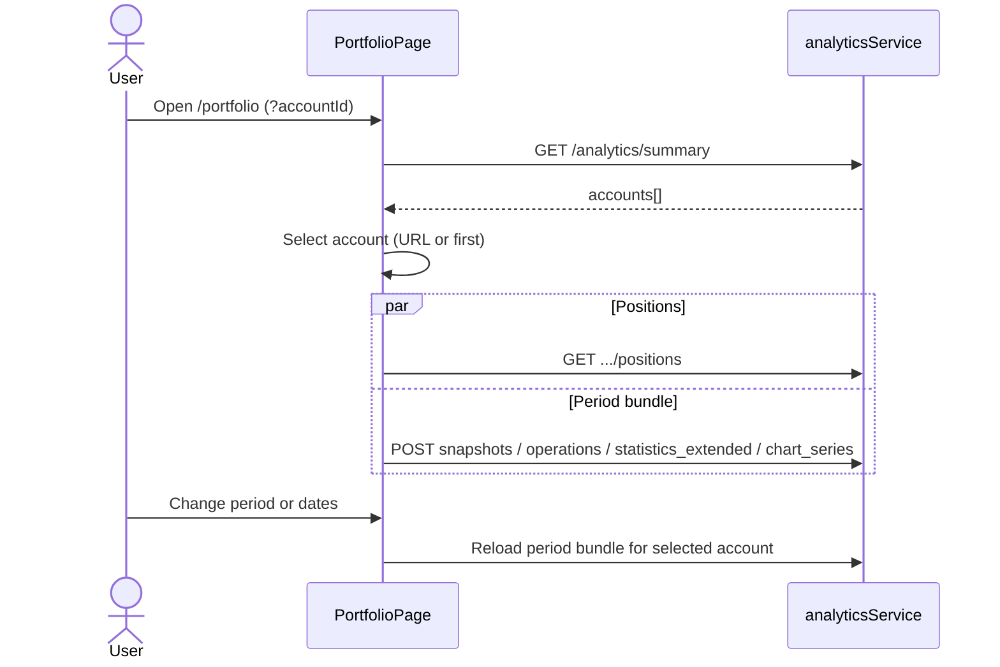
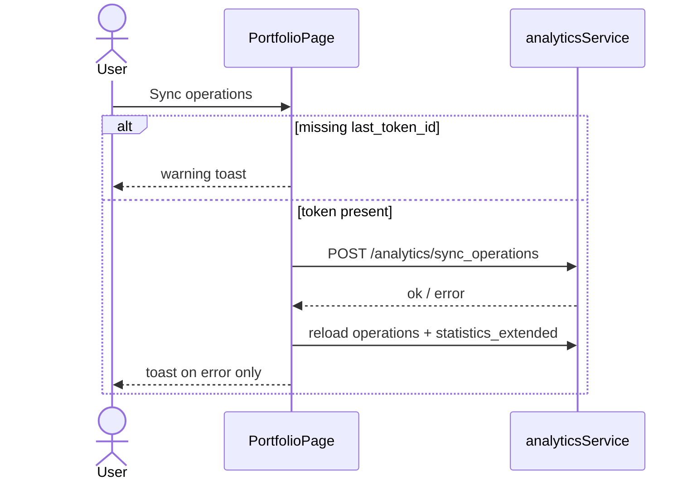

# SPEC-01: Portfolio page visual alignment with Dashboard

## 1. Problem and users

**Problem.** `/portfolio` (`PortfolioPage`) already reuses several dashboard building blocks (`PageHero`, `Card`, `dashboard-layout`, `dashboard-totals-card`, `dashboard-assets-card`, `StatTile`, `CollapsibleSection`, `DataTable`, `Chart`), but the page still reads as a hybrid: portfolio-specific CSS (`portfolio-*`), denser/less hierarchical stats than dashboard summary metrics, incomplete hero parity (`dashboard-hero--node`), weaker empty/error/retry patterns vs `/dashboard`, and a dead operations-sync handler with no visible control.

**Users.** Traders and operators who move between **Дашборд** → **Портфель** (Navbar / MobileTabBar) via account deep-links (`/portfolio?accountId=` from dashboard account rows/cards). They need the same cyber-trading visual language without losing account/period analytics, composition, charts, or Bybit/T-Invest quirks.

**Success.** After redesign, `/portfolio` feels like the same product surface as `/dashboard` (shared chrome, tokens, section rhythm, loading/empty/error language) while **behavior and data remain feature-complete** vs today’s page.

## 2. Scope (in / out)

### In scope

- Visual/structural redesign of `frontend/src/pages/PortfolioPage.tsx` and related portfolio UI (`PortfolioComposition`, portfolio CSS under `global.css` / `responsive.css`).
- Reuse and light refactor of shared UI: `PageHero`, `Card`, `CollapsibleSection`, `StatTile` (and/or dashboard summary metric patterns), `DataTable`, `Chart`, `Skeleton`, `RobotIllustration`, `SegmentedControl`, `Select`, `DateRangePicker`, `Toggle`, `Button`, toast patterns.
- Desktop **≥1440px** and mobile **≤767px** designed and accepted **in parallel** (match existing dashboard breakpoints / `useMediaQuery('(max-width: 767px)')`).
- Restore **visible** operations sync UX that already exists in code (`handleSyncOperations` → `analyticsService.syncOperations`) but is not rendered.
- Class/token cleanup toward shared `dashboard-*` / design tokens; keep page-specific hooks only where behavior is unique (chart legend, crosshair readout, period toolbar, snapshot→positions).
- Dark + light via existing `data-theme` / CSS variables (`variables.css`, `theme.css`).

### Out of scope

- New backend endpoints, schema changes, portfolio-updater robot, robot wizard, token CRUD.
- Changing analytics formulas, FIFO P&L semantics, IMOEX benchmark calculation, or snapshot generation.
- Replacing analytics REST with WebSocket (portfolio is request/response today; live streaming N/A).
- Reworking `/dashboard` product behavior (except ensuring deep-link to portfolio still works).
- Using legacy `portfolioService` (`/tinvest/portfolio/*`) on this page — current page is analytics-backed; do not migrate unless a hard gap appears (none found for current features).

## 3. Functional requirements `[R-n]`

Feature parity with current `/portfolio` (visual shell may change; behaviors must remain).

| ID | Requirement |
|----|-------------|
| `[R-1]` | Route `/portfolio` remains registered; Navbar + MobileTabBar keep «Портфель» entry. |
| `[R-2]` | Deep-link `?accountId=<analytics account id>` selects matching account on load; account change updates query via `history.replaceState`. |
| `[R-3]` | Account selector lists analytics accounts (`formatPortfolioAccountLabel`); currency formatting follows selected account currency; Bybit detection via `isBybitPortfolioAccount` preserved for any Bybit-specific UI/copy. |
| `[R-4]` | Period presets (День / Неделя / Месяц / 3 месяца / Всё время) + custom `DateRangePicker`; mobile may omit «3 месяца» as today (`MOBILE_PERIOD_DAYS`). Changing period/range reloads snapshots, operations, extended stats, chart series. |
| `[R-5]` | **Overall** stats: own funds, current value, ROI, avg monthly ROI. **Period** stats: capital flow, trading performance, operational metrics, benchmark vs IMOEX (incl. «нет данных»), risk/recovery — same tiles/labels as today. |
| `[R-6]` | Chart: portfolio area series vs instruments line series (`Toggle` «Посмотреть бумаги» / mobile «бумаги»); legend multi-select + select/clear all; crosshair value/delta for portfolio mode; chart height mobile 240 / desktop 360; pan-left may expand preset period as today. |
| `[R-7]` | Composition table (`PortfolioComposition`): columns, sort, mobile primary/details, empty «Нет позиций», loading skeleton; optional open when snapshot row requests composition (`loadPositions(accountId, snapshotId)`). |
| `[R-8]` | Snapshots history table (cap 500): click / mobile «Показать состав снимка» loads that snapshot’s positions. |
| `[R-9]` | Operations history table for selected period; empty «Нет операций за период». |
| `[R-10]` | **Operations sync action** visible in UI (operations section toolbar or headerEnd): calls existing `analyticsService.syncOperations` with `account_id`, range, `tokenId` from `last_token_id`; warn toast if token missing; error toast on failure; loading state; refresh operations + stats on success. *As-is gap: handler exists, control missing — redesign must restore control without new API.* |
| `[R-11]` | Empty accounts state explains need for portfolio updater robots (Bybit or T-Invest); chart empty state when no series for period. |
| `[R-12]` | No change to product calculations or broker quirks beyond presentation (e.g. benchmark unavailable, Bybit labeling). |

## 4. Non-functional (latency, tenancy, audit, risk)

- **UI-only.** Prefer existing analytics contracts; no new endpoints expected after inventory.
- **Theme.** All new/changed surfaces use semantic tokens (`--bg-card`, `--border-subtle` / `--border`, `--text-*`, `--color-up` / `--color-down`); charts keep `Chart.tsx` `data-theme` behavior; avoid hard-coded hex except chart series colors already derived in page helpers (instrument palette / area series) — optionally map closer to tokens later without changing series semantics.
- **Responsive.** Dual acceptance: desktop layout (≥1440) and mobile (≤767) must both ship; tablet may inherit nearest breakpoint without a third unique IA.
- **Perf.** Keep `DataTable` `maxHeight` scrolling; do not add WS; avoid remounting chart more than current key (`account + range + mode + figis`).
- **A11y.** Preserve `aria-busy` / labels on skeletons; collapsible keyboard toggle; sync button disabled + loading; focus-visible on controls matching dashboard.
- **Risk / tenancy.** No multi-tenant UI change; account isolation remains “selected account id” scoped fetches. Sync requires token — surface warning, do not invent tokens.
- **Logging.** No new client telemetry required; keep toast-only user feedback for sync failures.

## 5. Data model (tables, keys, retention) `[ref: R-n]`

**N/A — UI-only against existing APIs.** No schema or retention changes.

Client entities already consumed (for designer/backend awareness only):

- `AccountSummary`, `PortfolioSnapshotSummary`, `PortfolioStatisticsExtendedResponse`, `AnalyticsChartSeriesResponse`, operation/position row shapes from analytics responses (`frontend/src/types/api.ts`).

## 6. API and WebSocket contracts `[ref: R-n]`

**WebSocket:** N/A (portfolio page does not subscribe today; redesign must not add streaming).

**Service of record for this page:** `analyticsService` (not `portfolioService`).

| Call | Method / path | When | Refs |
|------|---------------|------|------|
| Account list | `GET /analytics/summary` → `accounts[]` | Initial load | `[R-2]` `[R-3]` `[R-11]` |
| Positions | `GET /analytics/accounts/{id}/positions` optional `snapshot_id` | Account / snapshot click | `[R-7]` `[R-8]` |
| Snapshots | `POST /analytics/snapshots` `{ account_id, from_date, to_date }` | Account + period | `[R-4]` `[R-8]` |
| Operations | `POST /analytics/operations` same range | Account + period | `[R-4]` `[R-9]` |
| Stats | `POST /analytics/statistics_extended` | Account + period | `[R-4]` `[R-5]` |
| Chart | `POST /analytics/chart_series` | Account + period | `[R-4]` `[R-6]` |
| Sync ops | `POST /analytics/sync_operations` `{ account_id, from_date, to_date, tokenId, state }` | User sync action | `[R-10]` |

**Hard gap check:** All current features map to the above. **No new backend endpoints required** for this redesign. Optional future: expose sync status/progress — out of scope; keep toast + reload.

`portfolioService.syncOperations` (`/tinvest/portfolio/operations/sync`) is a parallel legacy path — **do not switch** unless product explicitly migrates; page already uses analytics sync.

## 7. Sequence / C4 (Mermaid)

### C4 — containers (UI focus)

### Sequence — load + period change

### Sequence — operations sync `[R-10]`

## 8. Screen inventory (page, zones, data needed — no pixels)

**Page:** `PortfolioPage` — `data-page="portfolio"`, shell via existing `PageLayout` + Navbar / MobileTabBar.

**Shared chrome (align with Dashboard):**

| Zone | Role | Shared vs page-specific | Data / states |
|------|------|-------------------------|---------------|
| **A. PageHero** | Title strip | Shared `PageHero`; apply `dashboard-hero--node` parity with dashboard; eyebrow/title/subtitle copy can stay analytics-themed («ANALYTICS NODE» / «ПОРТФЕЛЬ») or be harmonized with dashboard node language — designer chooses; optional `actions` slot for future tools (sync may live in ops section instead) | Loading: hero + skeleton; Empty accounts: hero + error card |
| **B. Toolbar** | Account + period + date range | Page-specific content; wrap in `Card` using same surface tokens as dashboard cards (`dashboard-totals-card` rhythm / borders) | Accounts list; period presets; from/to |
| **C. Stats card** | Overall + period KPIs | Shared `Card` + `StatTile` / consider visual parity with `dashboard-summary-metrics` for the **overall** 4 KPIs; period grid remains denser `portfolio-stats-grid` or collapsed | `stats` / `statsLoading`; mobile: period block in `CollapsibleSection` (default closed) |
| **D. Chart card** | Equity / instruments | Shared `Card` / mobile `CollapsibleSection` (`dashboard-assets-collapse`); page-specific chart header, toggle, legend, crosshair | `chartData`, `chartLoading`, `chartMode`, `selectedFigis`; empty robot card |
| **E. Composition** | Positions | Shared `CollapsibleSection` + `DataTable` via `PortfolioComposition` | `positions`, `posLoading`; defaultOpen desktop true / mobile false |
| **F. Snapshots** | History | Shared collapse + `DataTable` | `snapshots`, `snapshotsLoading`; badge count |
| **G. Operations** | History + **sync control** | Shared collapse + `DataTable`; **add** sync `Button` in `headerEnd` or body toolbar | `operations`, `opsLoading`, `opsSyncing` |

**Loading / error / empty (target contract — match dashboard language):**

| State | Behavior |
|-------|----------|
| Initial accounts load | `PortfolioSkeleton` inside `dashboard-layout` (toolbar + totals + chart placeholders) |
| No accounts | `dashboard-error-card` + `RobotIllustration` inactive + copy about portfolio updater robots |
| Section load fail | Prefer inline empty/skeleton as today; **improve** at least page-level or stats/chart failure with retry pattern akin to dashboard (`Повторить`) where errors are currently swallowed (`catch { /* */ }` / set null) — minimal: chart/stats show empty + optional retry without new APIs |
| Chart no series | Robot empty card «Нет данных графика…» |
| Tables empty | Existing `emptyText` strings |
| Sync | Warning / error toasts; button loading |

**Responsive behavior (parallel acceptance):**

- **Desktop ≥1440:** vertical stack in `dashboard-layout`: toolbar → stats (overall + period expanded) → chart card → composition open → snapshots/ops collapsed.
- **Mobile ≤767:** same stack; period control without «3 месяца»; period stats + chart in collapsibles; tables use `mobilePrimary` / `mobileDetails`; composition default closed; sticky strip pattern from dashboard is **not** required (single-account page).

**CSS convention target:**

- Prefer shared `dashboard-*` for layout, cards, hero, empty/error, panel titles.
- Keep `portfolio-*` only for unique widgets: toolbar internals, chart legend/crosshair, mobile split rows, collapse count badge — or rename to shared names when identical to dashboard collapses (`dashboard-accounts-collapse` patterns).
- `StatTile` currently renders `portfolio-stat-tile`; either keep class as the shared KPI primitive or introduce a neutral alias — designer/UI should avoid forking a second tile for the same job. **Do not** adopt AnalyticsPage `KpiTile` (emoji/legacy) for this page.

## 9. Acceptance criteria (backend / UI / e2e)

### Backend

- No required API changes. Existing analytics endpoints continue to satisfy `[R-2]`–`[R-10]`.
- Regression: sync payload still accepted by `POST /analytics/sync_operations`.

### UI

- Visual language parity with `/dashboard`: hero node treatment, card surfaces, panel titles, empty/error robot cards, up/down colors, dark **and** light themes.
- Feature parity checklist: account URL, periods (incl. mobile subset), all overall + period stats labels, both chart modes + legend, composition, snapshot→positions, operations list, **visible sync**.
- Bybit accounts: selectable; money formatting uses account currency; no FIGI-column regression (already removed); benchmark may show «нет данных» without layout break.
- Shared components used; no one-off hex backgrounds fighting `--bg-card`.

### E2E / manual

- Desktop 1440+ and mobile width ≤767: full scroll through zones A–G; no horizontal overflow on toolbar/period control.
- From dashboard account click → portfolio opens correct account.
- Toggle papers mode, select/deselect legend, change period, open snapshot composition.
- Sync with missing token → warning; with token → reload ops (against sandbox/dev account).
- Theme toggle dark/light: hero, cards, tables, chart readable.

## 10. Open questions `[NEEDS INPUT]`

- `[NEEDS INPUT: Hero copy]` Keep «ANALYTICS NODE» vs align eyebrow to dashboard «PORTFOLIO NODE» family naming?
- `[NEEDS INPUT: Overall KPI presentation]` Keep dense `StatTile` grid for overall four metrics, or restyle overall block to match dashboard `dashboard-summary-metrics` (hero value weight) while period stays dense?
- `[NEEDS INPUT: Sync placement]` Prefer ops section `headerEnd` button vs PageHero `actions` vs composition-style toolbar?
- `[NEEDS INPUT: Error retry depth]` Is full dashboard-style page retry required for summary failure, or only chart/stats section retries?

Assumptions if unanswered: keep current hero copy; overall stats stay StatTile grid but with dashboard card chrome; sync in operations `headerEnd`; add section-level retry for chart/stats only.

## 11. Handoff

**Designer gets:** §8 zones A–G, responsive rules, empty/error/loading, shared vs page-specific components, open questions on hero/KPI weight/sync placement.

**Backend gets:** §5 N/A; §6 existing analytics contract confirmation; no new work unless sync/prod issues appear during QA.

**UI gets:** §3 feature parity, §6 call map, §9 acceptance; implement against existing APIs only; wait for approved UX layout decisions on open questions.

**Orchestrator:** do not implement in this analyst pass — route to product-designer then senior-typescript-ui-engineer after UX approval.
