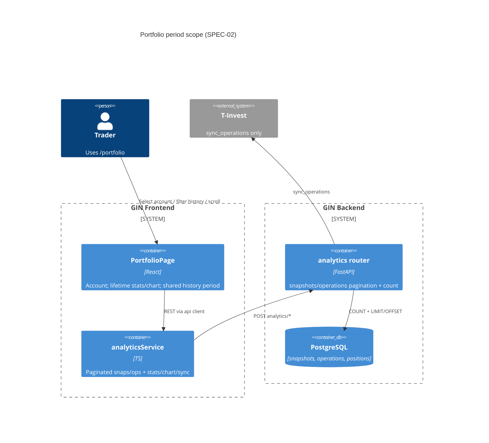
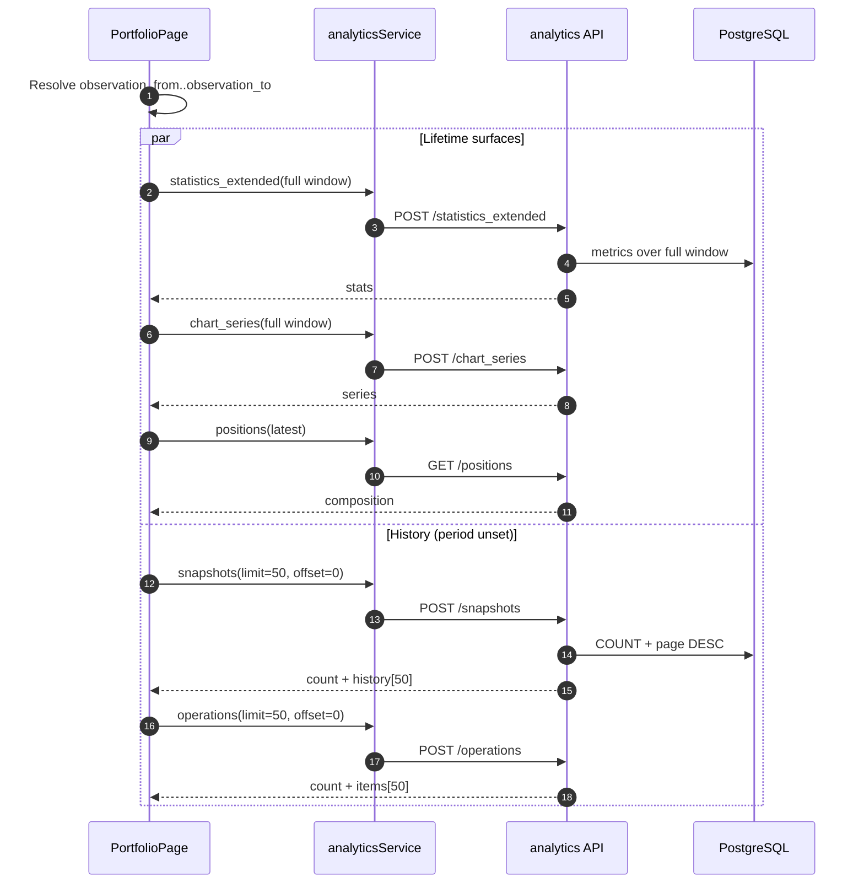

# SPEC-02: Portfolio history period scope + snapshots/operations pagination

**Supersedes (in part):** `docs/SPEC-01-portfolio-dashboard-visual-alignment.md` `[R-4]`, `[R-5]` (period KPI scope), `[R-8]`/`[R-9]` (list load), and toolbar/stats rows of `docs/ui/UX-02-portfolio-option-b-chart-zoom.md` that treat toolbar period as the stats filter.

**Does not contradict:** UX-02 chart behavior — chart remains **full observation history** + **client-side zoom** (День / Неделя / Месяц / Год / Всё). This SPEC removes toolbar period as a stats filter and moves period filtering to history lists only.

**Anchors:** `frontend/src/pages/PortfolioPage.tsx`, `frontend/src/services/analyticsService.ts`, `backend/app/modules/analytics/{router,schemas,service,queries}.py`.

---

## 1. Problem and users

**Problem.** The portfolio toolbar period (`SegmentedControl` + `DateRangePicker`) currently drives statistics, snapshots, operations, and (historically) chart fetch. Product intent has changed:

1. **Сводка** and **график** should always reflect the full observation window (account start / earliest available data → today).
2. **Состав** stays “current moment” (latest positions).
3. **Period** should filter only **history of snapshots** and **history of operations**, as one shared control.
4. Snapshots/operations payloads can be large; returning the full list (ops hard-capped at 5000; snaps uncapped in query; UI slices snaps to 500) is wasteful and misreports badge counts.

**Users.** Traders on `/portfolio` who pick an analytics account, scan lifetime performance, then dig into snapshot/operation history (optionally narrowed by dates).

**Success.**

- Toolbar is account-only; no period controls there.
- Lifetime KPIs + chart load once per account for the full window; chart zoom stays independent.
- Shared history period defaults to **unset** (= all-time); badges show server `count`, not loaded row length.
- First page is 50 newest rows; further pages load on scroll.

---

## 2. Scope (in / out)

### In scope

- Portfolio page IA/copy: toolbar contents; KPI block rename; placement of shared history period; infinite scroll UX for snaps/ops.
- API contract changes for `POST /api/analytics/snapshots` and `POST /api/analytics/operations`: optional date bounds, `count`, default page size 50, offset pagination, newest→oldest.
- Frontend `analyticsService.ts` (+ `types/api.ts` as needed) and sole product consumer `PortfolioPage`.
- Sync operations (`POST /api/analytics/sync_operations`) **request date source** when toolbar dates disappear (body schema may stay required `from_date`/`to_date`; client resolves values).
- How `statistics_extended` / `chart_series` date bounds are chosen without toolbar period (client-resolved full window; no mandatory schema change to those endpoints).

### Out of scope

- Changing analytics formulas, FIFO, IMOEX, snapshot generation, or portfolio-updater robots.
- WebSocket streaming for history.
- Cursor pagination (offset is the chosen contract for this release).
- Making `statistics_extended` / `chart_series` / `sync_operations` accept omitted dates (optional follow-up; see §10).
- Legacy `portfolioService` (`/tinvest/portfolio/*`) migration.
- Replacing chart zoom UX from UX-02.

---

## 3. Functional requirements `[R-n]`

| ID | Requirement |
|----|-------------|
| `[R-1]` | **Toolbar** (`Card.dashboard-totals-card.portfolio-toolbar`): only account `Select`. Remove period `SegmentedControl` and `DateRangePicker` from this card. |
| `[R-2]` | **Сводка** + **Стоимость портфеля (chart)**: always load for the **full observation window** = earliest available account data → end of current day. No dependency on history period control. Chart zoom remains client-only per UX-02. |
| `[R-3]` | **Period KPI block** (today titled «Выбранный период»): **rename, do not remove**. Metrics stay the extended capital-flow / trading / ops / benchmark / risk grid, but they describe the **full observation window**, not a toolbar filter. |
| `[R-4]` | **Russian labels (canonical):** desktop row title and mobile collapse title → **«За всю историю»**. Optional muted hint (designer may omit): «от первого снимка до сегодня». Do not reuse «Выбранный период» or «за период» for this block. |
| `[R-5]` | **Состав портфеля**: latest positions for selected account (`GET …/positions` without `snapshot_id` unless user opens a snapshot). **No period filter.** Confirm as-is. |
| `[R-6]` | **Shared history period**: one `from`/`to` (optional) used by **both** «История снимков» and «История операций». Default: **no period selected** → treat as all-time for both lists and for `count`. |
| `[R-7]` | Changing shared period **resets** both lists to first page (`offset=0`), clears accumulated rows, and refetches. Account change clears period to default (unset) and reloads all account-scoped data. |
| `[R-8]` | `POST /analytics/snapshots` and `POST /analytics/operations`: response includes **`count`** = number of rows matching account + optional date filter (all-time if dates omitted). Return first **`limit`** rows (default **50**), **newest → oldest**. Further pages via **`offset`**. |
| `[R-9]` | Collapse **badges** use response `count`, never `items.length` / `history.length`. |
| `[R-10]` | Infinite scroll: when user scrolls near end of the list viewport and `offset + loaded < count`, request next page and **append**. Show loading row/skeleton for “load more”; do not blank the table. |
| `[R-11]` | Empty copy: snaps — «Нет истории» (all-time) / «Нет снимков за выбранный период» (when filter set). Ops — «Нет операций» (all-time) / «Нет операций за выбранный период» (when filter set). |
| `[R-12]` | **Sync operations** uses the **shared history period** when set; when unset, uses the same resolved full observation window as stats/chart (`earliest → now`). Still requires `last_token_id`; warn toast if missing. After successful sync, refresh ops (page 0) and statistics (full window). |
| `[R-13]` | Preserve account deep-link `?accountId=`, Bybit labeling, composition-from-snapshot, chart papers/legend/crosshair, and visible sync control from SPEC-01 / UX-01–02 where not superseded here. |

### Russian copy matrix (UI)

| Surface | Current | New |
|---------|---------|-----|
| Toolbar aria / intent | «Период данных» | N/A (control removed) |
| Stats secondary block | «Выбранный период» | **«За всю историю»** |
| History zone label | (none) | **«Период истории»** (zone header; see §8) |
| History clear / all | «Всё время» preset | Prefer explicit **«Сбросить»** / empty range = all-time (may keep preset chip «Всё время» that clears dates) |
| Ops empty | «Нет операций за период» | See `[R-11]` |
| Chart zoom «Всё» | Unchanged | Unchanged (visible range only) |

---

## 4. Non-functional (latency, tenancy, audit, risk)

- **Latency.** First page of snaps/ops must avoid loading the full history. Target: single round-trip with `COUNT(*)` + `ORDER BY … DESC LIMIT :limit OFFSET :offset` (or equivalent). Prefer one SQL round-trip or count+page in the same request handler.
- **Limits.** Default `limit=50`; max `limit=200`; `offset >= 0`. Reject out-of-range with `400`.
- **Tenancy.** Unchanged: ownership check on `account_id` / external id for sync (`user_id`). No cross-account leakage in count or page rows. `[ref: multi-tenant-trading]`
- **Concurrency.** Offset pagination may skip/duplicate a row if sync inserts during scroll; acceptable for history browser. On period change / sync success / account change, **reset to offset 0**.
- **Perf (UI).** Keep `DataTable` `maxHeight` scroll container; wire `onScroll` (or IntersectionObserver sentinel) for load-more. Remove client `snapshots.slice(0, 500)` cap once server pages.
- **Logging.** Log `account_id`, `offset`, `limit`, `count`, whether dates were omitted; never log tokens. `[ref: logging-standards]`
- **Risk.** Sync with a very wide all-time window may hit broker rate/time limits — surface existing error toast; do not invent broker windows. See `[NEEDS INPUT]` in §10 if product wants a capped sync default.

---

## 5. Data model (tables, keys, retention) `[ref: R-8]`

**No new tables.** Use existing:

| Table | Role |
|-------|------|
| `portfolio_snapshots` | History rows for snaps; date field `snapshot_date` |
| `portfolio_operations` | History rows for ops; date field `operation_date` |
| `portfolio_accounts` | Ownership / account identity |
| `portfolio_positions` | Composition (latest snapshot) — unchanged |

**Query needs `[ref: R-8]`:**

- Filter: `account_id = :id` AND optional `date >= :from_date` AND `date <= :to_date`.
- Sort: `date DESC` (ops: `operation_date DESC`; snaps: `snapshot_date DESC`).
- Page: `LIMIT :limit OFFSET :offset`.
- Count: `COUNT(*)` with the **same** filter (no limit).

**Indexes (verify / add if missing):**

- `(account_id, snapshot_date DESC)` on `portfolio_snapshots`
- `(account_id, operation_date DESC)` on `portfolio_operations`

**Retention:** unchanged.

**Full-window resolution (for stats/chart/sync, not a stored entity):**

```text
observation_from = MIN(
  earliest portfolio_snapshots.snapshot_date for account,
  earliest portfolio_operations.operation_date for account  -- optional tie-break
)
observation_to   = end of current local calendar day (same convention as today’s FE ISO dates)
```

If no snapshots and no operations exist, stats/chart empty states apply; sync may still use a product-defined fallback start — see §10.

---

## 6. API and WebSocket contracts `[ref: R-6, R-8, R-12]`

**WebSocket:** N/A.

**Auth:** existing Bearer / session via `get_current_user` (unchanged).

**Idempotency:** GET-like POSTs; no `Idempotency-Key` required for list reads. Sync remains best-effort non-idempotent broker pull.

### 6.1 Pagination choice

**Chosen: `limit` + `offset` (not cursor).**

Rationale: only GIN UI consumer today; SQL already ordered by date; simpler FE append model; history is append-mostly. Document reset-on-mutation to mitigate offset drift.

### 6.2 Naming: `count` vs `total`

| Field | Meaning after this SPEC |
|-------|-------------------------|
| **`count`** | **Canonical.** Total rows matching filter (all-time or selected period). Independent of page size. |
| **`total`** | **Deprecated on operations.** Today = `len(items)` of the returned (often full) list — misleading under pagination. |

**Migration policy (breaking, accepted):**

- Only known clients: `PortfolioPage` + `analyticsService.getOperationsByPeriod` / `getSnapshotsByPeriod`. No external public SDK.
- **Breaking change in the same release as the FE update:** ship FE + BE together.
- Operations response: replace `total` with `count` (do **not** keep dual fields unless a hotfix needs a one-release alias; preferred clean cut).
- Snapshots response: add `count` (and pagination fields); keep array name `history` for minimal churn.

### 6.3 `POST /api/analytics/snapshots`

| Field | Value |
|--------|--------|
| BRD/SPEC ref | `[ref: R-6]` `[ref: R-8]` |
| Method / path | `POST /api/analytics/snapshots` |
| Auth | Current user; ownership on `account_id` |
| Idempotency | n/a |

**Request**

```json
{
  "account_id": 123,
  "from_date": "2026-01-01T00:00:00Z",
  "to_date": "2026-08-27T23:59:59Z",
  "limit": 50,
  "offset": 0
}
```

| Field | Type | Required | Notes |
|-------|------|----------|-------|
| `account_id` | int | yes | Internal analytics account id |
| `from_date` | datetime \| null / omitted | no | Inclusive lower bound on `snapshot_date` |
| `to_date` | datetime \| null / omitted | no | Inclusive upper bound |
| `limit` | int | no | Default **50**, max **200** |
| `offset` | int | no | Default **0** |

**Date rules:** omit both → all-time. Provide both → filter. Provide only one → `400` (`from_date and to_date must both be set or both omitted`). `from_date > to_date` → `400`.

**Response `200`**

```json
{
  "account_id": 123,
  "from_date": null,
  "to_date": null,
  "count": 842,
  "limit": 50,
  "offset": 0,
  "history": [ { "snapshot_id": 1, "date": "...", "total_value": 0, "daily_yield": 0, "expected_yield": 0 } ]
}
```

| Field | Notes |
|-------|--------|
| `from_date` / `to_date` | Echo request bounds; **`null` when all-time** |
| `count` | Filtered total |
| `history` | Page rows, newest→oldest; length ≤ `limit` |

**Errors:** `400` validation; `401`; `404` account not owned/found.

### 6.4 `POST /api/analytics/operations`

| Field | Value |
|--------|--------|
| SPEC ref | `[ref: R-6]` `[ref: R-8]` |
| Method / path | `POST /api/analytics/operations` |
| Auth | Current user; ownership |

**Request**

```json
{
  "account_id": 123,
  "from_date": null,
  "to_date": null,
  "operation_type": null,
  "limit": 50,
  "offset": 0
}
```

Same date / limit / offset rules as snapshots. `operation_type` remains optional filter (unchanged semantics) and must be included in `count`.

**Response `200`** (`AnalyticsOperationsResponse` updated)

```json
{
  "account_id": 123,
  "from_date": null,
  "to_date": null,
  "count": 1204,
  "limit": 50,
  "offset": 0,
  "items": [ { "operation_id": "...", "operation_date": "...", "...": "..." } ]
}
```

| Change | Detail |
|--------|--------|
| `total` removed | Use `count` |
| `items` | Page only; newest→oldest |
| Default page | 50 (replaces today’s effective “return up to 5000”) |

**Errors:** same as snapshots; `404` if ownership fails (align with current service behavior).

### 6.5 Unchanged endpoints (behavior via client dates)

| Call | Change |
|------|--------|
| `POST /analytics/statistics_extended` | Schema unchanged (`from_date`/`to_date` required). Client always sends **full observation window**. |
| `POST /analytics/chart_series` | Schema unchanged. Client always sends **full observation window** (replace magic-only `CHART_HISTORY_DAYS` when earliest date known; far-past fallback OK if unknown — align with UX-02). |
| `POST /analytics/sync_operations` | Schema unchanged (dates required). Client fills from shared history period or full window `[R-12]`. |
| `GET /analytics/accounts/{id}/positions` | Unchanged — composition / snapshot drill-in. |

### 6.6 Frontend service impact

`analyticsService.ts`:

- `getSnapshotsByPeriod` → accept optional dates + `limit`/`offset`; return `{ count, history, limit, offset, from_date, to_date }`.
- `getOperationsByPeriod` → same; return `count` (not `total`).
- Call sites: only `PortfolioPage.tsx` (grep-confirmed). Update `types/api.ts` accordingly.

---

## 7. Sequence / C4 (Mermaid)

### C4 — containers



### Sequence — account select (full window + first history pages)



### Sequence — history period change + infinite scroll

```mermaid
sequenceDiagram
  autonumber
  participant UI as PortfolioPage
  participant API as analytics API

  UI->>UI: User sets from/to (shared)
  UI->>UI: Clear snap/ops rows; badges→…
  UI->>API: POST /snapshots {from,to,limit:50,offset:0}
  API-->>UI: count, history
  UI->>API: POST /operations {from,to,limit:50,offset:0}
  API-->>UI: count, items
  Note over UI: Stats/chart NOT refetched
  UI->>UI: Scroll near end (ops)
  UI->>API: POST /operations {…, offset:50}
  API-->>UI: next page
  UI->>UI: Append items; badge stays count
```

---

## 8. Screen inventory (page, zones, data — no pixels)

Page: `/portfolio` — `PortfolioPage`. Desktop ≥1440 and mobile ≤767 both required.

| Zone | Name | Contents | Data | Notes for designer |
|------|------|----------|------|--------------------|
| A | Hero | Unchanged `PageHero` | — | SPEC-01 / UX-01 |
| B | Toolbar | **Account select only** inside `portfolio-toolbar` | `GET` summary accounts | Remove period segment + date picker; tighten layout so account isn’t a lonely orphan (designer: width / alignment) |
| C | Сводка | Overall KPIs + renamed block **«За всю историю»** | `statistics_extended` full window | Mobile: collapse title also «За всю историю», default closed OK |
| D | Chart | Full-history series + zoom strip + papers | `chart_series` full window | UX-02 zoom unchanged |
| E | Состав | Latest positions table | `positions` (no snapshot_id) | As-is; period N/A |
| H | **History period bar** (new) | Label **«Период истории»** + shared `DateRangePicker` + clear / «Всё время» control | Local UI state only until applied | **Place above both F and G** (shared header for the history zone). Not inside each collapse separately. Optional compact presets mirroring old day/week/month chips — must include clear-all-time. Mobile: full-width stack under composition |
| F | История снимков | Collapse + badge=`count` + table + infinite scroll | Paginated `POST /snapshots` | Load-more skeleton; empty per `[R-11]` |
| G | История операций | Collapse + badge=`count` + sync button + table + infinite scroll | Paginated `POST /operations`; sync dates from H or full window | Sync stays in `headerEnd` |

**Loading / error / empty (history):**

| State | Behavior |
|-------|----------|
| Initial list load | Section skeleton / `aria-busy` (existing) |
| Load more | Inline bottom skeleton or row spinner; keep loaded rows |
| Load more error | Toast or inline retry under table; do not wipe page 0 |
| Empty | `[R-11]` copy |
| Badge while loading first page | Show `…` or hide until `count` known — prefer show `count` when first response arrives |

**Out of screen inventory:** ASCII mockups, token colors, exact spacing — product-designer / UX follow-up after SPEC approval.

---

## 9. Acceptance criteria

### Backend

- [ ] `POST /snapshots` and `POST /operations` accept omitted `from_date`/`to_date` as all-time; reject half-specified ranges with `400`.
- [ ] Both return `count` equal to filtered total; first response with defaults returns ≤50 rows newest→oldest.
- [ ] `offset`/`limit` page correctly; `offset >= count` returns empty page with same `count`.
- [ ] Operations no longer expose `total`; OpenAPI/schema updated.
- [ ] Ownership `404`/`401` unchanged in spirit; counts never include other users’ rows.
- [ ] Indexes verified or migration added for date-desc account lookups.

### UI

- [ ] Toolbar shows only account select; no period controls in `portfolio-toolbar`.
- [ ] Stats secondary title is **«За всю историю»** (desktop + mobile); metrics match full-window `statistics_extended`.
- [ ] Chart loads full window; zoom presets still only change visible range (UX-02).
- [ ] Composition ignores history period.
- [ ] Shared **«Период истории»** sits above snaps + ops; default unset = all-time; both sections refetch together on change.
- [ ] Badges = `count`; infinite scroll appends pages of 50; empty strings per `[R-11]`.
- [ ] Sync uses shared period or full window; success refreshes ops page 0 + stats.

### E2E / manual

- [ ] Account with >50 ops: first paint shows 50 rows, badge >50, scroll loads more without resetting scroll position harshly.
- [ ] Set a narrow history period: both badges drop; stats/chart unchanged.
- [ ] Clear period: badges return to all-time totals.
- [ ] Deep-link `?accountId=` still works; period resets to unset on account change.

---

## 10. Open questions `[NEEDS INPUT]`

- [NEEDS INPUT: sync all-time] Confirm broker-safe default when history period is unset — true earliest operation date vs capped window (e.g. last N years) for `sync_operations`. Until answered: use resolved `observation_from → now` and keep error toast on broker rejection.
- [NEEDS INPUT: observation_from source] Prefer `MIN(snapshot_date)` only, or `LEAST(MIN(snapshot_date), MIN(operation_date))` when one side is empty? Recommendation in this SPEC: **least of available mins**; if both empty, keep FE far-past fallback for chart/stats requests only.
- [NEEDS INPUT: history presets] Does the history zone need day/week/month chips, or only `DateRangePicker` + clear? SPEC allows either; designer chooses density.

---

## 11. Handoff

| Role | Receives |
|------|----------|
| **Product-designer** | §8 zones B/C/H/F/G, copy matrix §3, empty/loading badge rules |
| **Backend** | §5 indexes/queries, §6 request/response, pagination, breaking `total`→`count`, date-omission rules |
| **UI** | §6 contracts + `analyticsService` / `PortfolioPage` behavior; wait for approved UX for zone H layout details |
| **Orchestrator** | SPEC-01 / UX-02 partial supersession notes in header |

**Compatibility note for implementers:** ship backend pagination + FE consumer in one release; do not leave production FE calling old `total===len(items)` semantics against a paginated API.

**Relation to prior docs:**

- SPEC-01 `[R-4]`: toolbar period driving stats/snaps/ops → **obsolete**; replaced by `[R-1]`–`[R-7]` here.
- UX-02 “toolbar period filters stats”: **obsolete**; chart full-history + zoom **stands**.
