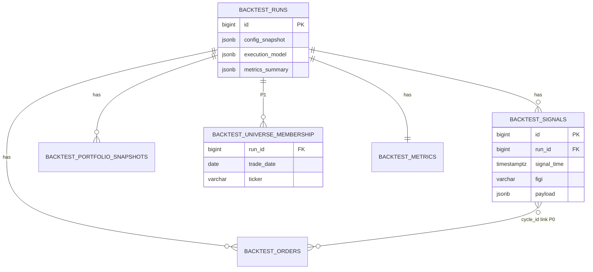
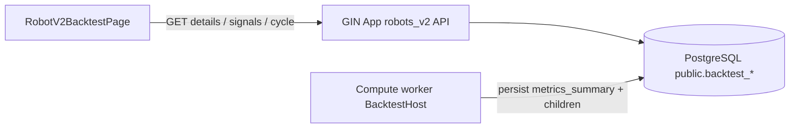
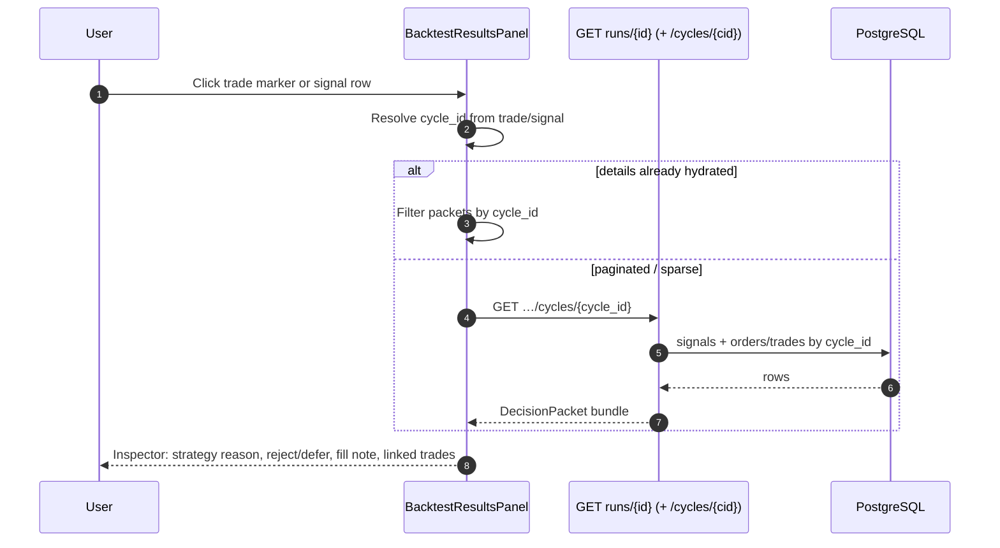
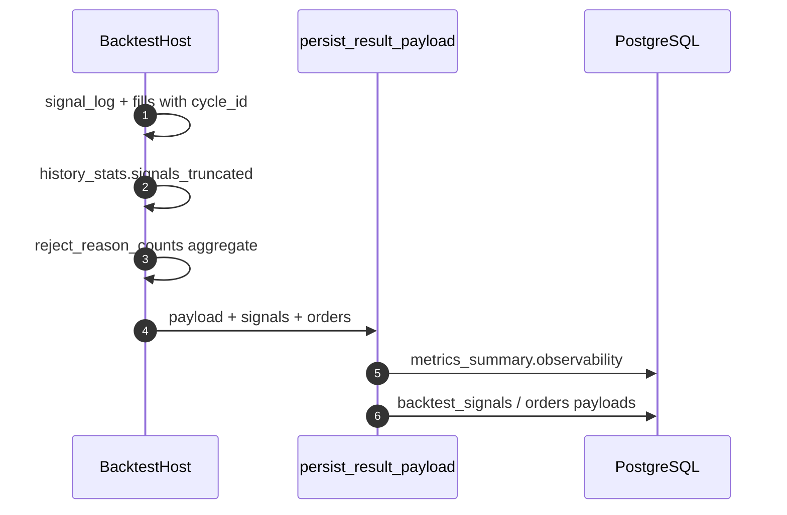

# SPEC-03: Glass-box backtest observability (robots_v2)

**Status:** Approved for design (defaults locked 2026-10-04)  

**Surface:** `/robots/:id/backtest` (`RobotV2BacktestPage`, `BacktestResultsPanel`, `BacktestHistoryCard`)  
**Engine:** V2 sole contour (`BacktestHost` / ARCH-05)  
**Extends (do not duplicate):** `docs/BRD-ARCH-02-unified-backtest-testing-spec.md`, `docs/ARCH-05-gin-compute-backtest-service.md`, `docs/func/robots_greenfield_spec.md`, `docs/backtest-module-as-built.pdf` / `docs/_gen_backtest_pdf.py`

---

## 1. Problem and users

**Problem.** Bot writers cannot see *what happened inside* a backtest run. Today’s results emphasize aggregate KPIs (return, DD, Sharpe, win rate) plus flat trade/signal tables. The competitive wedge for GIN is a **glass box**: process + decisions + rejects + execution honesty must be as visible as the scoreboard.

**Users.**

| Persona | Need |
|---------|------|
| Strategy author (primary) | Why enter / exit / reject / defer; link fill → cycle → risk reason |
| Power user tuning risk | Top reject reasons; daily accept/reject rhythm |
| Operator / founder demo | Credible “we show the engine, not a black box” narrative |

**Success metrics (product).**

- Time-to-answer “why was this trade taken / skipped” ≤ 2 clicks from results.
- ≥ 1 reject-reason insight visible without opening raw JSON.
- Execution model disclaimer always present on completed runs (no silent look-ahead implication).
- P0 ships without new billing/auth and without rewriting fill realism.

---

## 2. Scope (in / out)

### In scope

- Full glass-box **vision** for robots_v2 backtest **results** (and light run-progress honesty), phased **P0 / P1 / P2** inside this one SPEC.
- Screen inventory for redesigned results on existing route `/robots/:id/backtest`.
- API: audit of current `GET …/backtest/runs/{id}` vs additive fields/endpoints.
- Persist: prefer `public.backtest_*` + `metrics_summary` / signal payloads; new tables only where phases cannot work.
- Truncation honesty for `_MAX_SIGNAL_LOG = 25_000`.
- Compare/history interaction rules per phase.
- Reuse live-monitor labels/concepts (`tradeReasonLabels`, `MonitorDecisionsCard` semantics) where sensible — **backtest-focused**.

### Out of scope

- Billing, registration, auth, multi-tenant product changes beyond existing `user_id` run isolation.
- Institutional LOB / TCA / new fill realism engine (observe current next-open model only).
- Migrating V2 storage into orphan schema `backtest.*` (Alembic 0028) as a bulk cutover.
- Wiring live robot monitor to this SPEC (optional label reuse only).
- Optimization / parameter-grid glass box (separate later; same patterns may apply).
- Scalper tick/order-flow backtest (already rejected by V2 API).

### Documented assumptions (agree unless flagged)

| # | Assumption | Spec stance |
|---|------------|-------------|
| A1 | Phased delivery in one SPEC (P0/P1/P2) | **Agree** |
| A2 | P0 = decision inspector + equity timeline w/ trade markers + risk/reject lens + execution honesty | **Agree** |
| A3 | P1 = universe over time, richer holdings, costs/funding strip | **Agree** |
| A4 | P2 = bar scrubber + price overlay, intent↔fill lifecycle, in-product narrative | **Agree** |
| A5 | Prefer existing persisted data first | **Agree**, with **small P0 persist stamps** for trade↔cycle linkage (soft join alone is unreliable because fills are next-bar) |
| A6 | No billing/auth; no fill-model rewrite | **Agree** |
| A7 | Desktop-first ≥1440; mobile must not break | **Agree** |
| A8 | Reuse monitor decision UX patterns; SPEC is backtest-only | **Agree** |

**Disagreement / correction:** `create_db_run` currently writes `execution_model.model = "BAR_CLOSE"` while host stages state *“Fills at next bar open (no look-ahead)”*. Glass-box P0 must expose the **actual** model as **next-open / deferred market fills**, and align stored `execution_model` labeling — observability fix, not a new realism engine.

---

## 3. Functional requirements `[R-n]`

### 3.1 Vision (all phases)

| ID | Phase | Requirement |
|----|-------|-------------|
| `[R-1]` | P0+ | User can inspect any trade or signal and see **why** it entered, exited, was rejected, or deferred, with **cycle linkage**. |
| `[R-2]` | P0+ | Results show a **timeline**: equity curve with **trade markers**; selecting a marker opens the inspector. |
| `[R-3]` | P0+ | **Risk/reject lens**: ranked top reject reasons (and counts) for the run; click drills into filtered signal list. |
| `[R-4]` | P0+ | **Honest execution presentation**: next-open fills, no look-ahead claim; truncation banner if signal log capped. |
| `[R-5]` | P0+ | KPI strip remains (return, DD, Sharpe/Sortino/Calmar, win rate, trades) — glass box **adds** process, does not hide scores. |
| `[R-6]` | P0+ | Stages / history_stats remain available as a compact “run anatomy” strip (warmup, traded bars, skipped schedule, funding if any). |
| `[R-7]` | P0 | Empty/error/partial/cancelled runs stay understandable (same honesty for partial metrics). |
| `[R-8]` | P0 | Labels for strategy/risk reasons reuse `tradeReasonLabels` (+ extend reject codes with RU labels where missing). |
| `[R-9]` | P1 | **Universe membership over time** visible (`universe_by_day` today computed in host, barely exposed). |
| `[R-10]` | P1 | Holdings/snapshots richer than position **count** (per-ticker qty / side / mark at sample points). |
| `[R-11]` | P1 | Costs/funding **breakdown strip** (commission total, funding total, optional tax if present). |
| `[R-12]` | P2 | Bar scrubber + price chart overlay for selected ticker around a decision. |
| `[R-13]` | P2 | Full **intent vs fill** lifecycle (deferred → fill/reject/drop) as first-class UI. |
| `[R-14]` | P2 | In-product **narrative stream** (today `backtest_narrative` / `run_file_logger` are **not** wired to V2 UI). |
| `[R-15]` | P0 | Existing **compare** (metrics + config_diff) remains; deep glass-box compare deferred (see §3.3). |
| `[R-16]` | All | No change to auth/billing; runs remain scoped by `user_id`. |

### 3.2 Decision packet (canonical UI object)

For inspector and tables, normalize each signal/trade into a **decision packet** (API may assemble; not necessarily a new DB row in P0):

| Field | Source today | Notes |
|-------|--------------|-------|
| `cycle_id` | `backtest_signals.payload.cycle_id` | Must be top-level in API |
| `signal_time` / `bar_time` | signals / trades | Fill bar may be **next** bar vs signal bar |
| `ticker` / `figi` | signals / trades | |
| `kind` | entry / exit_* / flatten… | |
| `side` | BUY/SELL/CLOSE | |
| `status` | filled / rejected / deferred | |
| `strategy_reason` | `reason` | `tradeReasonLabel` |
| `reject_reason` | `reject_reason` | risk/exec codes |
| `quantity`, `price` | | |
| `pnl_net` | trades / signal payload | often null on entry |
| `linked_trade_ids` | **gap today** | P0 stamp `cycle_id` on fills |
| `execution_note` | derived | e.g. “fill at next open” |

### 3.3 Compare / history interaction

| Phase | Compare | History |
|-------|---------|---------|
| **P0** | **In scope:** keep `POST /backtest/compare` metrics + `config_diff` in `BacktestHistoryCard`. **Out of scope:** side-by-side inspectors, reject-lens diff, dual equity markers. Selecting a history run still loads full glass-box **for that one run**. | History list unchanged (KPI columns); open run → glass-box results. |
| **P1** | Optional: add reject-reason histogram diff + funding/commission totals to compare payload. | May show “signals truncated” badge on list item if `history_stats.signals_truncated`. |
| **P2** | Optional dual-run timeline / narrative diff — only if product still wants it after P0 usage. | Unchanged unless designer asks. |

---

## 4. Non-functional (latency, tenancy, audit, risk)

| Topic | Requirement |
|-------|-------------|
| Latency | P0 details load: target p95 ≤ 2s for typical runs (≤25k signals, ≤500 snapshots). If payload too large, use paginated signal endpoint (P0 allowed additive). |
| Payload size | Prefer: summary + equity + trades + reject aggregate on details; signals pageable if >5k rows. |
| Tenancy | All GETs remain `user_id`-scoped (`fetch_db_run`). |
| Audit | Signal/order/trade artifacts remain append-on-complete (replace-per-run child tables as today). |
| Honesty | Truncation and execution model must never be silent; prefer banners over footnotes only. |
| Desktop | Primary layout ≥1440px trading dashboard density. |
| Mobile | Stack zones; inspector becomes full-screen sheet; charts readable; no horizontal breakage. |
| Risk product | Observability only — does not change risk engine thresholds. |
| Retention | Same as current `backtest_*` child rows (run lifetime); P1 universe rows cascade with run. |

---

## 5. Data model (tables, keys, retention) `[ref: R-n]`

### 5.1 As-built (reuse first)

| Store | What glass box uses | Phase |
|-------|---------------------|-------|
| `backtest_runs.config_snapshot` | Strategy/risk params for inspector context | P0 |
| `backtest_runs.execution_model` | Honesty banner (after label fix) | P0 |
| `backtest_runs.metrics_summary` | KPIs, `equity_curve`, `trades`, `stages`, `history_stats`, `daily_summary`, `funding_charges_total` | P0 |
| `backtest_signals` | Decision log (`reason`, `reject_reason`, `kind`, `status`, `cycle_id` in JSON payload) | P0 |
| `backtest_orders` | Fill-ish rows (today mostly mirrored trades) | P0/P2 |
| `backtest_portfolio_snapshots` | Equity/cash; `positions` today = **count** | P0 chart / P1 holdings |
| `backtest_metrics` | Flat KPI row | P0 |
| Host `universe_by_day` | Computed, **not persisted** | → P1 |
| `backtest_decisions` / `backtest_risk_events` (0031) | Used by legacy recorder path; **not** V2 host signal_log | Do not require for V2 P0 |
| Schema `backtest.*` (0028) | Orphan richer DDL (`backtest_daily_universe`, signal→order FK) | **Do not cut over**; borrow ideas only |

### 5.2 P0 persist deltas (minimal)

No new tables required for P0 if the following stamps/fields are added to existing JSON payloads:

1. **Trade/order `cycle_id`** `[ref: R-1]`  
   - When recording fills (including deferred next-open fills), stamp originating `cycle_id` (and optionally `signal_time` of intent).  
   - Persist into `backtest_orders.payload.cycle_id` and each trade object inside `metrics_summary.trades[]`.  
   - **Why new stamp:** soft join by `(ticker, bar_time)` fails for next-open fills (fill time ≠ signal time).

2. **Flatten on read** `[ref: R-1]`  
   - `load_child_artifacts`: expose `cycle_id`, `reject_reason`, `kind`, `status` at top level (not only nested `payload`).

3. **Observability summary block** in `metrics_summary` (or top-level details) `[ref: R-3][R-4]`  
   ```json
   "observability": {
     "execution_model": {
       "code": "NEXT_BAR_OPEN",
       "label": "Fills at next bar open",
       "look_ahead": false
     },
     "signals_logged": 1234,
     "signals_truncated": false,
     "signal_log_cap": 25000,
     "reject_reason_counts": [{"code": "RISK_BLOCK", "count": 40}, ...],
     "status_counts": {"filled": 10, "rejected": 50, "deferred": 8}
   }
   ```  
   - `reject_reason_counts` may be computed at persist time from `signal_events` (preferred) or lazily on GET from `backtest_signals`.  
   - Align `execution_model` column write to `NEXT_BAR_OPEN` (or dual field `{signal_on: BAR_CLOSE, fill_on: NEXT_BAR_OPEN}`).

4. **Optional stable `signal_id`** (UUID per signal_log row) in payload — nice for P0 inspector deep-link; not mandatory if `cycle_id + ticker + signal_time + kind` is unique enough.

### 5.3 P1 persist

| Artifact | Recommendation | Retention / keys | `[ref]` |
|----------|----------------|------------------|---------|
| Universe by day | **New** `backtest_universe_membership` in **public** schema (inspired by `backtest.backtest_daily_universe`, not a schema move): `(run_id, trade_date, ticker)` PK/unique; optional `source`, `filter_result`, `reject_reason` JSON | Cascade delete with run; index `(run_id, trade_date)` | `[R-9]` |
| Alt (lighter) | Store compact `universe_by_day` map in `metrics_summary` if cardinality small; prefer table if daily × tickers large | Same retention as run | `[R-9]` |
| Holdings | Enrich `backtest_portfolio_snapshots.positions_payload` with `{positions: [{ticker, qty, side, avg_entry, mark}]}` (keep sampling ≤500) | Existing table | `[R-10]` |
| Costs | Add `fee_summary` into `metrics_summary`: `{commission_total, funding_total, funding_events, tax_total?}` from host aggregates | Existing JSON | `[R-11]` |

### 5.4 P2 persist

| Artifact | Recommendation | `[ref]` |
|----------|----------------|---------|
| Intent lifecycle | Persist deferred intent events (or status transitions) with `cycle_id`, `intent_id`, `status` timeline — extend `backtest_orders` statuses beyond always-`filled`, or small `backtest_execution_events` append table | `[R-13]` |
| Narrative | Persist structured narrative steps (`section`, `step`, `text`, `ts`) to `metrics_summary.narrative[]` **or** child table; wire host to `backtest_narrative` equivalents for V2 — **not** filesystem-only | `[R-14]` |
| Price overlay | **No** full candle dump per run; P2 API fetches candles by ticker+window from existing market store at read time | `[R-12]` |

### 5.5 ER (target, conceptual)



---

## 6. API and WebSocket contracts `[ref: R-n]`

WebSocket: **N/A for P0–P1 results** (poll status already exists). P2 narrative may remain REST snapshot unless streaming progress is desired later.

### 6.1 Existing endpoints (as-built)

| Method / path | Today returns | Gap vs glass box |
|---------------|---------------|------------------|
| `POST /api/v2/robots/backtest` | 202 + run_id | unchanged |
| `GET /api/v2/robots/backtest/runs` | list KPIs | P1 optional truncation badge fields |
| `GET /api/v2/robots/backtest/runs/{id}/status` | progress phases | optional short honesty line while running (P0 nice-to-have) |
| `GET /api/v2/robots/backtest/runs/{id}` | `RobotV2BacktestDetailsResponse`: status + KPIs + `result_payload` + `signals` + `orders` + `portfolio_snapshots` + `daily_summary` | Missing flattened `cycle_id`, reject aggregates, execution honesty object, trade↔cycle, universe |
| `POST /api/v2/robots/backtest/compare` | metrics + config_diff | P0 keep; glass deep-compare out |
| `POST …/cancel` | cancel flag | unchanged |

`result_payload` ≈ `metrics_summary` (equity_curve, trades, stages, history_stats, daily_summary, funding_charges_total, KPIs).

### 6.2 P0 — extend details (preferred) + optional page

#### REST: get run details (extended)

| Field | Value |
|--------|--------|
| BRD/SPEC ref | `[ref: R-1][R-2][R-3][R-4]` |
| Method / path | `GET /api/v2/robots/backtest/runs/{run_id}` |
| Auth | existing session / bearer |
| Idempotency | n/a (read) |
| Request | path `run_id`; optional query `signals_limit`, `signals_offset`, `signals_status`, `reject_reason` |
| Response `200` | existing fields **plus**: |

```json
{
  "observability": {
    "execution_model": {
      "code": "NEXT_BAR_OPEN",
      "label": "Fills at next bar open",
      "look_ahead": false
    },
    "signals_logged": 0,
    "signals_truncated": false,
    "signal_log_cap": 25000,
    "reject_reason_counts": [{"code": "string", "count": 0}],
    "status_counts": {"filled": 0, "rejected": 0, "deferred": 0}
  },
  "signals": [{
    "id": 0,
    "signal_time": "ISO-8601",
    "figi": "SBER",
    "signal_type": "BUY",
    "price": 0,
    "was_executed": 0,
    "reason": "momentum_breakout",
    "reject_reason": "RISK_BLOCK",
    "kind": "entry",
    "status": "rejected",
    "quantity": 1,
    "cycle_id": "uuid",
    "linked_trade_ids": [1]
  }],
  "result_payload": {
    "trades": [{
      "id": 1,
      "figi": "SBER",
      "side": "BUY",
      "bar_time": "ISO-8601",
      "cycle_id": "uuid",
      "reason": "momentum_breakout",
      "kind": "entry"
    }],
    "equity_curve": [{"time": "ISO-8601", "equity": 0}],
    "stages": ["…"],
    "history_stats": {"signals_truncated": 0}
  }
}
```

| Errors | `401`, `403`, `404` as today |
| Rate limit | existing user limits |

If `signals` payload is large, details may return `signals: []` + `signals_total` and require the page endpoint below.

#### REST: paginated signals (P0 if needed)

| Field | Value |
|--------|--------|
| SPEC ref | `[ref: R-1][R-3]` |
| Method / path | `GET /api/v2/robots/backtest/runs/{run_id}/signals` |
| Auth | same |
| Query | `limit` (default 200, max 1000), `offset`, `status`, `reject_reason`, `ticker`, `cycle_id` |
| Response `200` | `{ items: DecisionPacket[], total: int, truncated_run: bool }` |

#### REST: decision inspector bundle (optional sugar)

| Field | Value |
|--------|--------|
| SPEC ref | `[ref: R-1]` |
| Method / path | `GET /api/v2/robots/backtest/runs/{run_id}/cycles/{cycle_id}` |
| Response `200` | `{ cycle_id, signals: [], trades: [], orders: [], config_risk_excerpt: {} }` |
| Errors | `404` if cycle unknown |

P0 may implement inspector **client-side** from details if payloads fit; server cycle endpoint recommended when signals are paginated.

### 6.3 P1 endpoints

| Method / path | Purpose | `[ref]` |
|---------------|---------|---------|
| `GET …/runs/{id}/universe?from=&to=` | Daily membership rows or sparse diff (adds/drops) | `[R-9]` |
| Details `portfolio_snapshots[].positions` | Array of holdings | `[R-10]` |
| Details `fee_summary` | Costs strip | `[R-11]` |
| Compare (optional) | `reject_reason_counts` + fee fields on both sides | `[R-15]` P1 |

### 6.4 P2 endpoints

| Method / path | Purpose | `[ref]` |
|---------------|---------|---------|
| `GET …/runs/{id}/execution-events?cycle_id=` | Intent→fill lifecycle | `[R-13]` |
| `GET …/runs/{id}/narrative` | Structured narrative steps | `[R-14]` |
| `GET …/runs/{id}/price-window?ticker=&around=&bars=` | Candles for overlay (read from market store, not run blob) | `[R-12]` |

### 6.5 Versioning

Additive fields on existing v2 routes; no URI bump. Deprecate misleading `execution_model.model=BAR_CLOSE` by replacing with honest code (document in changelog).

---

## 7. Sequence / C4 (Mermaid)

### 7.1 C4 — containers (glass box read path)



### 7.2 Sequence — decision inspector `[ref: R-1]`



### 7.3 Sequence — persist observability (P0 write path)



---

## 8. Screen inventory (page, zones, data needed — no pixels)

**Page:** `RobotV2BacktestPage` — keep launch/config + history; **redesign results** (`BacktestResultsPanel`) into glass-box composition. Desktop-first ≥1440; mobile stacks.

### 8.1 Zones (results, completed run)

| Zone | Name | Job | Data needed | Phase |
|------|------|-----|-------------|-------|
| **A** | Run identity + honesty banner | Run #, period, status, **execution model**, **truncation** warning | `run_id`, dates, `observability.execution_model`, `signals_truncated` | P0 |
| **B** | KPI strip | Scoreboard | return, DD, Sharpe/Sortino/Calmar, win rate, trades, final equity | P0 |
| **C** | Run anatomy strip | Process facts | `stages` / `history_stats` (warmup, traded bars, skipped, funding events) | P0 |
| **D** | Timeline | Equity + **trade markers**; click → inspector | `equity_curve`, trades with times/sides/pnl | P0 |
| **E** | Risk / reject lens | Top reject reasons + counts; click → filter | `reject_reason_counts`, status_counts | P0 |
| **F** | Decision inspector (drawer/panel) | Why enter/exit/reject/defer; cycle linkage; linked fills | DecisionPacket bundle / cycle endpoint | P0 |
| **G** | Decisions table | Filterable signals (status, reject, ticker); row opens inspector | `signals` (+ pagination) | P0 |
| **H** | Trades table | Executed fills; row opens inspector | `trades` with `cycle_id` | P0 |
| **I** | Daily rhythm table | Per-day accept/reject/defer/trades | `daily_summary` | P0 (exists; keep) |
| **J** | History + compare rail | List runs; compare KPIs/config only | list + compare APIs | P0 (existing; no glass deep-compare) |
| **K** | Universe timeline | Membership / adds-drops by day | universe API | P1 |
| **L** | Holdings strip / snapshot detail | Positions at scrubbed time | rich snapshots | P1 |
| **M** | Costs / funding strip | Commission + funding breakdown | `fee_summary` | P1 |
| **N** | Price overlay + bar scrubber | Context around decision | price-window API | P2 |
| **O** | Intent↔fill lifecycle | Deferred → filled/dropped | execution-events | P2 |
| **P** | Narrative stream | Human-readable run story | narrative API | P2 |

### 8.2 States

| State | Zones behavior |
|-------|----------------|
| Loading | Skeletons for B/D/E; A shows run_id if known |
| Running / queued | Progress from status endpoint; honesty line that results finalize after complete; no fake trades |
| Empty trades but signals | D empty markers; E/G explain rejects dominated |
| Truncated signals | Persistent banner in A; E counts labeled “from logged window” |
| Cancelled / partial | Banner; KPIs from partial interval; glass box over available artifacts only |
| Error | Inline error + retry; history still usable |
| Mobile | A→B→D→E→F(sheet); tables G/H/I collapsible |

### 8.3 Interactions (inventory only)

- Marker / row / reject-chip → open inspector `[R-1][R-2][R-3]`
- Inspector shows strategy reason label + raw code, reject code, cycle id, fill timing note
- Filters on G sync from E
- Compare stays on history card; does not replace glass box

---

## 9. Acceptance criteria (backend / UI / e2e)

### 9.1 P0 — Backend

- [ ] `GET …/runs/{id}` includes `observability` with honest `NEXT_BAR_OPEN` (or equivalent), truncation flags, reject/status counts `[R-3][R-4]`
- [ ] Signals expose top-level `cycle_id`, `reject_reason`, `kind`, `status` `[R-1]`
- [ ] Trades/orders persist `cycle_id` for fills including deferred next-open path `[R-1]`
- [ ] Cycle inspector endpoint **or** documented client join works for sample runs with rejects + fills
- [ ] `execution_model` column no longer claims bare `BAR_CLOSE` as the fill model without next-open clarification
- [ ] Paginated `/signals` available if details would exceed agreed size threshold
- [ ] Compare endpoint behavior unchanged for metrics/config `[R-15]`
- [ ] Unit/integration: host truncation sets `signals_truncated`; reject aggregate matches signal rows

### 9.2 P0 — UI

- [ ] Zones A–I present on desktop results; mobile stacks without overflow `[R-2][R-5][R-7]`
- [ ] Timeline markers open inspector with reason + reject/defer + cycle link `[R-1][R-2]`
- [ ] Reject lens shows top reasons; chip filters decisions table `[R-3]`
- [ ] Truncation + execution honesty always visible when applicable `[R-4]`
- [ ] `tradeReasonLabels` used; unknown codes fall back to raw `[R-8]`
- [ ] History compare still works; does not claim glass-box parity `[R-15]`

### 9.3 P0 — e2e (minimum)

- [ ] Start (or open completed) V2 backtest → results show KPI + honesty banner
- [ ] Click a trade marker → inspector shows cycle-linked signal reason
- [ ] Run with known risk rejects → reject lens non-empty and drill-down lists matching rows
- [ ] Synthetic/truncated fixture → truncation banner visible
- [ ] Compare two runs → metrics diff still renders

### 9.4 P1 / P2 (summary gates)

- **P1:** universe zone K populated from persisted membership; holdings L show tickers not only counts; costs M matches host totals `[R-9][R-10][R-11]`
- **P2:** scrubber+overlay N; lifecycle O; narrative P non-empty for new runs after wiring `[R-12][R-13][R-14]`

---

## 10. Open questions — RESOLVED (2026-10-04)

| # | Topic | Decision |
|---|-------|----------|
| 1 | Reject-lens cardinality | Top **8** reject reasons |
| 2 | Signals pagination | Force paginated `/signals` when **>5k** rows |
| 3 | Universe storage (P1) | **Table** `public.backtest_universe_membership` |
| 4 | Narrative voice (P2) | **RU end-user** prose |
| 5 | Bybit funding | **P0 anatomy** (events if present) + full costs strip in **P1** |
| 6 | Schema 0028 | **No V2 cutover** to `backtest.*` (borrow DDL ideas only) |

---

## 11. Handoff

| Role | Consumes |
|------|----------|
| **Product designer** | §8 zones/states/interactions; §3 compare rules; honesty/truncation UX; reuse monitor decision semantics |
| **Backend** | §5 persist deltas; §6 API extensions; §7 write/read sequences; align `execution_model` labeling; cycle_id on fills |
| **UI engineer** | §6 contracts + §8 inventory after UX approval; wire inspector + timeline + reject lens; keep launch/history shells |
| **Orchestrator** | Route designer next for UX spec; backend can start P0 persist/API gaps in parallel (§10 defaults locked) |

**Locked defaults (§10):** top 8 reject reasons; paginate signals at >5k; P1 table `backtest_universe_membership`; narrative RU end-user; funding in P0 anatomy if present + full strip in P1; no migrate to schema `backtest.*`.

**Orphan 0028 note:** richer FKs (`signal_id` on orders) are desirable long-term; implement as **additive columns/payload fields on public.backtest_orders** in P2 rather than switching schemas mid-flight.
