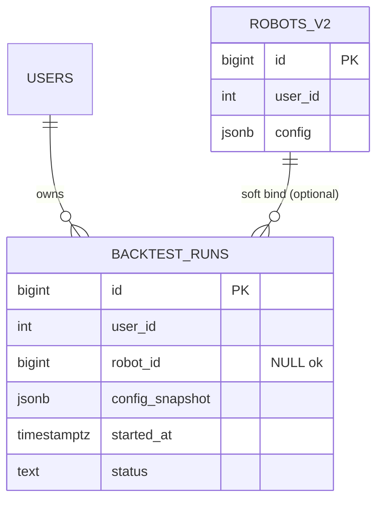
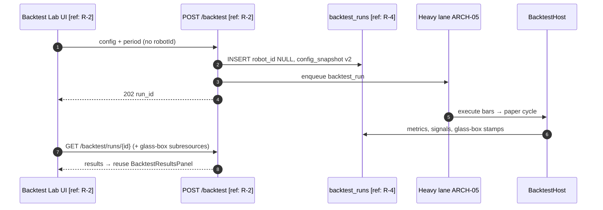
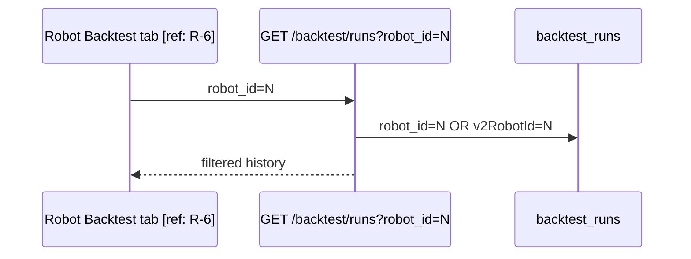
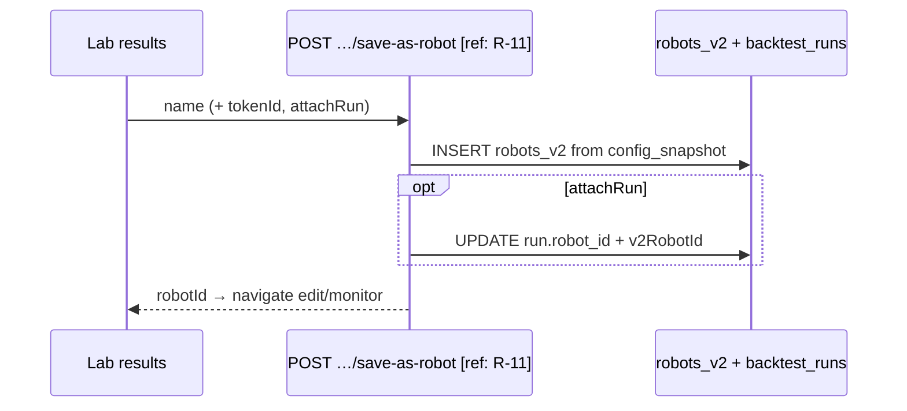

# SPEC-05: Backtest Lab — runs without hard robot binding

**Status:** Approved for design (defaults locked 2026-10-05)  
**Surfaces:** new Lab hub (P0) + existing `/robots/:id/backtest` (kept as filtered “runs of this config”)  
**Engine / observability:** Reuse SPEC-03 / UX-05 glass-box results — **do not redesign** decision inspector, reject lens, scrubber, etc.  
**Extends:** `docs/SPEC-03-glass-box-backtest-observability.md`, `docs/ui/UX-05-glass-box-backtest-results.md`, `docs/BRD-ARCH-02-unified-backtest-testing-spec.md`, `docs/ARCH-05-gin-compute-backtest-service.md`

---

## 1. Problem and users

**Problem.** Competitive glass-box backtest exists, but the product IA forces users through a **robot** (`/robots/:id/backtest`). Soft bind already exists in persistence (`robot_id` nullable in API/schema intent, `config_snapshot` + `v2RobotId`), yet UX and some DB constraints still treat runs as robot-owned.

**Vision.** Backtest is a **first-class entity** with a **Lab** hub: start from a config snapshot (optionally attach a robot), browse all user runs, open glass-box results. Robot page keeps a **filtered** view: “runs of this robot / config.” Optional later: **save as robot** after a good run.

**Users.**

| Persona | Need |
|---------|------|
| Strategy author | Iterate configs without creating/cluttering robots |
| Robot operator | Still see history for a specific robot on its Backtest tab |
| Power user (P1+) | Promote a winning Lab run into a durable robot |

**Success metrics (product).**

- P0: user can start and open a completed glass-box run with `robotId` omitted.
- P0: Lab lists **all** user v2 runs; robot tab lists only that robot’s runs.
- Existing robot backtest tab and SPEC-03 results remain functional (no observability rewrite).
- No billing/auth product changes.

---

## 2. Scope (in / out)

### Phased scope

| Phase | In scope |
|-------|----------|
| **P0** | Lab route + list of user runs; start backtest from config snapshot **without** requiring an existing robot; optional `robotId` attach; robot page = filter; reuse glass-box results UI; migration so orphan runs persist reliably |
| **P1** | «Сохранить как робота» from a successful Lab run (create `robots_v2` from `config_snapshot`, optional link-back) |
| **P2** | Share/compare across robots (cross-robot compare UX, tagging, richer Lab filters) — beyond today’s single-pair compare |

### Out of scope

- Redesigning glass-box observability (SPEC-03 / UX-05).
- Billing, auth, multi-tenant org features beyond existing `user_id` isolation.
- Migrating storage into orphan schema `backtest.*` (Alembic 0028) as a cutover.
- Parameter-grid / optimizer Lab (may attach later).
- Public share links / multi-user collaboration (P2+ product decision).

### Documented assumptions (agree unless flagged)

| # | Assumption | Spec stance |
|---|------------|-------------|
| A1 | Phased: P0 Lab list + run without robot OR optional `robot_id`; P1 create robot from run; P2 share/compare across robots | **Agree** |
| A2 | Reuse glass-box results UI — don’t redesign observability | **Agree** |
| A3 | Desktop-first ≥1440; mobile must not break | **Agree** |
| A4 | Keep existing robot backtest tab working (filter by robot) | **Agree** |

**Correction (as-built):** `RobotV2BacktestRequest.robot_id` is already `Optional`. `create_db_run` retries insert with `robot_id=None`. However Alembic `0027` created `backtest_runs.robot_id BIGINT NOT NULL`; `0062` dropped legacy FK but **did not** document `NULL` allowance. P0 **must** ensure column is nullable (migration if still `NOT NULL`) so orphan runs are first-class, not a failed fallback.

**Correction (IA):** Navbar today only has «Роботы». Lab needs an explicit entry (fleet chrome and/or nav) — see §8.

---

## 3. Functional requirements `[R-n]`

### 3.1 P0 — Lab + soft bind

| ID | Requirement |
|----|-------------|
| `[R-1]` | User can open a **Backtest Lab** hub (not under `/robots/:id/…`) listing their v2 runs. |
| `[R-2]` | User can **start** a backtest with a full TradingRobotConfigV4 snapshot + period + capital **without** `robotId`. |
| `[R-3]` | User may optionally pass `robotId` to soft-bind the run; list on robot page includes it via `robot_id` **or** `config_snapshot.v2RobotId` (existing filter semantics). |
| `[R-4]` | Orphan runs persist with `robot_id IS NULL`; `config_snapshot.engine_version = "v2"`; `v2RobotId` may be null/omitted when unbound. |
| `[R-5]` | Lab run detail / results reuse the same glass-box components and APIs as SPEC-03 (`GET …/backtest/runs/{id}`, signals, cycles, universe, execution-events, narrative, price-window). |
| `[R-6]` | `/robots/:id/backtest` remains: launch defaults from that robot’s config; history filtered to that robot; deep-link to results for those runs. |
| `[R-7]` | Compare (`POST /backtest/compare`) works for any two runs owned by the user, including orphan↔orphan and orphan↔robot (P0 keep metrics+config_diff; no new glass-box dual inspector). |
| `[R-8]` | Tenancy: all Lab list/start/detail scoped by `user_id`; no cross-user access. |
| `[R-9]` | No billing/auth changes. |
| `[R-10]` | Mobile: Lab list + results stack; no hard regression vs UX-05 mobile rules. |

### 3.2 P1 — Save as robot

| ID | Requirement |
|----|-------------|
| `[R-11]` | From a successful Lab run, user can create a new `robots_v2` row from `config_snapshot` (name prompt, token optional per mode). |
| `[R-12]` | After create, optionally set run’s `robot_id` / `v2RobotId` to the new robot (attach history). |
| `[R-13]` | Navigate to wizard/monitor of the new robot; do not auto-start live. |

### 3.3 P2 — Cross-robot Lab power

| ID | Requirement |
|----|-------------|
| `[R-14]` | Lab filters: by robot (incl. «без робота»), status, date range, archetype/board. |
| `[R-15]` | Cross-robot compare entry from Lab (reuse compare API; UX may allow picking any two listed runs). |
| `[R-16]` | Optional tags / display title on run — **deferred P2** (storage: metadata column vs `config_snapshot` TBD then). |

---

## 4. Non-functional

| Topic | Requirement |
|-------|-------------|
| Latency | Lab list P0: same order of magnitude as current `GET /backtest/runs` (limit ≤100). |
| Tenancy | `user_id` on every run; list/detail/compare enforce owner `[ref: R-8]`. |
| Concurrency | Existing compute queue / ARCH-05 heavy lane unchanged; orphan runs use same enqueue path. |
| Retention | Unchanged backtest_runs retention policy (no new purge rules in P0). |
| Audit / logging | Correlate Lab starts with `run_id` + `user_id`; log `robot_id` null explicitly. |
| Risk | Starting Lab backtest must not place live orders (backtest-only path). |

**Conflicts checklist (multi-tenant):**

- [x] Tenant key `user_id` on `backtest_runs` `[ref: R-8]`
- [x] Token scope only when universe/live-data preview needs token — Lab start may pass optional `tokenId` as today
- [x] Rate-limit / enqueue quotas unchanged — **Resolved:** same limits as robot backtest (no separate Lab quota)
- [x] Compare authZ: both runs must belong to caller

---

## 5. Data model `[ref: R-3, R-4, R-12]`

### 5.1 `public.backtest_runs` (as-built + P0 fix)

| Column | P0 requirement | Notes |
|--------|----------------|-------|
| `id` | PK | run id |
| `user_id` | NOT NULL | tenant |
| `robot_id` | **NULL allowed** | soft bind; migration if still NOT NULL |
| `config_snapshot` | jsonb | full v4 config + `engine_version: "v2"`; `v2RobotId` set when bound |
| `initial_capital`, period, status, metrics… | unchanged | SPEC-03 fields remain |

**Indexes (keep / ensure):**

- `(user_id, started_at DESC)` for Lab list — **add if missing** `[ref: R-1]`
- `(robot_id, started_at DESC)` existing for robot filter
- Partial optional: `(user_id, started_at DESC) WHERE robot_id IS NULL` — nice-to-have, not required P0

### 5.2 Orphan run definition

A run is **orphan / Lab-native** when `robot_id IS NULL` and (`v2RobotId` absent or null). Soft-bound: `robot_id = N` and/or `v2RobotId = N`.

### 5.3 P1 attach

| Change | Notes |
|--------|--------|
| `UPDATE backtest_runs SET robot_id = :new_id` | After save-as-robot |
| Patch `config_snapshot.v2RobotId` | Keep list filter consistent |

### 5.4 ER (conceptual)



**Migration need (P0):**  
`ALTER TABLE backtest_runs ALTER COLUMN robot_id DROP NOT NULL;` (guarded / IF applicable). Confirm in target DB; ship Alembic revision. No FK re-add to `robots_v2` (soft bind by design). **Resolved:** on robot delete, **nullify** `robot_id` (and clear `config_snapshot.v2RobotId` when present); keep run rows as Lab orphans — do not cascade-wipe history.

---

## 6. API and WebSocket contracts `[ref: R-1…R-7, R-11]`

Base prefix remains `/api/v2/robots` for backtest resources (existing). Lab is primarily a **UI IA** change; APIs stay run-centric. Optional aliases documented below.

### 6.1 Start run — existing `POST /api/v2/robots/backtest`

| Field | Value |
|--------|--------|
| Auth | Current user |
| Idempotency | No new key in P0 (enqueue idempotency remains `backtest_run:{id}`) |
| Request | Existing `RobotV2BacktestRequest` |

| Body field | Required | Notes |
|------------|----------|-------|
| `config` | yes | TradingRobotConfigV4 |
| `from_date` / `to_date` | yes | |
| `initial_capital` | optional | defaults from config.risk.capital |
| `robotId` | **optional** | omit for Lab-native `[R-2]` |
| `tokenId` | optional | universe/broker-dependent helpers as today |

**P0 backend hardening:**

- Accept `robotId: null` without resolving a robot row.
- Persist `robot_id` NULL without fallback failure.
- Do not inject fake `robot_id=0` into DB (host may use `0` in-process only).

**Response:** `202` async accepted `{ run_id }` or existing details — unchanged.

### 6.2 List runs — `GET /api/v2/robots/backtest/runs`

| Query | P0 |
|-------|-----|
| `robot_id` omitted | **Lab default:** all user v2 runs `[R-1]` |
| `robot_id=N` | Robot tab filter (existing OR on `v2RobotId`) `[R-6]` |
| `limit` | 1…100 (existing) |

**Additive list item fields (P0 recommended):**

| Field | Type | Purpose |
|-------|------|---------|
| `robot_id` | number \| null | soft bind |
| `bound` | boolean | derived `robot_id != null` |
| `config_label` | string \| null | archetype / strategy name for Lab table |
| `display_name` | string \| null | **P2** / optional P0 from snapshot |

### 6.3 Detail / glass-box — unchanged paths

- `GET /backtest/runs/{run_id}`
- `GET /backtest/runs/{run_id}/status`
- `GET /backtest/runs/{run_id}/signals|cycles|universe|execution-events|narrative|price-window`
- `POST /backtest/compare`
- `POST /backtest/runs/{run_id}/cancel`

All must authorize by `user_id` even when `robot_id` is null `[R-5]` `[R-8]`.

### 6.4 Optional Lab alias (P0 nice-to-have, not required)

| Method / path | Behavior |
|---------------|----------|
| `GET /api/v2/backtest/lab/runs` | Alias of list without robot filter |
| `POST /api/v2/backtest/lab/runs` | Alias of start with `robotId` default null |

Prefer **reusing** existing routes in P0 to avoid dual clients; aliases only if router mounting under `/robots` confuses OpenAPI.

### 6.5 P1 — Create robot from run

| Field | Value |
|--------|--------|
| Method / path | `POST /api/v2/robots/backtest/runs/{run_id}/save-as-robot` |
| Auth | Owner of run |
| Request | `{ "name": string, "tokenId"?: number, "attachRun"?: boolean }` |
| Response `201` | `{ "robotId": number, "runId": number }` |
| Errors | `404` run; `422` invalid snapshot; `409` if attach conflicts |

### 6.6 WebSocket

None new. Progress polling stays on status GET / existing compute progress.

### 6.7 Example — Lab start

```json
// POST /api/v2/robots/backtest
{
  "config": { "core": { "mode": "paper" }, "strategy": { "archetype": "…" }, "risk": { "capital": 1000000 } },
  "from_date": "2024-01-01T00:00:00Z",
  "to_date": "2024-06-01T00:00:00Z",
  "initial_capital": 1000000
}

// 202
{ "run_id": 901, "status": "queued", "message": "…" }
```

---

## 7. Sequence / C4

### 7.1 Lab start (orphan)



### 7.2 Robot tab filter



### 7.3 P1 save-as-robot



---

## 8. Screen inventory (names / zones only — no pixels) `[ref: R-1, R-5, R-6, R-10]`

### 8.1 Information architecture (P0)

| Route | Purpose |
|-------|---------|
| `/robots/backtest` | **Lab hub** — list + start + open results `[R-1]` (**Resolved** path) |
| `/robots/backtest?run={runId}` | Same Lab page with selected run results embedded (**Resolved** query; alias `?runId=` acceptable if already wired) |
| `/robots/:id/backtest` | Robot-scoped launch + filtered history `[R-6]` |

**Nav entry:** Fleet chrome / robots section link «Бэктест» or «Lab» next to fleet actions; optional Navbar later. Robot `RobotPageChrome` keeps «Бэктест» → robot-scoped tab.

### 8.2 Lab hub page zones

| Zone | Job | Data |
|------|-----|------|
| L0 Chrome | Title «Backtest Lab» / «Лаборатория бэктестов», link back to Флот | — |
| L1 Launch | Visual form (as robot wizard) · robot picker · previous run snapshot; period; capital; Start | `POST /backtest` |
| L2 Runs table | All user runs: started, status, period, capital, KPIs, robot bind badge («Робот #N» / «Без робота») | `GET /backtest/runs` |
| L3 Compare | Pick two rows → existing compare | `POST /backtest/compare` |
| L4 Results | When run selected: **embed** `BacktestResultsPanel` (+ progress stage card) per UX-05 | detail + subresources |

**Empty:** no runs — CTA to configure first Lab run.  
**Error:** enqueue 503 / validation 422 inline on L1.  
**Loading:** table skeleton; results skeleton per UX-05.

### 8.3 Robot backtest tab (unchanged job, clarified)

| Zone | Job |
|------|-----|
| Launch toolbar | Prefill from robot config (as today) |
| Progress | RobotStageCard |
| Results | Glass-box panel (SPEC-03) |
| History | Filtered list `robot_id=N` |
| Escape hatch | Link «Все прогоны в Lab» → Lab hub |

### 8.4 P1 zones

| Zone | Job |
|------|-----|
| Results action | Button «Сохранить как робота» |
| Modal | Name, optional token, attach history checkbox |
| Success | Toast + navigate to `/robots/edit/:id` |

### 8.5 P2 zones

| Zone | Job |
|------|-----|
| Filters | Robot / unbound / status / dates / archetype |
| Cross-compare | Multi-select from Lab table |

---

## 9. Acceptance criteria

### Backend P0

- [ ] `backtest_runs.robot_id` nullable in DB (migration applied).
- [ ] `POST /backtest` without `robotId` creates run with `robot_id` NULL and returns `202`/`run_id`.
- [ ] `GET /backtest/runs` without filter returns orphan + bound runs for user only.
- [ ] `GET /backtest/runs?robot_id=N` excludes unrelated orphans.
- [ ] Detail + glass-box subresources work for orphan runs (same authZ).
- [ ] Compare works across orphan/bound pairs owned by user.
- [ ] No auth/billing changes.

### UI P0

- [ ] Lab hub reachable without opening a robot.
- [ ] Can start unbound run and open glass-box results (reuse panel).
- [ ] Robot tab still launches/filters for that robot.
- [ ] Bind badge visible in Lab list.
- [ ] Desktop-first; mobile stack does not clip primary CTA/table.

### P1

- [ ] Save-as-robot creates robot from snapshot; optional attach updates `robot_id`.
- [ ] Does not auto-start session.

### E2E

- [ ] Orphan run survives API restart; appears in Lab; absent from unrelated robot tab.
- [ ] Soft-bound run appears in both Lab and that robot’s tab.

---

## 10. Open questions — RESOLVED (defaults locked 2026-10-05)

| Topic | Resolution |
|-------|------------|
| Lab path | **`/robots/backtest`** under robots layout |
| Results URL | **Same page** with query **`?run={runId}`** (alias `?runId=` OK if already wired) — not a separate `/runs/:runId` route in P0 |
| Robot delete | **Nullify** soft bind (`robot_id` + `v2RobotId`); keep run rows as orphans |
| P0 Lab config authoring | **Simplified:** start from snapshot / paste JSON (+ optional from-robot / last-used). **Full wizard = P1** |
| Lab enqueue quota | **Same** limits as robot backtest |
| P2 tags / display titles | **Deferred** to P2 |

---

## 11. Handoff

**Designer gets:** §8 IA + Lab zones L0–L4 (`/robots/backtest?run=`), robot-tab escape hatch, P1 modal inventory, empty/error; **reuse UX-05 for results** (no new glass-box mock).  
**Backend gets:** §5 migration nullability + delete→nullify bind, §6 start/list hardening, P1 save-as-robot contract, sequences §7.  
**UI gets:** contracts §6 + approved Lab UX; wire Lab to existing `BacktestResultsPanel` / services; keep robot page filter.

✅ SPEC ready: docs/SPEC-05-backtest-lab-decoupled.md

**Designer gets**: screen inventory (§8), user flows, empty/error states  
**Backend gets**: data model (§5), API/WS (§6), sequences (§7)  
**UI gets**: contracts (§6) + will wait for approved UX spec

Open questions: none for P0 (see §10 RESOLVED).
