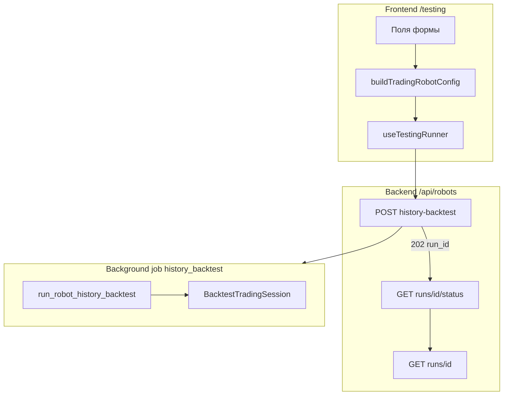
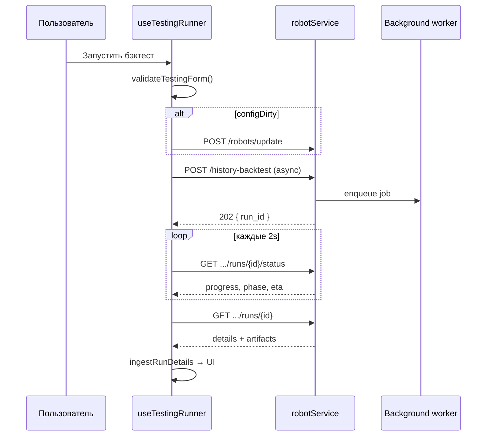

# Полное описание страницы `/testing`

**Версия:** 1.0 (as-built)  
**Дата:** 2026-06-19  
**Аудитория:** разработчики, аналитики

Документ описывает вкладку `/testing` «в мельчайших подробностях»: каждое поле UI, все уровни валидации, маппинг в JSON-конфиг и REST-запросы, поведение бэкенда.

**См. также:** [TESTING-BACKTEST-REFERENCE.md](TESTING-BACKTEST-REFERENCE.md) — операционный справочник по фазам симуляции, метрикам и карте файлов.

---

## Содержание

1. [Назначение и архитектура](#1-назначение-и-архитектура)
2. [Маршрут и композиция UI](#2-маршрут-и-композиция-ui)
3. [Слои валидации](#3-слои-валидации)
4. [Каталог полей формы](#4-каталог-полей-формы)
5. [Параметры стратегий](#5-параметры-стратегий)
6. [Pipeline-фильтры (MOEX)](#6-pipeline-фильтры-moex)
7. [Сборка `config` и тела запроса](#7-сборка-config-и-тела-запроса)
8. [REST API: основной контур бэктеста](#8-rest-api-основной-контур-бэктеста)
9. [REST API: вспомогательные вызовы UI](#9-rest-api-вспомогательные-вызовы-ui)
10. [Поток запуска, polling, отмена](#10-поток-запуска-polling-отмена)
11. [Что делает бэкенд после POST](#11-что-делает-бэкенд-после-post)
12. [Результаты и история](#12-результаты-и-история)
13. [Карта исходников](#13-карта-исходников)

---

## 1. Назначение и архитектура

Страница `/testing` — рабочее место для:

- настройки торгового робота **type=2** или ad-hoc конфигурации без сохранённого робота;
- подготовки данных (MOEX cache, universe, DMS pipeline — опционально);
- запуска **history-backtest** с асинхронным прогрессом и ETA;
- анализа KPI, equity, сделок, сигналов, ордеров, снимков портфеля;
- истории прогонов и сравнения двух run.

### Главный API

| Endpoint | Роль |
|----------|------|
| `POST /api/robots/history-backtest` | **Единственный** endpoint запуска бэктеста с UI |
| `GET /api/robots/history-backtest/runs/{id}/status` | Лёгкий poll прогресса |
| `GET /api/robots/history-backtest/runs/{id}` | Полный результат + артефакты |

`POST /api/market/backtest` существует, но **UI `/testing` его не вызывает**.

### Схема данных



Состояние формы — **локальное** (React hooks). Глобального Zustand-store для бэктеста нет.

---

## 2. Маршрут и композиция UI

| Слой | Файл | Роль |
|------|------|------|
| Роут | `frontend/src/app/App.tsx` | `path="testing"` внутри `PageLayout` |
| Entry | `frontend/src/pages/TestingPage.tsx` | Lazy-load, skeleton при `form.loading` |
| Контроллер | `useTestingRefactoredPage` (по умолчанию) или `useTestingPage` (`VITE_TESTING_LEGACY=true`) | Сборка sub-hooks |
| Layout | `TestingPageContent.tsx` | Wizard: Setup → Run → Analysis |

### Wizard (3 шага)

| Шаг | ID | Содержимое |
|-----|-----|------------|
| Setup | `setup` | MarketSelector, BaseConfig, MOEX/Crypto extended, Risk, Strategy, Advanced |
| Run | `run` | RunControlPanel, RunPhaseStepper, RunStatusLog |
| Analysis | `analysis` | KPI, equity chart, вкладки trades/signals/orders/portfolio, история |

### Панели Setup (сверху вниз)

| Панель | Компонент | Видимость |
|--------|-----------|-----------|
| Рынок | `MarketSelector` | всегда |
| Брокер и расписание | `TestingRobotParamsCard` | всегда |
| Базовая конфигурация | `BaseConfigPanel` | всегда |
| MOEX расширенные | `MoexExtendedPanel` | `market === 'moex'` |
| Crypto расширенные | `CryptoExtendedPanel` | `market === 'crypto'` |
| Риск-менеджмент | `RiskManagementPanel` | всегда |
| Параметры стратегии | `StrategyParamsPanel` | всегда |
| Дополнительно | `AdvancedPanel` (свёрнуто) | MOEX cache, universe LIVE, рекомендации |

---

## 3. Слои валидации

На поле может действовать **несколько** независимых проверок.

### 3.1. Inline-парсинг (`parseNum`, `clampDateToToday`)

Файл: `frontend/src/pages/testing/testingUtils.ts`

| Функция | Поведение |
|---------|-----------|
| `parseNum(raw, allowDecimal, min?, max?)` | Удаляет лишние символы; запятая → точка; clamp по `min`/`max` |
| `clampDateToToday(v)` | Дата не позже сегодня (локальный календарный день) |
| `parseTickers(v)` | split по `,`, trim, UPPERCASE |
| `parseFixedTickersInput(text)` | split по `[\s,;]+`, dedupe, sort (`utils/universeMode.ts`) |

Примеры clamp в UI:

- комиссия / НДФЛ: `0…100` (`TestingRiskParamsCard`, `MoexExtendedPanel`);
- `universeRefreshMinutes`: `0…1440` (`MoexExtendedPanel`);
- `pollValue` в часах: `1/60…12` (`TestingRobotParamsCard`);
- капитал: `min=0` без верхней границы в UI.

### 3.2. `validateTestingForm` (центральная клиентская валидация)

Файл: `frontend/src/pages/testing/refactored/validation.ts`

| Поле `issue.field` | Условие | Сообщение |
|--------------------|---------|-----------|
| `period` | `!fromDate \|\| !toDate` | «Выберите период бэктеста» |
| `period` | span > `MAX_BACKTEST_PERIOD_DAYS` (365) | «Период не должен превышать 365 календарных дней» |
| `period` | span < 1 | «Дата окончания должна быть не раньше начала» |
| `maxDailyLossPct` | < 0 или > 100 | «Макс. дневной убыток: 0–100%» |
| `fixedTickersText` | crypto + `fixed` + пустой список | «Укажите символы ByBit (например BTCUSDT)» |
| `fixedTickersText` | MOEX + `fixed` + пустой список | «Укажите тикеры для режима «Фиксированный список»» |
| `cryptoMinVolume24hUsd` | crypto + `auto` + `<= 0` | «Min volume должен быть > 0» |
| `robot` | `robotType !== 2` | «Backtest доступен только для торговых роботов type=2» |

`periodSpanDays(from, to)` = `ceil((to-from)/86400000) + 1` календарных дней.

Ошибки мапятся в `form.invalid` через `issuesToInvalidFields()` — подсветка периода и полей.

### 3.3. `canRunBacktest` (блокировка кнопки «Запустить»)

Файл: `TestingPageContent.tsx`

Кнопка **disabled**, если:

- нет `fromDate` или `toDate`;
- `form.invalid.period === true`;
- выбран робот с `type !== 2`;
- crypto + `cryptoUniverseMode === 'fixed'` + пустой `fixedTickersText`;
- MOEX + `universeMode === 'fixed'` + пустой `fixedTickersText`.

**Не проверяется** на кнопке: `maxDailyLossPct`, span > 365 (проверяется при клике через `validateTestingForm`).

### 3.4. Валидация при `runBacktest()`

Файл: `useTestingRunner.ts` (актуальный) / `useTestingBacktest.ts` (legacy)

1. `config.validate()` → `validateTestingForm` + подсветка полей + toast.
2. `clampDateToToday` для дат (с записью обратно в state).
3. Если выбран робот и `configDirty` → `POST /robots/update` (сохранить конфиг).
4. Сборка payload → `POST /robots/history-backtest`.

Legacy `useTestingBacktest` дублирует часть проверок inline (период, type=2, fixed tickers) без `validateTestingForm` для maxDailyLoss и 365 дней.

### 3.5. Backend Pydantic (`RobotHistoryBacktestRequest`)

Файл: `backend/app/modules/robots/schemas.py`

| Поле | Ограничение |
|------|-------------|
| `from_date`, `to_date` | Нормализация в UTC; `to_date > from_date` |
| `initial_capital` | `ge=1000` (₽ или USDT — без различия на схеме) |
| `poll_interval_hours` | `ge=1/60`, `le=12` |
| `allowed_weekdays` | `ge=0`, `le=127` (битовая маска Пн–Вс) |
| `robot_id is None` | обязательны `strategy` (непустая) и `config.risk` (непустой объект) |
| `async_execution` | default `true` → HTTP 202 |

Дополнительно в `run_robot_history_backtest`: робот type=2, стратегия в реестре, наличие данных для scoring/simulation.

---

## 4. Каталог полей формы

Тип состояния: `TestingFormState` (`refactored/types/forms.ts`).  
Дефолты при смене рынка: `refactored/defaults.ts`.

### 4.1. Рынок и брокер

| UI-поле | State key | Тип / дефолт | Валидация UI | Куда уходит в API |
|---------|-----------|--------------|--------------|-------------------|
| Рынок MOEX / Crypto | `market` (derived) | `'moex' \| 'crypto'` | при смене — сброс пресетов; робот другого рынка снимается | → `config.broker_type`, `schema_profile` |
| Брокер | `brokerType` | MOEX: `tinvest`; crypto: `bybit` | locked после создания робота (`brokerTypeLocked`) | `config.broker_type` |
| Sandbox | `brokerType` | опция только MOEX | — | `schema_profile: sandbox` |

### 4.2. Робот и стратегия

| UI-поле | State key | Дефолт | Валидация | REST / config |
|---------|-----------|--------|-----------|---------------|
| Робот (select) | `robotId` | `null` | type=2; при выборе — гидратация из `GET /robots/id/{id}` | `robot_id` в POST backtest; иначе `null` |
| Стратегия | `strategy` | MOEX: `grain_seed`; crypto: `reversion_to_ma` | список из `GET /robots/strategies` | `strategy` (если без робота) + `config.strategy` |
| — | — | при смене стратегии подставляется пресет `strategyParams` | — | `config.strategy_params` |

### 4.3. Период и капитал

| UI-поле | State key | Валидация | Формат в REST |
|---------|-----------|-----------|---------------|
| Период «с» | `fromDate` | обязателен; ≤ сегодня; span ≤ 365; span ≥ 1 | `from_date`: `` `${toApiDate(from)}T00:00:00Z` `` |
| Период «по» | `toDate` | то же | `to_date`: `` `${toApiDate(to)}T23:59:59Z` `` |
| Бюджет | `capital` | `parseNum(..., min=0)`; backend `ge=1000` | `initial_capital` + `config.strategy_params.initial_capital` |

`toApiDate` — локальная календарная дата `YYYY-MM-DD` (не UTC-сдвиг полночи).

### 4.4. Расписание live-робота (влияет на schedule patch)

| UI-поле | State key | Дефолт | Валидация | REST (top-level + robot update) |
|---------|-----------|--------|-----------|--------------------------------|
| Частота опроса | `pollValue` + `pollUnit` | 5 мин | minutes: 1,2,5,10,15,30,60; hours: 0.0167–12 | `poll_interval_hours` = `pollValue/60` или `pollValue` |
| Сессия с / по | `tradingHoursStart`, `tradingHoursEnd` | MOEX: 10:00–18:45; crypto: 00:00–23:59 | свободный текст ЧЧ:ММ | `trading_hours_start/end` + `config.risk.trading_hours_*` с суффиксом ` MSK` |
| Дни недели | `allowedWeekdays` | MOEX: 31 (Пн–Пт); crypto: 127 | битовая маска 0–127 | `allowed_weekdays` |

### 4.5. Риск-менеджмент

| UI-поле | State key | MOEX дефолт | Crypto дефолт | Config path |
|---------|-----------|-------------|---------------|-------------|
| Стоп-лосс % | `stopLossPct` | 2 | 2 | `config.risk.stop_loss_percent` |
| Тейк-профит % | `takeProfitPct` | 3 | 3 | `config.risk.take_profit_percent` |
| Макс. доля позиции % | `maxPositionPct` | 10 | 10 | `config.risk.max_position_percent` |
| Макс. позиция ₽/USDT | `maxPositionRub` | 50_000 | 0 | `config.risk.max_position_rub` |
| Макс. дневной убыток % | `maxDailyLoss` / `maxDailyLossPct` | 5 | 5 | `config.risk.max_daily_loss` |
| Комиссия брокера % | `brokerCommissionPct` | 0.05 | скрыто (0) | MOEX: `config.costs.broker_commission_rate` = pct/100 |
| НДФЛ % | `ndflPct` | 15 | 0 (скрыто) | MOEX: `config.costs.ndfl_rate` = pct/100 |

Для `grain_seed` поле **«Мин. цель прибыли %»** (`strategyParams.min_profit_target_pct`) дублируется в RiskManagementPanel — уходит в `strategy_params`, не в `risk`.

Пресет риска grain_seed (без робота, MOEX): `getGrainSeedRiskPreset()` в `strategyPresets.ts`.

### 4.6. Universe (MOEX)

| UI-поле | State key | Дефолт | Валидация при run | Config |
|---------|-----------|--------|-------------------|--------|
| Режим universe | `universeMode` | `dms_pipeline` | `fixed` → непустые тикеры | `config.universe_mode` |
| Тикеры TQBR | `fixedTickersText` | `''` | см. выше | `config.fixed_tickers[]` |
| Авто-пересбор (мин) | `universeRefreshMinutes` | 0 | 0–1440 | `config.universe_refresh_minutes`, `paper_selection.refresh.every_minutes` |

Режимы (`utils/universeMode.ts`):

| Значение | Поведение в бэктесте |
|----------|----------------------|
| `fixed` | Только указанные тикеры; pipeline не применяется к отбору кандидатов |
| `dms_pipeline` | Все строки MOEX snapshot → pipeline-фильтры |
| `tqbr_scan` | Все TQBR без pipeline (только базовая фильтрация snapshot) |

### 4.7. Universe (Crypto)

| UI-поле | State key | Дефолт | Валидация | Config |
|---------|-----------|--------|-----------|--------|
| Режим | `cryptoUniverseMode` | `auto` | `fixed` → символы обязательны | `config.universe_mode` (`fixed`/`auto`) |
| Символы | `fixedTickersText` | `''` | см. выше | `instruments`, `allowed_symbols`, `fixed_tickers` |
| Min volume 24h USD | `cryptoMinVolume24hUsd` | 5_000_000 | `auto` → > 0 | `config.crypto_universe.min_volume_24h_usd` |
| Max spread bps | `cryptoMaxSpreadBps` | 30 | `parseNum min=0` | `config.crypto_universe.max_spread_bps` |

### 4.8. Crypto — брокерские параметры

| UI-поле | State key | Дефолт | Config path |
|---------|-----------|--------|-------------|
| Testnet | `bybitTestnet` | `true` | `config.bybit.testnet` |
| Категория | `instrumentCategory` | `linear` | `config.bybit.instrument_category` |
| Leverage | `leverage` | 1 | `config.bybit.leverage`, `config.risk.max_leverage` |
| Maker fee % | `makerFeePct` | 0.01 | `config.costs.maker_fee_rate` |
| Taker fee % | `takerFeePct` | 0.06 | `config.costs.taker_fee_rate` |
| Funding | `fundingRateEnabled` | `true` | `config.costs.funding_rate_enabled` |

Превью funding: `GET` через `bybitService` (не блокирует бэктест).

### 4.9. Pipeline (только MOEX, `universeMode === 'dms_pipeline'`)

| UI-поле | State key | Дефолт | Config |
|---------|-----------|--------|--------|
| Режим фильтров | `pipelineMode` | `ALL` | `config.pipeline.mode`, `paper_selection.mode` |
| Список фильтров | `filters[]` | `createDefaultTestingPipelineFilters()` | `config.pipeline.filters`, `paper_selection.filters` |

См. [§6](#6-pipeline-фильтры-moex).

### 4.10. Создание робота (опционально)

| UI-поле | Валидация | REST |
|---------|-----------|------|
| Название | непустое после trim | — |
| Токен | обязателен | `token_id` в `POST /robots/create` |
| — | — | `type: 2`, `config` + schedule из текущей формы |

`GET /tinvest/portfolio/tokens` → список токенов.

### 4.11. Служебные флаги UI

| Флаг | Назначение |
|------|------------|
| `configDirty` | форма изменена относительно загруженного робота; перед run → `POST /robots/update` |
| `invalid` | `Record<string, boolean>` — подсветка после validate |
| `loading` | загрузка списка роботов |

---

## 5. Параметры стратегий

Источник метаданных: `frontend/src/pages/testing/strategyPresets.ts`  
Должны совпадать с Pydantic в `backend/app/modules/robots/schemas.py` и реестром стратегий.

Общее для всех стратегий:

- `interval` — **зависит от рынка**: MOEX → T-Invest enum (`CANDLE_INTERVAL_5_MIN`, …) из `tinvestCandleIntervals.ts`; Crypto → ByBit strings (`5m`, …) из `bybitCandleIntervals.ts`. Нормализация: `normalizeStrategyInterval(value, market)` в `strategyIntervals.ts`; backend: `normalize_interval(raw, broker_type)` в `trading/intervals.py`;
- `candle_days` — integer 1–3650;
- `initial_capital` — дублируется из поля «Бюджет» при сборке `strategy_params`.

### 5.1. `grain_seed`

| Ключ | UI label | kind | min/max | В П3 скрыто? |
|------|----------|------|---------|--------------|
| `interval` | Интервал свечей (T-Invest / ByBit) | enum | MOEX: `CANDLE_INTERVAL_*` · Crypto: `1m`…`1d` | нет |
| `candle_days` | Период истории свечей | integer | 1–3650 | нет |
| `gap_filter_pct` | Фильтр утреннего гэпа | number | ≥0 | **да** (П1/П2/риск) |
| `spread_limit_pct` | Лимит спреда | number | ≥0 | **да** |
| `atr_period` | Период ATR | integer | ≥2 | **да** |
| `atr_min_pct` | Мин. ATR/Close | number | ≥0 | **да** |
| `adx_period` | Период ADX | integer | ≥2 | нет |
| `adx_threshold` | Порог ADX | number | ≥0 | нет |
| `ma_fast_period` | MA fast | integer | ≥1 | нет |
| `ma_slow_period` | MA slow | integer | ≥2 | нет |
| `bb_period` | Bериод Bollinger | integer | ≥5 | нет |
| `bb_stddev` | Отклонение Bollinger | number | ≥0 | нет |
| `min_profit_target_pct` | Мин. цель прибыли | number | ≥0 | **да** (в Risk panel) |
| `signal_profile` | Профиль сигналов | enum | `legacy` / `tz_signals_v1` | нет |
| `force_close_time_msk` | Принудительное закрытие | string | — | нет |
| `force_market_flatten` | Рыночный выход после времени | boolean | — | нет |

При `strategy !== 'grain_seed'` ключ `signal_profile` удаляется из payload.

### 5.2. `momentum_breakout`

| Ключ | kind | Ограничения UI |
|------|------|----------------|
| `lookback_days` | integer | 1–30 |
| `entry_minutes_from_open` | integer | 1–360 |
| `hold_candles` | integer | 1–240 |
| `volume_confirmation` | boolean | — |
| `volume_multiplier` | number | ≥0.1 |
| `exit_on_reverse` | boolean | — |
| `sell_only_if_has_asset` | boolean | — |
| `allow_entry_all_day` | boolean | — |

### 5.3. `reversion_to_ma`

| Ключ | kind | Ограничения UI |
|------|------|----------------|
| `ma_period` | integer | 5–500 |
| `deviation_pct` | number | ≥0 |
| `rsi_period` | integer | 2–100 |
| `rsi_overbought` | number | 50–100 |
| `rsi_oversold` | number | 0–50 |
| `max_hold_candles` | integer | 1–500 |
| `use_volume_filter` | boolean | — |

---

## 6. Pipeline-фильтры (MOEX)

Типы: `testingPipeline.ts` → `PipelineFilterType`.

Дефолтный набор при новой форме MOEX / grain_seed:

| type | Параметры по умолчанию |
|------|------------------------|
| `security_status` | `eq: 'A'` (readonly в UI) |
| `trading_status` | `eq: 'T'` (readonly) |
| `volume` | `min: 50_000_000` |
| `num_trades` | `min: 100` |
| `gap` | `max_percent: 2.5`, `direction: BOTH` |
| `spread` | `max_percent: 0.15` |
| `atr` | `min_percent: 1.5`, `period: 14` |
| `turnover` | `min_percent: 0.1` |
| `gap_retention` | `min_ratio: 0.5` |

### Поля фильтра в UI (`TestingPipelineCard`)

| type | Редактируемые поля |
|------|-------------------|
| `security_status`, `trading_status` | `eq` (disabled) |
| `volume`, `num_trades`, `capitalization` | `min` |
| `spread`, `price_vs_open`, `opening_range` | `max_percent` / `min_percent` |
| `atr` | `min_percent`, `period`, `direction` |
| `gap` | `max_percent`, `direction` |
| `turnover` | `min_percent` |
| `gap_retention` | `min_ratio` |
| `min_step_ratio` | `min_ratio` |
| `allowed_tickers`, `excluded_tickers` | `list` (textarea → массив тикеров) |

Один тип фильтра — **не более одного** экземпляра (`addFilter` проверяет дубликат).

Payload: `buildPipelineFiltersPayload()` — массив объектов `{ type, min, max_percent, … }` без `id`.

---

## 7. Сборка `config` и тела запроса

Цепочка:

```
TestingFormState
  → formStateToSnapshot()          [payloadBuilder.ts]
  → buildTradingRobotConfig()      [buildTradingRobotConfig.ts]
       ├─ MOEX: buildMoexConfig()  → v3 type2_tinvest (поверх v2)
       ├─ crypto: buildCryptoTradingRobotConfig()
       └─ sandbox: buildSandboxConfig()
  → buildTradingRobotSchedulePatch()
  → buildHistoryBacktestRequest() / runHistoryBacktest в runner
```

### 7.1. Top-level `POST /robots/history-backtest`

**С выбранным роботом:**

```json
{
  "robot_id": 42,
  "from_date": "2025-01-01T00:00:00Z",
  "to_date": "2025-03-01T23:59:59Z",
  "initial_capital": 1000000,
  "token_id": 7,
  "type": 2,
  "async_execution": true,
  "config": { "...": "полный v3 config" },
  "poll_interval_hours": 0.0833,
  "trading_hours_start": "10:00",
  "trading_hours_end": "18:45",
  "allowed_weekdays": 31
}
```

**Без робота (ad-hoc):**

```json
{
  "robot_id": null,
  "strategy": "grain_seed",
  "from_date": "...",
  "to_date": "...",
  "initial_capital": 1000000,
  "async_execution": true,
  "config": { "...": "обязателен config.risk" },
  "poll_interval_hours": 0.0833,
  "trading_hours_start": "10:00",
  "trading_hours_end": "18:45",
  "allowed_weekdays": 31
}
```

`config` с роботом **перекрывает** сохранённый `robots.config` на сервере (merge в service).

### 7.2. MOEX config v3 (сокращённая структура)

Помимо legacy-полей (`strategy`, `broker_type`, `strategy_params`, `pipeline`, `costs`, `risk`, `universe_mode`, `fixed_tickers`):

```json
{
  "config_version": 3,
  "schema_profile": "type2_tinvest",
  "instrument_id_type": "figi",
  "historical_screening": {
    "enabled": true,
    "source": "moex",
    "board": "TQBR",
    "universe": "tqbr_all",
    "interval": "CANDLE_INTERVAL_10_MIN",
    "lookback_days": 14,
    "filters": [ "...historical role..." ],
    "refresh": { "every_minutes": 0, "daily_at_msk": "07:00" }
  },
  "paper_selection": {
    "enabled": true,
    "input": "candidate_pool",
    "mode": "ALL",
    "filters": [ "...pipeline filters..." ],
    "refresh": { "every_minutes": 30, "only_trading_hours": true }
  },
  "signal_generation": {
    "strategy": "grain_seed",
    "params": { "...strategy_params..." },
    "data_source": "tinvest",
    "update_interval_seconds": 10
  }
}
```

Маппинг `universe_mode` → v2-секции: `buildTradingRobotConfigV2.ts` → `universeToV2()`.

### 7.3. Crypto config v3 (сокращённая структура)

```json
{
  "config_version": 3,
  "schema_profile": "type2_bybit",
  "broker_type": "bybit",
  "market_profile": "crypto",
  "strategy": "reversion_to_ma",
  "strategy_params": { "interval": "CANDLE_INTERVAL_5_MIN", "..." },
  "bybit": { "testnet": true, "instrument_category": "linear", "leverage": 1 },
  "instruments": ["BTCUSDT"],
  "universe_mode": "auto",
  "crypto_universe": {
    "enabled": true,
    "min_volume_24h_usd": 5000000,
    "max_spread_bps": 30
  },
  "costs": { "maker_fee_rate": 0.0001, "taker_fee_rate": 0.0006, "funding_rate_enabled": true },
  "risk": { "stop_loss_percent": 2, "allow_short": true, "max_leverage": 5, "..." }
}
```

---

## 8. REST API: основной контур бэктеста

Базовый префикс клиента: `/api` (`frontend/src/services/api.ts`).  
Роутер: `backend/app/modules/robots/router.py` → `/api/robots`.

### 8.1. `POST /robots/history-backtest`

**Назначение:** создать запись `backtest_runs`, поставить фоновую задачу `history_backtest` (lane `LANE_HEAVY`).

| Аспект | Детали |
|--------|--------|
| Auth | JWT, `current_user` |
| Request body | `RobotHistoryBacktestRequest` |
| Sync (`async_execution=false`) | HTTP **200** + `RobotHistoryBacktestResponse` (редко с UI) |
| Async (UI всегда `true`) | HTTP **202** + `{ run_id, status: "queued", message }` |
| Ошибки | 400 validation, 404 robot, 409 активный прогон (если политика), 500 |

**Ответ 202:**

```json
{
  "run_id": 1234,
  "status": "queued",
  "message": "Опросите GET /api/robots/history-backtest/runs/<run_id>..."
}
```

Worker: `enqueue_background_job(job_type="history_backtest")` → `handle_history_backtest` → повторный вызов `run_robot_history_backtest(deferred_run_id=…)`.

### 8.2. `GET /robots/history-backtest/runs/active`

**Назначение:** найти незавершённый прогон текущего пользователя для resume on mount.

| Ответ | Значение |
|-------|----------|
| `200` + body | `RobotBacktestRunStatusResponse` |
| `200` + `null` | нет активного прогона |

Терминальные статусы (polling останавливается): `SUCCESS`, `FAILED`, `CANCELLED`.

### 8.3. `GET /robots/history-backtest/runs/{run_id}/status`

**Назначение:** лёгкий poll без тяжёлых артефактов.

| Поле ответа | Описание |
|-------------|----------|
| `status` | `QUEUED`, `RUNNING`, `SUCCESS`, `FAILED`, `CANCELLED`, … |
| `progress_percent` | 0–100, взвешенный по фазам |
| `run_phase` | машинное имя фазы |
| `phase_label` | человекочитаемая фаза (RU) |
| `phase_units_done` / `phase_units_total` | прогресс внутри фазы |
| `eta_seconds`, `eta_confidence` | оценка оставшегося времени |
| `current_trade_date` | текущий торговый день симуляции |
| `trade_dates_total` / `trade_dates_remaining` | календарные дни периода |
| `cancel_requested` | флаг запрошенной отмены |
| `error_message` | при `FAILED` |
| `partial_result` | при досрочной остановке |

UI: интервал poll **2 с**, максимум **7200** тиков (~4 ч).

### 8.4. `GET /robots/history-backtest/runs/{run_id}`

**Назначение:** полный прогон после терминального статуса или по клику в истории.

Дополнительно к status:

| Поле | Содержимое |
|------|------------|
| `total_return_percent`, `max_drawdown_percent`, `final_equity` | KPI |
| `trades_total` | число сделок |
| `result_payload` | equity_curve, trades, stages, history_stats |
| `signals[]` | сигналы стратегии |
| `orders[]` | симулированные ордера |
| `portfolio_snapshots[]` | equity по времени (для графика) |
| `daily_summary[]` | дневная сводка |

### 8.5. `POST /robots/history-backtest/runs/{run_id}/cancel`

**Назначение:** запросить отмену; worker проверяет флаг между шагами.

Ответ: `RobotBacktestCancelResponse` — `cancel_requested`, `status`, `run_phase`, `stale_reconciled`.

### 8.6. `POST /robots/history-backtest/list`

**Тело:**

```json
{
  "robotId": 42,
  "limit": 30,
  "only_active": false,
  "broker_type": "tinvest"
}
```

| Поле | Ограничение |
|------|-------------|
| `robotId` | `null` → все прогоны пользователя |
| `limit` | 1–200, default 30 |
| `broker_type` | `tinvest` \| `bybit` \| omit = все |

**Ответ:** `{ total, items[] }` — `RobotBacktestHistoryItem` (id, status, return, strategy_title, …).

### 8.7. `POST /robots/history-backtest/compare`

**Тело:** `{ baseRunId, compareRunId, name? }`  
**Ответ:** метрики base/compare/diff + `config_diff`.

### 8.8. Сохранение робота перед run

| Метод | Endpoint | Когда |
|-------|----------|-------|
| POST | `/robots/update` | `configDirty && selectedRobot` |
| POST | `/robots/create` | создание нового type=2 |
| GET | `/robots/id/{id}` | гидратация / refresh после update |

Тело update: `{ robotId, patch: { config, poll_interval_hours, trading_hours_*, allowed_weekdays } }`.

При update сохраняется `instrument_map` и `allowed_figis` из текущего робота, если не перезаписаны.

---

## 9. REST API: вспомогательные вызовы UI

Не запускают бэктест, но доступны со страницы.

### 9.1. Роботы и стратегии

| Метод | Endpoint | Назначение |
|-------|----------|------------|
| POST | `/robots/data` | Список роботов для dropdown |
| GET | `/robots/strategies` | Список стратегий (name, title) |
| GET | `/robots/trading-defaults` | Дефолты торговли (если используется) |
| POST | `/robots/validate-config` | Нормализация config (не вызывается при каждом run) |

### 9.2. MOEX market data (`marketService`)

| Метод | Endpoint | UI-блок | Назначение |
|-------|----------|---------|------------|
| GET | `/v1/market-data/tqbr-securities/bulk` | MOEX cache | Справочник SECID |
| POST | `/v1/market-data/candle-load-jobs` | MOEX cache | Старт загрузки свечей в общий кеш |
| GET | `/v1/market-data/candle-load-jobs/{id}` | MOEX cache | Poll job (2 с) |
| GET | `/v1/market-data/candles` | MOEX cache | Preview баров |
| GET | `/v1/market-data/candles/coverage-summary` | MOEX cache | Покрытие по тикерам |

**Тело createCandleLoadJob:**

```json
{
  "tickers": ["SBER", "GAZP"],
  "board": "TQBR",
  "interval": "10m",
  "from": "2025-01-01T00:00:00.000Z",
  "to": "2025-03-01T23:59:59.999Z"
}
```

Валидация перед стартом job: период задан; тикеры непустые (вручную или автоподбор через DMS preview).

### 9.3. DMS / Universe

| Метод | Endpoint | Назначение |
|-------|----------|------------|
| POST | `/dms/pipeline/preview` | Автоподбор тикеров для candle job / превью pipeline |
| GET | `/dms/daily-universe` | Таблица daily universe за trade_date |
| POST | `/robots/sync-universe` | Пересбор `allowed_figis` |
| POST | `/robots/jobs/historical-screening` | П1 historical screening |
| POST | `/robots/jobs/paper-selection` | П2 paper selection |
| POST | `/robots/jobs/crypto-screening` | Crypto screening preview |

**Тело DMS preview** (из `useMoexCandleJobState`):

```json
{
  "robot_id": 42,
  "board": "TQBR",
  "filters": [ "...pipeline payload..." ],
  "mode": "ALL",
  "warmup_candles": false
}
```

### 9.4. Рекомендации и токены

| Метод | Endpoint | Назначение |
|-------|----------|------------|
| GET | `/recommendations/robots/{id}?backtest_limit=15` | Карточка рекомендаций |
| GET | `/tinvest/portfolio/tokens` | Токены для создания робота |

### 9.5. ByBit (crypto preview)

Через `bybitService`: instruments, funding rate — только UI-подсказки в `CryptoConfigurator`.

---

## 10. Поток запуска, polling, отмена



### Resume on mount

При открытии `/testing`: `GET .../runs/active` → если статус не терминальный — автоматический poll до завершения.

### Отмена

`POST .../runs/{id}/cancel` → UI показывает «отмена запрошена»; worker завершает текущий шаг и ставит `CANCELLED` (возможен `partial_result`).

---

## 11. Что делает бэкенд после POST

Главная функция: `backend/app/modules/robots/service.py` → `run_robot_history_backtest()`.

### Фазы прогресса

| `run_phase` | Вес % | UI label |
|-------------|-------|----------|
| `fetching_market_data` | 4 | Подготовка |
| `prefetching_market_snapshots` | 12 | Снимки MOEX |
| `scoring` | 36 | Отбор бумаг |
| `prefetching_candles` | 10 | Кэш свечей MOEX |
| `loading_candles` | 8 | Загрузка свечей |
| `simulating` | 28 | Симуляция |
| `persisting` | 2 | Сохранение |

### Кратко по фазам

1. **fetching_market_data** — merge config, валидация, INSERT `backtest_runs` (`QUEUED`), snapshot config.
2. **prefetching_market_snapshots** — MOEX morning snapshots по торговым дням (`market_snapshot_data_history`).
3. **scoring** — для каждого дня D: snapshot → fast filters → ATR filters → дивиденды → `allowed_figis_by_date[D]`. Режим `ALL`/`ANY` из `pipeline.mode`.
4. **prefetching_candles** / **loading_candles** — загрузка OHLCV в кеш, сбор `candles_by_figi`.
5. **simulating** — `BacktestTradingSession.run_history_replay()`: бар за баром, тот же торговый цикл что live, сим-брокер.
6. **persisting** — trades, signals, orders, equity, метрики → БД; статус `SUCCESS` / `FAILED` / `CANCELLED`.

### Статусы run

| Статус | Значение |
|--------|----------|
| `QUEUED` | В очереди worker |
| `RUNNING` + phase | Выполняется фаза |
| `SUCCESS` | Готово |
| `FAILED` | Ошибка (`error_message`) |
| `CANCELLED` | Отмена пользователем |

### Вход без робота

`robot_id: null` — весь config из тела запроса; **обязателен** непустой `config.risk`. UI собирает risk из формы автоматически.

---

## 12. Результаты и история

### KPI на панели результатов

Из `result_payload` / `normalizeBacktestResult`:

- `initial_capital`, `final_equity`, `total_return_percent`
- `max_drawdown_percent`
- `trades[]`, `equity_curve[]`
- `stages[]`, `history_stats`

### Вкладки деталей

| Вкладка | Источник |
|---------|----------|
| trades | `result_payload.trades` |
| signals | `details.signals` |
| orders | `details.orders` |
| portfolio | `details.portfolio_snapshots` → equity chart |

### История прогонов

Фильтры UI: поиск по тексту, `historyMinReturn`, `historyMarketFilter` (`all`/`tinvest`/`bybit`).  
Сравнение: выбор двух run → `POST /history-backtest/compare`.

### Экспорт

`ResultExportActions` — экспорт JSON/CSV из загруженного `details` (клиентская сторона).

---

## 13. Карта исходников

### Frontend

| Область | Файлы |
|---------|-------|
| Страница | `TestingPage.tsx`, `TestingPageContent.tsx`, `TestingRefactoredPage.tsx` |
| Контроллеры | `useTestingRefactoredPage.ts`, `useTestingRobotForm.ts`, `useTestingRunner.ts`, `useTestingResults.ts` |
| Валидация | `refactored/validation.ts`, `refactored/setupValidation.ts` |
| Payload | `refactored/payloadBuilder.ts`, `buildTradingRobotConfig.ts`, `buildTradingRobotConfigV2.ts` |
| Стратегии | `strategyPresets.ts`, `tinvestCandleIntervals.ts` |
| Pipeline | `testingPipeline.ts`, `TestingPipelineCard.tsx` |
| API-клиент | `services/robotService.ts`, `services/marketService.ts` |
| Типы | `types/robot.ts` |

### Backend

| Область | Файлы |
|---------|-------|
| HTTP | `modules/robots/router.py` |
| Схемы | `modules/robots/schemas.py` |
| Use case | `modules/robots/usecases.py` |
| Пайплайн | `modules/robots/service.py` |
| Прогресс | `modules/robots/backtest_progress.py` |
| Симуляция | `trading/session_backtest.py`, `trading/runtime/orchestrator.py` |
| Worker | `core/background_jobs/handlers.py` |

---

*Документ синхронизирован с кодом на 2026-06-19. При изменении полей формы или API обновляйте этот файл и [TESTING-BACKTEST-REFERENCE.md](TESTING-BACKTEST-REFERENCE.md).*
