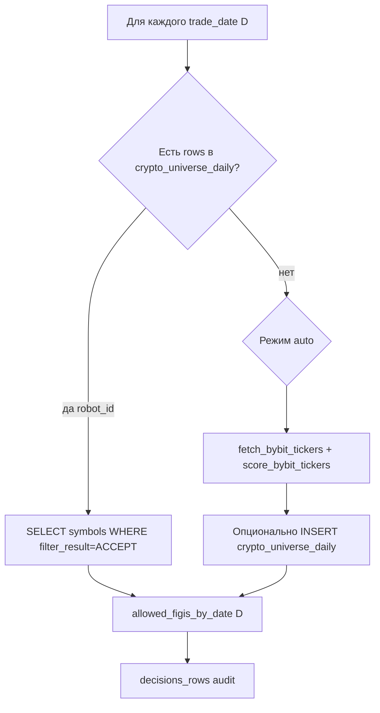

# Backend: необходимые изменения для унификации `/testing`

**Версия:** 1.0  
**Дата:** 18.06.2026  
**Статус:** Спецификация к реализации (T0)

**Связанные документы:**

- [TESTING-UI-RELEASE_MAP.md](TESTING-UI-RELEASE_MAP.md) — этап T0
- [TESTING-UI-RELEASE_STATUS.md](TESTING-UI-RELEASE_STATUS.md) — трекинг задач
- [TESTING-BACKTEST-REFERENCE.md](TESTING-BACKTEST-REFERENCE.md) — as-built логика бэктеста

**Принцип:** основной контур `POST /api/robots/history-backtest` **не меняется** (URL, async 202, фазы, симуляция). Расширяем **семантику config** и **фазу `scoring`** для crypto auto. Отдельный минорный контракт — фильтр в `POST /history-backtest/list` (T0.8).

**Не меняем:**

- `max_daily_loss` — остаётся **%** (`risk.max_daily_loss`, проверка в `session.py::_is_daily_loss_limit_breached`)
- Движок симуляции (`run_backtest_replay`, `session_backtest.py`)
- Веса фаз в `backtest_progress.py`
- MOEX scoring (`run_history_universe_scoring`)

---

## 1. Проблема as-built

Сегодня в `run_robot_history_backtest` для crypto (`is_crypto_backtest`):

```python
# service.py ~2705–2723
symbols = config.get("allowed_symbols") or config.get("instruments") or []
allowed_figis_by_date = {d.isoformat(): list(selected_tickers) for d in trade_dates}
```

Один и тот же список символов копируется на **все торговые дни**. Фаза `scoring` для crypto завершается мгновенно (`phase_units_done = scoring_units_total`).

**Live** уже умеет auto-screening:

- `rebuild_crypto_universe()` в `crypto_universe.py`
- `POST /robots/jobs/crypto-screening`
- Таблица `crypto_universe_daily` (migration `0034`)

**Gap:** history-backtest не использует screening и не читает `crypto_universe_daily`.

---

## 2. Целевая модель: `universe_mode` для crypto

### 2.1. Значения

| Режим | Поведение в backtest scoring |
|-------|------------------------------|
| `fixed` | Как сейчас: `allowed_symbols` / `instruments` / whitelist → один список на все дни |
| `auto` | Отбор символов по фильтрам `crypto_universe` → `allowed_figis_by_date[date]` |

MOEX режимы (`fixed`, `dms_pipeline`, `tqbr_scan`) **без изменений** в `universe.py`.

### 2.2. Маппинг с существующим config v3

Профиль [`type2_bybit.py`](../backend/app/modules/robots/config/profiles/type2_bybit.py):

```python
class CryptoUniverseConfig(BaseModel):
    enabled: bool = True
    min_volume_24h_usd: float = 50_000_000.0
    max_spread_bps: float = 15.0
    ...
```

**Правило нормализации:**

```
universe_mode = "auto"  ⟺  crypto_universe.enabled == True  И  allowed_symbols пуст
universe_mode = "fixed" ⟺  явно fixed ИЛИ непустой allowed_symbols/instruments
```

Добавить в config JSON явное поле `universe_mode` для crypto (как у MOEX) — предпочтительно для UI и валидации.

### 2.3. Файлы

| Файл | Изменение |
|------|-----------|
| [`universe.py`](../backend/app/modules/robots/universe.py) | `UNIVERSE_MODE_AUTO = "auto"`, `normalize_crypto_universe_mode(config)` |
| [`type2_bybit.py`](../backend/app/modules/robots/config/profiles/type2_bybit.py) | Опциональное `universe_mode: Literal["fixed","auto"]` |
| [`migration.py`](../backend/app/modules/robots/config/migration.py) | При миграции v2→v3: `enabled=True` + пустые symbols → `auto` |
| [`schemas.py`](../backend/app/modules/robots/schemas.py) | Документация в `RobotHistoryBacktestRequest.config` (описание полей) |

### 2.4. Согласование фильтров (технический долг)

Сейчас два набора defaults:

| Источник | min volume | max spread |
|----------|------------|------------|
| `Type2BybitConfig.crypto_universe` | 50M USD | 15 bps |
| `crypto_universe.CryptoUniverseFilters` | 3M USD | 0.45 % |

**Решение для T0:** единый resolver `_resolve_crypto_universe_filters(config)` в `crypto_universe.py`:

- читать `config.crypto_universe.min_volume_24h_usd`, `max_spread_bps`
- конвертировать bps → percent для `score_bybit_tickers` (`max_spread_pct = bps / 100`)
- fallback на `CryptoUniverseFilters` defaults

---

## 3. Новый модуль: crypto universe scoring в backtest

### 3.1. Файл

`backend/app/modules/robots/trading/pipeline/crypto_universe_scoring.py`

По аналогии с [`universe_scoring.py`](../backend/app/modules/robots/trading/pipeline/universe_scoring.py) (MOEX).

### 3.2. API модуля

```python
@dataclass
class CryptoUniverseScoringResult:
    allowed_figis_by_date: dict[str, list[str]]  # date ISO -> symbols
    decisions_rows: list[dict]                   # ACCEPT/REJECT audit
    processed_days: int
    cancelled: bool

async def run_history_crypto_universe_scoring(
    *,
    db: Session,
    trade_dates: list[date],
    config: dict,
    user_id: int,
    robot_id: int | None,
    run_id: int,
    is_cancelled: Callable[[], bool],
    flush_progress: Callable[..., None] | None,
) -> CryptoUniverseScoringResult:
    ...
```

### 3.3. Алгоритм по дням



**Подшаги для progress** (аналог `SCORING_PROGRESS_SUBSTEPS=5`):

1. start day  
2. load cache / fetch tickers  
3. score filters  
4. persist optional  
5. done day  

### 3.4. Интеграция в `service.py`

Заменить блок `if is_crypto_backtest:`:

```python
if is_crypto_backtest:
    mode = normalize_crypto_universe_mode(config)
    if mode == "fixed":
        # текущая логика (без изменений)
        ...
    else:  # auto
        from ...crypto_universe_scoring import run_history_crypto_universe_scoring
        scoring_result = await run_history_crypto_universe_scoring(
            db=db,
            trade_dates=trade_dates,
            config=config,
            user_id=user_id,
            robot_id=robot_pk,
            run_id=run_id,
            is_cancelled=lambda: is_history_backtest_cancelled(run_id),
            flush_progress=_flush_scoring_progress,  # новый callback
        )
        allowed_figis_by_date = scoring_result.allowed_figis_by_date
        decisions_rows.extend(scoring_result.decisions_rows)
        if scoring_result.cancelled:
            ...
```

После scoring — общий путь: prefetch candles, simulating, persist (без изменений).

---

## 4. Таблица `crypto_universe_daily`

### 4.1. As-built схема

Migration `0034_crypto_universe_daily`:

- `robot_id`, `trade_date`, `symbol`, `filter_result`, `turnover_24h`, `spread_percent`, `meta_payload`
- UNIQUE `(robot_id, trade_date, symbol)`

### 4.2. Изменения (опционально, T0.4)

Для ad-hoc backtest без `robot_id`:

**Вариант A (минимальный):** не писать в БД; screening только in-memory на время прогона.

**Вариант B (рекомендуемый):** миграция `0038_crypto_universe_daily_run_id.py`:

```sql
ALTER TABLE {schema}.crypto_universe_daily
  ADD COLUMN run_id BIGINT NULL,
  ADD COLUMN user_id BIGINT NULL;

-- robot_id сделать nullable ИЛИ robot_id=0 sentinel для ad-hoc
CREATE INDEX idx_crypto_universe_daily_run_date ON crypto_universe_daily(run_id, trade_date);
```

Запись при on-the-fly screening: привязка к `backtest_runs.id` для аудита.

### 4.3. Чтение

```sql
SELECT symbol FROM crypto_universe_daily
WHERE robot_id = :rid AND trade_date = :d AND filter_result = 'ACCEPT'
```

Для ad-hoc (вариант B):

```sql
WHERE run_id = :run_id AND trade_date = :d AND filter_result = 'ACCEPT'
```

---

## 5. On-the-fly screening и токены ByBit

### 5.1. Источник credentials

Переиспользовать `_find_active_bybit_token(db, user_id)` из `crypto_universe.py`.

Учитывать `config.bybit.testnet` из запроса (приоритет над token row, если явно задано в `config_snapshot`).

### 5.2. Ошибки

| Условие | HTTP |
|---------|------|
| `universe_mode=auto`, нет токена | `422` — «Добавьте ByBit API token в настройках» |
| ByBit API error | `FAILED` run или skip day + `last_history_error` в stage_logs |
| После screening 0 symbols | `422` до simulating — «Ни один символ не прошёл crypto universe» |

### 5.3. Whitelist при auto

Если в config задан непустой `allowed_symbols` при `auto` — трактовать как **кандидатный пул** (intersection после score), аналог MOEX `fixed` + pipeline.

---

## 6. Ограничения точности (historical auto)

ByBit REST `get_tickers` отдаёт **текущие** turnover/spread, не исторические на дату D.

**Модели точности (выбрать одну для T0, задокументировать):**

| Модель | Описание | Точность | Сложность |
|--------|----------|----------|-----------|
| **M1 Point-in-time** | Один screening в начале прогона → один список на все дни | Низкая для длинных периодов | Минимальная |
| **M2 Daily refresh** | Screening на каждый день D тем же API (все дни получают одинаковый срез «сейчас») | Формально per-day, фактически как M1 | Средняя |
| **M3 Preloaded daily** | Только из `crypto_universe_daily` (если ETL/live job писал историю) | Высокая при наличии данных | Зависит от jobs |
| **M4 Historical kline proxy** | Оборот за D-1 из kline cache | Высокая | Отдельный этап post-T0 |

**Рекомендация для T0:** **M2** с пометкой в UI «auto-screening использует текущие метрики ликвидности ByBit»; путь к M4 — отдельный backlog.

---

## 7. Расширение API истории (T0.8, minor)

Поддержка фильтра «Рынок» в UI без client-side перебора.

### 7.1. Request

[`RobotBacktestHistoryRequest`](../backend/app/modules/robots/schemas.py):

```python
broker_type: Optional[Literal["tinvest", "bybit"]] = Field(
    default=None,
    description="Фильтр по рынку из config_snapshot прогона",
)
```

### 7.2. Query

В `get_backtest_history()`:

```sql
AND (
  :broker_type IS NULL
  OR LOWER(COALESCE(br.config_snapshot->>'broker_type', 'tinvest')) = :broker_type
)
```

Требование: при создании `backtest_runs` в `config_snapshot` всегда есть `broker_type` (проверить as-built; при отсутствии — дописать в фазе `fetching_market_data`).

### 7.3. Response

В `RobotBacktestHistoryItem`:

```python
broker_type: Optional[str] = None  # tinvest | bybit
market_profile: Optional[str] = None  # moex | crypto
```

Вычислять из `config_snapshot` при list (без миграции БД).

---

## 8. Валидация config

### 8.1. `validate_robot_config` / `POST /validate-config`

| Условие | Ошибка |
|---------|--------|
| `type2_bybit` + `universe_mode=fixed` + пустые symbols | `allowed_symbols required` |
| `type2_bybit` + `universe_mode=auto` + `crypto_universe.enabled=false` | конфликт режима |
| `min_volume_24h_usd <= 0` | validation error |
| `max_spread_bps <= 0` | validation error |

### 8.2. `RobotHistoryBacktestRequest` (runtime)

При старте backtest без сохранённого робота:

- `config.risk` не пустой (уже есть)
- crypto auto: не блокировать на отсутствии `robot_id`, но требовать ByBit token у `user_id`

**Не добавлять** валидацию `max_daily_loss` как абсолютную сумму — только %.

---

## 9. Persist decisions (опционально, низкий приоритет)

MOEX пишет `backtest_decisions` из `decisions_rows` scoring.

Для crypto auto — те же строки с `stage: crypto_universe`, `result: ACCEPT|REJECT`, `reason`, `trade_date`, `ticker`.

Файл: `service.py` → `_bulk_persist_backtest_decisions()` (уже вызывается для MOEX).

---

## 10. Тесты

| Тест | Файл | Сценарий |
|------|------|----------|
| Normalize mode | `test_crypto_universe_mode.py` | fixed/auto из config |
| Score tickers | `test_crypto_universe.py` | уже есть — расширить bps mapping |
| Scoring per day | `test_crypto_universe_scoring_backtest.py` | mock DB + mock ByBit |
| Integration | `test_history_backtest_crypto_auto.py` | e2e scoring phase → symbols |
| History filter | `test_backtest_history_broker_filter.py` | list с `broker_type=bybit` |
| Regression fixed | существующие crypto backtest tests | fixed path unchanged |

---

## 11. Чеклист готовности backend (T0)

- [ ] `universe_mode`: `fixed` | `auto` для crypto в config и нормализаторе
- [ ] `run_history_crypto_universe_scoring` реализован и подключён в `service.py`
- [ ] `fixed` crypto backtest — без регрессии
- [ ] `auto` crypto backtest — non-empty universe или явная ошибка
- [ ] Progress scoring не skip-мгновенный для auto
- [ ] Фильтры `crypto_universe` согласованы (USD volume, bps spread)
- [ ] Документация M1/M2 в TESTING-BACKTEST-REFERENCE §10
- [ ] (T0.8) History list filter по `broker_type`
- [ ] Тесты green

---

## 12. Что сознательно не делаем на backend

| Идея | Причина |
|------|---------|
| Новый endpoint `/history-backtest/crypto` | Достаточно расширения config + scoring |
| Менять фазы или веса progress | UI уже заточен под 7 фаз |
| MOEX pipeline для crypto | Разные источники данных |
| `max_daily_loss` в рублях/USDT | Решение продукта: остаётся % |
| Удалять `POST /jobs/crypto-screening` | Остаётся для live и Advanced UI |
| Historical turnover ETL | Backlog post-T0 (модель M4) |

---

## 13. Порядок реализации (рекомендуемый)

1. **T0.1** — нормализация `universe_mode` + validate-config  
2. **T0.2** — `_resolve_crypto_universe_filters` (согласование bps/USD)  
3. **T0.3** — `run_history_crypto_universe_scoring` (read cache + score)  
4. **T0.4** — интеграция в `service.py` + ad-hoc token path  
5. **T0.6** — тесты  
6. **T0.5** — документация ограничений M2  
7. **T0.8** — history filter (можно параллельно с T1 frontend)  
8. **T0.4 DB** (вариант B) — только если нужен audit ad-hoc без robot  

---

*Синхронизировать с [TESTING-UI-RELEASE_STATUS.md](TESTING-UI-RELEASE_STATUS.md) при закрытии каждой подзадачи T0.x.*
