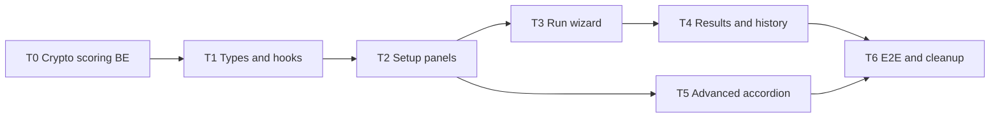

# Release map: `/testing` as-is → унифицированный UI бэктеста

**Версия:** 1.0  
**Дата:** 18.06.2026  
**Статус:** Проект (T0 🟡, T1 ✅, T2+ не начаты)

**Связанные документы:**

- [TESTING-UI-RELEASE_STATUS.md](TESTING-UI-RELEASE_STATUS.md) — трекинг T0–T6
- [TESTING-UI-ACCEPTANCE-CHECKLIST.md](TESTING-UI-ACCEPTANCE-CHECKLIST.md) — приёмочный чеклист (E2E, регрессия)
- [TESTING-UI-BACKEND-CHANGES.md](TESTING-UI-BACKEND-CHANGES.md) — спека изменений backend (T0)
- [TESTING-BACKTEST-REFERENCE.md](TESTING-BACKTEST-REFERENCE.md) — as-built: логика бэктеста, API, фазы
- [ui/TESTING-UX-REFACTOR-SPEC.md](ui/TESTING-UX-REFACTOR-SPEC.md) — UX/layout (as-is проблемы)
- [BRD-ARCH-02-unified-backtest-testing-spec.md](BRD-ARCH-02-unified-backtest-testing-spec.md) — продуктовые поля формы
- [ROBOTS-ARCHITECTURE-RELEASE_MAP.md](ROBOTS-ARCHITECTURE-RELEASE_MAP.md) — аналог структуры (R0–R8)
- Целевая UI-спека (черновик): `новый 1.txt` на рабочем столе → перенести в `docs/ui/TESTING-UNIFIED-REFACTOR-SPEC.md`

**Зафиксированные решения (18.06.2026):**

| Вопрос | Решение |
|--------|---------|
| Crypto auto-screening | **Делать в backend** — scoring в history-backtest, не только live job |
| `max_daily_loss` | **Проценты** (как сейчас в коде), не абсолютная сумма в ₽/USDT |
| MoexCache / Universe LIVE / Recommendations | **Не удалять** — секция **Advanced** (collapsible, по умолчанию свёрнута) |

---

## 1. Executive summary

Цель: единая вкладка `/testing` для MOEX и Crypto с wizard **Setup → Run → Analysis**, явным выбором рынка, 3 хуками вместо 7, без изменения REST API бэктеста.

**Текущее состояние (as-built, июнь 2026):**

| Область | Готовность | Комментарий |
|---------|------------|-------------|
| Backend history-backtest (MOEX) | **~95%** | 7 фаз, scoring, `run_backtest_replay` |
| Backend history-backtest (Crypto) | **~80%** | Fixed `allowed_symbols`; funding; **нет auto-screening в scoring** |
| API `/robots/history-backtest` | **100%** | Async 202, poll, cancel, compare — менять не планируется |
| UI `/testing` | **~60%** | Рабочий, но длинный скролл, 7 хуков, нет wizard, нет явного MarketSelector |
| Crypto screening (live) | **~90%** | `POST /jobs/crypto-screening`, `crypto_universe.py`, `crypto_universe_daily` |
| Crypto screening (backtest) | **~20%** | Только static symbols в `service.py` scoring |

**Принцип release map:** **снизу вверх** — сначала backend gap (crypto auto в scoring), затем фундамент типов/хуков, затем UI-компоненты, затем wizard и Advanced.

---

## 2. Матрица «сейчас → target»

Легенда: ✅ есть · 🟡 частично · ❌ нет

### 2.1 Backend

| Компонент | Сейчас | Target | Gap |
|-----------|--------|--------|-----|
| MOEX scoring в backtest | ✅ | `run_history_universe_scoring` | — |
| Crypto fixed universe в backtest | ✅ | `allowed_symbols` на все дни | — |
| Crypto **auto-screening** в backtest | ❌ | Per-day или snapshot screening в фазе `scoring` | **T0** |
| `crypto_universe_daily` | ✅ | Хранение результатов screening | Не читается в history-backtest |
| `POST /jobs/crypto-screening` | ✅ | Live/preview | Не интегрирован в ad-hoc backtest без robot_id |
| `universe_mode` crypto | 🟡 | `fixed` \| `auto` | В коде только `fixed` (принудительно в UI) |
| `max_daily_loss` | ✅ % | % от портфеля | Target-спека с ₽ — **отклонена** |

### 2.2 Frontend — структура

| Компонент | Сейчас | Target | Gap |
|-----------|--------|--------|-----|
| Явный `MarketSelector` | 🟡 | Первый контрол на странице | `brokerType` внутри RobotParamsCard |
| Wizard 3 этапа | ❌ | Setup / Run / Analysis | Одна длинная страница |
| 3 хука | ❌ | config / runner / results | 7 хуков (`useTestingPage` + 6) |
| `UnifiedBacktestRequest` (TS) | ❌ | Типизированная форма | `buildTradingRobotConfig` + разрозненный state |
| Кнопка «Проверить» | ❌ | Validate без run | — |
| Список 7 фаз с чекбоксами | 🟡 | Визуальный stepper | Только statusWindow + progress |
| Фильтр истории по рынку | ❌ | MOEX / Crypto / Все | Поиск + min return |
| Copy JSON / Download | ❌ | Экспорт результата | — |

### 2.3 Frontend — conditional по рынку

| Блок | MOEX сейчас | Crypto сейчас | Target |
|------|-------------|---------------|--------|
| Сессия МСК, НДФЛ, pipeline | ✅ отдельные карточки | Скрыто | `MoexExtendedPanel` |
| Testnet, leverage, funding | Скрыто | ✅ `TestingCryptoConfigCard` | `CryptoExtendedPanel` |
| Universe | 3 режима MOEX | Только fixed | MOEX: 3 режима; Crypto: fixed + **auto** |
| Strategy + Risk | ✅ общие карточки | ✅ | `StrategyParamsPanel` + `RiskManagementPanel` |

### 2.4 Advanced (свёрнуто по умолчанию)

| Блок as-built | Сейчас на странице | Target |
|---------------|-------------------|--------|
| `TestingMoexCacheCard` | Виден (MOEX) | **Advanced** — подготовка кеша, не блокер run |
| `TestingUniverseCard` | Виден (MOEX) | **Advanced** — LIVE sync, P1/P2 |
| `TestingRecommendationsCard` | Виден | **Advanced** — пост-анализ, не конфиг |

### 2.5 Deprecated (после T6)

| Артефакт | Действие |
|----------|----------|
| `TestingPageContent.tsx` (монолит) | `@deprecated` → удалить после feature flag |
| `useTestingPage` + 6 sub-hooks | Заменены на T1.2–T1.4 |
| Прямой импорт карточек в старом layout | Оставить реэкспорт для `TradingRobotSettingsPage` |

---

## 3. Этапы реализации (releases)

Каждый этап: **цель**, **scope**, **DoD**, **зависимости**.

---

### T0 — Backend: crypto auto-screening в history-backtest

**Цель:** режим universe `auto` для crypto работает в фазе `scoring` так же осмысленно, как MOEX pipeline — без новых HTTP endpoints.

**Зависимости:** R5/R7 robots (✅ `crypto_universe.py`, `crypto_universe_daily`)

| # | Задача | Файлы / действия | DoD |
|---|--------|------------------|-----|
| T0.1 | Расширить `universe_mode` для crypto | `universe.py`, `schemas.py`, config v3 `type2_bybit` | Значения: `fixed` \| `auto` (alias: `crypto_universe.enabled`) |
| T0.2 | Scoring branch для crypto auto | `service.py` `run_robot_history_backtest` | При `auto`: не flat list на весь период |
| T0.3 | Per-day universe из БД | `crypto_universe.py` | Читать `crypto_universe_daily` по `trade_date` если robot_id задан |
| T0.4 | On-the-fly screening для ad-hoc | `crypto_universe.py`, scoring helper | Без robot_id: screening по фильтрам из `config.crypto_universe` на старт периода; опционально prefetch в `crypto_universe_daily` с `run_id` |
| T0.5 | Historical limitation (документ) | `TESTING-BACKTEST-REFERENCE.md` §10 | Явная пометка: live turnover API → point-in-time или preloaded daily rows |
| T0.6 | Unit + integration tests | `test_crypto_universe.py`, backtest test | Crypto backtest с `universe_mode=auto` → non-empty `allowed_figis_by_date` |
| T0.7 | Прогресс scoring для crypto | `backtest_progress.py` | Фаза `scoring` обновляется при crypto auto (не мгновенный skip) |

**Критерий этапа:** `POST /history-backtest` с `broker_type=bybit`, `universe_mode=auto`, фильтрами volume/spread — scoring возвращает список символов; симуляция идёт по отобранным парам.

**Оценка:** 1–1.5 спринта.

**Не входит:** новый REST endpoint; изменение весов фаз.

---

### T1 — Foundation: типы, хуки, payload

**Цель:** подготовить новый фронтенд-слой без переключения маршрута.

**Зависимости:** T0 (для crypto `auto` в payload); может стартовать параллельно с T0.1–T0.2 на mock.

| # | Задача | Deliverable | DoD |
|---|--------|-------------|-----|
| T1.1 | TypeScript types | `testing/refactored/types/{forms,requests,responses}.ts` | `FormState`, `UnifiedBacktestRequest` → маппинг в существующий API body |
| T1.2 | `useTestingConfig` | Хук формы + validate | `max_daily_loss` как **%**; market-conditional errors |
| T1.3 | `useTestingRunner` | run + poll + cancel | Поведение 1:1 с `useTestingBacktest` (2s, 7200, terminal set) |
| T1.4 | `useTestingResults` | history + compare + filters | Вынесено из monolith hook |
| T1.5 | `payloadBuilder.ts` | `buildPayload(form)` → `buildTradingRobotConfig` | MOEX/crypto ветки; **без** изменения backend contract |
| T1.6 | `validation.ts` | Общие + market-specific rules | Период ≤365 дней; fixed universe non-empty |
| T1.7 | `defaults.ts` | Пресеты по рынку | RUB/USDT capital defaults |
| T1.8 | Feature flag | Default refactored (T6.1); legacy `VITE_TESTING_LEGACY` | Refactored on `/testing` |

**Критерий этапа:** unit-тесты на validate + payload; runner mock-тест на poll loop.

**Оценка:** 1 спринт.

---

### T2 — Setup UI: MarketSelector и панели конфигурации

**Цель:** этап **Setup** wizard — все поля конфигурации без Run/Analysis.

**Зависимости:** T1 ✅

| # | Задача | Компонент | DoD |
|---|--------|-----------|-----|
| T2.1 | `MarketSelector` | Radio MOEX / Crypto | Сброс incompatible robot; валюта RUB/USDT |
| T2.2 | `BaseConfigPanel` | Robot, strategy, period, capital, universe mode | Ad-hoc без robot_id; гидратация из robot |
| T2.3 | `MoexExtendedPanel` | Session, weekdays, НДФЛ, commission, pipeline | `broker_type=tinvest` only |
| T2.4 | `CryptoExtendedPanel` | testnet, category, leverage, funding, fees | `broker_type=bybit` only |
| T2.5 | Crypto auto UI | Min volume, max spread в panel | Поля → `config.crypto_universe` для T0 |
| T2.6 | `StrategyParamsPanel` | Динамика из `strategyPresets` | Переиспользовать логику `TestingStrategyParamsCard` |
| T2.7 | `RiskManagementPanel` | SL/TP/position/max daily **%** | Переиспользовать `TestingRiskParamsCard`; label «Макс. дневной убыток, %» |
| T2.8 | Collapsible sections | «Расширенные», «Стратегия и риск» | По умолчанию: базовые открыты, расширенные закрыты |
| T2.9 | «Сохранить как робота» | Кнопка в Setup | type=2 через существующий API |
| T2.10 | «Проверить» | `validate()` + toast список ошибок | Без network run |

**Критерий этапа:** переключение MOEX ↔ Crypto показывает правильные панели; payload собирается идентично as-built для regression snapshot.

**Оценка:** 1.5 спринта.

---

### T3 — Run UI: wizard этап «Запуск»

**Цель:** изолированный этап Run с прогрессом и отменой.

**Зависимости:** T1.3, T2 ✅

| # | Задача | Deliverable | DoD |
|---|--------|-------------|-----|
| T3.1 | `TestingWizard` shell | Stepper Setup / Run / Analysis | Переход Setup→Run по «Запустить» |
| T3.2 | `RunControlPanel` | IDLE / RUNNING / terminal states | Sticky bar на этапе Run |
| T3.3 | Phase stepper UI | 7 фаз с иконками ✅/⏳ | Веса из `backtest_progress.py` |
| T3.4 | ETA + progress bar | Из poll status | Как `useTestingBacktest.applyRunStatus` |
| T3.5 | Cancel | POST cancel + poll до terminal | Partial result path |
| T3.6 | Resume on mount | `GET .../runs/active` | При открытии страницы на этапе Run |
| T3.7 | Persist dirty config | `POST /robots/update` перед run | Если robot selected + dirty |

**Критерий этапа:** MOEX и Crypto backtest запускаются из нового Run panel; отмена работает.

**Оценка:** 1 спринт.

---

### T4 — Analysis UI: результаты и история

**Цель:** этап **Analysis** + постоянная история внизу.

**Зависимости:** T3 ✅

| # | Задача | Deliverable | DoD |
|---|--------|-------------|-----|
| T4.1 | `ResultsDashboard` | KPI tiles (6) | return, Sharpe, DD, win rate, profit factor, final equity |
| T4.2 | `EquityChart` | Lightweight Charts + trade markers | Переиспользовать `TestingBacktestEquityChart` |
| T4.3 | Result tabs | Trades / Signals / Orders / Portfolio | Из `TestingBacktestResultPanel` |
| T4.4 | Export actions | Copy JSON, Download | Новые кнопки |
| T4.5 | `HistoryPanel` | Таблица + фильтры | Поиск, min return, **фильтр рынка** |
| T4.6 | Compare runs | Два dropdown + side-by-side KPI | Существующий `POST .../compare` |
| T4.7 | Валюта в KPI | RUB vs USDT по `broker_type` run | Из metadata / config snapshot |

**Критерий этапа:** после SUCCESS пользователь на этапе Analysis; история фильтруется по MOEX/Crypto.

**Оценка:** 1–1.5 спринта.

---

### T5 — Advanced: MoexCache, Universe LIVE, Recommendations

**Цель:** убрать шум из основного Setup, сохранив power-user функции.

**Зависимости:** T2 (можно параллельно с T3–T4)

| # | Задача | Deliverable | DoD |
|---|--------|-------------|-----|
| T5.1 | `AdvancedPanel` accordion | Collapsible, **default closed** | Badge «Опционально» |
| T5.2 | MOEX cache block | Обёртка `TestingMoexCacheCard` / `useMoexCandleJobState` | Только MOEX + Advanced open |
| T5.3 | Universe LIVE block | `TestingUniverseCard` + P1/P2 | Только MOEX; не блокирует run |
| T5.4 | Recommendations block | `TestingRecommendationsCard` | После есть result или manual refresh |
| T5.5 | Copy в Settings | Карточки остаются в `TradingRobotSettingsPage` | Без регрессии robots settings |

**Критерий этапа:** основной Setup — 4 блока (Market, Base, Extended, Strategy/Risk); Advanced свёрнут по умолчанию.

**Оценка:** 0.5 спринта.

---

### T6 — Переключение, E2E, cleanup

**Цель:** новый UI по умолчанию; legacy deprecated.

**Зависимости:** T0–T5 ✅

| # | Задача | Deliverable | DoD |
|---|--------|-------------|-----|
| T6.1 | Flip feature flag | `/testing` → refactored | Старый UI за flag fallback 1 релиз |
| T6.2 | E2E MOEX | Playwright / manual script | Критерии §11.1 target spec |
| T6.3 | E2E Crypto fixed + auto | Testnet smoke | Критерии §11.2 + T0 auto |
| T6.4 | Regression TradingRobotSettings | Импорты shared panels | Settings не сломаны |
| T6.5 | Документация | `TESTING-BACKTEST-REFERENCE.md`, UX spec | Target vs as-built таблица |
| T6.6 | Deprecate legacy | `@deprecated` на старых hooks/cards | Удаление в T6+1 по желанию |
| T6.7 | `TESTING-UI-RELEASE_STATUS.md` | Статус по каждому T0.x–T6.x | Как ROBOTS-ARCHITECTURE-RELEASE_STATUS |

**Критерий этапа:** чеклист §9 ниже полностью зелёный.

**Оценка:** 1 спринт.

---

## 4. Сводная таблица releases

| Release | Название | Контур | Зависит от | Оценка | Статус |
|---------|----------|--------|------------|--------|--------|
| **T0** | Crypto auto-screening (BE) | Backend | R5 crypto universe ✅ | 1–1.5 спр | ⬜ |
| **T1** | Types + 3 hooks | Frontend foundation | T0 (желательно) | 1 спр | ⬜ |
| **T2** | Setup panels | Frontend UI | T1 | 1.5 спр | ⬜ |
| **T3** | Run wizard | Frontend UI | T1, T2 | 1 спр | ⬜ |
| **T4** | Results + history | Frontend UI | T3 | 1–1.5 спр | ⬜ |
| **T5** | Advanced accordion | Frontend UX | T2 | 0.5 спр | ⬜ |
| **T6** | E2E + cutover | All | T0–T5 | 1 спр | ⬜ |

**Суммарно:** ~6.5–8 спринт-недель (календарно ~7–9 недель при последовательности; T5 параллелится с T3–T4).

---

## 5. MVP-срезы

### MVP-A — «Backend crypto auto» (без нового UI)

**Releases:** T0 only

- Crypto backtest с `universe_mode=auto` через API/CLI
- Старый UI: можно временно добавить toggle auto в `TestingCryptoConfigCard` (minimal)

### MVP-B — «Новый UI, MOEX only»

**Releases:** T1 + T2 + T3 + T4 (MOEX path) + T5

- Crypto panels есть, но auto-screening до T0 — только fixed
- Полезно для ранней UX-приёмки на MOEX

### MVP-C — «Full unified /testing»

**Releases:** T0–T6

- MOEX + Crypto, auto-screening, Advanced, E2E, cutover

---

## 6. Маппинг target spec (`новый 1.txt`) → releases

| Раздел target spec | Release map |
|--------------------|-------------|
| §3 Wizard 3 этапа | T3.1 + T4 |
| §4.1 MarketSelector | T2.1 |
| §4.2–4.4 Base / Moex / Crypto panels | T2.2–T2.5 |
| §4.5–4.6 Strategy / Risk | T2.6–T2.7 |
| §4.7 RunControlPanel | T3.2–T3.5 |
| §4.8 ResultsDashboard | T4.1–T4.4 |
| §4.9 HistoryPanel + market filter | T4.5–T4.6 |
| §5 Hooks 7→3 | T1.2–T1.4 |
| §6 UnifiedBacktestRequest | T1.1, T1.5 |
| §8 API без изменений | Весь map (кроме T0 scoring) |
| §9 Новые файлы `testing/refactored/` | T1–T5 |
| §10 Этапы 1–4 (4 недели) | T1–T6 (~7–9 нед) — реалистичнее с T0 |
| Crypto auto-screening | **T0** (не было в target как BE) |
| `max_daily_loss` в ₽ | **Отклонено** — T2.7 % |
| Удаление MoexCache/Universe | **T5 Advanced** вместо удаления |

---

## 7. Риски и блокеры

| Риск | Влияние | Митигация |
|------|---------|-----------|
| Исторические turnover ByBit недоступны для прошлых дат | Crypto auto backtest неточен | T0.5: документировать; fallback — preloaded `crypto_universe_daily` или point-in-time |
| Дублирование `buildTradingRobotConfig` | Расхождение payload | T1.5: один builder, snapshot-тесты против as-built |
| `TradingRobotSettingsPage` shared cards | Регрессия settings | T5.5, T6.4 — shared primitives, не дублировать форму |
| Длинный cutover | Два UI в поддержке | Feature flag T1.8 → T6.1 |
| Backend T0 задерживает crypto E2E | MVP-B без auto | MVP-A отдельно |

---

## 8. Чеклист приёмки (full target)

### MOEX

- [ ] Явный выбор рынка MOEX
- [ ] MOEX extended: сессия, дни, НДФЛ %, pipeline
- [ ] Ad-hoc и robot type=2
- [ ] Запуск + 7 фаз + отмена + partial
- [ ] KPI в RUB, equity chart, tabs
- [ ] История + фильтр MOEX
- [ ] Advanced: cache / universe / recommendations свёрнуты по умолчанию

### Crypto

- [ ] Явный выбор рынка Crypto
- [ ] Crypto extended: testnet, leverage, funding, fees
- [ ] Universe **fixed** и **auto** (после T0)
- [ ] Запуск + funding в симуляции
- [ ] KPI в USDT
- [ ] История + фильтр Crypto

### Общее

- [ ] `max_daily_loss` — **проценты**, подпись в UI
- [ ] 3 хука, wizard Setup→Run→Analysis
- [ ] «Проверить» без запуска
- [ ] Нет регрессии API контрактов
- [ ] `TESTING-BACKTEST-REFERENCE.md` актуален

---

## 9. Следующий шаг

1. **Старт T0.1** — `universe_mode=auto` для `type2_bybit` (см. [TESTING-UI-BACKEND-CHANGES.md](TESTING-UI-BACKEND-CHANGES.md) §2).
2. **Параллельно T1.1** — заготовить `testing/refactored/types` за feature flag.
3. **Перенести** `новый 1.txt` → `docs/ui/TESTING-UNIFIED-REFACTOR-SPEC.md` с пометками решений (%, Advanced, T0).
4. **Трекинг** — [TESTING-UI-RELEASE_STATUS.md](TESTING-UI-RELEASE_STATUS.md) (создан, обновлять при закрытии T0.x–T6.x).

---

*Синхронизировать при завершении каждого release: обновлять §2 матрицу и `TESTING-UI-RELEASE_STATUS.md`.*
