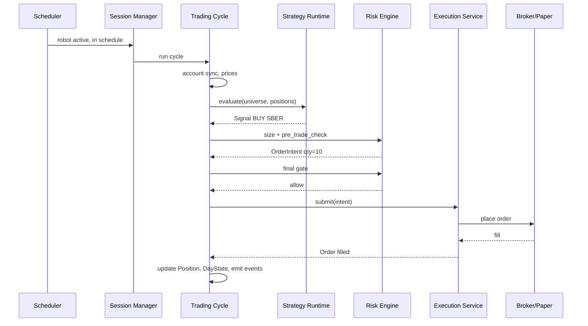
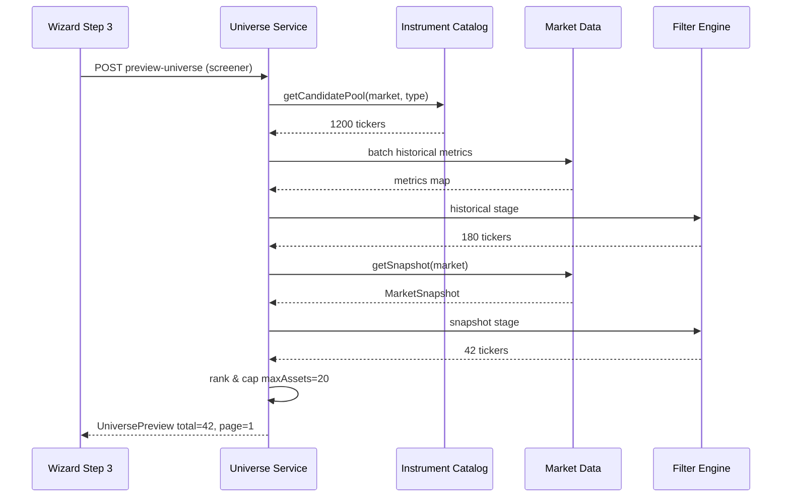
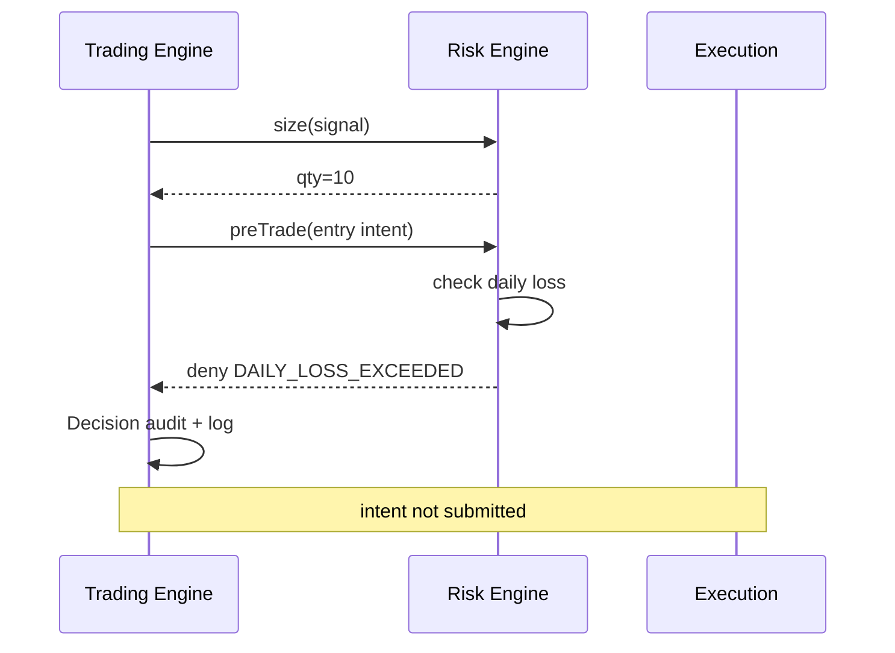

# Система торговых роботов — целевая спецификация

**Статус:** greenfield (согласовано, актуально)  
**Версия:** 2.0  
**Дата:** 2026-08-12  
**Аудитория:** разработчики, UX/UI, QA, product  
**ADR (решения v2):** [robots_greenfield_adr.md](./robots_greenfield_adr.md)

Единый документ: продукт и UI, Trading Engine, Universe Service (DMS), Strategy Runtime, Risk Engine, edge cases и QA. Не привязан к текущей реализации v1.

---

## Содержание

- [Часть I. Продукт и UI](#часть-i-продукт-и-ui)
  - [1. Видение](#1-видение)
  - [2. Типы роботов](#2-типы-роботов)
  - [3. Архитектура системы](#3-архитектура-системы)
  - [4. Модель данных](#4-модель-данных)
  - [5. Universe Service (DMS / скрининг)](#5-universe-service-dms-скрининг)
  - [6. Strategy Runtime (Brain)](#6-strategy-runtime-brain)
  - [7. Risk Engine](#7-risk-engine)
  - [8. Пользовательский интерфейс](#8-пользовательский-интерфейс)
  - [9. Жизненный цикл](#9-жизненный-цикл)
  - [10. API](#10-api)
  - [11. Нефункциональные требования](#11-нефункциональные-требования)
  - [12. Вне scope (идеал, но не MVP)](#12-вне-scope-идеал-но-не-mvp)
  - [13. Критерии готовности продукта](#13-критерии-готовности-продукта)
  - [14. Зафиксированные решения](#14-зафиксированные-решения)
- [Часть II. Trading Engine](#часть-ii-trading-engine)
  - [1. Назначение и границы](#1-назначение-и-границы)
  - [2. Архитектура runtime](#2-архитектура-runtime)
  - [3. Два уровня расписания](#3-два-уровня-расписания)
  - [4. Жизненный цикл сессии](#4-жизненный-цикл-сессии)
  - [5. Торговый цикл (Trading Cycle)](#5-торговый-цикл-trading-cycle)
  - [6. Доменные сущности](#6-доменные-сущности)
  - [7. Risk Engine в контуре цикла](#7-risk-engine-в-контуре-цикла)
  - [8. Universe в runtime](#8-universe-в-runtime)
  - [9. Execution Service](#9-execution-service)
  - [10. Market Data](#10-market-data)
  - [11. Account Book](#11-account-book)
  - [12. Soft / Hard Stop (runtime)](#12-soft-hard-stop-runtime)
  - [13. Ошибки и восстановление](#13-ошибки-и-восстановление)
  - [14. Observability](#14-observability)
  - [15. Sequence: entry сделка](#15-sequence-entry-сделка)
  - [16. API взаимодействия Engine ↔ Platform](#16-api-взаимодействия-engine-platform)
  - [17. Инварианты (must hold)](#17-инварианты-must-hold)
  - [18. Зафиксированные решения](#18-зафиксированные-решения)
  - [19. Критерии готовности Trading Engine](#19-критерии-готовности-trading-engine)
- [Часть III. Universe Service (DMS)](#часть-iii-universe-service-dms)
  - [1. Назначение и границы](#1-назначение-и-границы)
  - [2. Архитектура](#2-архитектура)
  - [3. Режимы universe](#3-режимы-universe)
  - [4. Модель данных](#4-модель-данных)
  - [5. Пресеты скринера](#5-пресеты-скринера)
  - [6. Market Snapshot](#6-market-snapshot)
  - [7. Historical Filter Stage](#7-historical-filter-stage)
  - [8. Snapshot Filter Stage](#8-snapshot-filter-stage)
  - [9. Ranking и maxAssets](#9-ranking-и-maxassets)
  - [10. Candidate Pool](#10-candidate-pool)
  - [11. API](#11-api)
  - [12. Runtime refresh (Trading Engine)](#12-runtime-refresh-trading-engine)
  - [13. UI шага 3 (мастер)](#13-ui-шага-3-мастер)
  - [14. Кэширование и производительность](#14-кэширование-и-производительность)
  - [15. Ошибки и коды отклонения](#15-ошибки-и-коды-отклонения)
  - [16. Безопасность и мультитенантность](#16-безопасность-и-мультитенантность)
  - [17. Наблюдаемость](#17-наблюдаемость)
  - [18. Зафиксированные решения](#18-зафиксированные-решения)
  - [19. Sequence: preview screener](#19-sequence-preview-screener)
  - [20. Критерии готовности](#20-критерии-готовности)
  - [21. Future (вне MVP)](#21-future-вне-mvp)
- [Часть IV. Strategy Runtime](#часть-iv-strategy-runtime)
  - [1. Назначение](#1-назначение)
  - [2. Архитектура](#2-архитектура)
  - [3. Режимы пробуждения (связь с Trading Engine)](#3-режимы-пробуждения-связь-с-trading-engine)
  - [4. Общие правила](#4-общие-правила)
  - [5. Scalper](#5-scalper)
  - [6. Momentum](#6-momentum)
  - [7. Reversion](#7-reversion)
  - [8. Grid](#8-grid)
  - [9. Матрица архетипов](#9-матрица-архетипов)
  - [10. Взаимодействие с Risk Engine](#10-взаимодействие-с-risk-engine)
  - [11. Warmup и bootstrap](#11-warmup-и-bootstrap)
  - [12. Universe change hooks](#12-universe-change-hooks)
  - [13. Тестирование Strategy Runtime](#13-тестирование-strategy-runtime)
  - [14. Future (вне MVP)](#14-future-вне-mvp)
  - [15. Критерии готовности](#15-критерии-готовности)
- [Часть V. Risk Engine](#часть-v-risk-engine)
  - [1. Назначение и границы](#1-назначение-и-границы)
  - [2. Архитектура](#2-архитектура)
  - [3. Модель конфигурации](#3-модель-конфигурации)
  - [4. Session & Day State](#4-session-day-state)
  - [5. Sizing Engine](#5-sizing-engine)
  - [6. Pre-Trade Gate](#6-pre-trade-gate)
  - [7. Exit Evaluator](#7-exit-evaluator)
  - [8. Halt Controller](#8-halt-controller)
  - [9. Cost & PnL model](#9-cost-pnl-model)
  - [10. Paper vs Live](#10-paper-vs-live)
  - [11. UI шага 4 (Risk)](#11-ui-шага-4-risk)
  - [12. API](#12-api)
  - [13. Наблюдаемость](#13-наблюдаемость)
  - [14. Зафиксированные решения](#14-зафиксированные-решения)
  - [15. Sequence: entry with deny](#15-sequence-entry-with-deny)
  - [16. Критерии готовности](#16-критерии-готовности)
  - [17. Future (вне MVP)](#17-future-вне-mvp)
- [Часть VI. Приложение — Edge Cases и QA](#часть-vi-приложение-edge-cases-и-qa)
  - [A.1. Состояния загрузки и ошибок](#a1-состояния-загрузки-и-ошибок)
  - [A.2. Краевые случаи (Edge Cases)](#a2-краевые-случаи-edge-cases)
  - [A.3. Взаимодействие с WebSocket](#a3-взаимодействие-с-websocket)
  - [A.4. Логирование и аудит](#a4-логирование-и-аудит)
  - [A.5. Процесс остановки и выхода](#a5-процесс-остановки-и-выхода)
  - [A.6. Навигация и управление состоянием](#a6-навигация-и-управление-состоянием)
  - [A.7. Валидация на бэкенде](#a7-валидация-на-бэкенде)
  - [A.8. Производительность и ограничения](#a8-производительность-и-ограничения)
  - [A.9. Тестирование (QA Checklist)](#a9-тестирование-qa-checklist)
  - [A.10. Дополнительные сценарии (Future)](#a10-дополнительные-сценарии-future)

---


# Часть I. Продукт и UI


### 1. Видение


#### 1.1. Продукт

Платформа даёт трейдеру **торгового ассистента**, а не конфигуратор пайплайнов.

Трейдер отвечает на четыре вопроса:

1. **Зачем и на каком счёте?** — цель, API-ключ, режим, расписание
2. **Как принимаются решения?** — стиль торговли (архетип) и несколько понятных параметров
3. **На чём торгуем?** — фиксированный список, индекс или скринер с превью состава
4. **Как защищён капитал?** — размер позиции, SL/TP, лимиты, режим остановки

Система прозрачна: состав универсума, планируемые действия и причины отказа от сделок всегда доступны.

#### 1.2. Принципы


| Принцип                   | Смысл                                                    |
| ------------------------- | -------------------------------------------------------- |
| От смысла к коду          | Сначала цель и стиль, потом параметры                    |
| Адаптивный UI             | Поля зависят от архетипа, брокера и режима universe      |
| Безопасность по умолчанию | Paper — дефолт; риск обязателен; hard stop — явный выбор |
| Прозрачность              | Превью активов, перевод % → деньги, логи с причинами     |
| Один конфиг               | Robot — единый агрегат Core + Brain + Body               |


#### 1.3. Три кирпича


| Кирпич    | Роль | Содержимое                                            |
| --------- | ---- | ----------------------------------------------------- |
| **Core**  | Ядро | Имя, API-ключ, режим, цель, расписание                |
| **Brain** | Мозг | Архетип стратегии, параметры, таймфрейм               |
| **Body**  | Тело | Universe (fixed / index / screener) + риск-менеджмент |


---


### 2. Типы роботов

На экране флота — два независимых продукта:


| Тип                   | Назначение                                  | UX                                               |
| --------------------- | ------------------------------------------- | ------------------------------------------------ |
| **Portfolio updater** | Синхронизация портфеля брокера с платформой | Короткая форма: имя, API-ключ, расписание опроса |
| **Trading robot**     | Автоторговля по стратегии                   | Мастер из 4 шагов (Core → Brain → Body)          |


Дальше — **Trading robot**, если не указано иное.

---


### 3. Архитектура системы


#### 3.1. Контекст

```text
┌─────────────┐     REST/WS      ┌──────────────────────────────────────┐
│  Web UI     │ ◄──────────────► │  Robot Platform                      │
│  (мастер,   │                  │  ┌────────────┐  ┌─────────────────┐ │
│   флот,     │                  │  │ Robot      │  │ Trading Engine  │ │
│   dashboard)│                  │  │ Service    │──► Session Runner   │ │
└─────────────┘                  │  └────────────┘  └────────┬────────┘ │
                                 │         │                    │         │
                                 │         ▼                    ▼         │
                                 │  ┌────────────┐  ┌─────────────────┐ │
                                 │  │ Universe   │  │ Strategy        │ │
                                 │  │ Service    │  │ Runtime         │ │
                                 │  │ (DMS)      │  │ (archetypes)    │ │
                                 │  └─────┬──────┘  └────────┬────────┘ │
                                 │        │                   │         │
                                 │        ▼                   ▼         │
                                 │  ┌────────────┐  ┌─────────────────┐ │
                                 │  │ Market     │  │ Broker          │ │
                                 │  │ Data       │  │ Gateway         │ │
                                 │  └────────────┘  └────────┬────────┘ │
                                 └───────────────────────────┼──────────┘
                                                             ▼
                                                    T-Invest / Bybit API
```


#### 3.2. Компоненты


| Комponent                  | Ответственность                                                                                                                                    |
| -------------------------- | -------------------------------------------------------------------------------------------------------------------------------------------------- |
| **Robot Service**          | CRUD роботов, валидация конфига, статусы, clone, drafts на сервере                                                                                 |
| **Universe Service (DMS)** | Резолв universe: fixed, index, screener; превью; периодическое обновление состава — см. [Часть III](#часть-iii-universe-service-dms) |
| **Strategy Runtime**       | Плагины архетипов: генерация сигналов входа/выхода                                                                                                 |
| **Risk Engine**            | Размер позиции, SL/TP, лимиты, halt — [Часть V](#часть-v-risk-engine)                                                             |
| **Trading Engine**         | Оркестрация сессии: расписание → universe → сигналы → риск → ордера                                                                                |
| **Broker Gateway**         | Единый интерфейс к брокерам: счёт, ордера, позиции, инструменты                                                                                    |
| **Market Data**            | Свечи, стакан, поток цен; WebSocket для scalper                                                                                                    |
| **Observability**          | Структурированные логи, метрики, уведомления                                                                                                       |


#### 3.3. Поток live-сессии

```text
Scheduler (по расписанию робота)
    │
    ▼
Session Start ──► проверка токена, режима, статуса
    │
    ▼
Universe Resolve ──► fixed | index | screener → список инструментов − excluded
    │
    ▼
Data Bootstrap ──► свечи/индикаторы/WebSocket (если нужно архетипу)
    │
    ▼
Trading Loop (каждый pollInterval):
    1. Синхронизация портфеля и позиций
    2. Обновление universe (если screener / index — по политике)
    3. Strategy.evaluate() → сигналы
    4. Risk Gate → разрешить / отклонить (с причиной в лог)
    5. Order Execution → брокер
    6. Обновление equity, daily PnL, drawdown
    │
    ▼
Stop (soft/hard) / error / лимит просадки → завершение сессии
```

Полная спецификация runtime, цикла, сущностей и инвариантов — в [Часть II](#часть-ii-trading-engine).

---

lj,

### 4. Модель данных


#### 4.1. Robot

```typescript
interface Robot {
  id: UUID
  type: 'portfolio_updater' | 'trading'
  name: string                    // ≤50 символов
  tokenId: UUID                   // значение из api_tokens
  status: number // значение из dictionary, например 'draft' | 'active' | 'stopped' | 'paused' | 'error'
  config: PortfolioUpdaterConfig | TradingRobotConfig
  createdAt: datetime
  updatedAt: datetime
}
```

**Правило:** `broker` и `market` — **производные** от `tokenId`, read-only в UI. Смена токена на другого брокера после создания запрещена.

#### 4.2. TradingRobotConfig

```typescript
interface TradingRobotConfig {
  core: CoreConfig
  strategy: StrategyConfig
  universe: UniverseConfig
  risk: RiskConfig
}

interface CoreConfig {
  goal: number // значение из dictionary 'conservative' | 'moderate' | 'aggressive'
  instrumentType: 'stock' | 'futures' | 'perpetual' | 'coin_futures'  // зависит от брокера
  mode: number // значение из dictionary 'paper' | 'live'
  schedule: Schedule
}

interface Schedule {
  weekdays: boolean[7]              // хотя бы один true
  timeFrom: HH:mm
  timeTo: HH:mm                     // timeFrom < timeTo
  pollInterval: '1m' | '5m' | '15m' | '1h'
}
```


#### 4.3. StrategyConfig (Brain)

```typescript
interface StrategyConfig {
  archetype: number // значение из dictionary 'scalper' | 'momentum' | 'reversion' | 'grid' 
  timeframe: string
  params: ScalperParams | MomentumParams | ReversionParams | GridParams
}

interface ScalperParams {
  deltaThresholdPct: number         // 1–20
  requiresWebSocket: true           // фиксировано
}

interface MomentumParams {
  maPeriod: number                  // 20–200
  volumeMultiplier: number          // 1.5–5.0
}

interface ReversionParams {
  indicator: 'rsi' | 'stochastic' | 'divergence'
  overboughtThreshold: number       // 70–90 (RSI)
}

interface GridParams {
  gridStepAtrPct: number            // 0.5–5
  gridDepth: number                 // 3–20 уровней
}
```


#### 4.4. UniverseConfig (Body, шаг 3)

```typescript
interface UniverseConfig {
  mode: 'fixed' | 'index' | 'screener'
  fixedList?: string[]
  index?: string                    // IMOEX, RTS, TOP_BYBIT, …
  screener?: ScreenerConfig
  excluded: string[]                // снятые в превью
  maxAssets: number                 // дефолт 20, макс. рекомендация 100
  exitOnDrop: boolean               // default false — hold position до SL/TP
}

interface ScreenerConfig {
  preset?: 'high_liquidity' | 'volatile' | 'low_price' | 'custom'
  filters: Filter[]                 // см. §5
  filterMode: 'all' | 'any'           // все условия / любое
  refreshPolicy: 'on_session' | 'daily' | 'on_poll'
}
```


#### 4.5. RiskConfig (Body, шаг 4)

```typescript
interface RiskConfig {
  capital: number
  maxPositionSharePct: number       // 1–100
  stopLossPct: number
  takeProfitPct: number             // stopLossPct < takeProfitPct
  maxDailyLoss: number
  maxDrawdownPct: number            // дефолт 50
  maxConcurrentPositions: number    // 1–10
  brokerCommissionPct: number
  taxPct: number
  slippagePct: number               // дефолт 0.5
  stopMode: 'soft' | 'hard'         // дефолт soft
}
```

**Цель (**`goal`**)** при выборе подставляет пресеты риска и опционально пресет скринера. После ручной правки полей цель — метка профиля; перезапись только по «Сбросить к пресету цели».

#### 4.6. PortfolioUpdaterConfig

```typescript
interface PortfolioUpdaterConfig {
  schedule: Schedule                // только pollInterval + окно при необходимости
}
```

---


### 5. Universe Service (DMS / скрининг)

Отдельный доменный сервис, **встроенный в шаг 3 мастера**, без инженерного жаргона в UI.

**Полная спецификация:** [Часть III](#часть-iii-universe-service-dms)

#### 5.1. Режимы


| Режим        | Вход пользователя  | Результат                                    |
| ------------ | ------------------ | -------------------------------------------- |
| **fixed**    | Список тикеров     | Валидация у брокера; дедуп; исключения       |
| **index**    | Код индекса        | Состав индекса на дату; пересчёт по политике |
| **screener** | Пресет или фильтры | Динамический отбор по рынку                  |


#### 5.2. Скринер (идеальная модель)

**Пресеты** (один клик):

- Высокая ликвидность  
- Волатильные  
- Дешёвые

**Расширенный режим** — цепочка фильтров:

```typescript
type Filter =
  | { type: 'volume'; op: '>' | '<'; value: number; period: '24h' | 'session' }
  | { type: 'price'; op: '>' | '<'; value: number }
  | { type: 'atr'; op: '>' | '<'; value: number; period: number }
  | { type: 'gap'; op: '>' | '<'; valuePct: number }
  | { type: 'spread'; op: '<'; valuePct: number }
  | { type: 'list'; tickers: string[]; mode: 'include' | 'exclude' }
```

Пустой набор фильтров → дефолт: «Объём > 10M, Цена > 10 ₽» (для MOEX; аналоги для crypto).

#### 5.3. Превью

Единый контракт для всех режимов:

```typescript
interface UniversePreview {
  total: number
  assets: {
    ticker: string
    name: string
    price: number
    volume24h: number
    atr: number
    included: boolean               // учитывает excluded
  }[]
}
```

UI: таблица (виртуализация при >20 строк), «Показано 20 из N», чекбоксы включения.

#### 5.4. Обновление состава в runtime


| refreshPolicy | Когда пересчитывать                 |
| ------------- | ----------------------------------- |
| `on_session`  | При старте сессии                   |
| `daily`       | Раз в торговый день до открытия     |
| `on_poll`     | Каждый цикл (осторожно с нагрузкой) |


Инструмент, выпавший из universe, не открывается заново; открытая позиция — по политике выхода (SL/TP или принудительное закрытие при hard stop).

---


### 6. Strategy Runtime (Brain)


#### 6.1. Контракт архетипа

Каждый архетип — плагин с единым интерфейсом:

```typescript
interface StrategyPlugin {
  archetype: string
  requiredData: ('candles' | 'orderbook' | 'websocket')[]
  evaluate(ctx: StrategyContext): Signal[]
}

interface Signal {
  ticker: string
  side: 'buy' | 'sell' | 'close'
  strength?: number
  reason: string                    // для логов
}
```


#### 6.2. Поведение архетипов (идеал)


| Архетип       | Логика (продуктово)                                               | Данные                  |
| ------------- | ----------------------------------------------------------------- | ----------------------- |
| **Scalper**   | Вход при смене дисбаланса агрессии (delta) выше порога            | WebSocket, стакан/лента |
| **Momentum**  | Вход по пробою/тренду: цена vs MA + подтверждение объёмом         | Свечи                   |
| **Reversion** | Вход при перекупленности/перепроданности по индикатору            | Свечи                   |
| **Grid**      | Сетка ордеров/усреднение на шагах ATR при движении против позиции | Свечи, ATR              |


#### 6.3. UI шага 2

- 4 карточки архетипов с иконкой и кратким описанием  
- Динамическая форма params  
- Scalper: индикатор WebSocket (зелёный / жёлтый / красный)  
- Без архетипа «Далее» заблокирована

Детальная логика каждого архетипа — [Часть IV](#часть-iv-strategy-runtime).

---


### 7. Risk Engine

Правила sizing, SL/TP, лимиты и halt — **до** отправки ордера. Полная спецификация: [Часть V](#часть-v-risk-engine).

Кратко — проверки **до** отправки ордера:

1. Робот `active`, внутри расписания, рынок открыт
2. `maxConcurrentPositions` не превышен
3. `maxDailyLoss` не исчерпан
4. `maxDrawdownPct` не достигнут
5. Размер позиции ≤ `capital × maxPositionSharePct`
6. Достаточно средств на счёте (paper — виртуальный ledger)
7. SL/TP валидны относительно правил архетипа

При отказе — запись в лог с **кодом причины** и человекочитаемым текстом.

---


### 8. Пользовательский интерфейс


#### 8.1. Маршруты


| URL                                  | Экран                                      |
| ------------------------------------ | ------------------------------------------ |
| `/robots`                            | Флот: карточки, статус, быстрый start/stop |
| `/robots/new?type=trading`           | Мастер, шаг 1                              |
| `/robots/new?type=portfolio_updater` | Короткая форма updater                     |
| `/robots/edit/{id}`                  | Мастер или форма updater                   |
| `/robots/clone/{id}`                 | Копия trading-робота → draft               |
| `/robots/{id}/dashboard`             | Позиции, equity, daily PnL, график         |
| `/robots/{id}/logs`                  | Логи с фильтрами и экспортом               |


#### 8.2. Флот

- Карточка: имя, тип, статус, брокер (из токена), last session  
- Действия: открыть, start/stop, clone (trading), удалить  
- Лимит: 10 роботов на пользователя  
- Загрузка: скелетоны; ошибка + «Повторить»


#### 8.3. Мастер Trading robot

**Прогресс:** Цель → Стратегия → Активы → Риск  

**Шаг 1 — Core**

1. Цель: Консервативный / Умеренный / Агрессивный
2. Название
3. **API-ключ** (select) → подписи: брокер, рынок
4. Тип инструмента (зависит от брокера)
5. Paper / Live (дефолт Paper)
6. Расписание: дни, окно, pollInterval
7. «Проверить подключение»

**Шаг 2 — Brain** — см. §6.3  

**Шаг 3 — Активы** — табы fixed / index / screener + превью (§5.3)  

**Шаг 4 — Риск**

- Капитал; % на сделку с пересчётом в ₽/USDT  
- SL / TP в % и деньгах; Risk/Reward  
- Дневной убыток; просадка  
- Макс. позиций  
- Soft / Hard stop (дефолт soft)  
- Расширенные: комиссия, налог, slippage  
- Предупреждение, если капитал > доступного баланса

**Footer:** Назад | Далее | Сохранить черновик | Создать и запустить  

**Черновики:** LocalStorage (debounce 500ms, TTL 7 дней) + серверный draft при сохранении. Offline-баннер и восстановление — по [Часть VI](#часть-vi-приложение-edge-cases-и-qa).

#### 8.4. Dashboard робота

- Статус, mode (paper/live)  
- Equity, daily PnL, открытые позиции  
- Последние сигналы и исполненные сделки  
- График equity (опционально в MVP+)


#### 8.5. Логи

Формат: `[timestamp] [LEVEL] message`  

Обязательные типы событий:

- сигнал сгенерирован  
- вход / выход / отказ (с причиной)  
- изменение universe  
- stop soft/hard  
- error брокера / WebSocket

---


### 9. Жизненный цикл


#### 9.1. Статусы

```text
draft ──save──► stopped
stopped ──start──► active
active ──stop──► stopped 
active ──failure──► error ──recovery──► active (если включено)
```

- **Сохранить** — persist, без запуска  
- **Создать и запустить** — validate → active  
- Запуск с ошибками validate — запрещён


#### 9.2. Остановка


| stopMode          | Поведение                               |
| ----------------- | --------------------------------------- |
| **soft** (дефолт) | Новые входы запрещены; позиции до SL/TP |
| **hard**          | Рыночное закрытие всех позиций робота   |


Выбор в риске и переопределение в диалоге Stop.

#### 9.3. Редактирование active

Изменение strategy / universe / risk:

1. Диалог: «Робот будет остановлен»
2. Stop → save → опциональный auto-restart

Имя — без рестарта. `tokenId` — только тот же брокер.

#### 9.4. Клонирование

Копия config → новый id, status `draft`, имя «Копия {name}».

---


### 10. API

REST, JSON. Единый агрегат конфигурации.


| Метод | Путь                       | Назначение                                         |
| ----- | -------------------------- | -------------------------------------------------- |
| POST  | `/robots/data`             | Список флота                                       |
| POST  | `/robots/create`           | Создание (type + config), Обновление конфига       |
| GET   | `/robots/{id}`             | Полный робот                                       |
| POST  | `/robots/delete`           | Удаление                                           |
| POST  | `/robots/validate`         | Валидация без сохранения                           |
| POST  | `/robots/preview-universe` | Превью universe                                    |
| POST  | `/robots/change_status`    | Запуск, Остановка `{ stopMode?: 'soft' | 'hard' }` |
| POST  | `/robots/logs`             | Пагинация, фильтры                                 |
| POST  | `/apikey/data`             | Список ключей пользователя / Уже есть              |
| POST  | `/apikey/test-stored/{id}` | Проверка подключения / Уже есть                    |


**Validate response:**

```json
{
  "valid": false,
  "errors": [
    { "field": "strategy.params.deltaThresholdPct", "message": "...", "severity": "error" }
  ],
  "suggestions": ["..."]
}
```

WebSocket (отдельный канал): live status, equity, connection health для scalper.

---


### 11. Нефункциональные требования


| Область      | Требование                                         |
| ------------ | -------------------------------------------------- |
| Лимиты       | ≤10 роботов; ≤200 активов в universe (warn >100)   |
| Превью       | Виртуализация таблицы                              |
| WebSocket    | Таймаут 5s; до 5 reconnect с backoff 1→16s         |
| Безопасность | Токены не в логах; paper изолирован от live ledger |
| Аудит        | Каждый ордер привязан к robotId и signal reason    |


Edge cases, offline, QA — [Часть VI](#часть-vi-приложение-edge-cases-и-qa).

---


### 12. Вне scope (идеал, но не MVP)

- Один робот на двух брокерах одновременно  
- Социальное копирование стратегий  
- A/B двух роботов на одном счёте  
- Import/export конфига JSON  
- Блокировка запуска по корреляции инструментов  
- Telegram/Email уведомления (можно добавить после MVP)

---


### 13. Критерии готовности продукта

Трейдер может:

1. Создать trading-робота за один проход мастера с **API-ключом**, целью, архетипом, universe (включая скринер) и риском.
2. На шаге 3 увидеть состав универсума и исключить инструменты.
3. Видеть риск в деньгах и соотношение R:R.
4. Запустить в Paper, остановить soft/hard, прочитать причину отказа от сделки.
5. Открыть dashboard с позициями и PnL.
6. Создать portfolio updater отдельным коротким флоу.

---


### 14. Зафиксированные решения


| #   | Решение                                                                        |
| --- | ------------------------------------------------------------------------------ |
| 1   | Paper ledger — **per robot**                                                   |
| 2   | Soft stop с позициями → `paused`; без позиций / hard stop → `stopped`          |
| 3   | Выпадение из screener — **hold** (default); strict через `universe.exitOnDrop` |
| 4   | Grid MVP — **virtual levels**, одна position per ticker                        |
| 5   | EOD flatten — **on** для MOEX stocks, **off** для crypto/futures (default)     |
| 6   | Hot-reload без stop — имя, издержки; остальное — stop → apply                  |


Подробности — [Часть II](#часть-ii-trading-engine) §18, [Часть IV](#часть-iv-strategy-runtime).

---


# Часть II. Trading Engine


### 1. Назначение и границы


#### 1.1. Что делает Trading Engine

- Запускает и останавливает **live-сессии** роботов по расписанию и командам пользователя.
- На каждом цикле: синхронизирует состояние счёта → обновляет universe → получает сигналы стратегии → пропускает через риск → исполняет ордера.
- Ведёт **audit trail**: сигналы, решения, ордера, сделки, причины отказов.
- Публикует **live-события** для dashboard и логов.


#### 1.2. Что не входит


| Компонент                         | Где живёт              |
| --------------------------------- | ---------------------- |
| CRUD роботов, validate конфига    | Robot Service          |
| Резолв universe, screener, превью | Universe Service (DMS) |
| Генерация сигналов по архетипу    | Strategy Runtime       |
| Правила sizing, SL/TP, лимиты     | Risk Engine            |
| HTTP к брокеру                    | Broker Gateway         |
| Свечи, стакан, WS-поток           | Market Data Service    |


Trading Engine **оркестрирует** эти сервисы, но не дублирует их логику.

#### 1.3. Режимы исполнения

Единый пайплайн решений; меняются только адаптеры данных и исполнения:


| Режим        | Источник цен               | Исполнение ордеров                                      |
| ------------ | -------------------------- | ------------------------------------------------------- |
| **paper**    | Live / delayed market data | Виртуальный ledger (симуляция fills)                    |
| **live**     | Live market data           | Реальный Broker Gateway                                 |
| **backtest** | Исторические данные        | Sim broker (вне scope этого документа, тот же контракт) |


Paper — **дефолт** при создании робота. Live требует явного выбора в Core.

---


### 2. Архитектура runtime


#### 2.1. Компоненты

```text
┌─────────────────────────────────────────────────────────────────┐
│                     Trading Engine                               │
│                                                                  │
│  ┌──────────────┐    ┌──────────────┐    ┌──────────────────┐ │
│  │ Platform     │    │ Session      │    │ Trading Cycle    │ │
│  │ Scheduler    │───►│ Manager      │───►│ Runner           │ │
│  └──────────────┘    └──────┬───────┘    └────────┬─────────┘ │
│                             │                      │           │
│         ┌───────────────────┼──────────────────────┤           │
│         ▼                   ▼                      ▼           │
│  ┌──────────────┐    ┌──────────────┐    ┌──────────────────┐ │
│  │ Market Data  │    │ Universe     │    │ Strategy         │ │
│  │ Worker (WS)  │    │ Resolver     │    │ Runtime          │ │
│  └──────────────┘    └──────────────┘    └──────────────────┘ │
│         │                   │                      │           │
│         └───────────────────┴──────────┬───────────┘           │
│                                        ▼                       │
│                              ┌──────────────────┐              │
│                              │ Risk Engine      │              │
│                              └────────┬─────────┘              │
│                                       ▼                        │
│                              ┌──────────────────┐              │
│                              │ Execution        │              │
│                              │ Service          │              │
│                              └────────┬─────────┘              │
│                                       ▼                        │
│                              ┌──────────────────┐              │
│                              │ Event Bus /      │              │
│                              │ Audit Store      │              │
│                              └──────────────────┘              │
└─────────────────────────────────────────────────────────────────┘
```


| Компонент                | Ответственность                                                            |
| ------------------------ | -------------------------------------------------------------------------- |
| **Platform Scheduler**   | Каждые ~30s: какие роботы `active` и в окне расписания → старт/стоп сессий |
| **Session Manager**      | Одна сессия на робота; idempotent start/stop; lifecycle                    |
| **Session**              | Долгоживущий async-процесс: bootstrap + workers + cleanup                  |
| **Market Data Worker**   | WebSocket / poll → очередь цен и bar-close событий                         |
| **Trading Cycle Runner** | Основной цикл по `pollInterval`                                            |
| **Execution Service**    | Единственный путь submit + poll ордеров                                    |
| **Audit Store**          | Персистентность RunCycle, Signal, Order, Fill, Decision                    |
| **Event Bus**            | Push в dashboard / logs / notifications                                    |


#### 2.2. Правило входа

Внешний мир (REST `start`, Platform Scheduler) вызывает только **Session Manager**. Прямой доступ к внутренностям Session запрещён.

---


### 3. Два уровня расписания


| Уровень            | Что задаёт                                             | Типичные значения     |
| ------------------ | ------------------------------------------------------ | --------------------- |
| **Platform tick**  | Когда робот *может* иметь открытую сессию              | ~30s, глобально       |
| **Robot schedule** | Дни недели + окно `timeFrom`–`timeTo` (TZ счёта/биржи) | Пн–Пт 10:00–18:45 MSK |
| **Poll interval**  | Пауза между торговыми циклами *внутри* сессии          | 1m / 5m / 15m / 1h    |


**Поведение:**

- Вне окна расписания → сессия завершается gracefully (soft end).
- Crypto / 24h рынки: schedule может быть «всегда» (все дни, 00:00–23:59).
- `pollInterval` > длины окна → предупреждение на этапе validate (UI), не блокер runtime.

**Universe refresh** — отдельная cadence от poll (см. §8), управляется `refreshPolicy` в конфиге.

---


### 4. Жизненный цикл сессии


#### 4.1. Диаграмма состояний

```text
                    start (valid config)
                          │
                          ▼
                   ┌─────────────┐
                   │ BOOTSTRAP   │
                   └──────┬──────┘
                          │ ok
                          ▼
                   ┌─────────────┐
         ┌────────►│ RUNNING     │◄────────┐
         │         └──────┬──────┘         │
         │                │                │
         │    schedule end│ error/recover  │ recovered
         │                ▼                │
         │         ┌─────────────┐         │
         │         │ STOPPING    │─────────┘ (auto-restart opt.)
         │         └──────┬──────┘
         │                │
         │                ▼
         │         ┌─────────────┐
         └─────────│ TERMINATED  │
                   └─────────────┘
```


#### 4.2. Bootstrap (Session Start)

Последовательность (fail-fast на критических шагах):

1. **Preflight**
  - Робот `active`, конфиг валиден
  - Токен действителен (Broker Gateway ping)
  - Режим paper/live согласован с типом токена (testnet/mainnet)
2. **Account sync**
  - Баланс, equity, открытые позиции брокера → **Account Book**
  - Инициализация **Day State**: `dayStartEquity`, `dailyRealizedPnL`, `peakEquity`
3. **Universe resolve**
  - Universe Service → список инструментов − `excluded`
  - Пустой universe → **FAIL** (сессия не стартует, робот → `error`)
4. **Instrument metadata**
  - Lot size, min notional, tick size, trading hours per instrument
5. **Data bootstrap**
  - Исторические свечи для warmup индикаторов (глубина зависит от архетипа)
  - Подписка WebSocket на universe (если архетип требует)
6. **Workers start**
  - Market Data Worker → `priceQueue`
  - Trading Cycle Runner → первый цикл после bootstrap
7. **ExecutionLog**
  - Создаётся запись сессии: `sessionId`, `robotId`, `startedAt`, `mode`


#### 4.3. RUNNING

Два параллельных worker'а:

```text
Market Data Worker          Trading Cycle Runner
        │                            │
        │  price / bar_close         │  wake every pollInterval
        ├───────────────────────────►│  drain priceQueue
        │                            │  run cycle pipeline (§5)
        │                            │  sleep(remaining poll time)
```

Bar-close события могут **досрочно будить** цикл (для momentum/reversion на закрытии бара). Scalper будится от потока цен чаще poll (с rate limit).

#### 4.4. STOPPING

Триггеры:


| Триггер          | Действие                                     |
| ---------------- | -------------------------------------------- |
| User Stop (soft) | `acceptNewEntries = false`; позиции по SL/TP |
| User Stop (hard) | Рыночное закрытие всех позиций робота        |
| Schedule end     | Как soft stop + опционально EOD flatten      |
| `maxDrawdownPct` | Halt: hard stop или soft + alert (конфиг)    |
| `maxDailyLoss`   | Блок новых входов; опционально flatten       |
| Critical error   | Halt session; робот → `error`                |
| Token revoked    | Halt; робот → `error`                        |


**Cleanup:** отписка WS, финальный sync Account Book, закрытие ExecutionLog, emit `session.ended`.

---


### 5. Торговый цикл (Trading Cycle)

Каждая итерация — **RunCycle** с уникальным `cycleId` и метриками времени/API.

#### 5.1. Pipeline (строгий порядок)

```text
Cycle N
  │
  ├─ 1. Config refresh          (hot-reload если робот сохранён во время сессии*)
  ├─ 2. Account health gate     (stale book → skip cycle, fail-closed)
  ├─ 3. Price ingest            (drain queue → last price per symbol)
  ├─ 4. Positions reconcile     (robot positions ↔ broker ↔ Account Book)
  ├─ 5. Exits first             (SL/TP/trailing/strategy exit → OrderIntents)
  ├─ 6. Universe refresh?       (по refreshPolicy)
  ├─ 7. Strategy evaluate       (entries + optional exits → Signals)
  ├─ 8. Signal → OrderIntent    (sizing через Risk Engine)
  ├─ 9. Risk gate               (pre-trade на каждый intent)
  ├─10. Execution               (submit + poll)
  ├─11. Persist & events        (audit + live fan-out)
  └─12. Metrics                 (equity, drawdown, cycle stats)

* Hot-reload: только безопасные поля без рестарта; смена strategy/universe/risk →
  требует stop (политика Robot Service, вне цикла).
```

**Принцип exits-first:** защитные выходы исполняются до новых входов.

#### 5.2. Account health gate

Цикл **пропускается** (не HALT), если:

- Account Book старше N секунд (broker sync failed)
- Нет цены по открытой позиции дольше M секунд

Сессия **HALT**, если:

- K подряд неудачных sync с брокером
- Margin / liquidation threshold breached (live)
- Drawdown ≥ `maxDrawdownPct`

Каждый skip/halt → лог с кодом причины.

#### 5.3. RunCycle (модель)

```typescript
interface RunCycle {
  id: UUID
  sessionId: UUID
  robotId: UUID
  cycleNumber: number
  startedAt: datetime
  finishedAt?: datetime
  status: number //значение из dictionary
  skipReason?: string
  stats: {
    pricesUpdated: number
    signalsGenerated: number
    intentsSubmitted: number
    intentsRejected: number
    ordersFilled: number
    apiCalls: number
  }
}
```

---


### 6. Доменные сущности


#### 6.1. Signal (выход Strategy Runtime)

```typescript
interface Signal {
  id: UUID
  robotId: UUID
  cycleId: UUID
  ticker: string
  side: 'buy' | 'sell' | 'close'
  kind: 'entry' | 'exit_strategy' | 'exit_grid' | 'exit_rebalance'
  strength?: number              // 0..1, опционально
  reason: string                 // человекочитаемо + код
  barTime?: datetime             // для bar-based архетипов
  suggestedStopPct?: number
  suggestedTakePct?: number
  createdAt: datetime
}
```

Signal — **намерение**, не ордер. Не содержит финального qty.

#### 6.2. OrderIntent (мост к исполнению)

```typescript
interface OrderIntent {
  id: UUID
  signalId?: UUID
  tradeId?: UUID                 // для exit — связь с открытой позицией
  ticker: string
  side: 'buy' | 'sell'
  kind: 'entry' | 'exit_sl' | 'exit_tp' | 'exit_trailing' | 'exit_strategy' | 'flatten'
  quantity: number
  orderType: 'market' | 'limit'
  limitPrice?: number
  reduceOnly: boolean
  timeInForce: 'ioc' | 'gtc' | 'fok'
  reason: string
}
```


#### 6.3. Order & Fill

```typescript
interface Order {
  id: UUID
  intentId: UUID
  robotId: UUID
  brokerOrderId?: string
  ticker: string
  side: 'buy' | 'sell'
  orderType: 'market' | 'limit'
  quantity: number
  filledQuantity: number
  status: 'new' | 'partially_filled' | 'filled' | 'rejected' | 'cancelled'
  rejectReason?: string
  submittedAt: datetime
  updatedAt: datetime
}

interface Fill {
  id: UUID
  orderId: UUID
  quantity: number
  price: number
  commission: number
  slippagePct?: number
  filledAt: datetime
}
```


#### 6.4. Position (robot-scoped)

```typescript
interface Position {
  id: UUID
  robotId: UUID
  ticker: string
  side: 'long' | 'short'
  quantity: number
  avgEntryPrice: number
  openedAt: datetime
  stopLossPrice?: number
  takeProfitPrice?: number
  trailingStopPct?: number
  peakPrice: number              // для trailing
  unrealizedPnL: number
  status: 'open' | 'closing' | 'closed'
}
```


#### 6.5. Decision (audit)

```typescript
interface Decision {
  id: UUID
  cycleId: UUID
  stage: 'risk' | 'execution' | 'schedule' | 'universe' | 'health'
  outcome: 'allow' | 'deny' | 'skip'
  code: string                   // machine-readable, e.g. DAILY_LOSS_EXCEEDED
  message: string
  context?: Record<string, unknown>
}
```

---


### 7. Risk Engine в контуре цикла

Полная спецификация: [Часть V](#часть-v-risk-engine).

Два слоя: **стратегический sizing + pre-trade** (Risk Engine) и **execution gates** (Execution Service).

#### 7.1. Pre-trade (на OrderIntent entry)

Проверки (все → `Decision` при deny):


| Код                   | Условие                                     |
| --------------------- | ------------------------------------------- |
| `ROBOT_NOT_ACTIVE`    | status ≠ active                             |
| `OUTSIDE_SCHEDULE`    | вне окна                                    |
| `MARKET_CLOSED`       | инструмент не торгуется                     |
| `SOFT_STOP`           | acceptNewEntries = false                    |
| `MAX_POSITIONS`       | open positions ≥ max                        |
| `DAILY_LOSS_EXCEEDED` | daily realized + unrealized ≤ −maxDailyLoss |
| `DRAWDOWN_EXCEEDED`   | equity drawdown от peak                     |
| `INSUFFICIENT_FUNDS`  | qty × price > available                     |
| `POSITION_SIZE_CAP`   | notional > capital × maxPositionSharePct    |
| `MIN_NOTIONAL`        | ниже минимума брокера                       |
| `SYMBOL_IN_FLIGHT`    | ордер по тикеру уже в полёте                |
| `COOLDOWN`            | min interval между сделками по тикеру       |


**Sizing:** Risk Engine вычисляет `quantity` из `capital`, `maxPositionSharePct`, SL distance (risk-budget mode опционально).

#### 7.2. Exit evaluation (на открытых Position)

На каждом цикле до strategy entries:

- Fixed SL/TP по цене
- Trailing stop от `peakPrice`
- Strategy-specific exit signals
- EOD flatten (если включено в schedule/risk)
- Hard stop → generate `flatten` intents для всех open

Protective exits **обходят** часть entry-лимитов (max trades/day), но не обходят SymbolGuard.

#### 7.3. Day State

```typescript
interface DayState {
  tradingDate: date
  dayStartEquity: number
  peakEquity: number
  dailyRealizedPnL: number
  tradesCount: number
  lossStreak: number
}
```

Сброс при первом цикле нового торгового дня (TZ из schedule/broker).

---


### 8. Universe в runtime


#### 8.1. Resolve при старте

Universe Service возвращает:

```typescript
interface ResolvedUniverse {
  asOf: datetime
  instruments: InstrumentRef[]    // ticker, figi/symbolId, metadata
  rejected: { ticker: string; reason: string }[]
}
```

Session хранит `activeUniverse` snapshot.

#### 8.2. Refresh в цикле


| refreshPolicy | Когда                            |
| ------------- | -------------------------------- |
| `on_session`  | Только bootstrap                 |
| `daily`       | Первый цикл торгового дня        |
| `on_poll`     | Каждый цикл (с rate limit к DMS) |


**Diff policy:**

- Новый инструмент в universe → доступен для **entry** со следующего цикла
- Инструмент выпал из universe → **новые entry запрещены**; open position → по политике `universe.exitOnDrop`:
  - `false` **(default):** управлять до SL/TP/exit signal
  - `true` **(strict):** exit_strategy при первом refresh после выпадения


#### 8.3. Strategy context

Strategy Runtime получает только `activeUniverse` tickers + market data по ним.

---


### 9. Execution Service


#### 9.1. Контракт

```typescript
interface ExecutionService {
  submit(intents: OrderIntent[], ctx: ExecutionContext): Promise<Order[]>
  poll(orders: Order[]): Promise<Order[]>
  cancel(orderId: UUID): Promise<Order>
}

interface ExecutionContext {
  mode: 'paper' | 'live'
  robotId: UUID
  tokenId: UUID
  slippagePct: number
}
```


#### 9.2. SymbolGuard

Per robot, per ticker:

- Не более одного **in-flight** order (status new | partially_filled)
- Pending close registry до подтверждения fill


#### 9.3. Execution gates (last mile)

После Risk, перед submit:

- Last price freshness
- Slippage guard для market orders (live): если spread/slippage > `slippagePct` → deny или retry (конфиг)
- Near market close window (MOEX): block new entries, allow exits


#### 9.4. Paper adapter

**Paper Ledger** — изолированный виртуальный счёт per robot (рекомендация greenfield):

```typescript
interface PaperLedger {
  robotId: UUID
  cash: number
  positions: Map<ticker, { qty, avgPrice }>
  orderHistory: Order[]
}
```

- Fill симулируется по last price ± slippage model
- Комиссия и tax из RiskConfig вычитаются
- Paper equity **не** смешивается с live балансом токена
- Dashboard показывает paper equity явно с меткой «Paper»


#### 9.5. Live adapter

- Delegates to Broker Gateway
- Idempotency key per intent (robotId + cycleId + intentId)
- Retry transient errors (429, timeout) с backoff; не retry reject

---


### 10. Market Data


#### 10.1. Требования по архетипу


| Архетип   | requiredData                   |
| --------- | ------------------------------ |
| scalper   | websocket, orderbook or trades |
| momentum  | candles, bar_close             |
| reversion | candles, bar_close             |
| grid      | candles, atr                   |


#### 10.2. Price queue

```typescript
type MarketEvent =
  | { type: 'price'; ticker: string; price: number; ts: datetime }
  | { type: 'bar_close'; ticker: string; candle: Candle; ts: datetime }
```

Trading Cycle drain'ит очередь в начале шага 3; хранит `lastPrice[ticker]`.

#### 10.3. WebSocket lifecycle

- Connect после bootstrap universe
- Subscribe tickers from activeUniverse
- On universe refresh → resubscribe diff
- Reconnect: max 5 attempts, backoff 1s→16s; после исчерпания → session `error`, robot `error`
- UI индикатор на dashboard (см. [Часть VI](#часть-vi-приложение-edge-cases-и-qa))


#### 10.4. Stale price policy

Нет свежей цены > T секунд по тикеру с open position → skip entries на тикер; exits по last known с флагом warning в лог.

---


### 11. Account Book

In-memory mirror + periodic broker reconcile:

```typescript
interface AccountBook {
  syncedAt: datetime
  cash: number
  equity: number
  holdings: Map<ticker, signedQty>   // long +, short −
}
```

- Обновление на каждом fill (paper и live)
- Reconcile с брокером каждые R секунд или каждый цикл
- Расхождение > tolerance → WARNING в лог; > critical → halt

Robot-scoped **Position** — логический слой поверх Account Book (только сделки этого robotId).

---


### 12. Soft / Hard Stop (runtime)


|                          | Soft             | Hard                         |
| ------------------------ | ---------------- | ---------------------------- |
| Новые entries            | ❌                | ❌                            |
| Exit по SL/TP            | ✅                | ✅ (если не отменено flatten) |
| Flatten all              | ❌                | ✅ market orders              |
| Статус робота после stop | `stopped`        | `stopped`                    |
| acceptNewEntries flag    | false на session | false + flatten queue        |


Hard stop: intents `flatten` для всех open → Execution Service → poll до closed или timeout → alert если остались позиции.

---


### 13. Ошибки и восстановление


#### 13.1. Классификация


| Класс       | Пример              | Реакция                  |
| ----------- | ------------------- | ------------------------ |
| Transient   | 429, timeout        | Retry в цикле            |
| Recoverable | WS disconnect       | Reconnect; fail → error  |
| Config      | invalid token       | Halt, robot error        |
| Risk halt   | drawdown            | Stop session по политике |
| Fatal       | unhandled exception | Halt, robot error, alert |


#### 13.2. Auto-recovery (опция в Core, future)

При `error` + WS restored: опциональный auto-restart session если пользователь включил «Автовосстановление».

#### 13.3. Idempotency

- Scheduler: не более одной RUNNING session per robotId
- Order submit: idempotency key предотвращает дубли при retry цикла

---


### 14. Observability


#### 14.1. Live events

```typescript
type LiveEvent =
  | { type: 'session.started' | 'session.ended'; ... }
  | { type: 'cycle.completed'; cycleId; stats }
  | { type: 'signal'; signal: Signal }
  | { type: 'decision.deny'; decision: Decision }
  | { type: 'order.submitted' | 'order.filled'; order: Order }
  | { type: 'position.opened' | 'position.closed'; position: Position }
  | { type: 'halt'; reason: string }
  | { type: 'equity'; equity; dailyPnL; drawdownPct }
```

WebSocket канал `/robots/{id}/stream` для dashboard.

#### 14.2. Логирование отказов

Каждый deny на шаге 7–9 → `Decision` + structured log:

```text
[2026-08-12 10:05:01] [INFO] Signal BUY SBER (momentum breakout)
[2026-08-12 10:05:01] [WARNING] Entry denied: DAILY_LOSS_EXCEEDED (-5200 / limit 5000)
```


#### 14.3. Метрики (platform)

- `robot_cycle_duration_ms`
- `robot_orders_submitted_total`
- `robot_decisions_denied_total{code}`
- `robot_session_uptime_seconds`
- `robot_ws_reconnects_total`

---


### 15. Sequence: entry сделка




---


### 16. API взаимодействия Engine ↔ Platform

Trading Engine — внутренний сервис; наружу через Robot Service:


| Команда                   | Эффект                                       |
| ------------------------- | -------------------------------------------- |
| `POST /robots/{id}/start` | Session Manager.start(robotId)               |
| `POST /robots/{id}/stop`  | Session Manager.stop(robotId, stopMode)      |
| `GET /robots/{id}/status` | Агрегат из Session + Account Book + DayState |
| `GET /robots/{id}/stream` | Live events WS                               |


Внутренние вызовы (не REST):

- `UniverseService.resolve(config)` / `preview(config)`
- `StrategyRuntime.evaluate(ctx)`
- `RiskEngine.preTrade / evaluateExits`
- `BrokerGateway.*` / `PaperLedger.*`

---


### 17. Инварианты (must hold)

1. Не более **одной** RUNNING session на `robotId`.
2. Все ордера проходят через **Execution Service** (нет прямых вызовов брокера из Strategy).
3. **Exits before entries** в каждом цикле.
4. Каждый **deny** имеет `Decision.code` и попадает в audit.
5. Paper и live **не смешивают** ledger.
6. Strategy видит только **activeUniverse** tickers.
7. Protective exit intents не блокируются entry-лимитами (кроме SymbolGuard на том же тикере — exit имеет приоритет).

---


### 18. Зафиксированные решения

Решения для реализации (ранее «открытые»):


| #   | Вопрос                    | Решение                                                                                                                                                                                                      |
| --- | ------------------------- | ------------------------------------------------------------------------------------------------------------------------------------------------------------------------------------------------------------ |
| 1   | **Paper ledger**          | **Per robot** — изолированный виртуальный счёт на каждый робота. Dashboard показывает paper equity явно.                                                                                                     |
| 2   | **Bar-close wake**        | **Гибрид:** momentum/reversion — evaluate entry на `bar_close`; scalper/grid — на `price_tick` с rate limit 500ms/ticker; poll — fallback для exit и housekeeping.                                           |
| 3   | **Выпадение из screener** | **Default: hold** — новые entry запрещены; open position управляется до SL/TP/strategy exit. Опция `universe.exitOnDrop: true` (strict) — force exit при первом refresh после выпадения.                     |
| 4   | **Grid execution**        | **MVP: internal virtual grid** — одна position per ticker, добавления по уровням через market entry. Биржевая limit-ladder — future ([Часть IV](#часть-iv-strategy-runtime) §8).         |
| 5   | **EOD flatten**           | **MOEX stocks: on** по умолчанию (flatten за N мин до close, N=15). **Crypto / futures: off** по умолчанию; включается в schedule/risk.                                                                      |
| 6   | **Hot-reload config**     | **Без stop:** `name`, `goal` (метка), `brokerCommissionPct`, `taxPct`, `slippagePct`. **Требует stop:** `tokenId`, `strategy`, `universe`, `risk` limits, `mode`, `instrumentType`, `schedule.pollInterval`. |
| 7   | **paused vs stopped**     | **Soft stop + open positions** → status `paused`. **Soft stop + flat** или **hard stop** → `stopped`. Entry flag `acceptNewEntries=false` на session в обоих случаях.                                        |


---


### 19. Критерии готовности Trading Engine

1. Робот в Paper проходит полный цикл: signal → risk → simulated fill → position → SL exit.
2. Schedule корректно стартует и останавливает сессию.
3. Soft stop блокирует entries; hard stop закрывает позиции.
4. Deny reasons видны в логах и dashboard stream.
5. Universe refresh меняет состав без crash; выпавший тикер не получает новых entries.
6. WS reconnect работает по политике; исчерпание → error state.
7. Live mode исполняет ордера через Broker Gateway с idempotency.
8. Drawdown и daily loss останавливают торговлю по конфигу.

---


# Часть III. Universe Service (DMS)


### 1. Назначение и границы


#### 1.1. Что делает Universe Service

- Превращает `UniverseConfig` в **список торгуемых инструментов** с метаданными.
- Даёт **превью** для мастера (шаг 3) без запуска робота.
- Поддерживает **runtime refresh** по политике screener/index.
- Объясняет **отклонения**: почему тикер не попал в universe.


#### 1.2. Что не делает


| Не входит                   | Где              |
| --------------------------- | ---------------- |
| Генерация торговых сигналов | Strategy Runtime |
| Ордерa и позиции            | Trading Engine   |
| CRUD роботов                | Robot Service    |
| Хранение конфига робота     | Robot Service    |


#### 1.3. Потребители

```text
Web UI (шаг 3)     ──► preview-universe
Trading Engine     ──► resolve (bootstrap + refresh)
Validate API       ──► resolve dry-run
```

---


### 2. Архитектура

```text
┌─────────────────────────────────────────────────────────────┐
│                    Universe Service (DMS)                    │
│                                                              │
│  ┌──────────────┐   ┌──────────────┐   ┌─────────────────┐ │
│  │ Instrument   │   │ Market       │   │ Index           │ │
│  │ Catalog      │   │ Snapshot     │   │ Provider        │ │
│  │              │   │ Builder      │   │                 │ │
│  └──────┬───────┘   └──────┬───────┘   └────────┬────────┘ │
│         │                  │                     │          │
│         └────────┬─────────┴─────────────────────┘          │
│                  ▼                                           │
│         ┌─────────────────┐    ┌─────────────────┐         │
│         │ Historical      │    │ Snapshot        │         │
│         │ Filter Stage    │───►│ Filter Stage    │         │
│         └─────────────────┘    └────────┬────────┘         │
│                                         ▼                   │
│                              ┌─────────────────┐           │
│                              │ Universe        │           │
│                              │ Resolver        │           │
│                              └────────┬────────┘           │
│                                       ▼                     │
│                         ResolvedUniverse / Preview          │
└─────────────────────────────────────────────────────────────┘
         ▲                              ▲
         │                              │
   MOEX ISS /                    Broker Gateway
   reference API                 (instruments, boards)
         │                              │
         └──────── Market Data ─────────┘
                  (candles, quotes)
```


| Компонент                   | Роль                                                           |
| --------------------------- | -------------------------------------------------------------- |
| **Instrument Catalog**      | Справочник: ticker → figi/symbolId, lot, board, currency, type |
| **Market Snapshot Builder** | Срез рынка на `asOf`: цена, объём, ATR, spread, status         |
| **Index Provider**          | Состав индексов (IMOEX, RTS, …) на дату                        |
| **Historical Filter Stage** | Фильтры по истории (N дней свечей)                             |
| **Snapshot Filter Stage**   | Фильтры по текущему срезу                                      |
| **Universe Resolver**       | Оркестрация режимов fixed / index / screener                   |


---


### 3. Режимы universe


#### 3.1. Fixed

```typescript
interface FixedUniverseInput {
  mode: 'fixed'
  tickers: string[]
  tokenId: UUID              // для валидации у брокера
  instrumentType: InstrumentType
}
```

**Pipeline:**

1. Normalize tickers (uppercase, trim, dedup)
2. Lookup в Instrument Catalog
3. Validate tradable у брокера (exists, not halted, board matches instrumentType)
4. Apply `excluded[]`
5. Cap `maxAssets` (truncate с warn по ликвидности или alphabet — configurable, default by volume desc if metrics available)

**Preview:** каждый тикер → row или reject reason.

#### 3.2. Index

```typescript
interface IndexUniverseInput {
  mode: 'index'
  indexCode: string            // IMOEX, RTS, MOEXBC, TOP_BYBIT, …
  asOf?: date                  // default today
}
```

**Pipeline:**

1. Index Provider → constituent tickers на дату
2. Enrich из Snapshot (price, volume, ATR)
3. Optional post-filters (если пользователь добавил filters поверх index — advanced)
4. `excluded`, `maxAssets`

**Refresh:** при `daily` или `on_session` — перечитать состав индекса (может меняться при ребалансе).

#### 3.3. Screener

```typescript
interface ScreenerUniverseInput {
  mode: 'screener'
  screener: ScreenerConfig
  tokenId: UUID
  instrumentType: InstrumentType
  market: 'moex' | 'crypto'      // derived from token
}
```

**Pipeline (двухстадийный, внутренний):**

```text
Candidate Pool (board / all perpetuals USDT)
        │
        ▼
Historical Filter Stage   ← фильтры с lookback > 0
        │
        ▼
Snapshot Filter Stage     ← price, volume session, spread, status
        │
        ▼
Rank & Cap maxAssets
        │
        ▼
Apply excluded
```

Пользователь видит один скринер и превью; стадии не показываются.

---


### 4. Модель данных


#### 4.1. UniverseConfig (полная)

```typescript
interface UniverseConfig {
  mode: 'fixed' | 'index' | 'screener'
  fixedList?: string[]
  index?: string
  screener?: ScreenerConfig
  excluded: string[]
  maxAssets: number                 // default 20, hard max 200
  exitOnDrop: boolean               // default false
}

interface ScreenerConfig {
  preset?: 'high_liquidity' | 'volatile' | 'low_price' | 'custom'
  filters: Filter[]
  filterMode: 'all' | 'any'         // default 'all'
  refreshPolicy: 'on_session' | 'daily' | 'on_poll'
  historicalLookbackDays?: number   // default 30, для historical stage
}
```


#### 4.2. Filter (расширенная модель)

```typescript
type Filter =
  | VolumeFilter
  | PriceFilter
  | AtrFilter
  | GapFilter
  | SpreadFilter
  | ListFilter
  | StatusFilter
  | HistoricalVolumeFilter
  | HistoricalReturnFilter

interface VolumeFilter {
  type: 'volume'
  op: '>' | '<'
  value: number
  period: '24h' | 'session'
}

interface HistoricalVolumeFilter {
  type: 'hist_volume'
  op: '>' | '<'
  value: number
  lookbackDays: number            // avg daily volume
}

interface HistoricalReturnFilter {
  type: 'hist_return'
  op: '>' | '<'
  valuePct: number
  lookbackDays: number
}

interface PriceFilter {
  type: 'price'
  op: '>' | '<'
  value: number
}

interface AtrFilter {
  type: 'atr'
  op: '>' | '<'
  value: number
  period: number                    // bars
}

interface GapFilter {
  type: 'gap'
  op: '>' | '<'
  valuePct: number
}

interface SpreadFilter {
  type: 'spread'
  op: '<'
  valuePct: number
}

interface ListFilter {
  type: 'list'
  tickers: string[]
  mode: 'include' | 'exclude'
}

interface StatusFilter {
  type: 'status'
  allowed: ('trading' | 'auction')[]
}
```

**filterMode:**

- `all` — тикер проходит, если **все** фильтры true  
- `any` — если **хотя бы один** true


#### 4.3. InstrumentRef (выход resolve)

```typescript
interface InstrumentRef {
  ticker: string
  name: string
  figi?: string                     // T-Invest
  symbolId?: string                 // Bybit
  board?: string
  lotSize: number
  minNotional: number
  currency: string
  instrumentType: InstrumentType
}
```


#### 4.4. ResolvedUniverse

```typescript
interface ResolvedUniverse {
  robotId?: UUID
  mode: UniverseConfig['mode']
  asOf: datetime
  instruments: InstrumentRef[]
  rejected: RejectedInstrument[]
  stats: {
    candidateCount: number
    afterHistorical: number
    afterSnapshot: number
    finalCount: number
  }
  cacheKey: string
  expiresAt?: datetime
}

interface RejectedInstrument {
  ticker: string
  stage: 'catalog' | 'historical' | 'snapshot' | 'cap' | 'excluded' | 'broker'
  code: string                      // e.g. FILTER_VOLUME, NOT_TRADABLE
  message: string
}
```


#### 4.5. UniversePreview (UI)

```typescript
interface UniversePreview {
  asOf: datetime
  total: number
  page: number
  pageSize: number                  // default 20
  assets: PreviewAsset[]
  rejectedSample?: RejectedInstrument[]  // first 10 for UX
}

interface PreviewAsset {
  ticker: string
  name: string
  price: number
  volume24h: number
  atr: number
  included: boolean                 // !excluded
}
```

---


### 5. Пресеты скринера

Пресет → разворачивается в `filters[]` + дефолтный `filterMode: 'all'`.


| Пресет             | MOEX (stock)                                                   | Crypto (perpetual)                               |
| ------------------ | -------------------------------------------------------------- | ------------------------------------------------ |
| **high_liquidity** | hist_volume > 50M ₽ (30d), volume session > 10M, spread < 0.3% | volume 24h > 50M USDT, spread < 0.1%             |
| **volatile**       | atr > 2%, price > 10 ₽                                         | atr > 3% (24h)                                   |
| **low_price**      | price 10–500 ₽, volume > 5M                                    | price < 1 USDT (meme filter off by default warn) |


**goal** (Core) может подставить пресет при создании:


| goal         | screener preset             |
| ------------ | --------------------------- |
| conservative | high_liquidity              |
| moderate     | high_liquidity + atr > 1.5% |
| aggressive   | volatile                    |


Пользователь может переключить на custom.

**Пустые filters** в custom → системный дефолт: `volume > 10M`, `price > 10 ₽` (MOEX) / `volume 24h > 5M USDT` (crypto).

---


### 6. Market Snapshot


#### 6.1. SnapshotRow

```typescript
interface MarketSnapshot {
  asOf: datetime
  market: 'moex' | 'crypto'
  tradeDate: date
  rows: Map<string, SnapshotRow>
}

interface SnapshotRow {
  ticker: string
  price: number
  volumeSession: number
  volume24h: number
  atr: number
  atrPct: number
  gapPct: number
  spreadPct: number
  status: 'trading' | 'halt' | 'auction' | 'unknown'
  isDividendGap?: boolean
}
```


#### 6.2. Источники данных


| Рынок  | Snapshot                            | Historical            |
| ------ | ----------------------------------- | --------------------- |
| MOEX   | ISS board snapshot + last quotes    | MOEX/T-Invest candles |
| Crypto | Bybit ticker 24h + orderbook spread | Bybit klines          |


Snapshot кэшируется **per market + tradeDate** (TTL до конца сессии или 5 min intraday).

#### 6.3. ATR / Gap

- ATR: classic 14-period на daily или на TF screener (configurable, default daily для скринера)
- Gap: `(open - prevClose) / prevClose` на tradeDate
- Dividend gap: optional filter `exclude_dividend_gap: true` (MOEX calendar)

---


### 7. Historical Filter Stage

Для фильтров `hist_volume`, `hist_return`, и любых с `lookbackDays > 0`.

```typescript
interface HistoricalMetrics {
  ticker: string
  avgDailyVolume: number
  returnPct: number
  lookbackDays: number
}
```

**Когда считается:**


| Context           | Policy                                                       |
| ----------------- | ------------------------------------------------------------ |
| Preview (UI)      | On demand; async job if >500 candidates, progress spinner    |
| Session bootstrap | Always for screener                                          |
| refresh `daily`   | Once per trade date                                          |
| refresh `on_poll` | **Skip** historical (use cache from day start) — performance |


Batch: параллельные запросы с rate limit к Market Data.

---


### 8. Snapshot Filter Stage

Применяется к выходу historical stage (или ко всему candidate pool, если historical пуст).

Для каждого ticker:

```
pass = filterMode === 'all'
  ? filters.every(evaluate)
  : filters.some(evaluate)
```

Default inject: `status in ['trading']` для MOEX (неявный фильтр, не показывается в UI unless advanced).

---


### 9. Ranking и maxAssets

Если после фильтров `count > maxAssets`:

1. **Rank** по composite score (default: volume24h desc)
2. Take top `maxAssets`
3. Остальные → `rejected` с `code: CAP_MAX_ASSETS`

Preview показывает top page; total в footer.

---


### 10. Candidate Pool

Стартовый набор до фильтров:


| market | instrumentType | Pool                                   |
| ------ | -------------- | -------------------------------------- |
| moex   | stock          | TQBR board, status active              |
| moex   | futures        | FORTS relevant series                  |
| crypto | perpetual      | USDT linear perpetuals, status Trading |
| crypto | coin_futures   | inverse per config                     |


Размер pool может быть 500–3000; historical stage сужает первым.

---


### 11. API


#### 11.1. Preview (UI, шаг 3)

```http
POST /robots/preview-universe
```

```json
{
  "tokenId": "uuid",
  "instrumentType": "stock",
  "universe": { "mode": "screener", "screener": { ... }, "excluded": [], "maxAssets": 20 }
}
```

Response: `UniversePreview` + optional `jobId` если async.

**Async preview** (pool > 500):

```http
GET /universe/jobs/{jobId}
→ { status: "running" | "done", progress: 0.45, result?: UniversePreview }
```


#### 11.2. Resolve (Trading Engine)

```http
POST /universe/resolve
```

Internal or `{ robotId, universe, tokenId, instrumentType }` → `ResolvedUniverse`.

Idempotent по `cacheKey = hash(universe + market + tradeDate + asOf bucket)`.

#### 11.3. Validate tickers (fixed mode)

```http
POST /universe/validate-tickers
{ "tokenId", "tickers": ["SBER", "INVALID"] }
→ { valid: [...], invalid: [{ ticker, code, message }] }
```


#### 11.4. List indices

```http
GET /universe/indices?market=moex|crypto
→ [{ code, name, constituentCount }]
```

---


### 12. Runtime refresh (Trading Engine)


| refreshPolicy | Historical stage   | Snapshot stage | Index re-fetch |
| ------------- | ------------------ | -------------- | -------------- |
| `on_session`  | bootstrap only     | bootstrap only | bootstrap      |
| `daily`       | first cycle of day | each refresh   | daily          |
| `on_poll`     | cached daily       | each cycle*    | daily          |


 `on_poll` + screener: rate limit **не чаще 1 раз / 5 min** per robot (configurable platform default).

**Diff handling:**

```typescript
interface UniverseDiff {
  added: string[]
  removed: string[]
  unchanged: string[]
}
```

Engine применяет diff:

- `added` → eligible for entry next cycle  
- `removed` → no new entries; `exitOnDrop` → signal exit  
- Strategy `onUniverseChange(added, removed)`

---


### 13. UI шага 3 (мастер)


#### 13.1. Табы


| Таб               | Действия                                                                    |
| ----------------- | --------------------------------------------------------------------------- |
| **Фиксированный** | Textarea тикеров, «Проверить доступность», превью                           |
| **Индекс**        | Select индекса, превью, optional maxAssets                                  |
| **Скринер**       | Пресеты, расширенные фильтры, filterMode, refreshPolicy (advanced collapse) |


#### 13.2. Превью таблица


| Колонка   | Источник            |
| --------- | ------------------- |
| Тикер     | InstrumentRef       |
| Название  | Catalog             |
| Цена      | Snapshot            |
| Объём 24h | Snapshot            |
| ATR       | Snapshot            |
| Включён   | checkbox → excluded |


Footer: «Показано 20 из 156», «Исключено: 3».

#### 13.3. Состояния UI


| State        | UX                          |
| ------------ | --------------------------- |
| Loading      | Spinner in table            |
| Empty result | Warning «Расширьте фильтры» |
| Error        | Message + «Обновить»        |
| Async job    | Progress bar                |


---


### 14. Кэширование и производительность


| Объект                               | TTL / policy                 |
| ------------------------------------ | ---------------------------- |
| MarketSnapshot (market, date)        | 5 min intraday               |
| HistoricalMetrics (ticker, lookback) | 24h                          |
| ResolvedUniverse (cacheKey)          | until refreshPolicy triggers |
| Index constituents (date)            | 24h                          |


**Лимиты:**


| Лимит                            | Значение             |
| -------------------------------- | -------------------- |
| maxAssets config                 | 200 hard             |
| preview pageSize                 | 20 default, 100 max  |
| fixedList tickers                | 1000 (truncate warn) |
| concurrent preview jobs per user | 3                    |
| on_poll min interval             | 5 min                |


Таблица превью: **react-window** virtualization.

---


### 15. Ошибки и коды отклонения


| code                  | stage      | meaning                   |
| --------------------- | ---------- | ------------------------- |
| `NOT_FOUND`           | catalog    | Тикер не в справочнике    |
| `NOT_TRADABLE`        | broker     | Halt, delisted            |
| `WRONG_BOARD`         | broker     | Не matches instrumentType |
| `FILTER_VOLUME`       | snapshot   | Объём                     |
| `FILTER_PRICE`        | snapshot   | Цена                      |
| `FILTER_ATR`          | snapshot   | ATR                       |
| `FILTER_SPREAD`       | snapshot   | Спред                     |
| `FILTER_HIST_VOLUME`  | historical | Средний объём             |
| `FILTER_HIST_RETURN`  | historical | Доходность                |
| `FILTER_LIST_EXCLUDE` | snapshot   | В exclude list            |
| `CAP_MAX_ASSETS`      | cap        | Не в топ-N                |
| `USER_EXCLUDED`       | excluded   | Снята галочка             |
| `INDEX_EMPTY`         | index      | Индекс без состава        |


Validate API возвращает `errors[]` с `field` paths (`universe.fixedList[2]`).

---


### 16. Безопасность и мультитенантность

- Preview/resolve всегда scoped by `userId` + `tokenId` (токен принадлежит пользователю).
- Rate limits per user на preview/resolve (защита от abuse скринера).
- Не логировать полные API keys; только tokenId.

---


### 17. Наблюдаемость

**Metrics:**

- `universe_resolve_duration_ms{mode}`
- `universe_preview_requests_total`
- `universe_rejected_total{code}`
- `universe_candidate_pool_size{market}`
- `universe_cache_hit_total`

**Logs (structured):**

```json
{ "event": "universe.resolved", "robotId", "mode", "finalCount", "asOf" }
```

---


### 18. Зафиксированные решения


| #   | Решение                                                             |
| --- | ------------------------------------------------------------------- |
| 1   | UI не показывает внутренние стадии; один скринер + превью           |
| 2   | Screener = **historical stage** + **snapshot stage** under the hood |
| 3   | `on_poll` historical **не пересчитывает** — cache от начала дня     |
| 4   | Ranking при cap — **volume24h desc** default                        |
| 5   | Пустой custom screener → **системный дефолт** фильтров              |
| 6   | `exitOnDrop: false` default — hold positions (Trading Engine)       |
| 7   | Async preview при pool **> 500** instruments                        |


---


### 19. Sequence: preview screener




---


### 20. Критерии готовности

1. Fixed: validate tickers, dedup, invalid подсвечены в UI.
2. Index: IMOEX (и crypto index) → preview с constituent count.
3. Screener: три пресета работают; custom filters; 0 results → warning.
4. Preview и resolve возвращают согласованный top-N при одинаковом config.
5. Runtime refresh по трём refreshPolicy без превышения rate limits.
6. Diff added/removed корректно отдаётся Trading Engine.
7. Rejected instruments имеют `code` + `message` на каждой стадии.
8. Кэш snapshot снижает нагрузку при повторных preview.

---


### 21. Future (вне MVP)

- Пользовательские сохранённые screener presets  
- Dividend / earnings calendar как фильтр  
- Sector / industry filters (MOEX)  
- ML-rank score вместо volume-only  
- Shared universe templates между пользователями (team)

---


# Часть IV. Strategy Runtime


### 1. Назначение


| Делает                                | Не делает                       |
| ------------------------------------- | ------------------------------- |
| Оценивает рынок по архетипу           | Submit ордеров                  |
| Возвращает Signal[]                   | Sizing qty                      |
| Хранит per-ticker state между циклами | Проверяет daily loss / drawdown |
| Объясняет reason в каждом сигнале     | Выбирает universe               |


---


### 2. Архитектура


#### 2.1. Plugin model

```typescript
interface StrategyPlugin {
  archetype: 'scalper' | 'momentum' | 'reversion' | 'grid'
  requiredData: DataRequirement[]
  warmupBars: number                    // мин. свечей при bootstrap

  evaluate(ctx: StrategyContext): Signal[]
  onUniverseChange?(added: string[], removed: string[]): void
  onPositionOpened?(position: Position): void
  onPositionClosed?(position: Position): void
}

type DataRequirement =
  | 'last_price'
  | 'candles'
  | 'bar_close_events'
  | 'websocket_trades'
  | 'orderbook_delta'
  | 'atr'
```

Registry: `StrategyRuntime.getPlugin(archetype)` → plugin instance (stateful per session).

#### 2.2. StrategyContext (вход evaluate)

```typescript
interface StrategyContext {
  robotId: UUID
  cycleId: UUID
  config: StrategyConfig              // archetype + params + timeframe
  universe: string[]                  // active tickers
  lastPrice: Map<string, number>
  candles: Map<string, Candle[]>      // скользящее окно
  atr: Map<string, number>
  orderFlow?: Map<string, OrderFlowSnapshot>  // scalper only
  openPositions: Position[]           // robot-scoped
  mode: 'paper' | 'live'
  now: datetime
  triggeredBy: 'poll' | 'bar_close' | 'price_tick'
}
```


#### 2.3. Выход

Массив `Signal` (может быть пустым). Один тикер — не более **одного entry-сигнала** за цикл; exit-сигналов может быть несколько.

---


### 3. Режимы пробуждения (связь с Trading Engine)


| Архетип       | triggeredBy           | Примечание                                      |
| ------------- | --------------------- | ----------------------------------------------- |
| **scalper**   | `price_tick`          | Rate limit: max 1 evaluate / ticker / 500ms     |
| **momentum**  | `bar_close` + `poll`  | Entry только на bar_close; poll для exit checks |
| **reversion** | `bar_close` + `poll`  | То же                                           |
| **grid**      | `price_tick` + `poll` | Уровни сетки по цене; poll для housekeeping     |


Bar-close: Trading Engine вызывает evaluate с `triggeredBy: 'bar_close'` при закрытии бара `timeframe` из конфига.

---


### 4. Общие правила


#### 4.1. Entry

- Нет open position по ticker → можно entry (если архетип даёт сигнал).
- Уже есть position → entry **запрещён** (кроме grid — см. §8).
- Ticker не в universe → игнор.


#### 4.2. Exit

- Exit-сигналы генерируются **до** entry в том же evaluate (дублирует exits-first на уровне engine, но plugin тоже не смешивает).
- SL/TP **protective** — зона Risk Engine (`evaluateExits`); strategy может дополнительно давать `exit_strategy`.


#### 4.3. suggestedStopPct / suggestedTakePct

Plugin может подсказать Risk Engine уровни SL/TP. Если не заданы — используются глобальные из `RiskConfig`.

#### 4.4. State

Каждый plugin хранит session-scoped state:

```typescript
interface StrategySessionState {
  archetype: string
  perTicker: Map<string, TickerState>
}
```

Persist: in-memory на время сессии; опционально snapshot при stop для debug (не MVP).

---


### 5. Scalper


#### 5.1. Продуктовое описание

Ловит краткосрочный дисбаланс агрессии на ленте сделок / стакане. Требует WebSocket.

#### 5.2. Параметры

```typescript
interface ScalperParams {
  deltaThresholdPct: number     // 1–20, UI default 5
  minVolumeWindow: number       // секунд окна агрессии, default 30
  cooldownSec: number           // пауза после сделки по ticker, default 60
}
```

`timeframe` в конфиге = `1m` (фиксировано).

#### 5.3. Данные

- `websocket_trades` или `orderbook_delta`
- `last_price`

**OrderFlowSnapshot:**

```typescript
interface OrderFlowSnapshot {
  buyVolume: number
  sellVolume: number
  deltaPct: number              // (buy - sell) / (buy + sell) * 100
  windowSec: number
}
```


#### 5.4. Логика entry (long; short — симметрично для crypto)

```
IF no open position on ticker
AND deltaPct >= deltaThresholdPct        // перевес покупателей
AND buyVolume + sellVolume >= minLiquidity (platform constant)
AND cooldown elapsed since last trade
THEN Signal BUY, kind=entry, reason="scalper_delta_cross"
```

Short (perpetual): `deltaPct <= -deltaThresholdPct` → Signal SELL entry.

#### 5.5. Логика exit

- **Не генерирует** SL/TP — полностью на Risk Engine.
- Опциональный **exit_strategy**: если delta развернулся против позиции на `-deltaThresholdPct` → Signal CLOSE, `exit_strategy`.


#### 5.6. TickerState

```typescript
interface ScalperTickerState {
  lastTradeAt?: datetime
  lastDelta?: number
}
```


#### 5.7. MOEX vs crypto


|       | MOEX stocks   | Crypto perpetual                 |
| ----- | ------------- | -------------------------------- |
| Short | ❌ long-only   | ✅                                |
| Data  | trades stream | trades + funding optional future |


---


### 6. Momentum


#### 6.1. Продуктовое описание

Вход по пробою / тренду: цена относительно MA с подтверждением объёмом.

#### 6.2. Параметры

```typescript
interface MomentumParams {
  maPeriod: number              // 20–200, default 50
  volumeMultiplier: number      // 1.5–5.0, default 2.0
  breakoutLookback: number      // баров для high, default 20
}
```


#### 6.3. Данные

- `candles` на `config.timeframe`
- `bar_close_events` для entry


#### 6.4. Индикаторы (per ticker)

```
MA = SMA(close, maPeriod)
avgVolume = SMA(volume, maPeriod)
breakoutHigh = max(high, breakoutLookback)  // excluding current bar
```


#### 6.5. Логика entry (long)

Только при `triggeredBy === 'bar_close'`:

```
IF close > MA
AND close > breakoutHigh[previous bars]
AND volume >= avgVolume * volumeMultiplier
AND no open position
THEN Signal BUY, kind=entry, reason="momentum_breakout"
     suggestedStopPct = from RiskConfig
     suggestedTakePct = from RiskConfig
```


#### 6.6. Логика exit (strategy)

```
IF open long AND close < MA
THEN Signal CLOSE, kind=exit_strategy, reason="momentum_ma_cross_down"
```


#### 6.7. TickerState

```typescript
interface MomentumTickerState {
  lastSignalBar?: datetime
}
```

---


### 7. Reversion


#### 7.1. Продуктовое описание

Контртренд: вход при перекупленности / перепроданности.

#### 7.2. Параметры

```typescript
interface ReversionParams {
  indicator: 'rsi' | 'stochastic' | 'divergence'
  overboughtThreshold: number   // 70–90, default 80
  oversoldThreshold: number     // 10–30, default 20  (100 - overbought mirror)
  rsiPeriod: number             // default 14
}
```


#### 7.3. Данные

- `candles`, `bar_close_events`


#### 7.4. Логика entry

**RSI** (default path), на bar_close:

```
IF RSI <= oversoldThreshold AND no position
THEN Signal BUY, kind=entry, reason="reversion_rsi_oversold"

IF RSI >= overboughtThreshold AND no position (short allowed)
THEN Signal SELL entry (crypto) OR skip (MOEX long-only)
```

**Stochastic:** аналогично по %K.

**Divergence (MVP+):** bullish divergence → BUY; реализация отложена, UI показывает «скоро» или скрыт.

#### 7.5. Логика exit

```
IF long AND RSI >= overboughtThreshold
THEN Signal CLOSE, exit_strategy, reason="reversion_rsi_target"

IF long AND RSI crosses below 50 (midline fail)
THEN Signal CLOSE, exit_strategy, reason="reversion_rsi_fail"
```


#### 7.6. TickerState

```typescript
interface ReversionTickerState {
  lastRsi?: number
  lastSignalBar?: datetime
}
```

---


### 8. Grid


#### 8.1. Продуктовое описание

Усреднение на откатах: одна базовая позиция + **виртуальные уровни** сетки внутри engine (MVP). Limit-сетка на бирже — future.

#### 8.2. Параметры

```typescript
interface GridParams {
  gridStepAtrPct: number        // 0.5–5, шаг = ATR * pct
  gridDepth: number               // 3–20 уровней
  baseAllocationPct: number       // доля max position на первый вход, default 30%
  scaleMultiplier: number         // множитель объёма на каждый уровень, default 1.2
}
```


#### 8.3. Решение по исполнению (зафиксировано)

**MVP:** single position per ticker + internal virtual levels.  
Движок на каждом уровне генерирует **add** entry (увеличение qty), Risk Engine агрегирует в одну Position с avg price.  
Биржевая ladder из N limit-ордеров — **не MVP** (см. §12 Future).

#### 8.4. Данные

- `candles`, `atr`, `price_tick`


#### 8.5. Grid state (критично)

```typescript
interface GridTickerState {
  anchorPrice?: number            // цена первого входа
  filledLevels: number            // 0..gridDepth
  nextLevelPrice: number
  levelQtys: number[]             // planned qty per level
  direction: 'long' | 'short'
}
```


#### 8.6. Логика

**Инициация** (нет position, нет state):

```
IF price cross detected (poll/tick) AND trend filter optional (price > MA for long grid)
THEN Signal BUY base qty, kind=entry, reason="grid_level_0"
     → on fill: init GridTickerState, anchorPrice, nextLevelPrice = anchor - step
```

**Добавление уровня** (есть position, filledLevels < gridDepth):

```
IF price <= nextLevelPrice (long grid)
THEN Signal BUY add qty[filledLevels+1], kind=entry, reason="grid_level_N"
     → increment filledLevels, nextLevelPrice -= step
```

**Take profit grid exit:**

```
IF price >= anchorPrice + step * tpMultiplier (e.g. 1 level)
THEN Signal CLOSE partial or full, exit_grid, reason="grid_tp"
```

**Stop всей сетки:** Risk Engine `maxDrawdown` / global SL на всю позицию.

#### 8.7. Предупреждение UI

При `gridDepth > 10` — warn «чрезмерное усреднение» (см. [Часть VI](#часть-vi-приложение-edge-cases-и-qa)).

---


### 9. Матрица архетипов


|               | Scalper   | Momentum       | Reversion       | Grid                   |
| ------------- | --------- | -------------- | --------------- | ---------------------- |
| TF default    | 1m        | 15m            | 1h              | 15m                    |
| Entry trigger | tick      | bar_close      | bar_close       | tick/price             |
| WS required   | ✅         | ❌              | ❌               | ❌                      |
| Short         | crypto    | crypto         | crypto          | crypto                 |
| SL/TP         | Risk only | Risk + MA exit | Risk + RSI exit | Risk on whole position |
| State         | light     | light          | light           | heavy                  |


---


### 10. Взаимодействие с Risk Engine

```text
Strategy.evaluate() → Signal[]
        │
        ▼
For each entry Signal:
  RiskEngine.size(signal, riskConfig) → qty
  RiskEngine.preTrade(intent) → allow | deny
        │
        ▼
OrderIntent

Protective exits (SL/TP/trailing):
  RiskEngine.evaluateExits(positions, prices) → OrderIntent[]
  (не дублировать если strategy уже дала exit_strategy на ту же причину)
```

Strategy **не знает** финальный qty. Может передать `strength` (0..1) — Risk использует для уменьшения size (optional future).

---


### 11. Warmup и bootstrap


| Архетип   | warmupBars                  | Источник           |
| --------- | --------------------------- | ------------------ |
| scalper   | 0                           | live flow          |
| momentum  | maPeriod + breakoutLookback | historical candles |
| reversion | rsiPeriod + 5               | historical candles |
| grid      | atrPeriod (14) + 5          | historical candles |


До завершения warmup по ticker — evaluate пропускает ticker (Decision `WARMUP_INCOMPLETE` в debug log, не error).

---


### 12. Universe change hooks

```typescript
onUniverseChange(added, removed):
  removed → clear TickerState for removed (except if open position → keep until close)
  added → init empty TickerState
```

Согласовано с Trading Engine: выпадение из screener → **hold до SL/TP** (default policy).

---


### 13. Тестирование Strategy Runtime


#### Unit (per plugin)

- Entry conditions на синтетических candles / order flow
- No double entry same bar
- Exit signals не конфликтуют с Risk SL


#### Integration (с Trading Engine)

- Full cycle: bar_close → signal → risk → paper fill
- Scalper: mock WS feed → entry within N ticks
- Grid: 3 levels filled → avg price корректен

---


### 14. Future (вне MVP)

- **Divergence** indicator для reversion
- **Exchange grid** — реальные limit-ордера на уровнях
- **Multi-timeframe** filter (HTF trend + LTF entry)
- **Signal strength** → proportional sizing
- **Custom archetype** SDK для power users

---


### 15. Критерии готовности

1. Все 4 архетипа зарегистрированы в Registry и вызываются из Trading Cycle.
2. Momentum/reversion генерируют entry **только** на bar_close.
3. Scalper работает только при healthy WebSocket; иначе Decision + no signals.
4. Grid наращивает одну position по уровням до `gridDepth`.
5. Каждый Signal содержит непустой `reason`.
6. Warmup блокирует premature entries без crash.

---


# Часть V. Risk Engine


### 1. Назначение и границы


#### 1.1. Что делает


| Функция                   | Описание                                             |
| ------------------------- | ---------------------------------------------------- |
| **Sizing**                | Signal + RiskConfig → qty для entry                  |
| **Pre-trade gate**        | Allow/deny entry с кодом причины                     |
| **Exit evaluation**       | SL / TP / trailing / EOD flatten → exit OrderIntents |
| **Day & session metrics** | daily PnL, drawdown, loss streak                     |
| **Halt policy**           | Когда блокировать entries или останавливать сессию   |
| **Cost model**            | Комиссия, налог, slippage для paper и PnL            |


#### 1.2. Что не делает


| Не входит                  | Где                                                  |
| -------------------------- | ---------------------------------------------------- |
| Strategy signals           | Strategy Runtime                                     |
| SymbolGuard, broker submit | Execution Service                                    |
| Universe membership        | Universe Service                                     |
| Schedule window check*     | Trading Engine (*Risk дублирует deny code для audit) |


#### 1.3. Место в цикле

```text
Trading Cycle
  │
  ├─ 5. RiskEngine.evaluateExits(positions, prices) → exit intents
  │
  ├─ 7. Strategy → Signals
  │
  ├─ 8. RiskEngine.size(signal) → qty
  │      RiskEngine.buildEntryIntent(signal, qty)
  │
  └─ 9. RiskEngine.preTrade(intent, ctx) → allow | deny → Decision
```

**Exits-first:** `evaluateExits` вызывается **до** entry sizing.

---


### 2. Архитектура

```text
┌────────────────────────────────────────────────────────────┐
│                      Risk Engine                            │
│                                                             │
│  ┌─────────────┐  ┌─────────────┐  ┌─────────────────────┐ │
│  │ Config      │  │ Session     │  │ Day State           │ │
│  │ (RiskConfig)│  │ Risk State  │  │ Tracker             │ │
│  └──────┬──────┘  └──────┬──────┘  └──────────┬──────────┘ │
│         │                │                     │            │
│         └────────────────┼─────────────────────┘            │
│                          ▼                                  │
│              ┌───────────────────────┐                      │
│              │ Sizing Engine         │                      │
│              └───────────┬───────────┘                      │
│                          ▼                                  │
│              ┌───────────────────────┐                      │
│              │ Pre-Trade Gate        │                      │
│              └───────────┬───────────┘                      │
│                          ▼                                  │
│              ┌───────────────────────┐                      │
│              │ Exit Evaluator        │                      │
│              │ SL/TP/Trail/EOD       │                      │
│              └───────────┬───────────┘                      │
│                          ▼                                  │
│              ┌───────────────────────┐                      │
│              │ Halt Controller       │                      │
│              └───────────────────────┘                      │
└────────────────────────────────────────────────────────────┘
```

Stateful **per robot session**: DayState + SessionRiskState живут в памяти сессии, persist snapshot при stop (optional debug).

---


### 3. Модель конфигурации


#### 3.1. RiskConfig

```typescript
interface RiskConfig {
  capital: number                       // стартовый / reference капитал
  maxPositionSharePct: number           // 1–100
  stopLossPct: number                   // > 0
  takeProfitPct: number                 // > stopLossPct
  maxDailyLoss: number                  // в валюте счёта
  maxDrawdownPct: number                // default 50
  maxConcurrentPositions: number        // 1–10
  brokerCommissionPct: number
  taxPct: number                        // на прибыль, где применимо
  slippagePct: number                   // default 0.5
  stopMode: 'soft' | 'hard'             // default soft

  sizingMode: 'notional_cap' | 'risk_budget'   // default notional_cap
  trailingStopPct?: number              // optional, 0 = off
  minHoldSeconds?: number               // default 0; soft-TP guard
  maxTradesPerDay?: number              // optional cap
  minMinutesBetweenTrades?: number      // per ticker cooldown, default 0
  eodFlatten: EodFlattenConfig
  reserveCashPct?: number               // % cash always free, default 5
}

interface EodFlattenConfig {
  enabled: boolean
  minutesBeforeClose: number            // default 15 (MOEX)
}
```


#### 3.2. Пресеты по goal (Core)

При выборе цели на шаге 1 подставляются дефолты (пользователь может изменить на шаге 4):


| Параметр               | conservative | moderate | aggressive |
| ---------------------- | ------------ | -------- | ---------- |
| maxPositionSharePct    | 5            | 10       | 20         |
| stopLossPct            | 2            | 3        | 5          |
| takeProfitPct          | 4            | 6        | 10         |
| maxDailyLoss           | capital × 2% | × 3%     | × 5%       |
| maxDrawdownPct         | 20           | 35       | 50         |
| maxConcurrentPositions | 2            | 5        | 8          |
| trailingStopPct        | 1.5          | off      | off        |
| maxTradesPerDay        | 5            | 15       | 30         |


`goal` после ручной правки — метка; сброс только через «Применить пресет цели».

#### 3.3. EOD flatten defaults


| market / type | eodFlatten.enabled default |
| ------------- | -------------------------- |
| MOEX stock    | **true**, 15 min           |
| MOEX futures  | false                      |
| crypto        | false                      |


---


### 4. Session & Day State


#### 4.1. SessionRiskState

```typescript
interface SessionRiskState {
  robotId: UUID
  acceptNewEntries: boolean             // false после soft/hard stop
  haltSession: boolean                  // true → Trading Engine завершает сессию
  haltReason?: string
  peakEquity: number                    // high water mark сессии
  lastTradeAt: Map<string, datetime>    // per ticker cooldown
  tradesToday: number
}
```


#### 4.2. DayState

```typescript
interface DayState {
  tradingDate: date                     // TZ broker/schedule
  dayStartEquity: number
  peakEquity: number                    // внутри дня
  dailyRealizedPnL: number
  dailyUnrealizedPnL: number
  lossStreak: number                    // подряд убыточных закрытий
  coolingUntil?: datetime               // после loss streak
}
```

**Инициализация:** первый цикл торгового дня → `dayStartEquity = current equity`, counters reset.

**Equity:**

```text
equity = cash + Σ(position qty × markPrice)     // paper & live
dailyPnL = equity - dayStartEquity
drawdownSessionPct = (peakEquity - equity) / peakEquity × 100
drawdownDayPct = (dayPeakEquity - equity) / dayPeakEquity × 100
```

Paper: markPrice из Market Data; cash/equity из Paper Ledger.

---


### 5. Sizing Engine


#### 5.1. Вход

```typescript
interface SizeRequest {
  signal: Signal
  risk: RiskConfig
  instrument: InstrumentRef
  lastPrice: number
  availableCash: number
  openPositionsCount: number
  equity: number
}
```


#### 5.2. Режим `notional_cap` (default)

```text
maxNotional = capital × (maxPositionSharePct / 100)
rawQty = floor(maxNotional / (lastPrice × lotSize)) × lotSize
```

Grid add-level: `baseAllocationPct` × maxNotional × scaleMultiplier^level (см. Strategy Runtime).

#### 5.3. Режим `risk_budget`

Риск на сделку = capital × (maxPositionSharePct / 100) как **денежный риск до SL**:

```text
stopDistance = lastPrice × (stopLossPct / 100)
riskAmount = capital × (maxPositionSharePct / 100)
rawQty = floor(riskAmount / stopDistance / lotSize) × lotSize
```

Если signal.suggestedStopPct задан — используется он вместо global stopLossPct.

#### 5.4. Ограничения после расчёта

1. `rawQty × lastPrice ≤ availableCash × (1 - reserveCashPct/100)`
2. `rawQty × lastPrice ≥ instrument.minNotional` иначе deny `MIN_NOTIONAL`
3. `rawQty = 0` → deny `ZERO_SIZE`


#### 5.5. UI перевод (шаг 4)


| UI label              | Formula                                                             |
| --------------------- | ------------------------------------------------------------------- |
| «На сделку ~X ₽»      | `capital × maxPositionSharePct / 100`                               |
| «Риск при SL ~Y ₽»    | notional_cap: `notional × stopLossPct/100`; risk_budget: riskAmount |
| «Прибыль при TP ~Z ₽» | `notional × takeProfitPct/100`                                      |
| Risk/Reward           | `takeProfitPct / stopLossPct`                                       |


---


### 6. Pre-Trade Gate


#### 6.1. Контракт

```typescript
interface PreTradeRequest {
  intent: OrderIntent                 // entry kind
  risk: RiskConfig
  session: SessionRiskState
  day: DayState
  robotStatus: RobotStatus
  scheduleOpen: boolean
  marketOpen: boolean
  inUniverse: boolean
  symbolInFlight: boolean
}

interface PreTradeResult {
  allow: boolean
  decision: Decision
  adjustedIntent?: OrderIntent        // optional qty clip
}
```


#### 6.2. Каталог кодов (entry)


| code                  | severity | Условие                             |
| --------------------- | -------- | ----------------------------------- |
| `ROBOT_NOT_ACTIVE`    | error    | status ∉ {active}                   |
| `ROBOT_PAUSED`        | warn     | status paused                       |
| `OUTSIDE_SCHEDULE`    | info     | вне окна                            |
| `MARKET_CLOSED`       | info     | инструмент закрыт                   |
| `SOFT_STOP`           | warn     | !acceptNewEntries                   |
| `HALT_SESSION`        | error    | haltSession                         |
| `MAX_POSITIONS`       | warn     | open ≥ maxConcurrent                |
| `DAILY_LOSS_EXCEEDED` | error    | dailyPnL ≤ −maxDailyLoss            |
| `DRAWDOWN_EXCEEDED`   | error    | drawdownSessionPct ≥ maxDrawdownPct |
| `INSUFFICIENT_FUNDS`  | warn     | notional > available                |
| `POSITION_SIZE_CAP`   | warn     | notional > cap                      |
| `MIN_NOTIONAL`        | warn     | below broker min                    |
| `SYMBOL_IN_FLIGHT`    | info     | Execution SymbolGuard               |
| `COOLDOWN`            | info     | minMinutesBetweenTrades             |
| `MAX_TRADES_DAY`      | warn     | tradesToday ≥ maxTradesPerDay       |
| `LOSS_STREAK_COOLING` | warn     | now < coolingUntil                  |
| `NOT_IN_UNIVERSE`     | warn     | ticker ∉ active universe            |
| `ZERO_SIZE`           | warn     | qty = 0                             |
| `WARMUP_INCOMPLETE`   | info     | strategy warmup ( propagated )      |


Deny → `Decision` + **не** создавать/не submit intent.

#### 6.3. Loss streak cooling (optional)

Если `lossStreak ≥ 3` (platform default, configurable):

```text
coolingUntil = now + 30 minutes
deny entries with LOSS_STREAK_COOLING
```

Exits не блокируются.

---


### 7. Exit Evaluator


#### 7.1. Контракт

```typescript
interface ExitEvalRequest {
  positions: Position[]
  prices: Map<string, number>
  risk: RiskConfig
  schedule: Schedule
  market: MarketContext
  now: datetime
}

interface ExitEvalResult {
  intents: OrderIntent[]              // kind exit_* | flatten
  decisions: Decision[]               // log trailing updates etc.
}
```

Вызывается **каждый цикл** до strategy entries.

#### 7.2. Fixed Stop-Loss

Long:

```text
stopPrice = avgEntry × (1 - stopLossPct/100)
IF lastPrice <= stopPrice → intent exit_sl
```

Short (crypto): симметрично.

#### 7.3. Take-Profit

```text
tpPrice = avgEntry × (1 + takeProfitPct/100)
IF lastPrice >= tpPrice AND held ≥ minHoldSeconds → intent exit_tp
```

`minHoldSeconds` предотвращает мгновенный TP на шуме (scalper может = 0).

#### 7.4. Trailing stop

Если `trailingStopPct > 0`:

```text
peakPrice = max(peakPrice, lastPrice)
trailStop = peakPrice × (1 - trailingStopPct/100)
IF lastPrice <= trailStop → intent exit_trailing
```

Обновление `peakPrice` на position при каждом цикле.

#### 7.5. EOD flatten

```text
IF eodFlatten.enabled
AND minutesToClose <= eodFlatten.minutesBeforeClose
AND position.open
→ intent flatten (reduce_only market)
```

Только exits; новые entries блокируются Trading Engine near-close gate.

#### 7.6. Hard stop (session-level)

При user hard stop или `haltSession`:

```text
FOR EACH open position → intent flatten
```

Приоритет над SL/TP в том же цикле.

#### 7.7. Grid aggregate SL

Для grid position (avg entry после multiple adds):

- SL/TP/trailing считаются от **средней** цены входа на всю qty
- `maxDrawdown` на уровне session может flatten все grid positions


#### 7.8. Dedup с strategy exit

Если Strategy Runtime уже дал `exit_strategy` на ticker в том же цикле — Risk не дублирует intent, если причина эквivalent (prefer strategy reason in log).

Protective exits **не** проверяют `MAX_TRADES_DAY`, `COOLDOWN`, `MAX_POSITIONS`.

---


### 8. Halt Controller


#### 8.1. Triggers


| Trigger              | Entry block | Session halt    | Robot status      |
| -------------------- | ----------- | --------------- | ----------------- |
| daily loss exceeded  | ✅           | configurable*   | active или paused |
| max drawdown         | ✅           | ✅ default       | paused/error      |
| user soft stop       | ✅           | optional end    | paused/stopped    |
| user hard stop       | ✅           | ✅ after flatten | stopped           |
| margin breach (live) | ✅           | ✅               | error             |


 `haltOnDailyLoss: false` (future) — только block entries до следующего дня.

#### 8.2. После halt

- `acceptNewEntries = false`
- `haltSession = true` → Trading Engine STOPPING
- Emit `LiveEvent halt` + log

---


### 9. Cost & PnL model


#### 9.1. На fill (paper & live)

```typescript
interface FillEconomics {
  gross: number
  commission: number    // notional × brokerCommissionPct / 100
  tax: number           // max(0, profit) × taxPct / 100  (on close)
  slippage: number      // paper: notional × slippagePct / 100
  net: number
}
```


#### 9.2. Unrealized PnL

```text
unrealized = (markPrice - avgEntry) × qty × directionSign - estimatedExitCosts
```


#### 9.3. Validate (шаг 4 / API)


| Rule                        | Error                            |
| --------------------------- | -------------------------------- |
| capital = 0                 | `CAPITAL_REQUIRED`               |
| stopLossPct = 0             | `SL_REQUIRED`                    |
| stopLossPct ≥ takeProfitPct | `SL_GTE_TP`                      |
| maxDailyLoss > capital      | `DAILY_LOSS_GT_CAPITAL`          |
| maxPositionSharePct > 100   | `SHARE_GT_100`                   |
| R:R < 1:1                   | warning `RR_BELOW_1` (не блокер) |


MOEX minimum capital 10 000 ₽ — validate на API.

---


### 10. Paper vs Live


| Aspect          | Paper               | Live                              |
| --------------- | ------------------- | --------------------------------- |
| Equity source   | Paper Ledger        | Broker Gateway                    |
| Pre-trade funds | ledger.cash         | broker buying power               |
| SL/TP execution | Simulated on mark   | Real orders via Execution         |
| Drawdown        | On paper equity     | On account equity                 |
| Margin          | Optional simplified | Real MM rate gate (Engine health) |


Risk **логика идентична**; различаются только входные balances и исполнение.

---


### 11. UI шага 4 (Risk)

Блоки:

1. **Капитал и размер** — capital, maxPositionSharePct + live ₽, max positions
2. **Выход** — SL, TP, trailing (advanced), R:R badge
3. **Защита** — maxDailyLoss, maxDrawdownPct
4. **Расширенные** — commission, tax, slippage, sizingMode, eodFlatten, maxTradesPerDay
5. **Остановка** — stopMode soft/hard

Сверка баланса: если API доступен и `capital > availableBalance` → warning (не блокер save).

---


### 12. API

Risk Engine — **внутренний** сервис. Наружу через Robot Service:

```http
POST /robots/{id}/validate
```

Body includes `risk` → returns field-level errors.

```http
POST /robots/risk/preview
```

Dry-run для UI шага 4:

```json
{
  "capital": 100000,
  "maxPositionSharePct": 10,
  "stopLossPct": 3,
  "takeProfitPct": 6
}
```

Response:

```json
{
  "notionalPerTrade": 10000,
  "riskAtStop": 300,
  "profitAtTp": 600,
  "riskRewardRatio": 2.0
}
```

---


### 13. Наблюдаемость

**Metrics:**

- `risk_pretrade_denied_total{code}`
- `risk_exits_generated_total{kind}`
- `risk_drawdown_pct{robotId}`
- `risk_daily_pnl{robotId}`

**Logs:** каждый deny и каждый generated exit intent с `code`, `ticker`, `qty`.

---


### 14. Зафиксированные решения


| #   | Решение                                                                                 |
| --- | --------------------------------------------------------------------------------------- |
| 1   | Default sizing — `notional_cap`; `risk_budget` — advanced toggle                        |
| 2   | SL/TP — **глобальные** из RiskConfig; signal может override stop distance в risk_budget |
| 3   | Trailing — **optional**, off в moderate/aggressive presets                              |
| 4   | Daily loss — **block entries**; session halt on drawdown **default on**                 |
| 5   | Loss streak cooling — **3 losses → 30 min** (platform default, MVP)                     |
| 6   | EOD flatten — **MOEX stocks on**, crypto off                                            |
| 7   | Protective exits bypass entry caps, not SymbolGuard exit priority                       |
| 8   | R:R < 1:1 — **warning only**                                                            |


---


### 15. Sequence: entry with deny




---


### 16. Критерии готовности

1. Sizing notional_cap и risk_budget дают корректный qty с учётом lotSize.
2. Pre-trade deny каждый код из §6.2 покрыт тестами.
3. SL/TP/trailing генерируют exit intents до strategy entries.
4. EOD flatten для MOEX stock за 15 min до close.
5. Drawdown ≥ maxDrawdownPct → halt session.
6. UI preview API совпадает с runtime sizing формулами.
7. Paper и live используют один gate; разный cash source.
8. Goal presets подставляются и сбрасываются по кнопке.

---


### 17. Future (вне MVP)

- Per-ticker max exposure  
- Volatility-adjusted sizing (ATR inverse)  
- Portfolio heat map / sector caps  
- Dynamic daily loss (scale with equity)  
- Correlation block between positions  
- Kelly fraction sizing (expert mode)

---


# Часть VI. Приложение — Edge Cases и QA


### A.1. Состояния загрузки и ошибок


#### A.1.1. Загрузка данных


| Компонент               | Состояние загрузки          | Состояние ошибки                                            |
| ----------------------- | --------------------------- | ----------------------------------------------------------- |
| Список роботов          | Скелетон-карточки (3 шт.)   | Текст "Не удалось загрузить роботов" + кнопка "Повторить"   |
| Превью универсума       | Спиннер внутри таблицы      | Текст "Ошибка получения данных" + кнопка "Обновить"         |
| Валидация конфигурации  | Блокировка кнопки "Создать" | Всплывающий Toast с текстом ошибки                          |
| Данные брокера (токены) | Спиннер в селекте           | Select с текстом "Ошибка загрузки" + кнопка "Перезагрузить" |


#### A.1.2. Потеря интернета

1. При потере соединения во время настройки:
  - Показывать баннер вверху страницы: "Потеряно соединение с сервером. Изменения сохраняются локально."
    - Все изменения автоматически сохраняются в LocalStorage (debounce 500ms).
    - При восстановлении соединения: баннер исчезает, данные синхронизируются с сервером.
2. При потере соединения во время сохранения:
  - Показывать Toast: "Ошибка сохранения. Попробуйте снова."
    - Сохранять черновик в LocalStorage с пометкой "draft".
    - При следующем открытии страницы предлагать восстановить черновик.


#### A.1.3. Ошибки брокера


| Ситуация                               | UI-реакция                                                                                                    |
| -------------------------------------- | ------------------------------------------------------------------------------------------------------------- |
| Истек срок действия токена             | Показывать баннер с предложением обновить токен и ссылкой на страницу настроек                                |
| Недостаточно средств на счете          | Предупреждение на Шаге 4: "Доступный баланс (X) меньше указанного капитала (Y)"                               |
| Брокер недоступен (Bybit/T-Invest API) | Кнопка "Проверить подключение" на Шаге 1. При ошибке — красный индикатор и текст "Сервис временно недоступен" |
| Лимиты API (Bybit)                     | Предупреждение: "Достигнут лимит запросов. Подождите X секунд."                                               |


---


### A.2. Краевые случаи (Edge Cases)


#### A.2.1. Шаг 1: Цель и Ядро


| Сценарий                                                       | Обработка                                                                                                |
| -------------------------------------------------------------- | -------------------------------------------------------------------------------------------------------- |
| Пользователь не выбрал цель                                    | Прогресс-бар не переключается на Шаг 2. Всплывающая подсказка у кнопки "Далее": "Выберите цель торговли" |
| Пользователь не ввел название                                  | Поле подсвечивается красным. Под полем текст: "Название обязательно"                                     |
| Пользователь выбрал Bybit, но не указал тестовую/реальную сеть | По умолчанию — Testnet (для безопасности)                                                                |
| Пользователь выбрал T-Invest и фьючерсы                        | Автоматически подставляется маржинальное плечо = 1 (без плеча)                                           |
| Время начала >= Времени окончания                              | Ошибка: "Время начала не может быть позже или равно времени окончания"                                   |
| Не выбран ни один день недели                                  | Ошибка: "Выберите хотя бы один день работы"                                                              |
| Интервал проверки сигналов > времени работы                    | Предупреждение: "Интервал проверки (30 мин) превышает период работы (15 мин). Уменьшите интервал."       |


#### A.2.2. Шаг 2: Стратегия


| Сценарий                       | Обработка                                                                            |
| ------------------------------ | ------------------------------------------------------------------------------------ |
| Пользователь не выбрал архетип | Кнопка "Далее" заблокирована. Карточки подсвечиваются с эффектом "пульсации"         |
| Скальпер: порог дельты = 0%    | Ошибка: "Порог дельты должен быть больше 0%"                                         |
| Следователь: период MA = 0     | Автоматически устанавливается 20 (дефолт)                                            |
| Контртрендер: RSI > 100        | Ошибка: "Значение RSI не может превышать 100" (автоматический клиппинг)              |
| Сеточник: шаг сетки < 0.1%     | Ошибка: "Минимальный шаг сетки — 0.1%"                                               |
| Сеточник: глубина сетки > 20   | Предупреждение: "Большое количество уровней может привести к чрезмерному усреднению" |
| Параметры стратегии не валидны | При нажатии "Далее" — показывать список ошибок под каждым полем                      |


#### A.2.3. Шаг 3: Активы


| Сценарий                                         | Обработка                                                                                       |
| ------------------------------------------------ | ----------------------------------------------------------------------------------------------- |
| Фиксированный список: нет тикеров                | Кнопка "Далее" заблокирована. Подсказка: "Добавьте хотя бы один тикер"                          |
| Фиксированный список: тикер не найден            | При нажатии "Проверить доступность" — строка с тикером подсвечивается красным, рядом иконка ❌   |
| Фиксированный список: дубликаты                  | Автоматически удаляются при сохранении (с уведомлением в Toast)                                 |
| Индекс: выбранный индекс не имеет бумаг          | Ошибка: "В индексе IMOEX нет бумаг, соответствующих вашему фильтру"                             |
| Скринер: все фильтры пустые                      | Используется дефолтный набор: "Объем > 10M, Цена > 10₽"                                         |
| Скринер: фильтры слишком жесткие (0 результатов) | Предупреждение: "По вашему запросу ничего не найдено. Расширьте условия фильтрации"             |
| Максимальное количество активов = 0              | Автоматически устанавливается 20 (дефолт)                                                       |
| В таблице превью более 20 строк                  | Отображаются первые 20 с пагинацией. Под таблицей: "Показано 20 из 156"                         |
| Пользователь исключает актив из превью (галочка) | Актив помечается как "Исключен" и не попадает в универсум. Внизу таблицы: "Исключено: 3 актива" |


#### A.2.4. Шаг 4: Риск-менеджмент


| Сценарий                                                | Обработка                                                                                    |
| ------------------------------------------------------- | -------------------------------------------------------------------------------------------- |
| Капитал = 0                                             | Ошибка: "Укажите стартовый капитал"                                                          |
| Капитал < минимальной суммы сделки (для MOEX: 10 000 ₽) | Ошибка: "Минимальный капитал для MOEX — 10 000 ₽"                                            |
| Максимальная доля на сделку = 0%                        | Ошибка: "Доля должна быть больше 0%"                                                         |
| Максимальная доля на сделку > 100%                      | Ошибка: "Доля не может превышать 100%"                                                       |
| Stop-Loss >= Take-Profit                                | Ошибка: "Стоп-лосс должен быть меньше тейк-профита"                                          |
| Stop-Loss = 0%                                          | Ошибка: "Стоп-лосс не может быть 0%"                                                         |
| Risk/Reward < 1:1                                       | Предупреждение: "Соотношение риск/прибыль меньше 1:1. Рекомендуется 1:2 или выше"            |
| Дневной убыток > Капитала                               | Ошибка: "Дневной убыток не может превышать стартовый капитал"                                |
| Максимальная просадка = 0%                              | Автоматически устанавливается 50% (дефолт)                                                   |
| Максимум открытых позиций > 10                          | Предупреждение: "Большое количество позиций может привести к избыточной нагрузке на капитал" |


---


### A.3. Взаимодействие с WebSocket


#### A.3.1. Индикатор соединения

- На Шаге 2 (Стратегия) для архетипа "Скальпер" отображается индикатор состояния WebSocket:
  - Зеленый: "Соединение установлено"
  - Желтый: "Подключение..."
  - Красный: "Ошибка подключения. Нажмите для переподключения"
- При потере соединения во время работы робота:
  - Робот переходит в статус `error`
  - Отправляется уведомление (Telegram/Email) пользователю
  - При восстановлении соединения — робот автоматически перезапускается (если включена опция "Автоматическое восстановление")


#### A.3.2. Задержки и таймауты

- Максимальное время ожидания ответа от WebSocket: 5 секунд
- При превышении — соединение переустанавливается
- Максимальное количество попыток переподключения: 5
- Интервал между попытками: увеличивается экспоненциально (1s, 2s, 4s, 8s, 16s)

---


### A.4. Логирование и аудит


#### A.4.1. Доступ к логам

- На странице редактирования робота (вкладка "Логи"):
  - Фильтры по дате
  - Фильтры по типу: INFO, WARNING, ERROR
  - Экспорт в CSV/JSON
  - Поиск по тексту
- Формат лога:
  - `[2026-08-11 14:32:01] [INFO] Сигнал на покупку SBER. Цена: 301.5, Объем: 1.2M`
  - `[2026-08-11 14:32:05] [WARNING] Недостаточно средств для сделки. Требуется: 5000 ₽, Доступно: 3200 ₽`
  - `[2026-08-11 14:32:10] [ERROR] Ошибка отправки ордера: лимит превышен`


#### A.4.2. Причины отказа от сделки

Если стратегия сгенерировала сигнал, но робот не вошел в сделку — причина должна быть явно указана в логах:

1. "Сигнал получен, но робот не активен (режим PAUSE)"
2. "Сигнал получен, но рынок закрыт (выходной день)"
3. "Сигнал получен, но превышен дневной лимит убытка"
4. "Сигнал получен, но превышен лимит открытых позиций"
5. "Сигнал получен, но не прошел фильтр риск-менеджмента (Stop-Loss слишком широкий)"

---


### A.5. Процесс остановки и выхода


#### A.5.1. Остановка робота (Stop)

**Вариант 1: Немедленный выход (жесткий стоп)**

- Все открытые позиции закрываются **рыночными ордерами**
- Используется для экстренной остановки (например, при падении рынка)
- В лог записывается: `[EMERGENCY] Все позиции закрыты по рыночной цене`

**Вариант 2: Постепенный выход (мягкий стоп)**

- Робот перестает открывать новые позиции
- Существующие позиции закрываются только по Take-Profit или Stop-Loss
- Используется для плановой остановки
- В лог записывается: `[INFO] Режим остановки: новые позиции не открываются`

**Выбор режима:** Настройка на Шаге 4 (Риск-менеджмент) в блоке "Расширенные настройки". По умолчанию — "Мягкий стоп".

#### A.5.2. Проскальзывание (Slippage)

- При закрытии позиции рыночным ордером на Bybit возможно проскальзывание
- В настройках риска указывается допустимый % проскальзывания (дефолт: 0.5%)
- Если фактическое проскальзывание превышает допустимое — сделка не закрывается, отправляется уведомление администратору

---


### A.6. Навигация и управление состоянием


#### A.6.1. Структура URL


| URL                      | Назначение                                     |
| ------------------------ | ---------------------------------------------- |
| `/robots`                | Список всех роботов                            |
| `/robots/new`            | Создание нового робота (мастер, Шаг 1)         |
| `/robots/edit/{id}`      | Редактирование существующего робота            |
| `/robots/clone/{id}`     | Клонирование робота (создание копии)           |
| `/robots/{id}/logs`      | Логи робота                                    |
| `/robots/{id}/dashboard` | Дашборд с текущими позициями и графиком эквити |


#### A.6.2. Клонирование робота

- Кнопка "Создать на основе этого" на странице редактирования
- Создает копию всех настроек (кроме названия и статуса)
- Название автоматически: "Копия {оригинальное_название}"
- Статус: draft


#### A.6.3. Черновики (Drafts)

- Автоматическое сохранение черновика в LocalStorage при каждом изменении
- При создании нового робота проверяется наличие черновика:
  - Если есть — предложение восстановить: "У вас есть несохраненный черновик. Восстановить?"
  - Если пользователь выбирает "Нет" — черновик удаляется
- Черновики хранятся 7 дней

---


### A.7. Валидация на бэкенде


#### A.7.1. Дополнительные проверки (серверные)

Кроме клиентских валидаций, бэкенд выполняет:

1. **Проверка токена:** Действителен ли токен, есть ли доступ к счету
2. **Проверка ликвидности:** Достаточно ли средств для минимальной сделки
3. **Проверка инструментов:** Существуют ли выбранные тикеры на бирже
4. **Проверка лимитов API:** Не превышен ли лимит запросов к брокеру
5. **Проверка корреляции:** Не торгует ли робот инструментами с высокой корреляцией (например, SBER и SBERP)


#### A.7.2. Ответ бэкенда при ошибке

```json
{
  "valid": false,
  "errors": [
    {
      "field": "strategy.params.deltaThreshold",
      "message": "Порог дельты должен быть между 1% и 20%",
      "severity": "error"
    },
    {
      "field": "universe.fixedList",
      "message": "Тикер 'INVALID' не найден на бирже",
      "severity": "warning"
    }
  ],
  "suggestions": [
    "Попробуйте использовать 'SBER' вместо 'INVALID'"
  ]
}
```


### A.8. Производительность и ограничения


#### A.8.1. Ограничения UI


| Элемент              | Лимит              | Поведение при превышении                                      |
| -------------------- | ------------------ | ------------------------------------------------------------- |
| Количество роботов   | 10 на пользователя | Кнопка "Создать" блокируется с пояснением                     |
| Активов в универсуме | 200                | Предупреждение: "Слишком много активов. Рекомендуется до 100" |
| Символов в названии  | 50                 | Обрезка с уведомлением                                        |
| Символов в fixedList | 1000               | Обрезка с уведомлением                                        |
| История логов        | 1000 записей       | Автоматическая архивация                                      |


#### A.8.2. Оптимизация

- Таблица превью универсума рендерится с виртуализацией (react-window)
- WebSocket-соединение автоматически отключается при переходе на другие страницы
- LocalStorage: максимальный размер данных — 5MB. При превышении — очистка старых черновиков


### A.9. Тестирование (QA Checklist)


#### A.9.1. Создание робота

- Создание с валидными данными → статус draft
- Создание без названия → ошибка
- Создание без выбора брокера → ошибка
- Создание с Bybit Testnet → успешно
- Создание с T-Invest и фьючерсами → плечо = 1
- Создание с пустым fixedList → ошибка


#### A.9.2. Редактирование

- Изменение названия → сохраняется
- Изменение стратегии → предупреждение о перезапуске
- Изменение активов → предупреждение о перезапуске
- Клонирование → создается копия с именем "Копия X"


#### A.9.3. Запуск/Остановка

- Запуск без сохранения → ошибка
- Запуск с ошибками валидации → ошибка
- Запуск с активным WebSocket → индикатор зеленый
- Остановка → закрытие всех позиций
- Потеря WebSocket → статус error, уведомление


#### A.9.4. Edge Cases

- Потеря интернета → черновик в LocalStorage
- Восстановление черновика → предложение при открытии
- Выбор индекса без бумаг → ошибка
- Фильтры без результатов → предупреждение
- Stop-Loss = Take-Profit → ошибка
- Капитал < минимальной суммы → ошибка


### A.10. Дополнительные сценарии (Future)

- Мульти-брокерская торговля: Робот может одновременно торговать на T-Invest и Bybit (разные счета).
- Социальная торговля: Возможность копировать стратегии успешных трейдеров (опционально).
- A/B-тестирование: Запуск двух роботов с разными стратегиями на одном счете для сравнения результатов.
- Экспорт/Импорт: Сохранение настроек робота в JSON-файл и загрузка на другой аккаунт.

---

