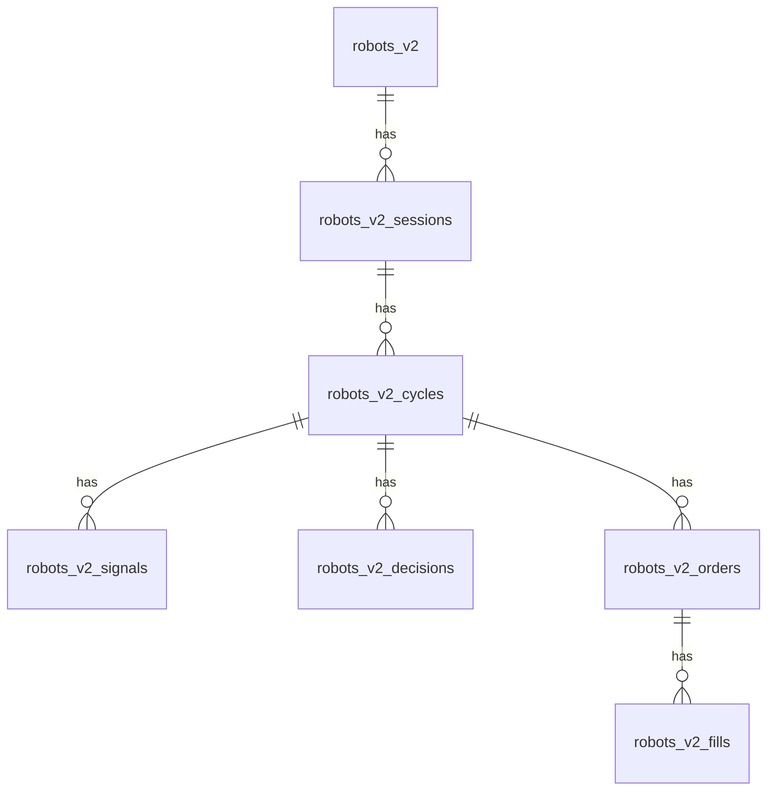
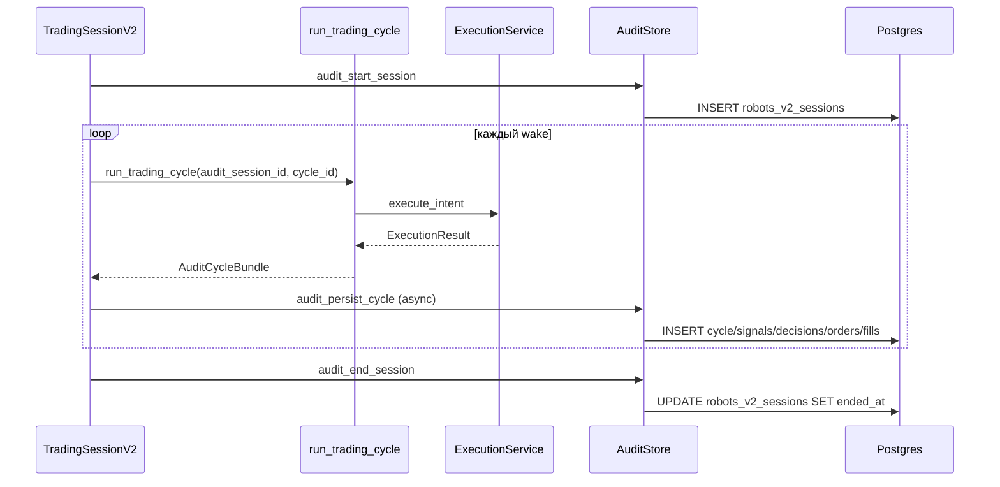

# Таблицы сделок и audit trail (robots v2)

Документ описывает, **где и что хранится** по торговым роботам: нормализованный audit в PostgreSQL, дополнительные логи и отличие от legacy v1.

См. также: [robots_greenfield_spec.md](./robots_greenfield_spec.md) §6.5 (Decision), миграция `alembic/versions/0059_robots_v2_audit.py`.

---

## Контуры

| Контур | FK робота | Audit-сделки | Статус |
|--------|-----------|--------------|--------|
| **Robots v1** | `robots.id` | `robot_trades`, `robot_signals`, `robot_run_cycles`, `robot_decisions` | Legacy, **v2 не пишет** |
| **Robots v2** | `robots_v2.id` | `robots_v2_*` (6 таблиц ниже) | Актуальный audit store |

Robots v2 — отдельный greenfield-контур. Таблицы v1 не переиспользуются и не мигрируются автоматически из файловых логов.

---

## ER-схема (robots v2 audit)



Иерархия: **сессия → цикл → (сигналы | решения | ордера → fills)**.

---

## Таблицы robots v2 audit

Миграция: `0059_robots_v2_audit` (`down_revision=0058_moex_index_cache`).

Код записи: `backend/app/modules/robots_v2/engine/audit.py` (`AuditStore`).  
Точки вызова:

- `session.py` — старт/стоп сессии, skip-циклы, fire-and-forget persist после `run_trading_cycle`
- `cycle.py` — сбор `AuditCycleBundle` (signals, decisions, executions) на один `cycle_id`

Запись **не блокирует** торговый цикл: `asyncio.to_thread` + ошибки → `logger.warning`.

---

### `robots_v2_sessions`

Одна строка = один запуск робота (от Start до Stop/Error).

| Колонка | Тип | Описание |
|---------|-----|----------|
| `id` | UUID PK | Audit session id (не путать с `session_id` в `run_trading_cycle`, там `robot_id`) |
| `robot_id` | bigint FK → `robots_v2.id` | Робот |
| `mode` | varchar(16) | `paper` / `live` |
| `virtual_capital` | numeric(20,4) | Стартовый капитал сессии |
| `account_id` | varchar(64) | Брокерский счёт (live) |
| `started_at` | timestamptz | Момент INSERT при переходе в RUNNING |
| `ended_at` | timestamptz | Заполняется при завершении |
| `stop_reason` | varchar(64) | `soft_stop`, `hard_stop`, `error` |

**Индекс:** `(robot_id, started_at)`.

**Когда пишется:** `audit_start_session()` после инициализации execution; `audit_end_session()` в `finally` при остановке.

---

### `robots_v2_cycles`

Один торговый цикл (poll / bar_close / price_tick) или skip-цикл.

| Колонка | Тип | Описание |
|---------|-----|----------|
| `id` | UUID PK | Стабильный `cycle_id` на весь pipeline |
| `session_id` | UUID FK → `robots_v2_sessions.id` | Сессия |
| `robot_id` | bigint FK | Денормализация для фильтров |
| `cycle_number` | int | Счётчик цикла в сессии |
| `triggered_by` | varchar(32) | `poll`, `bar_close`, `price_tick` |
| `started_at` | timestamptz | Начало цикла |
| `finished_at` | timestamptz | Конец цикла |
| `status` | varchar(16) | `ok` — полный pipeline; `skip` — пропуск |
| `skip_reason` | varchar(64) | При `status=skip`: см. ниже |
| `equity` | numeric(20,4) | Equity на конец цикла |
| `stats` | jsonb | `{ signals, fills, decisions }` — агрегаты |

**Индексы:** `(robot_id, started_at)`, `(session_id)`.

**Skip-reasons** (одна decision-строка на цикл, без tickerScan):

| `skip_reason` | Когда |
|---------------|-------|
| `NO_PRICES` | Нет цен по universe |
| `RECONCILE_FAILED` | Live: сверка с брокером не удалась |
| `EOD_HOLD` | EOD flatten / пауза входов |
| `OUTSIDE_SESSION` | Вне расписания MOEX |

**Когда пишется:** `AuditStore.persist_cycle()` / `_persist_skip_cycle()` в `session.py`.

---

### `robots_v2_signals`

Сигналы **стратегии** (не SL/TP exits из risk).

| Колонка | Тип | Описание |
|---------|-----|----------|
| `id` | UUID PK | |
| `cycle_id` | UUID FK | Цикл |
| `robot_id` | bigint FK | |
| `ticker` | varchar(32) | |
| `side` | varchar(8) | `BUY`, `SELL`, `CLOSE`, … |
| `kind` | varchar(32) | Обычно `signal` |
| `reason` | text | Текст из плагина стратегии |
| `price` | numeric(20,6) | Цена на момент сигнала (`last_price`) |
| `entry_price` | numeric(20,6) | Средняя цена открытой позиции (для CLOSE / add-to-position; null на flat BUY) |
| `delta_pct` | numeric(12,4) | Order-flow delta % на момент сигнала |
| `created_at` | timestamptz | = `finished_at` цикла |

**Индекс:** `(cycle_id)`.

**Не пишется:** полный `tickerScan` (20 строк NO_DATA/WARMUP на каждый тик) — только в RAM/WS/файл.

---

### `robots_v2_decisions`

Решения risk / strategy / schedule (allow / deny / skip).

| Колонка | Тип | Описание |
|---------|-----|----------|
| `id` | UUID PK | |
| `cycle_id` | UUID FK | |
| `robot_id` | bigint FK | |
| `stage` | varchar(32) | `strategy`, `risk`, `execution`, `schedule` |
| `outcome` | varchar(16) | `allow`, `deny`, `skip` |
| `code` | varchar(64) | Machine-readable, напр. `NO_SIGNAL`, `MAX_POSITIONS` |
| `message` | text | Человекочитаемое |
| `ticker` | varchar(32) | Опционально |
| `context` | jsonb | Остальные поля из audit dict |
| `created_at` | timestamptz | |

**Индексы:** `(robot_id, created_at)`, `(cycle_id)`.

**Примеры:**

- `NO_SIGNAL` — одна строка на цикл, `outcome=skip`, `stage=strategy`
- `ENTRIES_PAUSED`, `MAX_POSITIONS`, … — `outcome=deny`, `stage=risk`
- Skip-циклы — `stage=schedule`, `outcome=skip`, `code=NO_PRICES|…`

---

### `robots_v2_orders`

Каждая попытка исполнения intent (paper и live — один путь через cycle).

| Колонка | Тип | Описание |
|---------|-----|----------|
| `id` | UUID PK | Внутренний order id audit |
| `cycle_id` | UUID FK | |
| `robot_id` | bigint FK | |
| `ticker` | varchar(32) | |
| `side` | varchar(8) | `BUY` / `SELL` |
| `kind` | varchar(32) | `entry`, `exit_sl_tp`, `exit_strategy`, `flatten`, … |
| `quantity` | numeric(20,4) | |
| `price` | numeric(20,6) | Цена intent/fill |
| `status` | varchar(32) | `filled`, `rejected`, `submitted` |
| `mode` | varchar(16) | `paper` / `live` |
| `broker_order_id` | varchar(128) | ID у брокера (live) |
| `reject_reason` | text | При reject |
| `submitted_at` | timestamptz | |

**Индексы:** `(robot_id, submitted_at)`, `(broker_order_id)`, `(cycle_id)`.

**Источник:** `ExecutionResult` из `execution.py` → `execution_row_from_result()` в `cycle.py`.  
Пишется для **всех** executions в цикле, включая rejected (без fill).

---

### `robots_v2_fills`

Факт исполнения (только `status=filled`, qty>0, price>0).

| Колонка | Тип | Описание |
|---------|-----|----------|
| `id` | UUID PK | |
| `order_id` | UUID FK → `robots_v2_orders.id` | |
| `robot_id` | bigint FK | |
| `ticker` | varchar(32) | |
| `side` | varchar(8) | |
| `quantity` | numeric(20,4) | |
| `price` | numeric(20,6) | |
| `pnl` | numeric(20,6) | **Из ledger** (на live часто неверно — см. `realizedPnl` в API) |
| `commission` | numeric(20,6) | Пока NULL |
| `kind` | varchar(32) | Дублирует kind ордера |
| `filled_at` | timestamptz | |

**Индексы:** `(robot_id, filled_at)`, `(order_id)`.

**UI «Сделки»** на Monitor читает именно эту таблицу.

> **PnL:** значение `pnl` — из `PaperLedger.apply_fill`, не пересчитанное price-based по paired fills. Известные расхождения ledger PnL (напр. exit_strategy) **не исправляются** в audit — хранится факт как в runtime.

---

## Что **не** в audit-таблицах

| Данные | Где лежит |
|--------|-----------|
| Полный tickerScan (20 тикеров/цикл) | RAM (`session._last_ticker_scan`), WS `cycle.tickerScan`, REST `/status` |
| Текстовый action log | Файл `logs/app/{date}/robots/trading_robot/id_{robotId}_{HH}-{HH}.log` |
| HTTP к брокеру | `external_api_logs` (через `session_log.log_external_api`) |
| Live события (stage, equity) | WebSocket `/v2/robots/{id}/stream`, in-memory `event_bus` |
| Конфиг робота | `robots_v2.config`, история — `robot_config_history` |

Backfill из старых файловых логов в audit **не делается**.

---

## Поток записи



---

## Чтение (REST)

**Endpoint:** `POST /v2/robots/audit`

**Тело:**

```json
{
  "robotId": 1,
  "limit": 100,
  "offset": 0,
  "sessionId": "uuid-or-null",
  "types": ["fills", "cycles"]
}
```

| Поле | Описание |
|------|----------|
| `robotId` | Обязательный |
| `limit` / `offset` | Пагинация (1–500) |
| `sessionId` | Фильтр для `fills`, `cycles`, `decisions` |
| `types` | `sessions` \| `fills` \| `cycles` \| `decisions` \| `signals` — если не передан, **все** секции |

**Ответ:** объект с секциями `{ items: [...], total: N }` только для запрошенных типов.

Для `fills` каждый item дополнительно содержит:

| Поле | Описание |
|------|----------|
| `realizedPnl` | FIFO PnL после комиссии входа/выхода, **до налога** (только SELL) |
| `netPnl` | «В кармане»: `realizedPnl` − налог с прибыли (`taxPct`, только если PnL > 0) |
| `ledgerPnl` | Сырой PnL из ledger (на live **не использовать** для анализа) |

Код: `router.py` → `service.query_audit()` → `audit_queries.py` + `audit_pnl.enrich_fills_realized_pnl()`.

---

## Legacy v1 (справочно)

Используются роботами на `robots.id` (type=2 v1). Robots v2 **не пишет** сюда.

| Таблица | Назначение |
|---------|------------|
| `robot_trades` | Сделки/ордера v1 |
| `robot_signals` | Сигналы v1 |
| `robot_run_cycles` | Циклы v1 |
| `robot_decisions` | Решения v1 |
| `robot_order_events` | История статусов ордера |

FK: `robot_id → robots.id`.

---

## Связанные файлы

| Файл | Роль |
|------|------|
| `alembic/versions/0059_robots_v2_audit.py` | DDL |
| `backend/app/modules/robots_v2/engine/audit.py` | INSERT writer |
| `backend/app/modules/robots_v2/engine/cycle.py` | Сбор bundle |
| `backend/app/modules/robots_v2/engine/session.py` | Session start/stop, skip persist |
| `backend/app/modules/robots_v2/audit_queries.py` | SELECT для REST |
| `backend/app/modules/robots_v2/service.py` | `query_audit()` |
| `frontend/.../RobotV2MonitorPage.tsx` | Таблица «Сделки» (`types: ['fills']`) |

---

## Деплой

Перед первой live/paper-сессией с audit:

```bash
alembic upgrade head
```

Проверка наличия таблиц:

```sql
SELECT tablename FROM pg_tables
WHERE tablename LIKE 'robots_v2_%'
ORDER BY 1;
```
