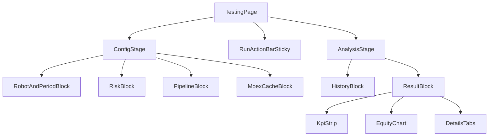

# UX/UI-спецификация рефакторинга `/testing`

## 1. Цель и контекст

Цель: сделать вкладку `/testing` быстрее в ежедневной работе трейдера/квант-разработчика за счет более ясной структуры, предсказуемых состояний и единых интерактивных паттернов.

Фокус этого документа:
- IA и layout страницы (desktop-first, затем tablet/mobile).
- UX-потоки: настройка -> запуск -> мониторинг -> анализ -> сравнение прогонов.
- Состояния интерфейса и правила обратной связи пользователю.
- Критерии приемки для последующей реализации.

**Продуктовые поля формы** (обязательность, блоки A–E, сценарий входа, матрица заказчик → UI/backend): **`docs/BRD-ARCH-02-unified-backtest-testing-spec.md`** §4.0–4.3 (актуальная версия документа — в шапке файла). Этот UI-документ дополняет BRD layout- и state-деталями; **§7.4** ниже — единая с BRD §4.1B политика пресета риска без робота.

Не входит:
- Изменение API и backend-контрактов.
- Изменение бизнес-логики бэктест-алгоритма.

## 2. Текущая реализация (as-is)

### 2.1 Карта текущих точек

- Маршрут: `frontend/src/app/App.tsx` (`path="testing"`).
- Контейнер: `frontend/src/pages/TestingPage.tsx`.
- Основная композиция: `frontend/src/pages/testing/TestingPageContent.tsx`.
- Блоки UI:
  - `TestingMoexCacheCard.tsx`
  - `TestingRobotParamsCard.tsx`
  - `TestingRiskParamsCard.tsx`
  - `TestingPipelineCard.tsx`
  - `TestingBacktestRunSection.tsx`
  - `TestingBacktestHistoryCard.tsx`
  - `TestingBacktestResultPanel.tsx`
- Стили в основном в `frontend/src/styles/global.css` через `[data-page='testing']`.

### 2.2 Основные UX-проблемы

1. Слишком длинный линейный скролл  
Пользователь последовательно проходит много карточек, при этом primary action ("Запустить бэктест") визуально теряется между секциями.

2. Нет стабильного action-контекста  
Кнопка запуска и статус run не закреплены; при длинной форме пользователь теряет контекст текущего состояния прогона.

3. Неравномерные паттерны ввода/таблиц  
Смешение разных визуальных подходов и inline-стилей затрудняет предсказуемость интерфейса.

4. История и результат конкурируют за внимание  
Секции одинакового визуального веса, но разного приоритета по сценарию использования.

5. Недостаточно явные empty/error/partial состояния  
Есть текстовые fallback-значения, но нет единого контракта состояний для каждой секции.

### 2.3 Дизайн-системные ограничения (обязательно учитывать)

- Использовать семантические токены (`--color-up`, `--color-down`, `--bg-card`, `--border-subtle`) вместо локальных хардкодов.
- Проверять читаемость в `data-theme='dark'` и `data-theme='light'`.
- Для trading-данных сохранять единообразие цветовой семантики P&L.

## 3. Целевой UX (to-be)

### 3.1 Принципы

- Action-first: запуск и ключевой статус всегда легко доступны.
- Progressive disclosure: сначала базовые настройки, продвинутые детали по раскрытию.
- Predictable states: единая модель `loading / ready / empty / error / partial`.
- Scanability: пользователь считывает KPI/результат за 3-5 секунд.

### 3.2 Целевая структура экрана (desktop >= 1440)

#### Desktop layout (wire-level)

- Zone A: Заголовок страницы + subtitle состояния.
- Zone B: ConfigStage в 2 колонки:
  - Левая: Robot/Period + Risk.
  - Правая: Pipeline + MOEX Cache.
- Zone C: Sticky RunActionBar (ниже конфигурации, фиксируется при скролле).
- Zone D: AnalysisStage:
  - D1: История прогонов.
  - D2: Результат выбранного/последнего прогона.

#### Tablet (768-1439)

- ConfigStage переходит в 1 колонку.
- Sticky-bar сохраняется, но упрощается до одной линии (CTA + статус).
- History и Result располагаются вертикально, порядок: Result -> History.

#### Mobile (<768)

- Верхний приоритет: CTA, краткий статус, KPI.
- Табличные секции с collapsible-блоками.
- По умолчанию открыт только активный details-tab.

## 4. Пользовательские сценарии

### S1. Базовый запуск

1. Выбор робота/периода/интервала.
2. Корректировка риска и pipeline.
3. Нажатие "Запустить бэктест" в sticky-bar.
4. Наблюдение статуса подготовки/прогона.
5. Получение KPI + графика + деталей.

Ожидание UX:
- CTA не исчезает из видимой области.
- Ошибки валидации подсвечиваются рядом с полем и в summary на sticky-bar.

### S2. Анализ и сравнение истории

1. Фильтрация истории (поиск + мин. доходность).
2. Открытие отдельного прогона.
3. Выбор 2 запусков для сравнения.
4. Быстрый просмотр дельт по доходности/капиталу/сделкам.

Ожидание UX:
- Сравнение доступно только при валидном выборе двух разных run.
- Таблица и summary сравнения визуально связаны.

### S3. Работа с MOEX cache job

1. Запуск job догрузки свечей.
2. Наблюдение прогресса и meta-информации.
3. Повторный запуск/дозагрузка при необходимости.

Ожидание UX:
- Прогресс и статус job читаются без прокрутки всей страницы.
- Долгий процесс имеет понятную обратную связь и "последнее обновление".

## 5. Контракт состояний интерфейса

Для каждой секции (`Config`, `Run`, `History`, `Result`, `MOEX`) обязателен контракт:

- `loading`: skeleton или inline loader без layout shift.
- `ready`: основное содержимое.
- `empty`: объяснение "почему пусто" + следующий шаг.
- `error`: понятное сообщение + retry действие.
- `partial`: часть данных недоступна, но остальное usable.

Дополнительно:
- Любое длительное действие > 1.5s показывает progress-hint.
- Для retry и refresh использовать единый паттерн кнопки (`size`, `variant`, текст).

## 6. Компонентная модель (целевой UI-контур)

### 6.1 Секции и слоты

Каждая крупная карточка должна иметь структуру:
- `header` (title + secondary actions),
- `body` (основной контент),
- `footer` (context actions/summary), при необходимости.

### 6.2 RunActionBarSticky

Содержимое:
- Primary CTA "Запустить бэктест".
- Краткий статус (`idle`, `running`, `failed`, `done`).
- Быстрый индикатор валидности формы.
- Вторичные действия: `Сброс фильтров`/`Обновить историю` (опционально).

Правила:
- Sticky на desktop/tablet.
- На mobile — компактная "липкая" нижняя панель.

### 6.3 ResultBlock приоритет

Порядок внутри блока:
1. KPI strip.
2. Equity chart.
3. Details tabs.

Причина: сначала итог, затем динамика, затем детальные таблицы.

## 7. UX-правила по элементам

### Формы

- Явная обязательность полей и подсказки на уровне поля.
- Ошибки дат/диапазона — сразу рядом с контролом.
- Изменение параметров после последнего run отображает "конфиг изменен" в sticky-bar.

### 7.4 Блок риска: робот выбран / не выбран `[ref: BRD-ARCH-02 §4.1B]`

**Источник правды по числам пресета без робота:** дефолты Pydantic-модели **`GrainSeedRisk`** в `backend/app/modules/robots/schemas.py` (поля `stop_loss_percent`, `take_profit_percent`, `max_position_percent`, `max_position_rub`, `max_daily_loss`, `trading_hours_start` / `trading_hours_end`, `allowed_weekdays`). На фронте — одна константа/фабрика (например `getGrainSeedRiskPreset()`), **численно и по строковым полям совпадающая** с этими дефолтами, чтобы `POST /api/robots/history-backtest` при отсутствии `robot_id` всегда получал валидный **`config.risk`** (иначе сервер: `config.risk is required when robot_id is omitted`).

| Ситуация | UX |
|----------|-----|
| **Робот выбран** | После загрузки шаблона робота заполнить блок риска значениями из ответа API. При смене робота на другого — заменить риск на шаблон нового робота; если пользователь уже правил риск вручную, показать **ненавязчивый confirm** («Заменить параметры риска данными выбранного робота?») — допускается отложить confirm на Phase 2, но тогда документировать «всегда перезаписывать» в PR. |
| **Робот не выбран** | При первом осмысленном состоянии формы (стратегия `grain_seed` выбрана или дефолтна) подставить **пресет** риска из таблицы выше; поля **не пустые**, не «серые плейсхолдеры без значения». |
| **CTA «Запустить бэктест»** | **Разрешён**, если выполнены BRD §4.1A, объект `config.risk` валиден по диапазонам и нет блокирующего активного прогона; **отдельное модальное «подтвердить пресет» не требуется**. |
| **Подсказка** | Пока пользователь **не менял** ни одного поля риска с момента подстановки пресета и робот не выбран — показать под заголовком секции или однострочный баннер: *«Параметры риска — пресет для ручного бэктеста (как в шаблоне стратегии); при необходимости измените.»* После первого изменения любого поля риска или после выбора робота — скрыть. |

### Таблицы

- Единый заголовок, плотность строк, поведение пустого состояния.
- Sticky header для длинных таблиц.
- Числа выровнены вправо, единицы/валюта стандартизованы.

### Цветовая семантика

- Доход/рост: только `--color-up`.
- Убыток/снижение: только `--color-down`.
- Предупреждения: `--color-warn`.

### Доступность

- Видимые focus-state для клавиатурной навигации.
- Контраст текста в обеих темах не ниже текущих проектных токенов.
- Все action controls имеют понятные подписи.

## 8. План внедрения по фазам

### Phase 1: Layout and state clarity

- Пересобрать страницу на `ConfigStage + Sticky RunActionBar + AnalysisStage`.
- Внедрить единый state-contract секций.
- Убрать критичные inline-style в ключевых карточках.

### Phase 2: Interaction consistency

- Привести формы/таблицы к единому поведению.
- Уточнить сценарии history compare и validation-feedback.
- Добавить consistent empty/error блоки.

### Phase 3: Polish and responsiveness

- Выравнивание desktop/tablet/mobile поведения.
- Финальная визуальная шлифовка без разрыва темы dark/light.
- Проверка UX-критериев и фиксация остаточных рисков.

## 9. Acceptance checklist

### A. Структура и навигация

- [ ] На desktop присутствуют 4 зоны: Header, ConfigStage, Sticky RunActionBar, AnalysisStage.
- [ ] Primary CTA доступен без возврата к верхней части страницы.
- [ ] ResultBlock визуально приоритетнее HistoryBlock.

### B. Состояния

- [ ] Для каждой ключевой секции реализованы `loading/ready/empty/error/partial`.
- [ ] Нет "немых" состояний без текста и next-step действия.
- [ ] Длительные операции имеют прогресс-обратную связь.

### B1. Риск без робота `[ref: §7.4]`

- [ ] При отсутствии выбранного робота `config.risk` инициализируется пресетом, совпадающим с `GrainSeedRisk` в `schemas.py`.
- [ ] Баннер/подпись пресета показывается до первого ручного изменения поля риска или до выбора робота.
- [ ] CTA запуска не блокируется искусственным «подтверди пресет», если остальная форма валидна.

### C. Консистентность UI

- [ ] Формы используют единый ритм отступов и подписи.
- [ ] Табличные секции имеют единый паттерн заголовка/empty state.
- [ ] Семантические цвета P&L единообразны во всех виджетах.

### D. Темизация и доступность

- [ ] Экран читаем и в `dark`, и в `light`.
- [ ] Нет критичных хардкод-цветов, конфликтующих с токенами темы.
- [ ] Focus-state явно видимы для интерактивных элементов.

## 10. Риски реализации и контроль

- Риск: "косметический" рефакторинг без улучшения сценариев.  
  Контроль: принимать изменения только по сценариям S1-S3 и checklist.

- Риск: деградация в light theme.  
  Контроль: отдельная smoke-проверка обеих тем.

- Риск: слишком много изменений одним пакетом.  
  Контроль: внедрение по Phase 1/2/3 с отдельным review-гейтом.

