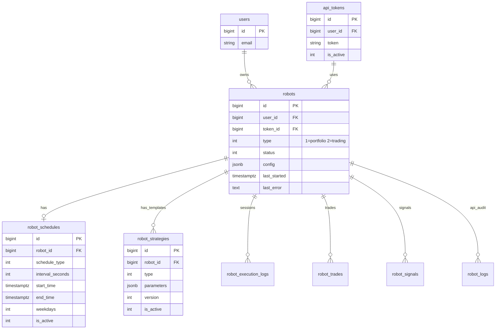
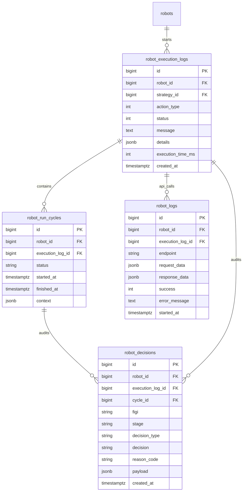
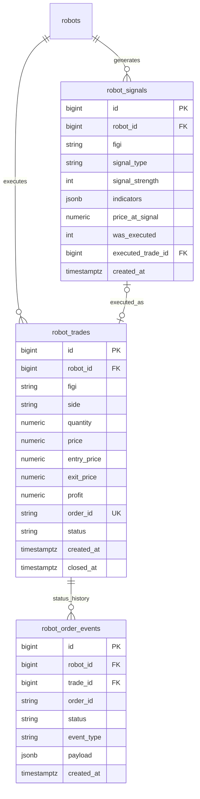
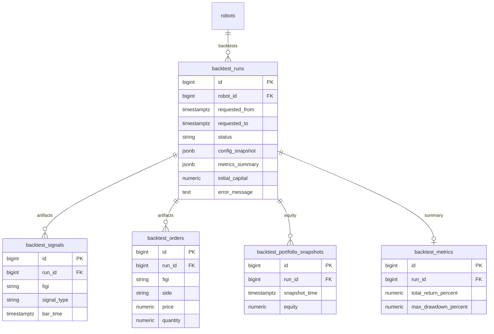
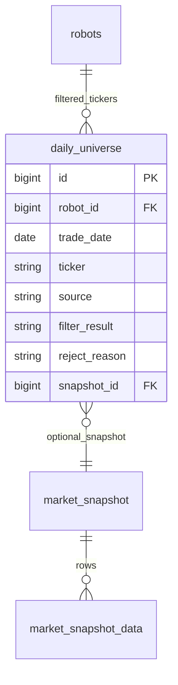

# Целевая архитектура роботов: унифицированное ядро и рыночные фасады  
  
**Версия:** 1.0    
**Дата:** 16.06.2026    
**Статус:** Target architecture (после реализации BRD-ARCH-04 + ByBit roadmap v2)    
**Связанные документы:**  
  
- [ROBOTS-TECH-PORTFOLIO-TRADING.md](ROBOTS-TECH-PORTFOLIO-TRADING.md) — эксплуатационная техдокументация  
- [BRD-ARCH-04-trading-core-facade-orchestrator.md](BRD-ARCH-04-trading-core-facade-orchestrator.md) — контракт ядра  
- [ROBOTS-TECH-ROAD-MAP_BYBIT.md](ROBOTS-TECH-ROAD-MAP_BYBIT.md) — crypto-интеграция  
  
---  
  
## 1. Executive summary  
  
После реализации система строится по принципу:  
  
> **Одно торговое ядро** → **тонкие рыночные адаптеры** → **единые REST/UI** с условным отображением полей.  
  
Три контура роботов:  
  
| Контур              | `robot_type` | Runtime                         | Брокер / рынок              |     |
| ------------------- | ------------ | ------------------------------- | --------------------------- | --- |
| Обновление портфеля | `1`          | `PortfolioUpdaterRobot`         | T-Invest (основной)         |     |
| Торговля MOEX       | `2`          | `TradingOrchestrator(LIVE)`     | `tinvest` или `bitby`       |     |
| Торговля crypto     | `2`          | `TradingOrchestrator(LIVE)`     | `bybit`                     |     |
| History backtest    | — (job)      | `TradingOrchestrator(BACKTEST)` | данные MOEX или ByBit kline |     |
  
**Ключевое правило:** нет отдельных `ByBitTradingSession` / `MoexTradingSession`. Есть один orchestrator и разные фасады исполнения и данных.  
  
---  
  
## 2. C4: контейнеры и потоки  
  
```mermaid  
flowchart TB  
    subgraph ui [Frontend]        ROBOTS_UI["/robots — настройка"]        LIVE_UI["/live — мониторинг"]        TEST_UI["/testing — backtest"]        PORT_UI["/portfolio — снимки"]    end  
    subgraph api [FastAPI /api]        RAPI["/robots/*"]        DMSAPI["/dms/*"]        OPS["/scheduler/*/run"]    end  
    subgraph sched [Schedulers]        PSCH[PortfolioUpdaterScheduler]        TSCH[TradingScheduler]        DSCH[DmsScheduler]    end  
    subgraph core [Unified trading runtime]        ORCH[TradingOrchestrator]        SESS[TradingSession / BacktestTradingSession]        TCORE[TradingCore.run_cycle]        PIPE[PipelineRunner]        RISK[RiskManager]        EXEC[ExecutionService]        MDF[MarketDataFacade]    end  
    subgraph facades [Market facades — раздельные]        TINV[TInvestBrokerFacade]        BBY_MOEX[BitByBrokerFacade MOEX]        BBY_CR[ByBitBrokerFacade crypto]        MOEX_P[moex_backtest / moex_snapshots]        BBY_P[bybit_market provider]    end  
    subgraph db [PostgreSQL]        ROB[(robots + runtime tables)]        MKT[(market + DMS tables)]        BT[(backtest tables)]        PF[(portfolio tinvest tables)]    end  
    ROBOTS_UI --> RAPI    LIVE_UI --> RAPI    LIVE_UI --> WS["/ws/live"]    TEST_UI --> RAPI  
    PSCH --> ORCH    TSCH --> ORCH    RAPI --> ORCH    ORCH --> SESS --> TCORE    TCORE --> PIPE    TCORE --> RISK    TCORE --> EXEC    TCORE --> MDF  
    EXEC --> TINV    EXEC --> BBY_MOEX    EXEC --> BBY_CR    MDF --> MOEX_P    MDF --> BBY_P    MDF --> TINV  
    TCORE --> ROB    EXEC --> ROB    PIPE --> MKT    ORCH --> BT    PSCH --> PF  
```  
  
---  
  
## 3. Модули: общие и различные  
  
### 3.1 Общие модули (все рынки)  
  
| Модуль | Путь | Назначение |  
|--------|------|------------|  
| REST API роботов | `backend/app/modules/robots/router.py` | CRUD, config, backtest, jobs |  
| Сервис роботов | `backend/app/modules/robots/service.py` | бизнес-операции, оркестрация job |  
| Схемы config v2 | `backend/app/modules/robots/config/v2_schema.py` | П1/П2/П3 + legacy mirror |  
| Trading orchestrator | `backend/app/modules/robots/trading/runtime/orchestrator.py` | live + backtest entry |  
| Trading session | `backend/app/modules/robots/trading/session.py` | live loop (WS + trade worker) |  
| Backtest session | `backend/app/modules/robots/trading/session_backtest.py` | bar replay |  
| Trading core | `backend/app/modules/robots/trading/core/trading_core.py` | один торговый цикл |  
| Strategies | `backend/app/modules/robots/trading/strategies/*` | grain_seed, momentum_breakout, reversion_to_ma |  
| Risk | `backend/app/modules/robots/trading/risk/*` | RiskManager, RiskParams |  
| Execution | `backend/app/modules/robots/trading/execution/*` | LiveExecutionService, SimExecution |  
| Indicators | `backend/app/modules/robots/trading/indicators/*` | bootstrap, on_closed_candle |  
| Broker factory | `backend/app/modules/robots/trading/brokers/factory.py` | `create_broker_facade(type)` |  
| Broker routing | `backend/app/modules/robots/trading/brokers/routing.py` | normalize, filter instruments |  
| Schedulers | `portfolio_updater/scheduler`, `trading/scheduler` | фоновые циклы |  
| Live WS hub | `backend/app/modules/robots/live_ws.py`, `live_hub.py` | стрим событий в UI |  
| Portfolio robot | `backend/app/modules/robots/portfolio_updater/robot.py` | type=1 |  
  
### 3.2 MOEX-only модули  
  
| Модуль                   | Путь                                                    | Назначение                               |     |
| ------------------------ | ------------------------------------------------------- | ---------------------------------------- | --- |
| Universe jobs П1/П2      | `backend/app/modules/robots/universe_jobs.py`           | candidate_pool → allowed_figis           |     |
| Pipeline runner          | `backend/app/modules/robots/trading/pipeline/runner.py` | DMS filters + dividend calendar          |     |
| DMS service              | `backend/app/modules/dms/service.py`                    | snapshots, candles_cache, daily_universe |     |
| MOEX market data         | `trading/data/providers/moex_*`                         | backtest/live MOEX candles               |     |
| Grain seed orchestration | `trading/grain_seed_orchestrator.py`                    | сессионные правила MOEX                  |     |
| T-Invest integration     | `backend/app/modules/tinvest/*`                         | REST/WS брокер MOEX                      |     |
| BitBy MOEX broker        | `backend/app/modules/bitby/*`, `brokers/bitby.py`       | альтернативный MOEX execution            |     |
| Corporate actions        | `backend/app/modules/corporate_actions/*`               | дивиденды в pipeline                     |     |
  
### 3.3 Crypto-only модули (целевые, после roadmap)  
  
| Модуль | Путь | Назначение |  
|--------|------|------------|  
| ByBit API | `backend/app/modules/bybit/*` | REST v5, WS, signer |  
| ByBit broker facade | `trading/brokers/bybit.py` | `BrokerFacade` для crypto |  
| ByBit market provider | `trading/data/providers/bybit_market.py` | live/backtest kline |  
| Crypto universe jobs | `trading/crypto_universe_jobs.py` *(план)* | top volume, spread filters |  
| Funding adapter | `bybit/funding.py` *(план)* | funding rate в risk/costs |  
  
### 3.4 Матрица «кто что использует»  
  
| Компонент              | Portfolio `type=1` | MOEX `type=2` | Crypto `type=2` | Backtest   |     |
| ---------------------- | ------------------ | ------------- | --------------- | ---------- | --- |
| TradingOrchestrator    | —                  | ✓             | ✓               | ✓          |     |
| TradingCore            | —                  | ✓             | ✓               | ✓          |     |
| PipelineRunner (DMS)   | —                  | ✓             | —               | ✓ (MOEX)   |     |
| Universe jobs П1/П2    | —                  | ✓             | —               | ✓ (MOEX)   |     |
| Crypto universe        | —                  | —             | ✓               | ✓ (crypto) |     |
| TInvestBrokerFacade    | ✓ (portfolio)      | ✓             | —               | —          |     |
| BitByBrokerFacade      | —                  | ✓             | —               | —          |     |
| ByBitBrokerFacade      | —                  | —             | ✓               | ✓ (sim)    |     |
| MarketDataFacade MOEX  | —                  | ✓             | —               | ✓          |     |
| MarketDataFacade ByBit | —                  | —             | ✓               | ✓          |     |
  
---  
  
## 4. Фасады: как выглядят после реализации  
  
### 4.1 Слой брокерского исполнения (`BrokerFacade`)  
  
Единый абстрактный контракт (`trading/brokers/base.py`):  
  
```  
get_accounts, get_portfolio, get_free_funds  
get_candles, post_order, post_market_order  
get_order_state, get_orders, cancel_order  
connect_websocket, subscribe_prices, close  
```  
  
Реализации:  
  
| Фасад                     | `broker_type` | Внешний модуль     | Инструмент        | Особенности                 |     |
| ------------------------- | ------------- | ------------------ | ----------------- | --------------------------- | --- |
| `TInvestBrokerFacade`     | `tinvest`     | `modules/tinvest/` | FIGI (BBG…)       | MOEX session, T-Invest WS   |     |
| `BitByBrokerFacade`       | `bitby`       | `modules/bitby/`   | тикеры MOEX       | REST quotes, MOEX execution |     |
| `ByBitBrokerFacade`       | `bybit`       | `modules/bybit/`   | symbols (BTCUSDT) | 24/7, short, leverage       |     |
| `SimBacktestBrokerFacade` | —             | internal           | оба               | backtest fills              |     |
| `StubBrokerFacade`        | `vtb`, `alfa` | stub               | —                 | заглушки                    |     |
  
Фабрика:  
  
```python  
create_broker_facade(broker_type, token) -> BrokerFacade  
```  
  
Ядро **не импортирует** HTTP-клиенты брокеров напрямую — только фасад.  
  
### 4.2 Слой рыночных данных (`MarketDataFacade`)  
  
Единый контракт (`trading/data/facade.py`):  
  
- `ensure_candles` — gap-fill + cache  
- `read_candles_cache_rows`  
- `ensure_snapshot_day` — для MOEX pipeline  
- `gap_fill_ticker`  
  
Провайдеры внутри:  
  
| Провайдер               | Когда                      | Источник                   |     |
| ----------------------- | -------------------------- | -------------------------- | --- |
| `moex_backtest`         | backtest MOEX, П1 lookback | MOEX ISS → `candles_cache` |     |
| `moex_snapshots`        | П2 snapshot day            | DMS `market_snapshot_*`    |     |
| `bitby_market`          | live MOEX via bitby        | BitBy REST                 |     |
| `tinvest` (via broker)  | live MOEX bootstrap        | T-Invest GetCandles        |     |
| `bybit_market` *(план)* | live/backtest crypto       | ByBit kline API            |     |
  
### 4.3 Слой исполнения сигналов (`ExecutionService`)  
  
- `LiveExecutionService` — live, вызывает `BrokerFacade`  
- `SimExecution` — backtest, без внешнего брокера  
  
Один интерфейс, разные backend'ы по `broker_type` из config.  
  
### 4.4 Слой universe (отбор инструментов)  
  
| Контур | Job | Вход | Выход в config |  
|--------|-----|------|----------------|  
| MOEX П1 | `rebuild_candidate_pool` | TQBR + historical filters | `candidate_pool.tickers` |  
| MOEX П2 | `rebuild_paper_selection` | DMS snapshot + paper filters | `allowed_figis` |  
| Crypto *(план)* | `rebuild_crypto_universe` | ByBit tickers + volume/spread | `allowed_symbols` / `allowed_figis` |  
  
`PipelineRunner` (DMS) — **только MOEX**. Для crypto — отдельный screening job без dividend/TQBR filters.  
  
---  
  
## 5. Роботы: типы и config после реализации  
  
### 5.1 Portfolio robot (`type=1`)  
  
**Назначение:** синхронизация портфеля и операций с брокером.  
  
**Config:** минимальный (`PortfolioUpdaterConfig`), привязка к `token_id`.  
  
**Runtime:** `PortfolioUpdaterScheduler` → `PortfolioUpdaterRobot.run()`.  
  
**Не использует:** TradingCore, Pipeline, strategies.  
  
### 5.2 Trading robot MOEX (`type=2`, `broker_type ∈ {tinvest, bitby}`)  
  
**Config v2 (источник правды):**  
  
```json  
{  
  "config_version": 2,  "broker_type": "tinvest",  "universe_mode": "dms_pipeline",  "historical_screening": {    "enabled": true,    "source": "moex",    "board": "TQBR",    "interval": "CANDLE_INTERVAL_10_MIN",    "lookback_days": 14,    "filters": [{ "type": "atr", "min_percent": 1.5, "period": 14 }],    "refresh": { "daily_at_msk": "07:00" }  },  "paper_selection": {    "enabled": true,    "input": "candidate_pool",    "mode": "ALL",    "filters": [{ "type": "volume", "min": 1000000 }],    "refresh": { "every_minutes": 30, "only_trading_hours": true }  },  "signal_generation": {    "strategy": "momentum_breakout",    "params": { "interval": "CANDLE_INTERVAL_5_MIN", "lookback_days": 5 },    "data_source": "tinvest",    "update_interval_seconds": 10  },  "allowed_figis": ["BBG004730N88"],  "risk": { "stop_loss_percent": 2, "trading_hours_start": "10:00 MSK" },  "costs": { "broker_commission_rate": 0.0005, "ndfl_rate": 0.13 }}  
```  
  
**Расписание:** `robot_schedules` + `risk.allowed_weekdays`.  
  
### 5.3 Trading robot Crypto (`type=2`, `broker_type=bybit`)  
  
**Config v2 + crypto extension:**  
  
```json  
{  
  "config_version": 2,  "broker_type": "bybit",  "market_profile": "crypto",  "bybit": {    "testnet": true,    "instrument_type": "linear_perpetual",    "position_mode": "one_way",    "leverage": 3,    "symbols": ["BTCUSDT", "ETHUSDT"]  },  "crypto_universe": {    "enabled": true,    "min_volume_24h_usd": 50000000,    "max_spread_bps": 15,    "refresh": { "every_minutes": 60 }  },  "signal_generation": {    "strategy": "reversion_to_ma",    "params": { "interval": "CANDLE_INTERVAL_5_MIN", "ma_period": 20 },    "data_source": "bybit",    "update_interval_seconds": 10  },  "allowed_figis": ["BTCUSDT"],  "risk": {    "allow_short": true,    "max_leverage": 5,    "max_daily_loss": 3  },  "costs": {    "maker_fee_rate": 0.0001,    "taker_fee_rate": 0.0006  }}  
```  
  
**Отличия от MOEX:**  
  
- нет `historical_screening` / `paper_selection` DMS (или `enabled: false`)  
- schedule 24/7 (`schedule_type=1`)  
- costs: maker/taker вместо НДФЛ  
- instrument id = symbol, не FIGI  
  
### 5.4 Backtest job (не отдельный robot type)  
  
- snapshot `robots.config` на момент запуска  
- `backtest_runs` + артефакты  
- тот же `TradingOrchestrator.run_backtest_replay`  
- источник свечей зависит от `market_profile` / `broker_type`  
  
---  
  
## 6. Таблицы БД: общие и различные  
  
### 6.1 Общие (все роботы)  
  
| Таблица | Назначение |  
|---------|------------|  
| `robots` | сущность робота, `type`, `status`, `config` JSONB |  
| `robot_schedules` | расписание live-сессий |  
| `api_tokens` | токены брокеров (per user) |  
| `robot_execution_logs` | запуск/завершение сессии |  
| `robot_run_cycles` | торговые циклы внутри сессии |  
| `robot_logs` | API call audit |  
| `robot_signals` | сгенерированные сигналы |  
| `robot_trades` | сделки/ордера |  
| `robot_decisions` | audit pipeline/risk |  
| `robot_order_events` | события статусов ордеров |  
  
### 6.2 MOEX / DMS (universe pipeline)  
  
| Таблица | Назначение |  
|---------|------------|  
| `daily_universe` | результат П2 по дням (robot_id, ticker, filter_result) |  
| `market_snapshot` / `market_snapshot_data` | оперативные снапшоты TQBR |  
| `market_snapshot_history` / `_data_history` | архив снапшотов |  
| `candles_cache` | кэш MOEX свечей (П1, backtest) |  
| `shared_market_candles` | общий TS storage |  
| `tqbr_securities` | справочник бумаг |  
| `dms_subscriptions` | подписки на авто-снапшоты |  
  
### 6.3 Backtest  
  
| Таблица | Назначение |  
|---------|------------|  
| `backtest_runs` | прогон (status, progress, ETA) |  
| `backtest_signals` | сигналы прогона |  
| `backtest_orders` | ордера прогона |  
| `backtest_portfolio_snapshots` | equity curve points |  
| `backtest_metrics` | агрегированные KPI |  
| `backtest_comparisons` | сравнение прогонов |  
  
### 6.4 Portfolio (type=1)  
  
| Таблица | Назначение |  
|---------|------------|  
| `tinvest_accounts` | счета пользователя |  
| `portfolio_snapshots` | снимки портфеля |  
| `account_operations` | синхронизированные операции |  
  
### 6.5 Crypto *(план, опционально)*  
  
| Таблица | Назначение |  
|---------|------------|  
| `bybit_candles_cache` *(или reuse candles_cache с market=bybit)* | kline history |  
| `crypto_universe_daily` *(опционально)* | аналог daily_universe для symbols |  
  
**Принцип:** runtime-таблицы роботов (`robot_*`, `backtest_*`) **общие**; market data tables **разделяются по провайдеру**, но с единым доступом через `MarketDataFacade`.  
  
---  
  
## 7. REST API  
  
### 7.1 Общие endpoints (`/api/robots`)  
  
| Метод | Path | Назначение | Рынок |  
|-------|------|------------|-------|  
| POST | `/data` | список роботов | все |  
| POST | `/create` | создать робота | все |  
| GET | `/id/{robot_id}` | карточка | все |  
| POST | `/update` | patch робота | все |  
| POST | `/change_status` | вкл/выкл | все |  
| POST | `/delete` | soft delete | все |  
| POST | `/config` | сохранить config | все |  
| POST | `/schedule` | расписание | все |  
| GET | `/strategies` | метаданные стратегий | trading |  
| GET | `/trading-defaults` | комиссии/НДФЛ defaults | trading |  
| POST | `/live/snapshot` | снимок live-состояния | trading |  
| POST | `/migrate-config-v2` | миграция config | trading |  
  
### 7.2 MOEX universe jobs  
  
| Метод | Path | Назначение |  
|-------|------|------------|  
| POST | `/jobs/historical-screening` | П1 → candidate_pool |  
| POST | `/jobs/paper-selection` | П2 → allowed_figis |  
| POST | `/sync-universe` | полный pipeline sync |  
  
### 7.3 Backtest  
  
| Метод | Path | Назначение |  
|-------|------|------------|  
| POST | `/history-backtest` | запуск (sync/202) |  
| GET | `/history-backtest/runs/active` | активный прогон |  
| GET | `/history-backtest/runs/{id}` | детали |  
| GET | `/history-backtest/runs/{id}/status` | лёгкий статус + ETA |  
| POST | `/history-backtest/runs/{id}/cancel` | отмена |  
| POST | `/history-backtest/list` | история |  
| POST | `/history-backtest/compare` | сравнение прогонов |  
  
### 7.4 DMS (`/api/dms`) — MOEX only  
  
| Метод | Path | Назначение |  
|-------|------|------------|  
| POST | `/pipeline/preview` | проверка фильтров П2 (кнопка «Проверить») |  
| POST | `/initialize-day` | snapshot + universe за день |  
| GET | `/daily-universe` | результат отбора |  
| GET | `/filter-log` | журнал фильтрации |  
| POST | `/snapshots/create` | ручной снапшот |  
  
### 7.5 Crypto *(план)*  
  
| Метод | Path | Назначение |  
|-------|------|------------|  
| POST | `/robots/jobs/crypto-screening` | universe top pairs |  
| GET | `/bybit/instruments` | справочник символов |  
| GET | `/bybit/funding-rate` | funding для UI |  
  
### 7.6 Операторские (`/api/scheduler`)  
  
| Метод | Path | Назначение |  
|-------|------|------------|  
| GET | `/scheduler/portfolio/run` | force portfolio cycle |  
| GET | `/scheduler/trading/run/{robot_id}` | force trading session |  
  
### 7.7 WebSocket  
  
| Endpoint | Назначение |  
|----------|------------|  
| `WS /ws/live?robot_id=&token=` | price, log, order events |  
  
События: `init`, `price`, `log`, `order`, `ping`, `error` + envelope (`event_id`, `run_id`, `cycle_id`).  
  
---  
  
## 8. UI: маршруты и экраны  
  
### 8.1 Маршруты frontend  
  
| Route | Страница | Аудитория |  
|-------|----------|-----------|  
| `/robots` | `TradingRobotSettingsPage` | настройка portfolio + trading |  
| `/live` | `LivePage` | мониторинг live-сессий, WS |  
| `/testing` | `TestingPage` | backtest, presets, universe cards |  
| `/portfolio` | `PortfolioPage` | снимки портфеля (type=1) |  
| `/dashboard` | KPI, обзор | все |  
| `/analytics` | метрики торговли | trading |  
| `/settings` | токены API | все |  
  
### 8.2 UI: общие блоки (все trading robots)  
  
| Блок | Компонент | Backend |  
|------|-----------|---------|  
| Список роботов | sidebar cards | `POST /robots/data` |  
| Общие поля | name, token, type, schedule | `/create`, `/schedule` |  
| П3 стратегия | strategy form, risk, costs | `/config`, `/strategies` |  
| Pipeline visualizer | П1/П2/П3 badges | config + job state |  
| Проверить / Запустить | validation + preview | local + `/dms/pipeline/preview` |  
| Live monitor | WS + snapshot | `/ws/live`, `/live/snapshot` |  
  
### 8.3 UI: MOEX-only поля  
  
| Поле UI | Config path |  
|---------|-------------|  
| Интервал свечей MOEX | `historical_screening.interval` |  
| Глубина (дней) | `historical_screening.lookback_days` |  
| Пересчёт (MSK) | `historical_screening.refresh.daily_at_msk` |  
| Режим universe | `universe_mode` (fixed / tqbr_scan / dms_pipeline) |  
| Фильтры П1/П2 | `historical_screening.filters`, `paper_selection.filters` |  
| Пересчёт отбора (мин) | `paper_selection.refresh.every_minutes` |  
| Часы работы МСК | schedule + `risk.trading_hours_*` |  
| FIGI / тикеры TQBR | `allowed_figis`, `fixed_tickers` |  
| Broker | `tinvest` / `bitby` |  
  
### 8.4 UI: Crypto-only поля *(план)*  
  
| Поле UI | Config path |  
|---------|-------------|  
| Testnet / Mainnet | `bybit.testnet` |  
| Тип инструмента | `bybit.instrument_type` |  
| Плечо | `bybit.leverage`, `risk.max_leverage` |  
| Режим позиций | `bybit.position_mode` |  
| Символы | `bybit.symbols` / `allowed_figis` |  
| Maker/Taker fee | `costs.maker_fee_rate`, `costs.taker_fee_rate` |  
| Funding rate (read-only) | API `/bybit/funding-rate` |  
| Short allowed | `risk.allow_short` |  
| 24/7 schedule indicator | schedule_type=1 |  
  
### 8.5 Условное отображение в UI  
  
```text  
if robot.type === 1:  
  show portfolio schedule only  hide pipeline / strategy / backtest  
if robot.type === 2 && broker_type in (tinvest, bitby):  
  show П1, П2, MOEX filters, MSK hours, NDFL  
if robot.type === 2 && broker_type === bybit:  
  hide П1/П2 DMS blocks  show crypto universe, leverage, funding, 24/7  
```  
  
---  
  
## 9. Runtime: как выглядит сессия после реализации  
  
### 9.1 Live MOEX session  
  
```text  
TradingScheduler (schedule window MSK)  
  → TradingOrchestrator.run_live_session(robot)    → TradingSession(broker_type=tinvest|bitby)      → PortfolioUpdater sync (fast mode)      → universe jobs П1/П2 (if due)      → WS worker (Stage2WebSocket via BrokerFacade)      → trading worker:          refresh_config          TradingCore.run_cycle            → MarketDataFacade (MOEX/T-Invest)            → PipelineRunner (if snapshot day)            → Strategy.generate_signals            → RiskManager            → ExecutionService → BrokerFacade          → poll order statuses      → live_event_hub → /ws/live  
```  
  
### 9.2 Live Crypto session  
  
```text  
TradingScheduler (24/7)  
  → TradingOrchestrator.run_live_session(robot)    → TradingSession(broker_type=bybit)   # тот же класс      → crypto universe job (if due)      → WS worker (ByBit public/private)      → trading worker:          TradingCore.run_cycle            → MarketDataFacade (bybit_market)            → Strategy (crypto params)            → RiskManager (short, leverage)            → ExecutionService → ByBitBrokerFacade      → live_event_hub → /ws/live  
```  
  
### 9.3 Backtest session  
  
```text  
POST /history-backtest  
  → TradingOrchestrator.run_backtest_replay    → BacktestTradingSession      → bar-by-bar TradingCore.run_cycle      → SimExecution / SimBacktestBrokerFacade      → persist backtest_runs + artifacts  
```  
  
---  
  
## 10. Границы ответственности (что НЕ смешивать)  
  
| ❌ Нельзя | ✓ Правильно |  
|----------|-------------|  
| ByBit HTTP в `TradingCore` | `ByBitBrokerFacade` + factory |  
| DMS pipeline для BTCUSDT | `crypto_universe_jobs` |  
| `ByBitTradingSession` отдельный класс | `TradingSession` + config |  
| MOEX `grain_seed` rules на crypto | отдельный risk preset |  
| Прямой MOEX fetch из strategy | `MarketDataFacade` |  
| Разные REST для каждого брокера | один `/api/robots` + conditional config |  
  
---  
  
## 11. Эволюция: текущее состояние → target  
  
| Область | Сейчас | Target |  
|---------|--------|--------|  
| Ядро | `TradingSession` + partial `TradingCore` | полный `TradingOrchestrator` + `TradingCore` |  
| MOEX execution | `tinvest` (+ `bitby` stub-live) | production tinvest + bitby |  
| Crypto | roadmap only | `bybit` facade + UI branch |  
| Universe | П1/П2 MOEX | + crypto screening |  
| Backtest data | MOEX cache | MOEX + ByBit kline provider |  
| UI | MOEX-focused settings | market_profile conditional panels |  
  
---  
  
## 12. Быстрая шпаргалка для команды  
  
- **Один robot row** в `robots` — одна конфигурация, один `broker_type`.  
- **Одно ядро** принимает решения; фасады только IO.  
- **MOEX** = DMS pipeline + FIGI + session hours + НДФЛ.  
- **Crypto** = symbols + 24/7 + leverage/funding + maker/taker.  
- **REST/UI** общие; различия — в config branches и conditional UI.  
- **Таблицы runtime** общие; market data — через facade providers.  
  
---  
  
## 13. Sequence: создание робота в UI → первый ордер  
  
Сценарий: торговый робот MOEX (`type=2`, `broker_type=tinvest`), universe через П1/П2.  
  
```mermaid  
sequenceDiagram  
    autonumber    actor U as Пользователь    participant UI as TradingRobotSettingsPage    participant RS as robotService (frontend)    participant API as /api/robots + /api/dms    participant SVC as robot_service    participant DB as PostgreSQL    participant SCH as TradingScheduler    participant ORCH as TradingOrchestrator    participant SESS as TradingSession    participant CORE as TradingCore    participant MDF as MarketDataFacade    participant EXEC as ExecutionService    participant BRK as TInvestBrokerFacade    participant WS as /ws/live  
    Note over U,UI: Фаза A — создание и настройка    U->>UI: Заполнить форму (general, П1, П2, П3)    U->>UI: Нажать «Проверить»    UI->>UI: collectRobotSettingsIssues()    UI->>API: POST /dms/pipeline/preview    API-->>UI: passed / rejected sample    UI-->>U: lastCheckOk = true  
    U->>UI: Сохранить / автосейв    UI->>RS: create / update + config + schedule    RS->>API: POST /robots/create (или /update, /config, /schedule)    API->>SVC: persist robot    SVC->>DB: INSERT/UPDATE robots, robot_schedules    DB-->>SVC: robot_id    SVC-->>UI: RobotInDB  
    Note over U,UI: Фаза B — запуск    U->>UI: Нажать «Запустить»    UI->>UI: runFullPipeline() если universe != fixed    UI->>RS: POST /jobs/historical-screening    RS->>API: П1 rebuild_candidate_pool    API->>DB: config.candidate_pool    UI->>RS: POST /jobs/paper-selection    RS->>API: П2 rebuild_paper_selection    API->>DB: config.allowed_figis, daily_universe    UI->>RS: POST /change_status status=1    RS->>API: activate robot    API->>DB: robots.status = ACTIVE  
    Note over SCH,BRK: Фаза C — фоновый runtime    SCH->>SCH: tick (каждые 30 сек)    SCH->>SCH: should_start_trading_session?    SCH->>ORCH: run_live_session(robot)    ORCH->>SESS: TradingSession.run()    SESS->>DB: INSERT robot_execution_logs    SESS->>SESS: PortfolioUpdater sync (fast)    SESS->>SESS: WS worker + trading worker (parallel)  
    Note over SESS,CORE: Фаза D — первый торговый цикл    SESS->>DB: INSERT robot_run_cycles    SESS->>SESS: refresh_config()    SESS->>MDF: ensure_candles / bootstrap indicators    SESS->>CORE: run_single_trading_cycle    CORE->>CORE: Strategy.generate_signals    CORE->>DB: INSERT robot_signals    CORE->>CORE: RiskManager pre_trade_check    CORE->>EXEC: submit_signals(approved)    EXEC->>BRK: post_order / post_market_order    BRK-->>EXEC: orderId, executionReportStatus    EXEC->>DB: INSERT robot_trades    EXEC->>DB: INSERT robot_order_events    EXEC->>DB: UPDATE robot_signals.was_executed    SESS->>WS: live_event_hub.publish(order, log)    WS-->>U: WS event (LivePage)  
    Note over SESS,BRK: Фаза E — подтверждение исполнения    SESS->>EXEC: poll_order_status    EXEC->>BRK: get_order_state    EXEC->>DB: UPDATE robot_trades status    EXEC->>DB: INSERT robot_order_events (FILL)  
```  
  
### 13.1 Упрощённый путь (fixed universe, без П1/П2)  
  
```text  
Создать → config (fixed_tickers + strategy) → Проверить → Запустить  
  → change_status(1) → Scheduler → Session → Cycle → Order  
```  
  
### 13.2 Crypto-ветка (bybit) — отличия в sequence  
  
- шаги 24–27 (П1/П2 DMS) заменяются на `POST /jobs/crypto-screening` *(план)*  
- `TInvestBrokerFacade` → `ByBitBrokerFacade`  
- schedule check всегда в окне 24/7  
- costs: maker/taker вместо НДФЛ  
  
---  
  
## 14. ER-диаграмма: таблицы `robot_*` и связанный runtime  
  
### 14.1 Ядро сущности робота  
  

  
### 14.2 Runtime live-сессии (один запуск → циклы → решения)  
  

  
### 14.3 Сигналы → сделки → события ордеров  
  

  
### 14.4 Backtest (отдельный контур, ссылка на robot)  
  

  
### 14.5 Связь с MOEX universe (вне `robot_*`, но пишется из П2)  
  

  
### 14.6 Ключевые FK-цепочки (шпаргалка)  
  
| Цепочка | Смысл |  
|---------|--------|  
| `robots` → `robot_execution_logs` → `robot_run_cycles` | одна live-сессия и её циклы |  
| `robot_run_cycles` → `robot_decisions` | audit pipeline/risk на цикл |  
| `robot_signals` → `robot_trades` | сигнал исполнен сделкой |  
| `robot_trades` → `robot_order_events` | история статусов ордера у брокера |  
| `robot_execution_logs` → `robot_logs` | API-вызовы в рамках сессии |  
| `robots` → `backtest_runs` → `backtest_*` | исторический прогон и артефакты |  
| `robots.config` (JSONB) | candidate_pool, allowed_figis — без отдельных таблиц |